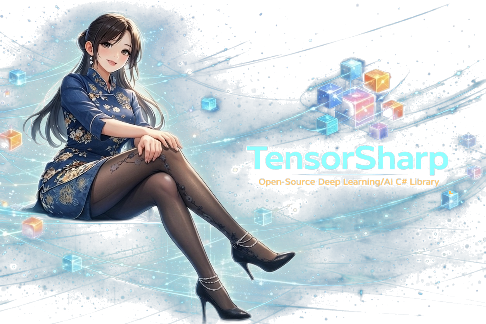

# TensorSharp

<p align="center">
  
</p>

[English](README.md) | [中文](README_zh-cn.md)

A C# inference engine for running large language models (LLMs) locally using GGUF model files. TensorSharp provides a console application, a web-based chatbot interface, and Ollama/OpenAI-compatible HTTP APIs for programmatic access.

## Features

- **Multi-architecture support** -- Gemma 4, Gemma 3, Qwen 3, Qwen 3.5, GPT OSS, Nemotron-H, Mistral 3
- **Multimodal inference** -- image, video, and audio inputs (Gemma 4); images for Gemma 3 / Qwen 3.5 / Mistral 3
- **Thinking / reasoning mode** -- structured chain-of-thought output with `<think>` / `<|channel>thought` / `<|channel>analysis` tags (Qwen 3, Qwen 3.5, Gemma 4, GPT OSS, Nemotron-H)
- **Tool calling / function calling** -- models can invoke user-defined tools; multi-turn tool-call conversations supported across all three API styles
- **Quantized model support** -- loads GGUF files with Q4_K_M, Q8_0, F16, MXFP4, and other quantization formats; performs native quantized matmul without dequantizing to FP32, including memory-efficient pure C# CPU loading for large GGUFs
- **GPU-accelerated** -- GGML Metal on macOS and GGML CUDA on Linux/NVIDIA, with fused whole-model GPU dispatch for Gemma 4 decode on Metal (~2.6x speedup over per-op dispatch)
- **Optimized pure C# CPU backend** -- managed GEMM fast paths plus fused SIMD kernels for RMSNorm, RoPE, softmax, fused activations, and other inference hot paths
- **Ollama & OpenAI API compatibility** -- drop-in replacement endpoints for existing tooling
- **Configurable sampling** -- temperature, top-k, top-p, min-p, repetition/presence/frequency penalties, seed, stop sequences
- **Chat templates** -- auto-loaded from GGUF metadata (Jinja2), with hardcoded fallbacks per architecture
- **Request queue** -- FIFO inference queue ensures single-request execution for KV cache stability, with real-time position tracking for clients
- **Batch processing** -- JSONL input support in the console application
- **Streaming** -- token-by-token output via SSE (web) or stdout (console)
- **Hybrid SSM-Transformer** -- Nemotron-H mixes Mamba2 SSM layers, attention-only layers, and MoE FFN layers in a single model
- **Mixture of Experts** -- Gemma 4 MoE variants (e.g. gemma-4-26B-A4B), GPT OSS MoE (e.g. gpt-oss-20b), Nemotron-H MoE FFN layers
- **Message editing** -- edit or delete previous messages in the web chat UI and regenerate from that point
- **Large file uploads** -- supports video/audio uploads up to 500 MB in the web interface

## Supported Model Architectures

| Architecture | Example Models | Multimodal | Thinking | Tool Calling |
|---|---|---|---|---|
| Gemma 4 | gemma-4-E4B, gemma-4-31B, gemma-4-26B-A4B (MoE) | Image, Video, Audio | Yes | Yes |
| Gemma 3 | gemma-3-4b | Image | No | No |
| Qwen 3 | Qwen3-4B | Text only | Yes | Yes |
| Qwen 3.5 | Qwen3.5-9B, Qwen3.5-35B-A3B | Image | Yes | Yes |
| GPT OSS | gpt-oss-20b (MoE) | Text only | Yes | No |
| Nemotron-H | Nemotron-H-8B, Nemotron-H-47B (Hybrid SSM-Transformer, MoE) | Text only | Yes | Yes |
| Mistral 3 | Mistral-Small-3.1-24B-Instruct | Image | No | No |

See [Model Architecture Cards](docs/model_cards.md) for detailed documentation of each architecture.

## Model Downloads (GGUF)

TensorSharp loads models in GGUF format. Below are Hugging Face links where you can download GGUF files for each supported architecture. Pick a quantization that fits your hardware (Q4_K_M for low memory, Q8_0 for higher quality, etc.).

| Architecture | Model | GGUF Download |
|---|---|---|
| Gemma 4 | gemma-4-E4B-it | [ggml-org/gemma-4-E4B-it-GGUF](https://huggingface.co/ggml-org/gemma-4-E4B-it-GGUF) |
| Gemma 4 | gemma-4-31B-it | [ggml-org/gemma-4-31B-it-GGUF](https://huggingface.co/ggml-org/gemma-4-31B-it-GGUF) |
| Gemma 4 | gemma-4-26B-A4B-it (MoE) | [ggml-org/gemma-4-26B-A4B-it-GGUF](https://huggingface.co/ggml-org/gemma-4-26B-A4B-it-GGUF) |
| Gemma 4 | gemma-4-mmproj (multimodal projector) | Included in the GGUF repos above |
| Gemma 3 | gemma-3-4b-it | [google/gemma-3-4b-it-qat-q4_0-gguf](https://huggingface.co/google/gemma-3-4b-it-qat-q4_0-gguf) |
| Qwen 3 | Qwen3-4B | [Qwen/Qwen3-4B-GGUF](https://huggingface.co/Qwen/Qwen3-4B-GGUF) |
| Qwen 3.5 | Qwen3.5-9B | [unsloth/Qwen3.5-9B-GGUF](https://huggingface.co/unsloth/Qwen3.5-9B-GGUF) |
| Qwen 3.5 | Qwen3.5-35B-A3B | [ggml-org/Qwen3.5-35B-A3B-GGUF](https://huggingface.co/ggml-org/Qwen3.5-35B-A3B-GGUF) |
| GPT OSS | gpt-oss-20b (MoE) | [ggml-org/gpt-oss-20b-GGUF](https://huggingface.co/ggml-org/gpt-oss-20b-GGUF) |
| Nemotron-H | Nemotron-H-8B-Reasoning-128K | [bartowski/nvidia_Nemotron-H-8B-Reasoning-128K-GGUF](https://huggingface.co/bartowski/nvidia_Nemotron-H-8B-Reasoning-128K-GGUF) |
| Nemotron-H | Nemotron-H-47B-Reasoning-128K | [bartowski/nvidia_Nemotron-H-47B-Reasoning-128K-GGUF](https://huggingface.co/bartowski/nvidia_Nemotron-H-47B-Reasoning-128K-GGUF) |
| Mistral 3 | Mistral-Small-3.1-24B-Instruct | [bartowski/Mistral-Small-3.1-24B-Instruct-2503-GGUF](https://huggingface.co/bartowski/Mistral-Small-3.1-24B-Instruct-2503-GGUF) |
| Mistral 3 | mistral3-mmproj (Pixtral vision projector) | [bartowski/Mistral-Small-3.1-24B-Instruct-2503-GGUF](https://huggingface.co/bartowski/Mistral-Small-3.1-24B-Instruct-2503-GGUF) |

## Compute Backends

| Backend | Flag | Description |
|---|---|---|
| GGML Metal | `--backend ggml_metal` | GPU-accelerated via Apple Metal (macOS). Recommended for Apple Silicon. |
| GGML CUDA | `--backend ggml_cuda` | GPU-accelerated via GGML CUDA on Linux with an NVIDIA GPU. |
| GGML CPU | `--backend ggml_cpu` | CPU inference using native GGML with optimized kernels. |
| Pure C# CPU | `--backend cpu` | Portable CPU inference with no native dependencies. |

## Project Structure

```
TensorSharp/
├── TensorSharp.Core/            # Core tensor library (Tensor, Ops, memory, device abstraction)
├── TensorSharp.Runtime/         # GGUF, tokenizers, templates, sampling, protocol parsing
├── TensorSharp.Models/          # Model architectures and multimodal encoders/injectors
├── TensorSharp.Backends.GGML/   # GGML backend bindings (Metal/CUDA/CPU via native library)
├── TensorSharp.GGML.Native/     # Native C++ bridge to ggml (builds libGgmlOps)
├── TensorSharp.Server/          # Web chatbot + API server (ASP.NET Core)
│   ├── ModelService.cs          # Model lifecycle management
│   ├── InferenceQueue.cs        # FIFO request queue with position tracking
│   ├── wwwroot/index.html       # Chat UI
│   ├── testdata/                # Integration test suites (bash + Python)
│   └── API_EXAMPLES.md          # Detailed API documentation
├── TensorSharp.Cli/             # CLI application
├── AdvUtils/                    # Utility library
└── ExternalProjects/            # Third-party dependencies (ggml)
```

## NuGet Packages

The repository is now split along package boundaries so consumers can depend on only the layers they actually need.

| Project | NuGet package | Public namespace | Responsibility |
|---|---|---|---|
| `TensorSharp.Core` | `TensorSharp.Core` | `TensorSharp` | Tensor primitives, ops, allocators, storage, and device abstraction |
| `TensorSharp.Runtime` | `TensorSharp.Runtime` | `TensorSharp.Runtime` | GGUF parsing, tokenizers, prompt rendering, sampling, and output protocol parsing |
| `TensorSharp.Models` | `TensorSharp.Models` | `TensorSharp.Models` | `ModelBase`, architecture implementations, multimodal encoders, and model-side execution helpers |
| `TensorSharp.Backends.GGML` | `TensorSharp.Backends.GGML` | `TensorSharp.GGML` | GGML-backed execution and native interop |
| `TensorSharp.Server` | `TensorSharp.Server` | `TensorSharp.Server` | ASP.NET Core server, OpenAI/Ollama adapters, queueing, and web UI |
| `TensorSharp.Cli` | `TensorSharp.Cli` | `TensorSharp.Cli` | Console host and debugging / batch tooling |

This split keeps engine users off the web stack, keeps API-layer changes from leaking into core/runtime packages, and makes future benchmark or eval-harness projects easier to publish independently.

## Prerequisites

- [.NET 10 SDK](https://dotnet.microsoft.com/download/dotnet/10.0)
- **macOS (Metal backend):** CMake 3.20+ and Xcode command-line tools for building the native GGML library
- **Linux (GGML CPU / CUDA backends):** CMake 3.20+; for `ggml_cuda`, install an NVIDIA driver plus CUDA Toolkit 12.x or another compatible CUDA toolkit
- GGUF model files (e.g., from [Hugging Face](https://huggingface.co))

## Building

### Build the entire solution

```bash
dotnet build TensorSharp.slnx
```

### Build individual applications

```bash
# Console application
dotnet build TensorSharp.Cli/TensorSharp.Cli.csproj

# Web application
dotnet build TensorSharp.Server/TensorSharp.Server.csproj
```

### Build the native GGML library

The native library is built automatically during the first `dotnet build` if it doesn't exist. To build it manually:

```bash
cd TensorSharp.GGML.Native
```

macOS:

```bash
bash build-macos.sh
```

Linux (CPU-only):

```bash
bash build-linux.sh
```

Linux (GGML_CUDA enabled):

```bash
bash build-linux.sh --cuda
```

On Linux, `build-linux.sh` now auto-detects the visible NVIDIA GPU compute capability and passes a narrow `CMAKE_CUDA_ARCHITECTURES` value to ggml-cuda (for example `86-real` on an RTX 3080), which cuts CUDA build time substantially. The native build also runs in parallel by default with a conservative job cap so `nvcc` does not overwhelm typical developer machines.

If you want to override the auto-detected architecture list or the default build parallelism, use either environment variables or explicit build flags:

```bash
TENSORSHARP_GGML_NATIVE_CUDA_ARCHITECTURES='86-real;89-real' bash build-linux.sh --cuda
bash build-linux.sh --cuda --cuda-arch='86-real;89-real'
TENSORSHARP_GGML_NATIVE_BUILD_PARALLEL_LEVEL=2 bash build-linux.sh --cuda
```

You can also request a CUDA-enabled native build from `dotnet build`:

```bash
TENSORSHARP_GGML_NATIVE_ENABLE_CUDA=ON dotnet build TensorSharp.Cli/TensorSharp.Cli.csproj -c Release
```

On macOS this compiles `libGgmlOps.dylib` with Metal GPU support. On Linux, `build-linux.sh` preserves an existing CUDA-enabled build and auto-enables GGML_CUDA when a CUDA toolchain is detected; `build-linux.sh --cuda` and `TENSORSHARP_GGML_NATIVE_ENABLE_CUDA=ON` force CUDA explicitly. The build output is automatically copied to the application's output directory.

## Usage

### Console Application

```bash
cd TensorSharp.Cli/bin

# Text inference
./TensorSharp.Cli --model <model.gguf> --input prompt.txt --output result.txt \
    --max-tokens 200 --backend ggml_metal

# Text inference on Linux + NVIDIA GPU
./TensorSharp.Cli --model <model.gguf> --input prompt.txt --output result.txt \
    --max-tokens 200 --backend ggml_cuda

# Image inference (Gemma 3/4, Qwen 3.5)
./TensorSharp.Cli --model <model.gguf> --image photo.png --backend ggml_metal

# Video inference (Gemma 4)
./TensorSharp.Cli --model <model.gguf> --video clip.mp4 --backend ggml_metal

# Audio inference (Gemma 4)
./TensorSharp.Cli --model <model.gguf> --audio speech.wav --backend ggml_metal

# Thinking / reasoning mode
./TensorSharp.Cli --model <model.gguf> --input prompt.txt --backend ggml_metal --think

# Tool calling
./TensorSharp.Cli --model <model.gguf> --input prompt.txt --backend ggml_metal \
    --tools tools.json

# With sampling parameters
./TensorSharp.Cli --model <model.gguf> --input prompt.txt --backend ggml_metal \
    --temperature 0.7 --top-p 0.9 --top-k 40 --repeat-penalty 1.2 --seed 42

# Batch processing (JSONL)
./TensorSharp.Cli --model <model.gguf> --input-jsonl requests.jsonl \
    --output results.txt --backend ggml_metal
```

**Command-line options:**

| Option | Description |
|---|---|
| `--model <path>` | Path to a GGUF model file (required) |
| `--input <path>` | Text file containing the user prompt |
| `--input-jsonl <path>` | JSONL file with batch requests (one JSON per line) |
| `--multi-turn-jsonl <path>` | JSONL file for multi-turn chat simulation with KV cache reuse |
| `--output <path>` | Write generated text to this file |
| `--image <path>` | Image file for vision inference |
| `--video <path>` | Video file for video inference |
| `--audio <path>` | Audio file (WAV, MP3, OGG) for audio inference |
| `--mmproj <path>` | Path to the multimodal projector GGUF file |
| `--max-tokens <N>` | Maximum tokens to generate (default: 100) |
| `--backend <type>` | Compute backend: `cpu`, `ggml_cpu`, `ggml_metal`, or `ggml_cuda` |
| `--think` | Enable thinking/reasoning mode (chain-of-thought) |
| `--tools <path>` | JSON file with tool/function definitions |
| `--temperature <f>` | Sampling temperature (0 = greedy) |
| `--top-k <N>` | Top-K filtering (0 = disabled) |
| `--top-p <f>` | Nucleus sampling threshold (1.0 = disabled) |
| `--min-p <f>` | Minimum probability filtering (0 = disabled) |
| `--repeat-penalty <f>` | Repetition penalty (1.0 = none) |
| `--presence-penalty <f>` | Presence penalty (0 = disabled) |
| `--frequency-penalty <f>` | Frequency penalty (0 = disabled) |
| `--seed <N>` | Random seed (-1 = non-deterministic) |
| `--stop <string>` | Stop sequence (can be repeated) |
| `--test` | Run built-in test suite |

The multimodal projector file is auto-detected if placed alongside the model file with a recognized name (e.g., `gemma-4-mmproj-F16.gguf`).

**JSONL input format:**

Each line is a JSON object with `messages`, optional `prompt`, and optional sampling parameters:

```json
{"id": "q1", "messages": [{"role": "user", "content": "What is 2+3?"}], "max_tokens": 50}
{"id": "q2", "messages": [{"role": "user", "content": "Write a haiku."}], "max_tokens": 100, "temperature": 0.8}
```

### Web Application

```bash
cd TensorSharp.Server/bin

# Set environment variables and run
MODEL_DIR=./models BACKEND=ggml_metal ./TensorSharp.Server

# Linux + NVIDIA GPU
MODEL_DIR=./models BACKEND=ggml_cuda ./TensorSharp.Server
```

Open `http://localhost:5000` in your browser. The web interface supports:

- Multi-turn chat conversations
- Model selection from available GGUF files in `MODEL_DIR`
- Image, video, and audio uploads for multimodal inference (up to 500 MB)
- Thinking/reasoning mode toggle
- Tool calling with function definitions
- Streaming token generation via Server-Sent Events
- Request queue with real-time position feedback
- Message editing and deletion with regeneration from any point in the conversation

**Environment variables:**

| Variable | Description |
|---|---|
| `MODEL_DIR` | Directory containing GGUF model files |
| `BACKEND` | Compute backend: `cpu`, `ggml_cpu`, `ggml_metal`, or `ggml_cuda` (default: `ggml_metal` on macOS, `ggml_cpu` elsewhere) |
| `VIDEO_MAX_FRAMES` | Maximum evenly spaced video frames extracted for video prompts (default: `4`) |
| `PORT` | HTTP port (default: `5000`) |

### HTTP APIs

TensorSharp.Server exposes three API styles. See [API_EXAMPLES.md](TensorSharp.Server/API_EXAMPLES.md) for full documentation with curl and Python examples.

**Ollama-compatible API:**

```bash
# List models
curl http://localhost:5000/api/tags

# Generate text
curl -X POST http://localhost:5000/api/generate \
  -H "Content-Type: application/json" \
  -d '{"model": "Qwen3-4B-Q8_0.gguf", "prompt": "Hello!", "stream": false}'

# Chat
curl -X POST http://localhost:5000/api/chat/ollama \
  -H "Content-Type: application/json" \
  -d '{"model": "Qwen3-4B-Q8_0.gguf", "messages": [{"role": "user", "content": "Hi"}], "stream": false}'

# Chat with thinking mode
curl -X POST http://localhost:5000/api/chat/ollama \
  -H "Content-Type: application/json" \
  -d '{"model": "Qwen3-4B-Q8_0.gguf", "messages": [{"role": "user", "content": "Solve 17*23"}], "think": true, "stream": false}'

# Chat with tool calling
curl -X POST http://localhost:5000/api/chat/ollama \
  -H "Content-Type: application/json" \
  -d '{"model": "Qwen3-4B-Q8_0.gguf", "messages": [{"role": "user", "content": "What is the weather?"}], "tools": [{"function": {"name": "get_weather", "description": "Get current weather", "parameters": {"properties": {"city": {"type": "string"}}, "required": ["city"]}}}], "stream": false}'
```

**OpenAI-compatible API:**

```bash
# Chat completions
curl -X POST http://localhost:5000/v1/chat/completions \
  -H "Content-Type: application/json" \
  -d '{"model": "Qwen3-4B-Q8_0.gguf", "messages": [{"role": "user", "content": "Hi"}], "max_tokens": 50}'

# Structured outputs (OpenAI response_format)
curl -X POST http://localhost:5000/v1/chat/completions \
  -H "Content-Type: application/json" \
  -d '{
    "model": "Qwen3-4B-Q8_0.gguf",
    "messages": [{"role": "user", "content": "Extract the city and country from: Paris, France."}],
    "response_format": {
      "type": "json_schema",
      "json_schema": {
        "name": "location_extraction",
        "strict": true,
        "schema": {
          "type": "object",
          "properties": {
            "city": {"type": "string"},
            "country": {"type": "string"},
            "confidence": {"type": ["string", "null"]}
          },
          "required": ["city", "country", "confidence"],
          "additionalProperties": false
        }
      }
    }
  }'
```

**OpenAI Python SDK:**

```python
from openai import OpenAI

client = OpenAI(base_url="http://localhost:5000/v1", api_key="not-needed")
response = client.chat.completions.create(
    model="Qwen3-4B-Q8_0.gguf",
    messages=[{"role": "user", "content": "What is 2+3?"}],
    max_tokens=50
)
print(response.choices[0].message.content)
```

**Queue status:**

```bash
curl http://localhost:5000/api/queue/status
# {"busy":false,"pending_requests":0,"total_processed":42}
```

## Thinking / Reasoning Mode

Models that support thinking mode (Qwen 3, Qwen 3.5, Gemma 4, GPT OSS, Nemotron-H) can produce structured chain-of-thought reasoning before generating the final answer. The thinking content is separated from the main response and can be displayed or hidden by the client.

- **Qwen 3 / Qwen 3.5 / Nemotron-H:** uses `<think>...</think>` tags
- **Gemma 4:** uses `<|channel>thought\n...<channel|>` tags
- **GPT OSS:** uses Harmony format with `<|channel|>analysis` for thinking and `<|channel|>final` for the response

Enable via `--think` (console), `"think": true` (Ollama API), or the thinking toggle in the web UI.

## Tool Calling / Function Calling

Models can invoke user-defined tools and participate in multi-turn tool-call conversations. Define tools as JSON and pass them via `--tools` (console) or the `tools` parameter in the API.

Each architecture uses its own wire format for tool calls:

- **Qwen 3 / Qwen 3.5 / Nemotron-H:** `<tool_call>{"name": "...", "arguments": {...}}</tool_call>`
- **Gemma 4:** `<|tool_call>call:function_name{args}<tool_call|>`

The output parser (`OutputParser.cs`) automatically extracts tool calls from the model's raw output regardless of architecture.

## Multimodal Support

### Gemma 4

Gemma 4 models support image, video, and audio inputs. Place the multimodal projector (`gemma-4-mmproj-F16.gguf`) in the same directory as the model file for automatic loading.

- **Images:** PNG, JPEG
- **Video:** MP4 (extracts up to 8 frames at 1 fps using OpenCV)
- **Audio:** WAV (16kHz mono), MP3, OGG Vorbis

### Gemma 3 / Qwen 3.5

These models support image inputs with their respective multimodal projector files.

### Mistral 3

Mistral 3 supports image inputs via the Pixtral vision encoder. Place the multimodal projector (`mistral3-mmproj.gguf`) in the same directory as the model file for automatic loading.

- **Images:** PNG, JPEG

## Architecture

TensorSharp is structured as a layered system:

1. **TensorSharp.Core** provides the core `Tensor` type, storage abstraction, and the extensible operation registry (`Ops`). CPU implementations use `System.Numerics.Vectors` for SIMD acceleration.

2. **TensorSharp.Runtime** owns runtime-facing contracts and services: GGUF parsing, tokenization (SentencePiece / BPE), chat template rendering, configurable token sampling, output parsing, and reusable contracts such as `IModelArchitecture`, `IPromptRenderer`, `IOutputProtocolParser`, `IMultimodalInjector`, `IKVCachePolicy`, and `IBackendExecutionPlan`.

3. **TensorSharp.Models** implements `ModelBase` plus the concrete architectures and multimodal helpers (Gemma 3/4, Qwen 3/3.5, GPT OSS, Nemotron-H, Mistral 3). Models are loaded via `ModelBase.Create()` which auto-detects the architecture from GGUF metadata.

4. **TensorSharp.Backends.GGML** registers accelerated implementations of the same operations via a native C++ bridge (`libGgmlOps`) that links against [ggml](https://github.com/ggml-org/ggml). On macOS this provides Metal GPU compute, and on Linux it can expose GGML CUDA for NVIDIA GPUs. Operations include native quantized matmul (Q4_K_M, Q8_0, etc.) without dequantizing to FP32.

5. **TensorSharp.Server** is the HTTP/application layer. It provides Ollama-compatible and OpenAI-compatible REST APIs, the browser-based chat UI, upload handling, and the FIFO inference queue.

6. **TensorSharp.Cli** is the console/application layer for local prompts, multimodal experiments, prompt inspection, and JSONL batch workflows.

### Performance Optimizations

- **Fused GPU decode** (Gemma 4): all transformer layers are executed in a single GGML compute graph dispatch on Metal, reducing CPU-GPU round-trips from hundreds per token to one. This achieves ~2.6x speedup over per-operation dispatch.
- **Fused weight projections**: Q/K/V projections are fused into a single QKV matmul; gate and up projections are fused into a single gate_up matmul.
- **Native quantized compute**: quantized weights (Q4_K_M, Q6_K, Q8_0, etc.) are used directly in matmul without expanding to FP32, saving memory and bandwidth.
- **Optimized pure C# CPU path**: managed GEMM fast paths and contiguous float32 kernels accelerate decode, softmax, RMSNorm, RoPE, fused activations, and other hot paths while keeping quantized GGUF weights compressed during CPU loading.
- **Circular KV cache**: sliding-window attention layers use a fixed-size circular buffer, bounding memory usage regardless of sequence length.
- **Memory-efficient model loading**: large tensors are streamed directly to native memory without intermediate managed allocations.

## Testing

Integration tests for TensorSharp.Server are in `TensorSharp.Server/testdata/`. They cover all three API styles (Web UI SSE, Ollama, OpenAI), multi-turn conversations, thinking mode, tool calling, structured outputs, queue behavior, concurrent requests, and abort support.

```bash
# Start TensorSharp.Server, then run:
python3 TensorSharp.Server/testdata/test_multiturn.py
# or
bash TensorSharp.Server/testdata/test_multiturn.sh
```

See [TensorSharp.Server/testdata/README.md](TensorSharp.Server/testdata/README.md) for the full test matrix.

## Author

Zhongkai Fu

## License

See [LICENSE](LICENSE) for details.

