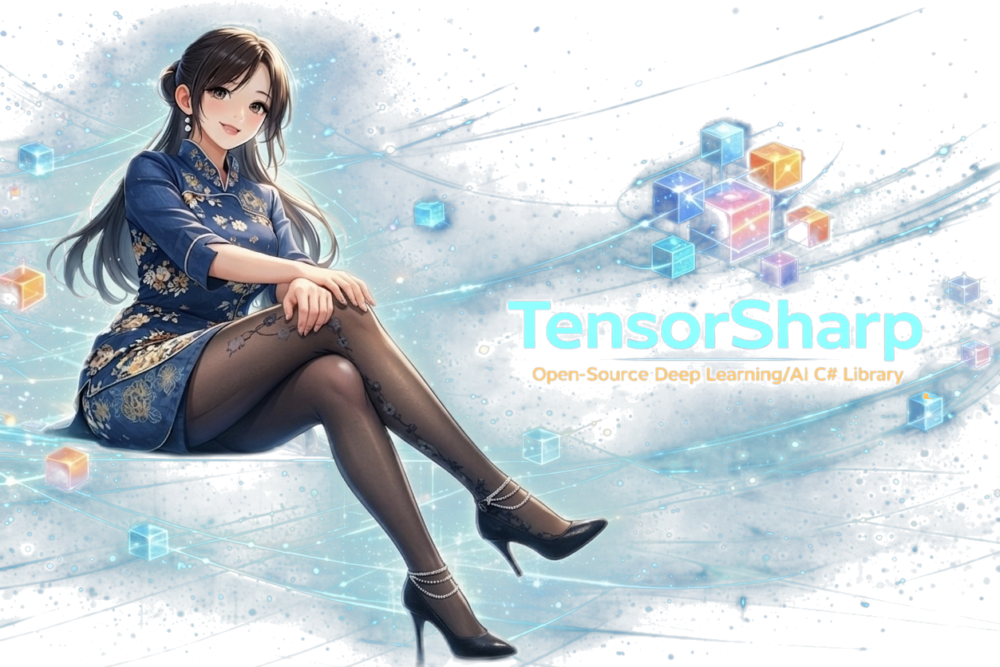

# TensorSharp

<p align="center">
  
</p>

[English](README.md) | [中文](README_zh-cn.md)

**面向 GGUF 模型的原生 .NET LLM 推理引擎** —— 覆盖自回归 LLM *与* DiffusionGemma 风格的文本扩散模型，以及 Qwen-Image-Edit 图像编辑。提供控制台应用、浏览器聊天界面，以及兼容 Ollama/OpenAI 的 HTTP API。一个纯 .NET 引擎，在相同 GGUF 文件与相同 GPU 上与手工优化的 C++ `llama.cpp` 互有胜负。

## 《From Tensors to Tokens》—— TensorSharp 实战书籍

<p align="center">
  <a href="https://www.amazon.com/dp/B0H9P44QZZ">
    
  </a>
</p>

Zhongkai Fu 所著的 **[From Tensors to Tokens: Building a Multimodal LLM Inference Engine from Scratch with TensorSharp and Gemma 4 E4B](https://www.amazon.com/dp/B0H9P44QZZ)** 将本仓库串成一条端到端的学习路径。全书以 Gemma 4 E4B 为示例，连接张量基础、模型执行、多模态输入，以及一个可运行 LLM 推理引擎的应用接口。

**[查看书籍介绍与仓库伴读路线](docs/BOOK_zh-cn.md)** · **[在 Amazon 购买平装本](https://www.amazon.com/dp/B0H9P44QZZ)**

## 亮点功能

- **⚡ 与 llama.cpp 互有胜负——用纯 .NET 做到。** 在相同 GGUF 文件、相同 GPU 上，TensorSharp 在关键负载上追平乃至超越 `llama.cpp`：Gemma 4 E4B 与 2-bit 量化的 Qwen 3.6 35B-A3B MoE 在 CUDA 上 prefill 快 **1.28×**、首 token 早 **1.27×**（多轮最高 **1.49×**）；Gemma 4 12B 在 Vulkan 上 decode 快 **1.21×**（长上下文最高 **1.32×**）。→ [性能数据](#性能数据)
- **🚀 连续批处理 & 分页 KV 缓存。** vLLM 风格的分页 KV 池，支持基于内容哈希的前缀共享与迭代级调度器，服务端默认启用。→ [深入文档](docs/PAGED_ATTENTION_AND_CONTINUOUS_BATCHING_zh-cn.md)
- **🔮 MTP / NextN 投机解码。** 多 token 预测草稿头加速单序列 decode：Qwen 3.6（内嵌 NextN 块）与 Gemma 4（独立 `gemma4-assistant` 草稿 GGUF）——草稿提议、主干一次批量前向验证，输出与标准 decode 完全一致。→ [投机解码](FEATURES_zh-cn.md#mtp--nextn-投机解码)
- **🎨 Qwen-Image-Edit 图像编辑。** 提示词 + 输入图像 → 编辑后的图像，驱动 60 块 MMDiT，配以 Qwen-Image VAE 与 Qwen2.5-VL-7B 文本编码器。CUDA 图捕获的整 DiT、FlowMatch-Euler true-CFG 去噪、Web UI 实时预览，以及 Lightning-LoRA 快速路径。热态 4 步编辑比 `stable-diffusion.cpp` 快 **1.19×**。→ [Qwen-Image-Edit 卡片](docs/models/qwenimage_zh-cn.md)
- **🌫️ DiffusionGemma 文本扩散。** 基于 Gemma-4 派生 MoE backbone 的分块 EntropyBound 去噪，提供 CLI 参数与 Web UI 实时去噪预览。→ [DiffusionGemma 卡片](docs/models/diffusiongemma_zh-cn.md)
- **🖼️ 多模态。** 图像 / 视频 / 音频（Gemma 4）；图像输入（Gemma 3、Qwen 3.5-family、Mistral 3、Nemotron-H Omni）；CLI 与 Web UI 支持 PDF。→ [多模态](FEATURES_zh-cn.md#多模态支持)
- **🛠️ 工具调用与思维链。** Qwen 3、Qwen 3.5/3.6-family、Gemma 4、GPT OSS、Nemotron-H 均支持多轮工具调用与结构化思维链。→ [功能特性](FEATURES_zh-cn.md)
- **🔌 兼容 Ollama 与 OpenAI 的 API**，外加浏览器聊天 UI——现有工具可直接接入。→ [HTTP API](USAGE_zh-cn.md#http-api)
- **📄 配置文件 + 自动下载。** 把 CLI/Server 参数写进可复用的 JSON 文件，支持 `${变量}` 与首次运行自动下载模型的 `{ "path", "urls" }` 条目。→ [config/README.md](config/README.md)
- **🧮 原生量化计算。** Q4_K_M / Q8_0 / MXFP4 / IQ2_XXS 等直接参与 matmul，无需反量化为 FP32。可运行于 GGML Metal / CUDA / Vulkan、Direct CUDA/cuBLAS、MLX（Apple Silicon）与纯 C# CPU 路径，均带 CPU 回退。→ [后端](USAGE_zh-cn.md#计算后端)

## 快速开始

TensorSharp 面向 .NET 10。全新机器需要安装完整的 **.NET 10 SDK**；只安装 .NET Runtime 无法构建 TensorSharp：

| 平台 | 安装 SDK |
|---|---|
| **Windows** | 在 PowerShell 中运行 `winget install Microsoft.DotNet.SDK.10`，或参阅 Microsoft 的 [Windows 安装说明](https://learn.microsoft.com/zh-cn/dotnet/core/install/windows)。 |
| **macOS** | 使用 [.NET 10 SDK 安装程序](https://dotnet.microsoft.com/zh-cn/download/dotnet/10.0)：Apple 芯片选择 **Arm64**，Intel Mac 选择 **x64**。另见 Microsoft 的 [macOS 安装说明](https://learn.microsoft.com/zh-cn/dotnet/core/install/macos)。 |
| **Linux** | 按照 Microsoft 的 [Linux 发行版指南](https://learn.microsoft.com/zh-cn/dotnet/core/install/linux)为当前发行版配置正确的软件源，并安装其 .NET 10 SDK 包（通常名为 `dotnet-sdk-10.0`）。 |

安装后打开新终端，确认列表中包含 `10.0.x` SDK：

```bash
dotnet --list-sdks
```

更多细节见 [.NET 跨平台安装概览](https://learn.microsoft.com/zh-cn/dotnet/core/install/)或[开发 → 前置要求](DEVELOPMENT_zh-cn.md#前置要求)。

然后即可在已验证的原生 GGML 快速路径（Gemma 4 E4B）上约 30 秒跑起来。其他前置包括 `git`、`curl`，以及所选 GPU 后端的工具链（见 [开发 → 前置要求](DEVELOPMENT_zh-cn.md#前置要求)）。推荐的公开文件是 [`gemma-4-E4B-it-Q8_0.gguf`](https://huggingface.co/ggml-org/gemma-4-E4B-it-GGUF/blob/main/gemma-4-E4B-it-Q8_0.gguf)（7.48 GiB）；纯文本推理无需投影器。

**Windows + NVIDIA（PowerShell）**

```powershell
git clone https://github.com/zhongkaifu/TensorSharp.git; Set-Location TensorSharp
New-Item -ItemType Directory -Force models | Out-Null
curl.exe -L --fail "https://huggingface.co/ggml-org/gemma-4-E4B-it-GGUF/resolve/main/gemma-4-E4B-it-Q8_0.gguf?download=true" -o models\gemma-4-E4B-it-Q8_0.gguf
'用一句话回答：TensorSharp 是什么？' | Set-Content prompt.txt
$env:TENSORSHARP_GGML_NATIVE_ENABLE_CUDA = 'ON'
dotnet run --project TensorSharp.Cli -c Release -p:TensorSharpSkipMlxNative=true -- --model models\gemma-4-E4B-it-Q8_0.gguf --input prompt.txt --max-tokens 128 --backend ggml_cuda
```

**macOS（Apple Silicon）** —— 去掉 CUDA 环境变量，使用 `--backend ggml_metal`。
**Linux + NVIDIA** —— 在 `dotnet run` 前加 `TENSORSHARP_GGML_NATIVE_ENABLE_CUDA=ON`，使用 `--backend ggml_cuda`。
**AMD / Intel / NVIDIA Vulkan** —— 设置 `TENSORSHARP_GGML_NATIVE_ENABLE_VULKAN=ON`，使用 `--backend ggml_vulkan`。

将同一模型作为服务托管（浏览器 UI 在 <http://localhost:5000/index.html>，另有 Ollama/OpenAI API）：

```bash
dotnet run --project TensorSharp.Server -c Release -p:TensorSharpSkipMlxNative=true -- --model models/gemma-4-E4B-it-Q8_0.gguf --backend ggml_cuda --max-tokens 512
```

> 服务端绑定 `0.0.0.0:5000`，无内置鉴权或 TLS——请置于防火墙之后，或使用带鉴权的 HTTPS 反向代理。图像/视频/音频需追加伴随文件 [`mmproj-gemma-4-E4B-it-Q8_0.gguf`](https://huggingface.co/ggml-org/gemma-4-E4B-it-GGUF/blob/main/mmproj-gemma-4-E4B-it-Q8_0.gguf)，用 `--mmproj` 指定。

完整命令参考：**[CLI](USAGE_zh-cn.md#控制台应用)** · **[Server](USAGE_zh-cn.md#web-应用)** · 更多可下载模型：**[模型下载](MODEL_DOWNLOADS_zh-cn.md)** · 想用配置文件？**[config/](config/README.md)**。

## 选择后端

每个后端对尚未实现的算子都会回退到 CPU，因此所有后端的输出都正确。

| 你的硬件 | 推荐后端 | 标志 | 说明 |
|---|---|---|---|
| **Apple Silicon（Mac）** | GGML Metal | `--backend ggml_metal` | macOS 默认。`--backend mlx` 是另一条 Apple Silicon GPU 路径。 |
| **Windows / Linux + NVIDIA GPU** | GGML CUDA | `--backend ggml_cuda` | 测试最充分的 NVIDIA 路径。`--backend cuda` 是用于实验的 Direct PTX/cuBLAS 后端。 |
| **Windows / Linux + AMD / Intel / NVIDIA GPU** | GGML Vulkan | `--backend ggml_vulkan` | 与厂商无关的 GPU 路径（ggml-vulkan）。机器有 Vulkan 运行时即自动构建；用 `--no-vulkan` 退出。 |
| **无 GPU / 可移植 / 调试** | 纯 C# CPU | `--backend cpu` | 无原生依赖。需要更快的 CPU 推理可用 `--backend ggml_cpu`（原生算子）。 |

每个后端的完整说明见 [使用方法 → 计算后端](USAGE_zh-cn.md#计算后端)。

## 已验证模型

以下架构均已实现，并由测试 / 基准矩阵覆盖。请选择适配你硬件的量化（低内存用 Q4_K_M、更高质量用 Q8_0）。更多尺寸与投影器文件见 [模型下载](MODEL_DOWNLOADS_zh-cn.md)。

| 家族 | 示例模型（GGUF） | 图像 / 视频 / 音频 | 思维链 | 工具 | 卡片 |
|---|---|---|---|---|---|
| Gemma 4 | [gemma-4-E4B-it](https://huggingface.co/ggml-org/gemma-4-E4B-it-GGUF)（另有 31B、26B-A4B MoE） | ✅ / ✅ / ✅ | ✅ | ✅ | [gemma4](docs/models/gemma4_zh-cn.md) |
| Qwen 3.5 / 3.6 | [Qwen3.5-9B](https://huggingface.co/unsloth/Qwen3.5-9B-GGUF)（另有 35B-A3B MoE） | ✅ / — / — | ✅ | ✅ | [qwen35](docs/models/qwen35_zh-cn.md) |
| Qwen 3 | [Qwen3-4B](https://huggingface.co/Qwen/Qwen3-4B-GGUF) | — / — / — | ✅ | ✅ | [qwen3](docs/models/qwen3_zh-cn.md) |
| GPT OSS | [gpt-oss-20b](https://huggingface.co/ggml-org/gpt-oss-20b-GGUF)（MoE） | — / — / — | ✅ | ✅ | [gptoss](docs/models/gptoss_zh-cn.md) |
| Nemotron-H | [Nemotron-H-8B](https://huggingface.co/bartowski/nvidia_Nemotron-H-8B-Reasoning-128K-GGUF)（另有 47B、Omni） | ✅（Omni） / — / — | ✅ | ✅ | [nemotron](docs/models/nemotron_zh-cn.md) |
| Mistral 3 | [Mistral-Small-3.1-24B](https://huggingface.co/bartowski/mistralai_Mistral-Small-3.1-24B-Instruct-2503-GGUF) | ✅ / — / — | — | — | [mistral3](docs/models/mistral3_zh-cn.md) |
| Gemma 3 | [gemma-3-4b-it](https://huggingface.co/ggml-org/gemma-3-4b-it-GGUF) | ✅ / — / — | — | — | [gemma3](docs/models/gemma3_zh-cn.md) |
| DiffusionGemma | [diffusiongemma-26B-A4B-it](https://huggingface.co/unsloth/diffusiongemma-26B-A4B-it-GGUF) | — / — / — | — | — | [diffusiongemma](docs/models/diffusiongemma_zh-cn.md) |
| Qwen-Image-Edit | [Qwen-Image-Edit-2511](https://huggingface.co/unsloth/Qwen-Image-Edit-2511-GGUF)（MMDiT + VAE + Qwen2.5-VL） | 🖼️ 图像→图像 | — | — | [qwenimage](docs/models/qwenimage_zh-cn.md) |

## 支持的模型架构

| 架构 | GGUF 架构标识 | 示例模型 | 多模态 | 思维链 | 工具调用 | MTP 投机 | 卡片 |
|---|---|---|---|---|---|---|---|
| Gemma 4 | `gemma4` | gemma-4-E4B、gemma-4-31B、gemma-4-26B-A4B（MoE） | 图像、视频、音频 | 支持 | 支持 | 支持（独立草稿 GGUF） | [gemma4](docs/models/gemma4_zh-cn.md) |
| Gemma 3 | `gemma3` | gemma-3-4b | 图像 | 不支持 | 不支持 | — | [gemma3](docs/models/gemma3_zh-cn.md) |
| Qwen 3 | `qwen3` | Qwen3-4B | 仅文本 | 支持 | 支持 | — | [qwen3](docs/models/qwen3_zh-cn.md) |
| Qwen 3.5 / 3.6 family | `qwen35`, `qwen35moe`, `qwen3next` | Qwen3.5-9B（混合 Attn+递归）、Qwen3.5/3.6-35B-A3B（MoE） | 图像 | 支持 | 支持 | Qwen 3.6 支持（内嵌 NextN） | [qwen35](docs/models/qwen35_zh-cn.md) |
| GPT OSS | `gptoss`, `gpt-oss` | gpt-oss-20b（MoE） | 仅文本 | 支持（始终） | 支持 | — | [gptoss](docs/models/gptoss_zh-cn.md) |
| Nemotron-H | `nemotron_h`, `nemotron_h_moe` | Nemotron-H-8B/47B（混合 SSM-Transformer，MoE）、Nemotron 3 Nano Omni | 图像（Omni） | 支持 | 支持 | — | [nemotron](docs/models/nemotron_zh-cn.md) |
| Mistral 3 | `mistral3` | Mistral-Small-3.1-24B-Instruct | 图像 | 不支持 | 不支持 | — | [mistral3](docs/models/mistral3_zh-cn.md) |
| DiffusionGemma | `diffusion-gemma` | diffusion-gemma 文本扩散 GGUF | 仅文本 | 不支持 | 不支持 | — | [diffusiongemma](docs/models/diffusiongemma_zh-cn.md) |
| Qwen-Image-Edit | `qwen_image` | qwen-image-edit MMDiT GGUF（+ VAE 与 Qwen2.5-VL） | 图像编辑（图像+文本 → 图像） | 不支持 | 不支持 | — | [qwenimage](docs/models/qwenimage_zh-cn.md) |

各架构的端到端文档（前向图、组件、参数、prefill/decode 优化）见[按模型架构卡片](docs/models/README_zh-cn.md)。

## 性能数据

### 对比 llama.cpp 的同台评测（引擎对比）

纯 .NET 引擎与手工优化的 C++ `llama.cpp` 正面较量：**相同的 GGUF 文件、相同的 NVIDIA RTX 3080 Laptop GPU（16 GB）、统一的 OpenAI `/v1/chat/completions` 接口**，**两个引擎均分别在 GGML CUDA 与 Vulkan 构建上测量**。下表为 **在相同后端上，TensorSharp 相对 llama.cpp 的几何平均加速比**（单流、贪心采样、关闭 MTP）；**> 1.0× 表示 TensorSharp 更快 / 延迟更低**。完整表格见 [`docs/engine_comparison_report.md`](docs/engine_comparison_report.md)。

| 模型 | 后端 | decode | prefill | TTFT |
|---|---|---:|---:|---:|
| Gemma 4 E4B it（Q8_0，dense 多模态） | CUDA | 1.02× | **1.28×** | **1.27×** |
| Gemma 4 E4B it（Q8_0，dense 多模态） | Vulkan | 1.00× | 1.05× | 1.03× |
| Gemma 4 12B it（QAT UD-Q4_K_XL，dense） | CUDA | 1.04× | **1.17×** | **1.16×** |
| Gemma 4 12B it（QAT UD-Q4_K_XL，dense） | Vulkan | **1.21×** | 1.04× | 1.03× |
| Qwen 3.6 35B-A3B（UD-IQ2_XXS，MoE） | CUDA | 0.98× | **1.28×** | **1.27×** |
| Qwen 3.6 35B-A3B（UD-IQ2_XXS，MoE） | Vulkan | 0.87× | 1.04× | 1.03× |
| Qwen 3.6 27B（UD-IQ2_XXS，dense） | CUDA | **1.07×** | 0.96× | 0.95× |
| Qwen 3.6 27B（UD-IQ2_XXS，dense） | Vulkan | 1.02× | 0.85× | 0.84× |

TensorSharp 在 CUDA 的 prefill / 首 token 延迟上明显领先（多轮 prefill **每个模型**都获胜，最高 **1.49×**），CUDA decode 保持持平或更快，Vulkan 上 dense 12B 的 decode 明显胜出（长上下文最高 **1.32×**）——即便在 2-bit IQ2_XXS 量化下亦然。剩余低于 1.0× 的项仍是正在优化的目标。该框架还提供工具调用、结构化输出、图像编辑（对比 `stable-diffusion.cpp`）、MTP 开/关与并发场景，可通过 [`benchmarks/engine_comparison`](benchmarks/engine_comparison) 在你自己的硬件上运行。完整报告见 [此处](docs/engine_comparison_report.md)。

## 文档

初次使用？上面几节足以让你跑起来。其余均为详细参考：

| 文档 | 内容 |
|---|---|
| [书籍指南：《From Tensors to Tokens》](docs/BOOK_zh-cn.md) | 从张量基础走向 Gemma 4 E4B 多模态推理引擎的连贯路线，含出版信息与配套仓库阅读指引 |
| [模型下载](MODEL_DOWNLOADS_zh-cn.md) | 各模型 `huggingface-cli` 下载 + 运行速查（量化档位、投影器、伴随文件） |
| [使用方法](USAGE_zh-cn.md) | 完整 CLI 参考（选项、交互式 REPL、JSONL 批处理）、服务端托管、日志、HTTP API 示例、后端与环境变量矩阵 |
| [功能特性](FEATURES_zh-cn.md) | 连续批处理、MTP 投机解码、工具调用、思维链、多模态、MoE、KV 编解码等深入说明 |
| [配置文件](config/README.md) | 把参数写进可复用的 JSON 文件，支持 `${变量}` 与模型自动下载 |
| [开发](DEVELOPMENT_zh-cn.md) | 前置要求、构建原生 GGML/MLX 库、仓库结构、包分层、内部架构与测试工具 |
| [按模型架构卡片](docs/models/README_zh-cn.md) | 各架构端到端文档（前向图、组件、参数、prefill/decode 优化） |
| [分页注意力 & 连续批处理](docs/PAGED_ATTENTION_AND_CONTINUOUS_BATCHING_zh-cn.md) | vLLM 风格的分页 KV 缓存、前缀共享与迭代级调度器 |
| [环境变量功能矩阵](docs/env_var_feature_matrix_zh-cn.md) | 哪些高影响运行时开关影响哪些模型、后端与提示类型 |
| [引擎对比报告](docs/engine_comparison_report.md) | TensorSharp 对比 llama.cpp / stable-diffusion.cpp 的完整逐场景表格 |
| [测试 / 基准矩阵运行器](TensorSharp.TestMatrix/README_zh-cn.md) | 扫描 model × backend × feature × env-var 组合并生成回归报告 |
| [服务端 API 示例](TensorSharp.Server/API_EXAMPLES_zh-cn.md) | 完整的 curl 与 Python 示例 |

## 当前状态

| 范围 | 状态 |
|---|---|
| 模型家族 | Gemma 3/4、DiffusionGemma、Qwen 3、Qwen 3.5/3.6-family（`qwen35`、`qwen35moe`、`qwen3next`）、GPT OSS、Nemotron-H（含 Nemotron 3 Nano Omni）、Mistral 3。图像编辑通过 Qwen-Image-Edit（`qwen_image` MMDiT）。 |
| 推理宿主 | CLI、交互式 REPL、ASP.NET Core Web UI、Ollama 风格 API、OpenAI Chat Completions 风格 API。 |
| 后端 | 纯 C# CPU、Direct CUDA/cuBLAS（`cuda`）、MLX Metal（`mlx`）、GGML CPU、GGML Metal、GGML CUDA、GGML Vulkan。 |
| 多模态 | Gemma 4 图像/视频/音频；Gemma 3、Qwen 3.5-family、Mistral 3、Nemotron-H Omni 图像输入；PDF（CLI `--pdf` + Web UI）。 |
| 连续批处理 | vLLM 风格分页 KV 缓存、基于内容哈希的前缀共享、迭代级调度器（默认启用，`--no-continuous-batching` 关闭）。 |
| 投机解码 | Qwen 3.6（内嵌）与 Gemma 4（独立草稿 GGUF）的 MTP / NextN 草稿头；默认关闭，服务端通过 `--mtp-spec` 启用。 |
| 服务端模型范围 | 通过 `--model` 显式托管单个 GGUF；可通过 `--mmproj` 显式指定投影器；不扫描目录。 |
| 可观测性 | 结构化每轮日志、队列状态，以及 Web UI / Ollama / OpenAI 中的 KV 缓存复用指标。 |

## 作者

Zhongkai Fu

## 许可证

详见 [LICENSE](LICENSE)。
