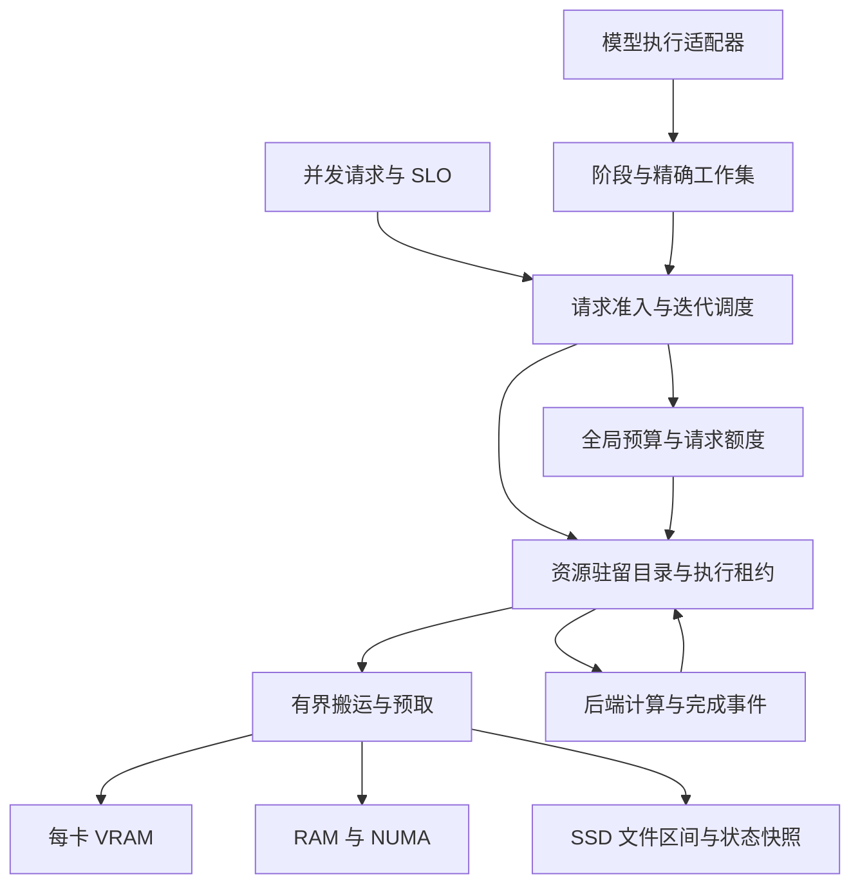

# TensorSharp 统一 VRAM / RAM / SSD 调度系统

源码基线：`f5b1eefb6cf378ed19c9a33178be84c818f7fc4b`；文件权重执行续作基于 `163474ba30814e5abcaba277c3a1f83d9f8ab604`。设计、实现与硬件续验：2026-10-08 UTC。

## 1. 交付状态与目标

目标是让模型的**可执行工作集**适配硬件，而不是要求整个模型同时驻留 VRAM 或 RAM。系统统一管理权重、专家、KV、循环状态、前缀缓存、LoRA、多模态中间结果与临时工作区，保留原有模型计算语义，并根据请求并发程度选择驻留、搬运、计算和排队方案。

本次已经构建可运行的调度基础库、RAM/文件搬运与状态回写、请求预算、GGUF 分片目录、CUDA 分配适配器，并将 Qwen4Exp 原有放置算法抽出后接回原路径。文件权重执行现已显式接入 dense Qwen 3.5 的 Q8_0 和 dense Gemma4 的 Q8_0/F16 PLE，两者均限定单 rank GGML CUDA、文本、无 MTP/draft。Qwen 0.8B 的完整 logits 与重复释放验收已通过；Gemma E4B 的短提示诊断、645-token 长提示 Forward/分块 ForwardRefill、后续 decode 和各两次加载均与原常驻路径逐位一致。Gemma 为保持原 CUDA 归约和融合语义，部分投影需要完整逻辑矩阵的临时设备工作区，不能沿用 Qwen 的极小配额结论。具体预算、上下文和硬件范围见第 6、14 节。**尚未完成全部模型的原生执行图、KV 和媒体流水线接入；不能把本次实现描述为“所有模型已自动支持三层调度”。** CLI、Server、TensorAgent 的公共引擎已可通过环境变量启用有预算的主机 KV 快照换页，但没有一个开关可以开启完整的全模型三层调度。

| 范围 | 本次状态 |
| --- | --- |
| 模型无关预算、驻留目录、租约、版本、LRU、固定搬运缓冲 | 已实现并测试 |
| 真正的 RAM 分配、文件按区间读取、可变状态 SSD 回写/恢复 | 已实现并测试；存储介质类型未作 NVMe 假设 |
| 请求完整峰值预留、FIFO 队列、取消、预留向实际分配转账 | 已接入 ContinuousBatchScheduler/InferenceEngine；由执行器显式提供成本，未自动启用全部旧模型 |
| GGUF / split GGUF 权重目录和不改量化格式的切片 | 已实现并测试；旧加载器未整体切换 |
| 文件权重实际执行 | dense Qwen35 Q8_0 和 dense Gemma4 Q8_0/F16 PLE 的单 rank GGML CUDA 文本适配器已接入；Qwen 0.8B 已验收，Gemma E4B 短/长提示 Forward 和分块 ForwardRefill 完整 logits 逐位一致；配额只覆盖登记的权重 payload |
| Qwen CUDA/UMA 静态放置算法通用化 | 已接入原模型路径；保持原调优参数 |
| 主机 KV 快照、前缀页、循环状态快照 | 显式启用时选择可恢复的逐序列路径，不再被融合路径绕过；Gemma 及 dense、无 MTP、单 rank GGML CUDA 的 Qwen 3.5 真实模型 RAM/文件换页已验证；不接管原生 holder/device arena |
| CUDA 原始分配/读写/释放、真实 event fence、可选 P2P | 两张 A40 上单卡和主机中转多卡通过；本 VM 的直接 P2P 数据损坏，保持默认关闭 |
| GGML lazy device-copy/preload、选中专家 cache | 可通过 GgmlCacheBudgetScope 接入同一份托管 MemoryBudget，分配前预留、物理释放后归还；原有独立 cache 配额仍有效 |
| 硬件/请求预算规划与驻留保留 | dense Gemma4/Qwen35 的 AdaptiveModelSession 显式入口；优先保留驻留图，按物理可用 RAM/VRAM、权重格式、融合、KV/状态和工作区选择；不是全模型自动策略 |
| GGML/Metal/Vulkan/MLX 原生图、分页 KV、全部融合算子 | 全面适配仍待实现；本轮没有 Metal/Vulkan/MLX 硬件验收 |
| 多卡预算向量、带节点/设备标识的资源位置 | 已支持多位置工作集租约和全 rank fence；两张 A40 上实际内核、双向中转和释放验证通过 |
| 多机协调、远程内存、异步 DMA 重叠 | 设计阶段，未实现；文件提前读取已实现，不能等同异步 CUDA DMA |

“高速”必须相对于模型、量化、工作集、带宽和 SLO 定义。容量虚拟化能让更多模型运行，但无法让每个 token 都要读取几十 GB 冷权重的 dense 模型获得全驻留 GPU 的延迟。

## 2. 当前源码的实际集成边界

| 当前代码 | 已有机制 | 需要统一的边界 |
| --- | --- | --- |
| `TensorSharp.Models/Models/Qwen4Exp/Qwen4ExpModel.ExpertPlacement.cs` | CUDA/Metal 专家放置、专家缓存配额和布局下限 | 算法已迁出；下一步把实际原生分配接入同一个预算 |
| `TensorSharp.Models/GpuMemoryBudget.cs` | free VRAM、headroom、token 容量估算 | 统一观测、避免已驻留资源再次扣账 |
| `TensorSharp.Models/ModelBase.WeightLoading.cs`、`ModelBase.WeightPolicy.cs` | 公共权重读取和驻留决策 | 从目录注册资源，按执行边界获取租约 |
| `WeightStreamingOptions`、`WeightStreamingExecutor`、`GgmlWeightStreamingSession`、`GgmlResidentWeightSession` | 显式文件权重、固定主机 tile；按模型选择行分块或完整逻辑 M/N 的临时 CUDA 工作区 | Qwen35 Q8_0 和 Gemma4 Q8_0/F16 PLE 已接入；Gemma 的归约、Norm/RoPE/Residual 融合语义单独对齐；其他模型族和异步预取未接入 |
| `TensorSharp.Runtime/GgufReader.cs` | GGUF、分片、mmap、tensor 类型与字节布局 | 新增文件区间接口；可避免预读整个数据区 |
| `TensorSharp.GGML.Native/ggml_ops_core.cpp` | device-copy、预载、host buffer、offload cache | 所有分配必须预留；缓存命中必须表示上传已完成 |
| `ggml_ops_host_moe_cache.cpp`、`ggml_ops_host_moe_decode.cpp` | 专家缓存与主机计算 | 热专家驻留、联合选中专家工作集、CPU/GPU 成本选择 |
| `TensorSharp.Runtime/Scheduling/ContinuousBatchScheduler.cs` | 连续批处理、prefill 分块、KV 容量准入、抢占 | 接入字节与 I/O 成本；仅 token 数和 KV 元数据不够 |
| `TensorSharp.Runtime/Scheduling/PrefixCache/` | radix、holder/page、跨请求恢复协议 | 可迁移数据位置，不改变“哪些状态足以恢复”的规则 |
| `TensorSharp.Runtime/Paged/`、各模型 KV/holder | 页面与模型专用状态 | 区分已读页、追加尾页、循环状态、可共享完整页 |
| `TensorSharp.Chat/DiffusionBatchScheduler.cs`、QwenImage、Wan | 非自回归任务、分阶段模型和临时张量 | 以 encoder/denoiser/VAE/帧块为阶段估算资源 |
| `TensorSharp.Distributed/`、GGML TP 实现 | collective、多卡执行路径 | 节点内预算与跨节点原子准入协议分别接入 |

原生执行图里缓存了原始地址。只增加一个“LRU + memcpy”会产生 use-after-free 或读到旧版本。必须在算子、图或原生 slot 的生命周期上持有租约。对于捕获图，采用固定地址的 slot arena，或在地址/布局版本改变时失效并重建图。模型名字不应进入驻留管理器。

本次原生改动全部位于 TensorSharp 自有 C++/CUDA 文件。upstream ggml 固定为 `ffa4e8b80930029a35991f94e7c8a93cd67730ab`，本地 checkout 保持原样，此前 VM 验收也使用未修改的同一 revision。VM 的 CUDA 12.8 / sm_86 缓存预算构建和本机 CUDA 12.6 / sm_86 文件权重构建分别记录，不能混为一次验收。对该 VM 使用 ggml 已有的 `GGML_CUDA_NO_PEER_COPY=ON`；TensorSharp 的 CMake 不再强制覆盖用户选项，没有修改 upstream 实现。

lazy device-copy cache 在分配前原子预留、成功发布后转为 committed，使用 ggml 报告的 buffer 字节数；显式 preload 单独记录 reserved/committed。`GgmlBasicOps.TryGetCacheMemoryUsage` 提供每 rank 诊断。可在首次缓存分配前安装 `GgmlCacheBudgetScope`，将这些缓存的完整所有权记入与 KV 快照共用的托管 `MemoryBudget`；物理释放后才归还额度，失败的 scope 卸载可在清理后重试。新增 `includeGraphBuffers: true` 可纳入已接线的普通算子和 Gemma/Qwen35 图 buffer、reuse gallocr；默认构造保留旧 cache-only 合约。仍未覆盖所有 native executor、backend/driver pool 和总 RSS/VRAM。具体接入与关闭顺序见第 15 节。

首次 DeviceCopy 上传现在在发布前同步完成，随后图构建因 scratch 分配失败而退出，也不会留下未初始化的缓存命中。CPU/UMA host-pointer 路径不变；冷 miss 增加 descriptor 和同步成本，尚未测量其性能影响，不能宣传为提速。设备回归覆盖 F32、Q8_0、opaque host key 和放弃图构建后重试；没有 Metal/Vulkan 运行验证。

## 3. 系统分层



控制面管理所有权、预算、版本、准入、放置和观测。数据面执行原有正确的算子、数据搬运和设备事件。调度器知道“字节数、合法执行位置、下次使用、代价、状态依赖”，不需要知道这是 Gemma、Qwen、图像还是音频。

新模型应主要增加**布局与执行计划适配**：声明只读资源、动态状态、每阶段工作集和安全完成边界。新算子可能需要新的分块内核；抽象接口无法凭空让一个必须连续持有巨大张量的旧内核变成可流式执行。

## 4. 资源和所有权协议

实际类型在 `TensorSharp.Memory/`：

| 类型 | 职责 |
| --- | --- |
| `ResourceKey(Owner, Epoch, Name)` | 区分模型修订、请求/租户、reload 和资源，避免地址复用污染缓存 |
| `MemoryResource` | 字节长度、用途、可变性、布局指纹；核心不解释布局字符串 |
| `IResourceSource` | 精确区间读取；权重可直接引用原文件，无需复制到 SSD 缓存 |
| `IMemoryBackend` | 预先声明实际分配的所有预算约束，再分配设备内存 |
| `ResourceLease` | 固定地址和版本；并发读共享，写独占；GPU 使用直到事件完成 |
| `BudgetReservation` | 保留、提交、转账、返还额度，覆盖短时双副本 |
| `MemoryLocation` | 节点、设备/NUMA、主机或加速器位置 |

权重和已完成的只读前缀允许多副本。KV 尾页、循环状态、扩散 latent 等可变资源有一个当前逻辑版本。取得写租约前等待读者结束，清除旧副本/快照，再增加版本。完成并验证一次搬运后才把目标登记成可命中副本。

执行中的资源、源副本和未完成写入不能被淘汰。每个资源的状态转换单独串行化，不在全局锁内等待 SSD 或 GPU。相同资源并发加载合并为一次；不同资源允许并行搬运。

多资源算子必须一次取得完整合法工作集。当前 `AcquireReadSetAsync` 在压力或冲突时释放部分租约，由上层重试整个集合；不会拿着半个工作集等待另一半容量。多资源写事务、COW 前缀页和 graph arena 的复合租约是原生适配阶段的必要工作。

资源来源保持不可变，源句柄必须活到注销之后。模型 hash、LoRA 组合、KV dtype、RoPE 参数、位置/模态布局、TP 分片规格等都应进入各适配器的缓存身份或布局验证，不能只用 prompt 文本作为键。

## 5. 一个预算系统，多个物理约束

对每个 pool 始终保持：

$$\text{reserved}_p + \text{committed}_p \leq \text{capacity}_p.$$

pool 是容量约束，不只是 VRAM/RAM/SSD 三个计数。例子包括 `node0/gpu0`、`node0/numa0/ram`、`node0/pinned`、`node0/ssd` 和 `node0/metal-working-set`。

Apple UMA 上一块共享内存同时约束物理 RAM 与 GPU working set；这是同一分配的两个上限，不是两份物理数据。独显权重存在 host mirror 与 device copy 时则确实是两份分配，需要分别记账。

预算必须包括权重、专家 cache、KV/前缀、draft/MTP、encoder、LoRA、activation、scratch、graph arena、通信区、对齐和复制过程中的新旧双份。固定 staging buffer 要先预留，保证压力下仍有办法搬出一页，而不是把最后一点 RAM 给缓存后无法回写。

当前 `MemoryBudget` 支持多 pool 原子预留、提交、释放、缩减容量时拒绝破坏已有额度。请求 envelope 的字节在分配时转成 committed；不重复记一遍请求额度和实际 buffer。释放 buffer 时返还活跃请求；请求先结束时，仅释放剩余额度，其仍被缓存保留的 buffer 继续计入全局 committed。

capacity 要扣掉 OS、其他进程、驱动、.NET 元数据、原生 allocator 等 headroom。已有分配不能同时算作 free-memory 观测中的减少和新的完整扣款。接入旧 cache 前应做一次基线归属清查，并持续比较“调度账本”和“设备/进程实际内存”的差值。

当前实现约束的是已登记的 payload 和对齐额度，**不是进程 RSS 的硬上限**。buffered I/O 的 page cache、libc 保留的 heap 页面、旧 GGML/MLX 缓存没有凭空纳入控制。生产阶段还需 Linux cgroup/pressure、Windows memory pressure、macOS working set 等观测；硬约束部署要配合系统级限制并保留缓冲余量。

## 6. VRAM 和 RAM 都不足时的加载

加载顺序应为：解析头部/张量目录 → 校验文件范围与布局 → 计算最小前进工作集 → 预留 staging 和必要状态 → 按阶段获取权重块 → 执行并释放。禁止为了“模型加载完成”先把所有张量读入托管数组、完整解量化或锁定全部 mmap 页面。

`GgufMemoryCatalog` 已实现单文件/分片目录和共享 shard 句柄，按真实文件 offset 读取原始量化字节；它不猜测专家布局。`GetSlice` 可以描述某专家、某些行或一个 tile，但其边界合法性必须由算子适配器保证。非 GGUF 数据可直接实现 `IResourceSource`。

实际权重执行入口是 `ModelBase.Create(..., weightStreaming: options)` 和 Qwen35/Gemma4 对应构造参数。`WeightStreamingOptions` 借用公共 `MemoryBudget`，声明一个 host pool、一个或多个约束同一 CUDA allocation 的 device pool、文件 tile 大小和 token 分块上限。能力检查限定为 dense、单 rank GGML CUDA、文本、无 MTP/外部 draft：Qwen35 接受 Q8_0 二维投影与 embedding；Gemma4 接受 Q8_0 矩阵，以及明确列入文件权重的 F16 `per_layer_model_proj.weight`。Gemma 的 F16 PLE 为兼容原 CUDA 算法，还要求输入宽度按 64、输出行数按 32 对齐；不能从通用 F16 文件区间支持推断任意模型布局可执行。MoE、多卡、layer split、媒体、推测解码和可绕过状态保护的批处理入口均明确拒绝。少量具名 F32 norm/循环参数保持常驻，限制为每 tensor 至多 1 MiB、合计至多 32 MiB，并单独报告字节数；它们不属于权重 staging 配额。

`WeightStreamingExecutor` 持有模型生命周期的 catalog 和一个固定主机读取 tile。流式矩阵不创建全量 host 副本、不 prefault/mmap 数据区，也不把临时 tile 指针注册进旧原生 cache。Q8_0 每输出行是 `K / 32 * 34` 字节，`K` 必须按 32 元素 block 对齐；F16 原始行是 `K * 2` 字节。文件读取必须填满请求区间，不能把短读当成有效权重。embedding 和 Gemma PLE embedding 只读实际 token 对应行。Gemma 的单位 scale Q/K/V、同 scale 的 gate/up 使用 `ConcatenatedWeightSource` 形成虚拟行拼接，保持常驻参考的逻辑输出宽度；不复制源 tensor、不重复统计原文件字节，缺 V 时借用 K，共享 KV 层只投影自身 Q。非单位 QKV scale 明确拒绝，gate/up 的 scale 不同时保留 split。

计算策略按模型区分。Qwen35 继续使用 TensorSharp 自有 Q8×F32 行分块内核，保留 F32 激活和完整归约维度。Gemma 的 `ResidentCuda` 模式保留原 GGML CUDA 运算选择：Q8 在逻辑 token 数 `N <= 8` 时采用兼容 MMVQ 的行分块，F16 在 `N <= 16` 时采用对应的小批量行分块；Q8 `N > 8`、F16 `N > 16` 则通过 `GgmlResidentWeightSession` 分段上传完整逻辑权重矩阵和输入，只按原始 M/N 投影一次，再分块下载。token/row tile 仍限制 host staging，但不能缩小这部分完整设备工作区。F16 完整矩阵当前有 session 权重与 cuBLAS scratch 权重两份临时设备副本，连同 half input/output、对齐和显式 cuBLAS workspace 全部计账；handle、驱动和库内部元数据需要额外 headroom。Gemma E4B 已通过的短/长提示 Forward 分别使用 128/256 MiB device 配额，不声称 32 MiB 可以运行相同参考数学。

CUDA MMQ/cuBLAS 的归约策略会随逻辑矩阵形状变化，微小误差又可能在后续 Q8_1 激活量化时放大。因此 Gemma 除了保留完整投影形状，还用仅持有激活和小参数的 `StreamingNormRoPE`、`StreamingNormResidual` 图保留原路径的 norm/mul/rope 与 norm/mul/add 融合边界，并使用显式 flash attention 与相同 KV dtype。常驻整模型权重图和 batched holder 仍关闭；这里保留的是实际计算语义，不是缓存整个文件权重模型。默认 fusion policy 的模型对比已单独记录；`TS_WEIGHT_FUSION_COPIES=0` 可能使常驻 FFN 采用 split 投影，该非默认参考尚未由当前结果覆盖。

主机输出 tile 与 CUDA 工作区分别在分配前预留、物理释放后归还。若 host pool 也约束 CUDA allocation，规划会同时扣除独立的主机输出 staging 和设备工作区，避免漏记两份分配。允许分块的工作区按剩余额度缩小输出行数，再缩小 token 数；完整矩阵路径的 device payload 是固定下限，不会靠缩小 host tile 假装满足更低配额。规划后被其他 owner 抢占的额度仍由实际预留裁决，失败立即返回 pressure 并回收临时 staging，不持有半个工作集等待。调用同步完成后才复用 tile；CUDA 创建与清理同时失败时保留 session 和额度。`ResetKVCache` 必须先成功重试释放保留的 session，再重置模型状态并解除失败保护；Dispose 也允许重试。这里没有长期权重 cache、SSD/计算重叠或自动跨模型驱逐。

这条路径新增了实际文件权重计算，**尚不是整个 forward 的原子内存事务**。中途 pressure/I/O 错误可能发生在前面若干层已更新状态之后；流式 `Forward`/`ForwardRefill` 失败会阻止直接重试，必须成功 `ResetKVCache` 并重放请求，或释放模型。固定 host tile、输出 staging 和设备工作区的预算不包含现有激活、live KV、图/后端池、运行时和 OS page cache。真实模型的完整 logits 对比、实际 RSS/VRAM 观测及可用硬件范围须由第 14 节分别给出；不能从较小的 payload 配额推断“物理 RAM 不够也已完成整模型验收”。

最小可执行单元仍有下限：

$$M_{\min}=M_{\text{required state}}+M_{\text{activations}}+M_{\text{scratch}}+M_{\text{one legal tile}}+M_{\text{transfer reserve}}.$$

当某个现有内核的这个工作集也放不下时，需要更细粒度且正确的分块内核，或者 CPU 路径。如果全部合法路径都无法前进，应在加载/准入阶段给出需要的最小容量，而不是启动之后反复 OOM。

SSD 存放两类内容：只读模型权重直接引用原文件；变化的运行状态写入独立配额的临时快照。当前可变状态快照采用有界缓冲、完成落盘后原子改名和 SHA-256 校验，失败/取消不发布目标。原文件不被修改。文件名不含 prompt 或请求内容。进程崩溃后的自动清理和持久恢复尚未实现，不能把临时 swap 文件当成可恢复会话数据库。

## 7. 按计算行为选择策略

### Dense 与共享权重

执行顺序通常可预测：按层/矩阵 tile 顺序读取，保持小而高频的常量驻留，提前准备下一单元，重复使用 staging。吞吐模式把多个请求对同一组权重的计算合并，摊薄 SSD/H2D 读取；交互模式限制 microbatch 和 prefill 工作量以保护 decode 延迟。

核心不应强制整层作为唯一迁移粒度。Embedding/LM head 的行访问、矩阵的行列分块、张量并行分片，都可以是独立资源。但分块 matmul 的归约顺序可能改变浮点舍入；需要与原路径比较 logits 和输出，而不能仅凭字节搬运正确就宣布模型等价。

### MoE

路由器仍执行原有 top-k。针对一个 microbatch，合并所有 token 实际选择的专家集合，gate/up/down 和格式元数据作为合法执行组获取。热专家保留在 VRAM，次热专家在 RAM，冷专家引用 SSD。预测只用于预取；预测错了必须加载真正被选择的专家，不能减少专家数或用近似专家替代。

选择 CPU 专家计算或搬到 GPU，比较的是测量得到的总时间：CPU 计算 + activation 传输，对比排队 + SSD/RAM 读取 + H2D + GPU 计算。一次只活跃很少专家的 decode 和覆盖大量专家的 prefill 可能需要不同策略。

并发增加时，活跃专家的并集会扩大。不能拿单请求的 expert-cache 命中率推算并发 16 的 VRAM。首版统一预算已能表达各类资源竞争；具体专家文件 coalescing、带宽成本模型和跨请求专家分组仍需在原生 MoE 执行适配中落地。

### KV、滑动窗口与循环状态

可复用的**冷前缀**与每个 decode 都访问的**活跃历史 KV**应区分。把前缀放到 SSD 可以节省再次 prefill；把活跃 KV 放到 SSD 则可能每个 token 都付出读取代价，收益条件不同。

普通 attention 的原始 K/V 以页保存；滑动窗口只丢弃模型语义已经允许不再访问的区域。GDN/SSM/Mamba 等保存的是循环状态及必要 checkpoint，不能按普通 KV 的 token 公式强行分页。共享 KV、压缩/索引 attention、MLA 和模型自己的 retention 策略保留专用布局与恢复规则。

超大活跃 KV 可用完整覆盖历史块的 online softmax attention。对于两个已计算块，令最大 logit 为 $m_a,m_b$、归一化和为 $l_a,l_b$、未归一化输出为 $z_a,z_b$：

$$m=\max(m_a,m_b),\quad l=e^{m_a-m}l_a+e^{m_b-m}l_b,$$
$$z=e^{m_a-m}z_a+e^{m_b-m}z_b,\qquad o=z/l.$$

这能分块覆盖所有原始 KV，不必用裁剪上下文换容量，但仍需与原内核验证精度、掩码、位置和吞吐。**本次尚未新增该 attention 内核。** Prefix cache 的分页/holder 协议只迁移位置，不擅自改变原有可恢复性判定。

### Diffusion、多模态、LoRA 与 draft

图像/视频的 text encoder、vision encoder、denoiser、VAE 常在不同阶段活跃。阶段切换允许卸载不再使用的组件；denoiser 的重复步骤有利于保留同一工作集。大分辨率 latent/attention 和 VAE 仍需要正确的空间/时间分块，不能假设仅搬运权重就解决所有峰值。

音频按采样长度/特征帧数，图像按 patch 数，视频按帧数和时空 token 数估算资源；按文本 token 预算会漏掉 encoder 峰值。LoRA、DoRA、draft、MTP 作为独立依赖登记，包含正确 identity、临时 merged/dequantized buffer 和验证阶段 KV。不得自动降低图像尺寸、帧数、音频长度、步数、draft 验证强度或改变 mask。

## 8. 并发请求调度

推荐的运行时流程是：

1. 模型适配器估算 prompt、最大输出、模态编码、循环状态和最坏算子 scratch，声明哪些资源可共享。
2. 请求进入有界队列，不能单独满足的请求立即给出容量原因；可满足但暂时不足的请求排队。
3. 每次迭代挑选 decode 和 prefill chunk，形成实际资源并集，并在所有相关 pool 上预留。
4. 获取完整租约集合、等待数据和依赖事件；完成之后执行；事件结束后释放临时租约。
5. KV/状态按请求生命周期持有；prefix cache 接收状态时保留其预算所有权，再关闭请求额度。

已实现的队列是严格 FIFO，具有明确的队头阻塞取舍。它没有自称为 EDF、WFQ 或动态批处理优化器。后续与 `ContinuousBatchScheduler` 集成时，保留现有公平性/防抖动机制，加入有限 bypass、aging、prefill token/byte 双预算，以及 IO stall 信号。请求的公平单位不能只看 token 数，还要考虑它占用的 SSD 时间和 GPU 工作集。

压力优先级建议为：取消低收益预取 → 清理无租约冷副本 → 回收冷前缀 → 缩小 prefill/microbatch → 排队新请求 → 在合法 checkpoint 暂停请求。避免多个长请求反复互相抢占、重新 prefill。用户显式指定的最大输出不应被悄悄改小。

同一权重在不同请求之间共享一个资源和加载过程；请求私有状态按 owner 隔离。逐层跨请求复用通常改善吞吐，但会增加请求等待权衡，需由目标 TTFT/TPOT/SLO 决定批次，而不是只优化总 tokens/s。

## 9. 多卡与多机

单机多卡采用每卡 pool、NUMA host pool 和设备拓扑。静态规划与实测传输成本应区别 PCIe、NVLink、P2P、经主机中转，以及共享 SSD 带宽。TP/PP/EP/DP 的分片与副本位置属于执行计划，不能把“有多个 MemoryLocation”当成已支持任意并行模式。

一个 TP step 需要同时取得所有 rank 的额度和 collective 工作区；不能 rank 0 持有预算后永久等 rank 1。单进程内多 pool 原子预留已能表达这个约束。图捕获地址、通信 buffer 和跨设备事件仍须后端适配。

多机以节点为预算权威：协调器发送带 epoch/有效期的 prepare；所有节点接受后 commit；任一失败则撤销整组。节点失联时禁止向失效地址发 DMA，未提交的预留超时回收，已提交的执行按可验证 checkpoint 恢复。远端 KV/专家缓存必须有模型版本、布局与分片标识；鉴权和配额按租户处理。远端缓存不是本地 SSD 的等价延迟层。

**以上跨节点协议尚未实现。** `MemoryLocation.Node` 只是为后续扩展预留身份空间，不提供分布式一致性。

## 10. 当前所有模型族的接入清单

以下来自基线 `BuiltInArchitectures.cs` 及其模型目录，不依据宣传名称推断已经兼容。所有条目的通用登记/搬运数据结构可复用；Qwen 放置策略、公共主机 KV 快照路径，以及下表限定的 Qwen35/Gemma4 文件权重执行入口已经接入。其余原生执行、holder/arena、媒体资源适配仍须逐项完成，不能用公共路径或微算子测试代替每个模型的验收。

| 注册族/目录 | 必须申报和适配的资源 | 关键验收 |
| --- | --- | --- |
| Qwen35 | dense、单 rank GGML CUDA、Q8_0、无 MTP/draft 的文本文件权重执行通过真实 0.8B 完整 logits parity；该单 rank CUDA 路径已有主机 GDN/KV 快照 | MoE、其他量化/backend、TP 流式权重、推测解码（含 N-gram）、MTP、vision 及 native KV/holder 全预算仍未接入 |
| Qwen4Exp | 专家、QSA/索引 KV、PLE、MTP、host seam | 全部选中专家、compact cache、量化布局、多请求并集 |
| Gemma4 | dense、单 rank GGML CUDA 的 Q8_0/F16 PLE 文本文件权重已接入；E4B Forward/分块 ForwardRefill、decode、重复加载完整 logits 逐位一致；原主机 KV 快照已有验收 | MoE、其他量化/backend、多卡、媒体、推测解码和 native holder/arena 全预算未接入 |
| GptOss | MoE、窗口/全局 attention KV、量化专家 | 分页与跨请求状态、完整路由 |
| Nemotron | 混合循环/attention、已有模态组件 | scan/conv 状态与 checkpoint 一致 |
| Mistral3 | dense 权重、KV、vision projector | 图像 token/位置、prefill/decode 一致 |
| HunyuanDense | dense 权重、KV、scratch | Dense 流式分块与原实现 logits |
| MuseGlimmer | 语言权重、vision、KV、DFlash | draft/target 的资源隔离与验证回滚 |
| DeepSeek4 | MoE、压缩/索引 attention、原生 slots、draft | 原生 slot 所有权和压缩状态一起恢复 |
| DeepSeek41 | 上述加 Engram/辅助 lookup/vision 等实际启用组件 | lookup 精确区间、异步 gather、slot/TP 不漏账 |
| GlmDsa | MoE、DSA 索引与相关状态 | 索引与值版本一致、精确路由 |
| MiniMaxH3 | 混合计算、专家/循环状态、既有 slot 机制 | 保留模型自己的状态语义 |
| DiffusionGemma | block/canvas、迭代状态、缓存、多模态输入 | 接受规则与恢复点，不能当成普通逐 token AR |
| QwenImage（含 2.1） | text/vision encoder、DiT、VAE、LoRA/DoRA、latent | 阶段峰值、空间分块、mask、adapter identity |
| WanVideo | encoder、DiT、VAE、帧/时空块、latent | 时序依赖、帧块拼接、视频质量和峰值 |

与新模型接入相关的契约应放在架构描述器旁：资源目录工厂、逐阶段工作集估算、原生绑定/重绑定、安全事件和状态导入导出。能力必须按**模型 × backend × dtype/layout × 执行模式**描述。只实现接口、只运行一个小 checkpoint、或保留旧常驻 fallback 都不能标记为完整三层支持。

## 11. 性能控制和带宽上限

以有效读取带宽 $B_{ssd}$、主机到设备带宽 $B_{h2d}$、冷数据字节 $D$ 估算，一个 step 至少受到相应链路时间约束：

$$T_{step}\geq\max(T_{compute},D_{ssd}/B_{ssd},D_{h2d}/B_{h2d}).$$

这是充分重叠时的下界，不是实现时延预测。不能重叠时各阶段还要相加，并计入随机读取、页故障、队列和同步。假设每 step 必须读取 8 GB 冷数据、有效 SSD 带宽 4 GB/s，单读取就至少 2 秒；单请求上限最多约 0.5 token/s，尚未计入计算。若 8 个请求在该 step 共享这批权重，聚合吞吐可能改善，但单请求 step 延迟并没有自动变成八分之一。

首版已实现驻留 LRU、有界搬运、同资源加载合并和不驱逐需求数据的预取。淘汰扫描只遍历**当前驻留项**，不扫描整个 SSD 模型目录。成本感知策略、页缓存建议、IO coalescing、后台回写、水位滞回、预取准确率反馈、按链路限流及 DMA/计算重叠尚待实现。

后续策略可使用“未来命中概率 × 省下的加载/计算时间 ÷ 常驻字节”衡量缓存价值；权重、KV、专家竞争同一个资源预算，但不能混淆它们的恢复成本。保留最低 decode 前进工作集，防止预取与前缀挤占所有额度。

## 12. 正确性规则和故障行为

- 默认仅迁移原有字节，不重新量化、不减少专家、不删有效上下文、不降分辨率。
- 活跃 lease/fence 未完成时不可释放地址。失败 fence 保留租约等待恢复；设备释放失败隔离该资源并保留预算。
- 目标 allocation、双副本、搬运 buffer、SSD 新快照都先预留；I/O 失败不会被当成有效缓存命中。
- 异步取消必须等待 DMA/I/O 不再引用 buffer 才释放。不能用“请求已取消”代替设备完成事件。
- 写租约更新版本、丢弃旧副本；临时 SSD 恢复校验失败返回错误，不读取未初始化数据继续生成。
- 所有资源对齐、元素类型、stride、shape、量化 block 信息由适配器验证；当前 `Layout` 是身份元数据，内核本身不解释它。
- 共享前缀只共享不可变完成页；修改尾页需要 COW 或独占副本。COW 集成尚待完成。
- 新旧后台 cache 不可同时声称拥有同一份免费额度。旧 buffer pool 若缓存物理分配，应在池真正释放之前保留额度。

无损搬运不意味着跨 CUDA/CPU/Metal 计算逐位相同；后端内核和累加顺序本来就可能不同。验收需要区分同路径 exact byte round trip、同 dtype 的数值容差、argmax/token 稳定性，以及任务质量。

## 13. 实施顺序与上线门槛

| 阶段 | 具体工作 | 完成条件 |
| --- | --- | --- |
| 本次基础库 | 预算、lease、文件、spill、queue、GGUF seam、Qwen policy 抽取 | 已有可复现 CPU/文件测试与放置回归 |
| 原生预算接管 | GGML device-copy/preload/expert cache、CUDA pool、MLX/Metal 所有分配归属 | 账本与设备实测差额可解释；加载/图重建峰值不越界 |
| 权重执行适配 | 固定 slot 或按阶段重绑，通用 dense/专家分块、真实 CUDA 事件 | 正确完成“权重 > RAM > 可用 VRAM”的真实模型测试 |
| 动态状态适配 | paged KV、holder、循环状态、draft、prefix 所有权转移 | 多轮/取消/并发/恢复不丢状态；冷/热 KV 语义清楚 |
| 媒体与所有族 | 按上表补齐 adapter、encoder/DiT/VAE 分块 | 每族每后端明确支持矩阵，缺失项不能默认为支持 |
| 高性能路径 | pinned DMA、预取/计算重叠、CPU/GPU 策略、带宽反馈 | 真实设备下满足设定 TTFT/TPOT/吞吐指标 |
| 多卡/多机 | rank 预算、通信区、P2P、节点租约和恢复 | 原子准入与故障测试，不以单卡成功替代 |

在完整适配前应保留显式能力检查；不足时报告哪个执行单元还不能迁移。先收集 shadow accounting，再逐族开启，禁止用无效开关宣称全模型支持。

CLI、HTTP API、Web Chat、TensorAgent 最终应共享一套 engine 配置。产品层只需展示预算、等待原因、实际运行位置、当前模式和预计性能；原生布局/指针等实现细节留在诊断页。该产品配置接入尚未在本次实现。

## 14. 验证与本次证据

本轮 VM 环境为 Ubuntu 24.04 x64、.NET SDK 10.0.401、CUDA 12.8.93、驱动 570.211.01，两张 NVIDIA A40（各 46,068 MiB）。`/workspace` 是网络文件系统，本轮文件换页不代表本地 NVMe 性能。使用未修改的上述 ggml revision 完成 CUDA 原生构建。

独立 Linux harness **46/46 通过**，覆盖原子预算/UMA、并发额度、请求 envelope、队列取消、真实文件大工作集、single-flight、写独占/版本、SSD 无损回写、损坏校验、SSD 配额耗尽、I/O/分配失败和取消回滚、完成事件、部分工作集回滚、预取、主机降级、生命周期、并发状态更新、split GGUF、原策略回归和流式矩阵计算。本轮增加分配与清理同时失败时的隔离、降级清理失败、预算缩减后的队列拒绝、真实 engine 的路径选择、完整页写放大、释放重试，以及多个 owner 共享 RAM/SSD 预算与部分构造回滚。释放中途失败时 worker 停止继续生成，完成所有等待 handle，保留未释放页面和额度；多请求 Dispose 中已经完成的释放不会因下一个请求失败而丢失。Windows 的同一 harness 为 **45/46**：文件共享语义不允许注入的损坏场景不可用，不能计为通过。

真实文件工作集测试：1 MiB 权重文件，在 12 KiB 的受管 payload/staging 预算下循环读取。流式计算测试：512 KiB F32 矩阵，在 20 KiB 的受管 payload/staging 预算下分块，8 个请求共享一次权重读取，4,096 个结果与同运算顺序的参考计算逐位一致。输入/输出、.NET 运行时和 OS page cache 不属于这个 payload 预算；这些不是低 RAM 完整 LLM 的 benchmark。

公共引擎测试用依赖完整历史状态的确定性模型逐 token 比较换页前后并发输出，并验证循环状态 checkpoint、外部预算释放唤醒、前缀回收和取消。原有调度、Qwen 放置与专家计划回归，加上执行计划、有预算快照、prefix 回收与并发对话回归，在 Linux 上 **140/140 通过，0 skipped**，与 harness 分开运行。此前三个 NuGet 包已本地打包；本轮没有发布包。

真实 CUDA residency：GPU 0、GPU 1 各 **5/5**，双 GPU 主机中转 **11/11**，包括两方向全量数据、事件、SSD 恢复和请求物理释放。直接 P2P 的两个方向均失败；独立 CUDA Runtime 控制程序的同步/异步、两个方向共 **4/4 失败**。这是部署上的传输问题证据，不推断具体驱动/平台原因，也不算 P2P 通过。

最终原生缓存 CTest **4/4 通过，0 skipped**：并发预留/回滚、共享预算安装/卸载与生命周期、CUDA 单卡和双卡实际缓存预算与 F32/Q8_0 计算、显式 preload 独立计账、释放归零。放弃图构建用例先将新 allocation 填入测试值，再要求其后缓存命中与强制流式参考逐元素一致。Q8_0 用可精确量化的激活输入，避免把 CUDA Q8_1 的输入舍入误判为缓存损坏；没有放宽比较容差。

真实托管/原生共享预算探针在 **1/2 张 A40** 上均通过，分别完成 **10/14 次**逐元素精确 F32 matvec，以及各 **6 个**分配失败回滚场景。验证外部 owner 占用额度、公共与每 rank 配额、lazy cache 拒绝后的计算回退、preload 拒绝、GC 后回调存活、带未释放缓存时 Dispose 拒绝与清理后重试、原生计数与托管账本一致。每次矩阵 allocation 为 **65,536 字节**。公共 pool 是两卡共享的配额，不是另一份物理 RAM 副本；这不是 UMA 硬件或模型全内存上限的验证。见 [GgmlBudgetProbe](../../eng/validation/UnifiedMemory.GgmlBudgetProbe/README.md)。

真实 Gemma 4 E2B IT Q4_K_M：此前完整聊天模板下并发 **1/2/4/8/16**、每请求 8 个生成 token，原有快照和受限 RAM/文件换页路径输出、结束原因一致；并发大于 1 必须实际发生 spill/load。另比较两个真实历史恢复后 **4,194,304** 个 logits，最大误差 **0**、argmax 无差异。仅验证文本和模型可恢复窗口内的状态。checkpoint hash、复现方式见 [ModelProbe](../../eng/validation/UnifiedMemory.ModelProbe/README.md)。最初未使用完整聊天模板的高并发用例发生早停，已保留为失败证据，不能与纠正后的固定输出用例混算。

Gemma 较长用例实际为两个 **271 token** 完整 prompt，每请求生成 **16 token**；输出一致，换页恢复后 **8,388,608** 个 logits 最大误差仍为 **0**。engine 的 snapshot RAM 配额为 **655,360 字节**，含一个 294,912 字节驻留页及 capture/transfer scratch；权重、设备上的活跃 KV 和 OS page cache 在该配额之外。该上下文仍在模型的 512-token 可恢复窗口内。

Qwen 3.5 0.8B Q8_0 的 dense、无 MTP、单 rank GGML CUDA 路径现已启用安全快照，包含完整 GDN conv/ring/delta state 与 attention KV。新增负数/溢出范围和逐层布局的事务性检查；中途恢复失败时只从真实 recurrent checkpoint 继续。最终计算库下并发 **1/2/4/8/16** 输出与 **16 个独立请求参考**完全一致，tiered 路径分别发生 **0/24/48/96/192 次 spill**；两个历史交替恢复三轮，**6 份快照字节完全一致**，共 **11,919,360** 个 logits 误差为 **0**。较长用例是两个 **258 token** prompt、每请求 **16 token**，发生 **64 次 spill**，**23,838,720** 个恢复后 logits 误差为 **0**。快照页为 **20,398,156 字节**，RAM 配额 **40,861,952 字节**，仍不包含权重/live device KV/OS page cache。MoE、MTP、多卡快照及其他 backend 未开放；这些不属于本次通过范围。

同一计算库在物理 GPU 1 上补跑 Gemma 并发 **2**，与独立请求参考相等，发生 **25 次 spill**；**6 次**快照恢复字节完全一致，**12,582,912** 个 logits 误差为 **0**。Qwen 和 Gemma 的短暂异卡重叠只用于正确性验收，时延没有作为受控 benchmark。GDN 每页重复完整状态导致大额 I/O，严格一页 RAM 配额下的换页显著慢于原有路径。

真实 Qwen 3.5 0.8B Q8_0 的 TP1/TP2 比较执行了 5 个用例 × 24 行、共 **29,798,400** 个 logits。日志、每 rank 缓存计数与设备观测确认两个 rank 实际参与。最终两进程均以 0 退出，全部有限且 **120/120 argmax 相同**；最大 relative L2 为 **0.0005205466**（限 0.001），最小 cosine 为 **0.9999998736**（限 0.999999），最大绝对误差 **0.006324291**。严格门槛未改变。初始版本的 relative L2 **0.04140844**、cosine **0.99914715** 和 max-abs **0.6113646** 属于失败记录，不能混入通过结果。

定位时同一 TP1 路径在物理 GPU 0/1 上的全部 logits 逐位相等；关闭 TP 并行/CUDA graph 等控制未消除旧差异。实际首 token 张量比较将首次显著偏差定位到第 7 层 QKV 投影：约 1e-7 的 norm 差异使 Q8_1 激活量化跨过舍入边界。修复为 dense Qwen GGML CUDA 的 Q8_0 权重注册 TensorSharp 自有 Q8×F32 投影，保留 F32 激活；TP1 和 TP2 使用一致策略，不生成常驻 F32 权重副本，也不修改 ggml。注册跟随 host/device key 生命周期并在释放前注销，缓存键创建失败可回滚重试。该模型的整个模型 TP decode 路径未使用；覆盖的是实际 per-operation TP 路径。命令与限制见 [ForcedLogitProbe](../../eng/ForcedLogitProbe/README.md)。测试使用 host reduction 和关闭 P2P 的 ggml 构建，不代表 NCCL/P2P 或吞吐验收。

以上数值、缓存和完整快照矩阵使用的原生库 SHA-256 为 `0146374922609a3f88038c61540467db26dc05dbf8098b128a87e6d2eacc5cfc`，上游 ggml revision 仍为 `ffa4e8b80930029a35991f94e7c8a93cd67730ab`，工作区无修改。Q8 精度路径改变了运算选择；模型数值误差已按上述范围验证，不能从这些单次运行推导性能提升。

随后只修正可选张量诊断的文件 I/O 错误处理，防止写文件失败使已经推进状态的 forward 重试。该库 SHA-256 为 `5bd4436676564091850c8862ed50e971ad8924147399742e4299fcf895d1c941`；对应 TP 和有效/无效诊断目录控制记录见 [ForcedLogitProbe](../../eng/ForcedLogitProbe/README.md)。它不取代上述原库的完整快照矩阵来源。

新增文件权重执行的本机微算子验证使用 Windows/MSVC 14.44、CUDA 12.6.77、sm_86 和 NVIDIA GeForce RTX 3080 Laptop GPU（16 GiB，驱动 566.36）：Q8_0 流式投影覆盖 **60 种配置 × 2 轮输入/权重内容**，逐元素检查独立 double oracle，并要求 full/tiled 两条 CUDA 计算逐位相等；原 Q8×F32 路径的 **86 种配置 × 2 轮**回归也通过。singleton/显式 rank 的设备身份修复后，contract/显式 rank/singleton 原生回归 **3/3 通过**，该阶段库 SHA-256 为 `d2fb392209eac7b6033a9adffc9b85ffb6be5f0c1aa7bf85514a95add8af4205`。

完整模型验收发现 GDN shape cache 延迟到 CUDA driver 退出后释放，导致虽然 logits 通过、进程仍以非零退出。已在 cache/model/backend teardown 时提前释放 TensorSharp 自有 GDN 和 recurrent-prefill 图缓存。修复后的库 SHA-256 为 `e0c73d62a7b074e82abce47994a1e94c0715d2376b0af3eb702573c1f6c3769b`，上游 ggml 仍为上述未修改 revision。实际 native GDN 生命周期测试覆盖三次分配、两次 Clear 后重建及一次 Shutdown，进程以 0 退出；最终托管契约、失败保护和实际 CUDA 双失败 ownership 回归 **32/32 通过，0 skipped**。流式模式明确拒绝 N-gram 在内的推测解码及直接 fused/pipelined 入口，避免绕过 failed-forward/reset 边界。独立 recurrent-prefill cache 在这些流式模型用例中始终为 0，其清理经过代码审查，但不计作已有分配的硬件释放覆盖。

真实 Qwen3.5 0.8B Q8_0 使用原 checkpoint（SHA-256 `0ad885ffd4bb022fc4f0d33a3308fa108ef8613159d3b3a67e23abca056b7a6c`，文件 811,843,840 字节）。187 个量化 tensor 共 798,887,936 字节保留为文件区间；133 个白名单 F32 tensor 共 1,993,984 字节常驻并单独报告。普通常驻模型生成独立参考，文件流式模型使用相同 prompt/token history；每轮重新构造并释放，外部 owner 耗尽 host/GPU 额度后分别验证构造拒绝、forward 拒绝、必须 reset 及恢复后的完整 logits。

| Qwen35 文件权重模型用例 | 实际通过结果 |
| --- | --- |
| 2 MiB host / 128 KiB CUDA 工作区；2 个 32-token prompt × 4 行 × 2 次加载 | 16 行、3,973,120 logits；max relative L2 **0.000842258**，min cosine **0.999999689**，top-1 **16/16**；host peak **1,052,160** B，CUDA peak **130,816** B |
| 2 MiB host / 2 MiB CUDA 工作区；2 个 256-token prompt × 16 行 × 2 次加载 | 64 行、15,892,480 logits；max relative L2 **0.000717923**，min cosine **0.999999745**，top-1 **64/64**；host peak **1,171,840** B，CUDA peak **1,541,376** B |

两用例均进程退出 0、无量化权重 preload、每轮预算回到 0。长用例每次实际 GDN graph buffer 从 **113,509,376** B 归零；这部分是预算之外的缓存，不能合并成“2 MiB 就能运行整个模型”。最终 Models assembly SHA-256 为 `738b66bf2c73bf92337bb85c39140f6f38f3f28ba0b624e2af15ddfc8560004c`，probe 为 `75125f6de46dbb4cf5007c939c4340ce41aee97c18ea7b2f65e7fc976183b2fc`。复现见 [WeightModelProbe](../../eng/validation/UnifiedMemory.WeightModelProbe/README.md)。Windows `/proc/self/maps` 检查不可用，没有计为通过；VM SSH 当前拒绝连接，新增文件权重路径尚无 Linux/双 GPU 完整模型验收。

性能对照固定 2 个 32-token prompt、每个 4 行、2 个加载周期，顺序为 token tile **8/32/32/8/8/32**。每组各三次运行全部通过原数值门槛。32-row 配置每进程逻辑文件读取从 **19,127,018,240** B 减至 **12,782,428,928** B（**33.2%**）；纯 Forward 中位耗时从 **12.787** s 降至 **9.019** s（**29.5%**），prefill 合计中位耗时从 **6.526** s 降至 **2.821** s。decode 合计仍约 6.2 s，没有声称单 token 解码加速。默认 token tile 因此设为 32，仍按剩余共享预算缩小。对照使用同一 native、Models `318bc7a0765bf57455dcf2374fb4aa4c21517158789acd0ed696369e83d0b652`、probe `f804a51163130e774a554bf336289e6e7dff50aeb593016f8a56dbf97afe9e64`；随后只改默认值和极端 token cursor 溢出边界，最终版本验证如上。这是同机缓存已热的短用例配置对照，逻辑读取包含 OS cache 命中，未测物理磁盘字节、冷启动带宽、p95/p99 或全驻留模型吞吐优势。128 KiB 用例的纯 Forward 合计约 **80.5 s**，更小工作区带来的分块开销不可忽略。

Gemma 文件权重续验使用本机同一 RTX 3080 Laptop / CUDA 12.6 / sm_86 环境，模型为用户目录中的 `gemma-4-E4B-it-uncensored-Q8_0.gguf`，文件 **8,031,235,616** 字节，SHA-256 `96c455818ff64884f0e2ae3bc5517675896c4eae60676cc9135b9bb865eaf15c`。380 个 Q8_0 tensor 和一个 F16 PLE tensor 共 **8,013,152,256** 字节保留为文件来源；339 个小 F32 参数共 **2,263,208** 字节常驻。F16 PLE 的逻辑形状为 `[2560,10752]`，原始 payload **55,050,240** 字节；它没有被当成小常量加载。以上是模型/文件身份，不表示将整个文件同时读入主机内存。

本轮新增原生 contract、显式 rank、singleton、resident 行分块和完整 M/N session 的 CTest **5/5 通过**；托管生命周期、预算和 flash attention 在 CUDA 配置下 **41/41 通过**（40 个 CUDA 用例 + 1 个 CPU 参数检查）；CPU 文件区间、虚拟拼接、布局/能力和 shared-pool 契约 **57/57 通过**，均为 **0 skipped**。随后 NormRoPE **5/5**（4 CUDA double-oracle + 1 CPU 参数检查）、NormResidual **3/3**（2 CUDA double-oracle + 1 CPU 参数检查）分别通过，未把参数检查算作硬件覆盖。完整 session 测试包括分段上传的缺口/越界拒绝、完整投影与原 AddmmQuant 逐位比较、子区域下载 canary、新输入使旧输出失效、真实上传失败后 poison、创建与清理双失败保留所有权，以及 shared host/device pool 的一字节配额边界。结果保存在忽略的 `artifacts/unified-memory-gemma/` 中，对应 `native-complete-matrix-tests-v1.log`、`cuda-complete-matrix-tests-v1.log`、`contracts-complete-matrix-v1.log`、`norm-rope-tests-v1.log` 和 `norm-residual-tests-v1.log`。

最新合并硬件 suite 的 `cuda-final-tests-v1.log` 为 **65/65 通过、0 skipped**，其中 **62 个实际 CUDA 用例、3 个 CPU 参数检查**；与上述阶段性结果存在重叠，不累加为新的独立覆盖总数。它包含 **14 个 direct CUDA circular-cache 用例**，覆盖 F16/F32、长 chunk 最后窗口、非零及 `int.MaxValue` 起点、graph 执行和非 circular 越界拒绝；另有 **2 个旧 `GgmlQ8StreamingSession` API 兼容用例**，比较旧 API 与 generic FullPrecision API 的结果、独立数值 oracle 和共享预算释放。旧 public API 已原样恢复，未借新接口改动旧行为。主机 ring、refill 清理等 CPU 用例不计入该硬件 suite。

CPU 全量套件 `cpu-suite-final-v1.log` 记录 **7,937 passed / 1 failed / 73 skipped**，不是全绿。唯一失败为未修改的 `MultiAgentWorkspaceTests.SymbolicLinksAreRejectedEvenWhenTheirTargetsRemainInsideParent`：创建符号链接时抛出 `System.IO.IOException`，报告缺少所需权限；仍按失败记录，未修改或跳过该测试。该轮编译早于最后一批 SWA 异常清理修改，尚不包含随后新增的 9 个失败清理所有权用例。

最后改动后的 CPU 定向复验 `cpu-focused-final-v1.log` 为 **92/92 通过、0 skipped**：原 57 个文件权重/预算契约、14 个主机 ring 用例、12 个 refill 用例，以及 9 个 SWA 部分分配失败的所有权用例。此轮覆盖 `BuildSwaPrevWindow` / `ConcatHeadFirstKV` 错误路径释放临时 owner，以及 K/V 字典接管时的事务式清理；修改限于异常路径，不改变正常算术。92 个定向通过与此前全量套件有重叠，不相加，也不将此前的符号链接权限失败改计为通过；最后改动后未再次运行整个 CPU 套件。

direct CUDA 的 tracked sm_120 PTX 使用官方 **CUDA 12.8.93** 编译器重新构建；同一编译器的修改前后 control 均含 **150 个 entry**，仅 `ts_copy_head_first_to_cache_f16` 与 `ts_copy_head_first_to_cache_f32` 两个目标 kernel 改变，其余 entry 和前缀相同，见 `artifacts/toolchains/cuda-12.8.1/ptx-control-diff-summary.json`。这是 **sm_120 编译验证**，没有该架构硬件运行结果。本机上述 direct CUDA 用例实际加载的是 **CUDA 12.6.77 / sm_86 / PTX 8.5** 构建，PTX SHA-256 为 `0BE65FA0530B12724E608B732530FE88191E3826D06E2A21C2CBB5592D259F7A`；不能用它宣称 sm_120 已通过硬件验收。

短提示诊断实际执行 **2 个 36-token prompt × 2 行 × 1 个加载周期**，比较全部 **1,048,576** 个 logits，relative L2 和最大绝对误差均为 **0**、cosine 为 **1**、top-1 **4/4**。同时比较选定融合边界的 **396 对中间张量**，全部逐位相等，缺失 **0**；这不是所有执行阶段或长上下文的覆盖。配置为 **32 MiB host / 128 MiB device**、16 MiB 文件 tile、32 token staging、F16 KV、最大上下文 1024、默认 CUDA/fusion 环境。host payload peak **17,566,720** B、device workspace peak **117,170,176** B；流式 quantized preload 始终为 0，构造/forward 压力拒绝与 reset 恢复通过，释放后两个预算 pool 均归零，进程正常退出。报告为 `gemma-e4b-norm-residual-diagnostic-v1.json` 和 `tensors-norm-residual-v1-comparison.json`；此阶段 native SHA-256 `3aed4594acbca0ac637d51d1b30e3ad8cb390f1d23a611b0328bd5bc4a439f47`，ggml 仍为上述未修改 revision。

长提示最新完整通过报告为 `gemma-e4b-long-forward-v3.json`：**2 个 645-token prompt × 16 行 × 2 个加载周期**，共 **64 行、16,777,216 个 logits** 全部逐位一致，relative L2/最大绝对误差为 **0**，cosine **1**，top-1 **64/64**。使用 **32 MiB host / 256 MiB device**、16 MiB 文件 tile、32 token staging、F16 KV、最大上下文 1024 和默认 CUDA/fusion 设置；没有启用 tensor dump。host/device weight payload 峰值分别为 **17,566,720 / 165,812,224 B**，每轮 forward 压力拒绝与 reset 恢复通过，两轮释放后预算均归零，进程正常退出。此报告仍使用上述 native `3aed4594…`；Models SHA-256 为 `707f2c3c8c4ca41a4f13fecebb2360292e7383502d0cb1d0a622be26bf2c3849`，probe 为 `648851c4e97962d878e3bd403aa6e7315700cb8ae6538046e6828b5fb5867d11`。

`long-forward-v1/v2` 的首 decode 不匹配保留为历史定位证据，不再代表最新 Forward 状态：v1 relative L2 为 **0.0083440551**，虽 top-1 相同仍按原门槛失败。修复包含两处实际问题：单 token decode 保持与常驻 CUDA 图一致的物理 ring 遍历顺序；主机 F16/F32 circular cache 写入只调度长 chunk 最后 `min(seqLen,cacheSize)` 行，保持原始 source/head stride，避免旧行与新行并行写同一槽位。direct CUDA 的两个对应 copy kernel 也采用最后窗口 guard，位置相加使用 64 位以免溢出。这些 direct CUDA 修改是独立修复；上述 GGML CUDA 模型验收经过的是主机 copy 路径，不能代替 direct CUDA 后端整模型验收。

同一 v3 报告的纯 Forward 时间对照如下。prefill 速率按输入 prompt token 数除以 prefill 时间；decode 速率只计算独立单 token decode 调用，首个输出由 prefill 产生，因此每例 16 行对应 15 次 decode。常驻参考跑两个用例一次，流式跑两个用例两轮；下表分别使用各自实际计数，不将两轮耗时直接与一轮相比。

| 路径 | Prefill token / 累计秒 / token·s⁻¹ | Decode 次数 / 累计秒 / token·s⁻¹ |
| --- | --- | --- |
| 常驻参考，2 个用例 | 1,290 / **0.538503** / **2,395.53** | 30 / **0.570599** / **52.576** |
| 强制文件流式，2 个用例 × 2 轮 | 2,580 / **29.335252** / **87.949** | 60 / **124.208739** / **0.4831** |

该强制流式配置明显慢于常驻参考。计时只覆盖返回的 Forward 调用，排除模型加载、压力/reset、logits 比较和释放；未控制 cold/warm cache，未交错随机化两条路径，也没有 p95/p99 或跨硬件吞吐测量。两轮逻辑文件读取 **317,490,998,400 B** 可能包含 OS cache 命中，不等于物理磁盘流量。它证明给定工作区下的正确执行和本机代价，不是全性能验收或流式提速结论。

分块 `ForwardRefill` 已完成独立验收，最新 `gemma-e4b-long-refill-v2.json` **通过**：`TS_PREFILL_CHUNK=256`，**2 个 645-token prompt × 16 行 × 2 轮**，**64 行、16,777,216 logits** 全部逐位一致，top-1 **64/64**。配置仍为 32 MiB host / 256 MiB device、16 MiB 文件 tile、32 token staging、F16 KV 和最大上下文 1024；host/device weight payload 峰值为 **17,566,720 / 134,742,016 B**，最终预算归零。与 Forward v3 合计 **128 行、33,554,432 logits** 逐位一致；这只是两类已列明用例的正确性总量，不合并性能指标。此阶段 Models SHA-256 为 `d772645dc281d5bb906f11ad744ae69b3fa879a17d11e8fb868e7f345c651a19`，native/probe 与 Forward v3 相同。

旧 `long-refill-v1` 的首行 relative L2 **0.0142817554** 属于已修复的历史失败。streaming 先前只保留 `W-1` 行旧 SWA 历史；resident CUDA verify 保留完整 `W=512` 行，再由首 query 的 mask 排除最老一行。两者有效逻辑 key 集相同，但删去这一行会移动 flash attention 的归约布局并改变数值。现在只对 streaming 保留完整的 512 行及其 leading masked slot，普通 per-op 路径保持原状；v2 的完整模型结果验证了修复，未放宽数值门槛。

Refill v2 未启用 tensor dump，其纯 ForwardRefill/prefill 与后续 decode 对照单独列出，token 和 decode 计数口径与上表一致。两条 arm 均使用 ForwardRefill，但它与整段 Forward 的工作划分不同，不能混算为一次吞吐结果。

| 分块 refill 路径 | Prefill token / 累计秒 / token·s⁻¹ | Decode 次数 / 累计秒 / token·s⁻¹ |
| --- | --- | --- |
| 常驻参考，2 个用例 | 1,290 / **0.802487** / **1,607.50** | 30 / **0.544150** / **55.132** |
| 强制文件流式，2 个用例 × 2 轮 | 2,580 / **53.639249** / **48.099** | 60 / **126.147967** / **0.4756** |

Refill 两轮逻辑读取为 **368,442,754,048 B**，不是物理磁盘流量。此配置的流式 prefill/decode 仍明显慢于常驻参考；cold/warm cache 未控制、无 p95/p99 和跨硬件测量，计时排除加载、压力/reset、比较与释放，不把正确性验收宣传为完整性能验收。

共享执行器改造后也重跑 Qwen 0.8B，`qwen-regression-v1.json` **通过**：2 个 **256-token** prompt × 4 行 × 2 轮，**16 行、3,973,120 logits**，max relative L2 **0.0007179224**、min cosine **0.9999997448**、top-1 **16/16**。使用 **2 MiB host / 2 MiB device** 配额，实际 payload 峰值 **1,171,840 / 1,541,376 B**，最终额度归零。此回归的 Models 为 `54970d39334bcee780937462381e6e1be151ca23198839b988a3e326e0e5b4e9`，native 为同一 `3aed4594…`；它验证该阶段通用 Q8 路径未被 Gemma 的 resident-arithmetic 分支替换，不混称所有后续模型专属修改均已复验。

最终程序集还完成 Gemma 文件 tile 对照：固定 **128 MiB host / 256 MiB device**，两个 **36-token prompt × 4 行 × 1 轮**，四个独立进程按 **16/64/64/16 MiB** 顺序执行。四次均通过，合计 **32 行、8,388,608 logits** 全部逐位一致，压力/reset/释放检查通过。16 MiB 的纯 Forward 时间为 **17.763 / 16.682 s**，64 MiB 为 **16.767 / 16.457 s**；两次均值分别 **17.223 / 16.612 s**，差 **3.54%**，但样本范围重叠，不能据此断言稳定提速或调整全局默认值。prefill 均值 **4.867 / 4.541 s**，decode 均值 **12.355 / 12.072 s**。每进程逻辑文件读取同为 **39,681,038,976 B**，linear tile 次数由 **3,736** 降至 **2,112**，host payload 峰值由 **17,566,720** 增至 **69,730,304 B**，device 峰值均为 **117,170,176 B**。常驻参考先执行使文件缓存变热；未测冷磁盘或延迟分位数。原始报告为 `gemma-tile-abba-{0-16m,1-64m,2-64m,3-16m}.json`，汇总为 `gemma-tile-abba-summary.json`。Models SHA-256 `1742a43dd7e4f8395fc316a306724bf565ab8ae9cbfe9926419ac8d3086de95a`，probe `f935581331a7e3e98415a50242b507eb13f80325205ec6925828be334a88441c`，native 仍为 `3aed4594…`；这组使用最后的 SWA 异常清理和旧 API 兼容代码。

最后的同一 Models/probe 程序集另以 `gemma-final-refill-smoke.json` 复验两个 645-token prompt、chunk 256、每例 2 行和 1 个周期，**4 行、1,048,576 logits** 逐位一致，压力/reset/释放通过且退出 0。此复验覆盖最后异常清理改动后的正常长窗口 refill；不替代前述 16 行 × 2 轮的长解码报告。

性能审查确认当前路径仍逐算子创建和释放 CUDA 工作区，并串行执行文件读取、H2D、计算与 D2H。较大的文件 tile 不减少每个 decode 约 4.96 GB 的逻辑权重读取，现有计数不能区分 OS cache、物理磁盘、PCIe 和同步开销。后续流水线和预算内常驻策略需要独立实现、阶段计时与正确性验证；不能将未实现的异步重叠计为当前性能收益。

这些 payload 配额均**不是进程 RSS 或总 VRAM 上限**。短提示报告观察到流式阶段 working set 约 0.98–1.03 GB；同一进程此前运行了常驻参考，生命周期峰值包含该阶段，且采样可能遗漏瞬时峰值，不能代替 GPU 内存观测。激活、live KV、Norm/RoPE/Residual/attention 图 arena、后端池、CUDA runtime/库内部开销和 OS 文件缓存均在 weight budget 之外。F16 两份临时 device weight 及显式 scratch 已计入设备 payload，但不能由此声称所有原生分配已接管。诊断会增加 I/O 和内存开销；诊断短用例耗时不是性能基准，早期不匹配结果也保留为失败证据。

Linux 主机限额只完成了只读检查：给定 VM 的 cgroup v1 容器已有约 100 GB memory limit，但可见 memory cgroup 目录不通过写权限检查，未创建子 cgroup 或改变任何 limit。可复用工具与实验边界见 [Linux memory-limit evidence](../../eng/validation/linux-memory-limits.md)。文件模型字节数、受管 weight payload、进程 RSS、cgroup 含文件缓存的 usage 和 GPU VRAM 是不同指标，不能互相替代。

本轮最终 SSH 重试仍返回 `Connection refused`（退出码 255），见忽略的 `artifacts/unified-memory-gemma/vm-availability-final.log`。因此 Gemma 新增文件权重路径尚无该 VM 的 Linux/多 GPU 验收；此前 A40 缓存、快照及 Qwen TP 结果不能替代本轮新增路径。

真实媒体输入/生成、全部其他模型族、Metal/Vulkan/MLX、多机以及“权重同时大于 RAM/VRAM”的完整模型测试：**未运行**。模拟 accelerator 只验证状态机。文件换页增加时延，本轮单次观测不是性能提升、p95/p99 或异步重叠证明。

复现命令：

```sh
dotnet run --project eng/tests/unified-memory/UnifiedMemory.Tests.csproj -c Release \
  -- --json artifacts/unified-memory/results.json

dotnet test InferenceWeb.Tests/InferenceWeb.Tests.csproj -c Release -m:1 \
  -p:BuildInParallel=false -p:TensorSharpSkipGgmlNative=true -p:TensorSharpSkipMlxNative=true \
  --filter 'FullyQualifiedName~ContinuousBatchSchedulerTests|FullyQualifiedName~Qwen4ExpCudaPlacementTests|FullyQualifiedName~SchedulerCapacityAdmissionTests|FullyQualifiedName~Qwen4ExpExpertOffloadTests.Plan_|FullyQualifiedName~ExecutionPlannerTests|FullyQualifiedName~BoundedSnapshotEngineTests|FullyQualifiedName~ReclaimQueueFailureTests|FullyQualifiedName~PrefixTreeEvictionTests|FullyQualifiedName~ParallelConversationReuseTests|FullyQualifiedName~RadixPagedEngineTests' \
  --logger 'trx;LogFileName=unified-memory-followup.trx' \
  --results-directory artifacts/unified-memory
```

后续真实基准至少覆盖：全驻留、只缺 VRAM、VRAM/RAM 同时不足；cold/warm cache；并发 1/2/4/8/16；短/长上下文；prefill/decode/混合；各量化格式；MTP on/off；模型 reload、取消、SSD 满/慢/短读、GPU 分配失败；多模态输入和生成阶段；单卡/多卡/多机。

记录 p50/p95/p99 TTFT、TPOT、每请求与聚合吞吐、模型质量/完整 logits、实际 VRAM/RSS/pinned 峰值、每层有效字节、SSD IOPS/带宽/写放大、cache 命中、重复 prefill 和队列等待。比较必须保持 checkpoint、量化、上下文、路由、输出长度和服务质量设定一致，不能把所有请求聚合 throughput 当成单请求速度。

### 2026-10-08：动态驻留、提前读取与扩展模型续验

以下是前述阶段之后的新证据，不覆盖或改写早期失败记录。upstream ggml 仍为未修改的 `ffa4e8b80930029a35991f94e7c8a93cd67730ab`。

新增纯 `InferenceMemoryPlanner` 和单 CUDA dense `AdaptiveModelSession`。规划优先保留原驻留图，再缩小 prefill chunk，最后才选择已验证格式的文件执行器。RAM 区分原文件映射、常驻 F32/显式保留副本与融合构造峰值；Qwen recurrent 输入融合保留原矩阵时计入额外副本。Linux 观察同时约束于 `/proc/meminfo` 和当前进程可见的 cgroup v1/v2 各级 `limit-current`；隐藏的 namespace 父层仍不可观测，读取失败不当作无限内存。请求边界刷新容量时保留 live owner，压力下停止新准入，不撤销正在使用的 KV。

原生 graph owner 适配保持 ggml 原 buffer 的类型、context 与 free 函数不变，避免破坏 CUDA/Metal 的类型判定。reuse gallocr 在已核对的 upstream 单 buft 世代切换边界退款。真实模型测试发现并修复了 Gemma 单路解码图在 `Model.Dispose` 后仍存活的问题；E4B 两次加载、Forward/decode、卸载后全部 owner 归零，无须 backend Shutdown。

E4B Q8_0（checkpoint SHA `96c455818ff64884f0e2ae3bc5517675896c4eae60676cc9135b9bb865eaf15c`）在 RTX 3080 Laptop 16 GiB 上按 resident/adaptive/adaptive/resident 四个独立进程交替，context 2048，每进程排除一次 warmup、测三次 645-token prefill 和 63 次 decode。native SHA `4bd1fbae1ba3a7e8422f9169527a64277b56c6f008ef159e067f347287320233`。六次/组中位数为：resident **2037.09 / 53.24** tokens/s，adaptive **2053.09 / 52.53** tokens/s（prefill/decode）。decode 中位数低 1.35%，观测范围重叠；全部完整 raw-logit 哈希一致且退出零。这支持该 fixture 接近原驻留性能，不能推及所有模型、设备或受限卸载场景。方法与范围见 [AdaptiveMemoryProbe](../../eng/validation/AdaptiveMemoryProbe/README.md)，原始报告在忽略的 `artifacts/unified-memory-adaptive/e4b-abba-v1-*`。

文件执行器可从同一 RAM 预算申请第二块 tile，消费当前块时启动下一次文件读取；中止后等待未完成读取，再释放 buffer 和额度。紧预算、禁用选项及 RAM/device 共用同一 pool 时保留单 buffer。CUDA Q8 输入量化 scratch 在同一输入的输出 tile 间复用，完整形状路径只清零尾部 padding。E4B 短提示新增验证的 8 个完整词表行逐位一致，触发 1,704 次提前读取，host/device payload 峰值 **34,343,936 / 117,170,176 B**。这次验证有并行编译，不用其耗时宣称提速；逻辑读取 **39,681,038,976 B** 也不是物理 SSD 流量。仍未实现文件权重路径跨 token 的 GPU 权重保留或异步 H2D/D2H。

扩展真实模型检查使用 `C:\Works\models` 的官方分片/组件，并记录固定源版本及 SHA。Flash Next IQ1_M 的完整三分片、projector 和 Qwen Image 2.1 的 Q4 DiT、Qwen3VL encoder、projector、VAE 均完成文件验证。Flash 全模型约 75.45 GB，大于本机 RAM 与 VRAM 总量；host experts + 2 GiB 选中专家 cache 完成实际 `17+25` 任务并输出 `42`。仅该短任务的 prefill/decode 为 **1.676 / 1.291** tokens/s，cache 命中率 **18.89%**，不能当作已达到性能目标。Qwen Image 完成 512×512、40 step、seed 42 生图，红茶壶/蓝杯/木桌的单提示视觉检查通过；杯子部分裁边。不是全图像质量基准、编辑验收或独立实现数值对照。并行编译期间的计时不作为安静硬件性能。原始报告在忽略的 `artifacts/multimodal-local-runs/`。

Gemma 12B UD-IQ2_M 从 Unsloth 固定 revision `fc034cfff751157913579611efad8462ac1be606` 下载，SHA `4bd2461d35398dbcf5f3d5f0c9ad91cac78ae35b556e3a81f315a0cc0815ae8c`。发现并修复了未执行 `tokenizer.ggml.suppress_tokens` 的采样合约缺陷，适用于普通、grammar、greedy 与 speculative 路径，并禁用不适用的 device argmax 捷径。但原中文 FF7 提示在修复后及推荐采样三 seed 下仍有重复/严重事实错误，**质量未通过**。独立重新编译的未修改 llama.cpp `4ebdf2c74acce30883d8e34b7c70b3eb8146f2fe` 同文件、同 prompt IDs 的 greedy 1024-token 输出也未结束，末尾有 period-84 的 310-token 重复；这不能单独证明量化或运行时是根因。TensorSharp 对该连续基线前 20 个固定 teacher prefix 的 allowed argmax 一致，但有限个 top-1 一致不是完整数学或质量证明。逐请求重放的独立基线自身也在 step 18 与连续运行不同，涉及缓存和 prefill/decode geometry，不能把该重放无条件当作 oracle。CUDA FA 的 KV=19/256 两种形状均通过独立 double oracle；默认关闭的 padding 诊断未显示整体 gap 改善，未改默认调度。QAT Q4 是不同 checkpoint，不能替代同源控制。可复用入口见 [GemmaRepetitionProbe](../../eng/validation/GemmaRepetitionProbe/README.md)。

Flash Next 的实际工具智能体套件首次仅 **2/6 通过**，不是只检查输出能否解析为工具调用。两例工具执行正确但最终答复违反精确输出约束；代码生成/修改还暴露前缀 checkpoint 发布重试期间的节点生命周期错误，以及压缩历史后文件正文不可见、`read_file` 却继续去重的错误。代码产物独立执行能区分“文件本身正确”与“完整工作流失败”，不把前者覆盖后者。修复须复测原 8k context 条件，并将更大 context 的结果另列。记录位于忽略的 `artifacts/multimodal-local-runs/flash-agent-v1/`。

真实 CUDA 的 N=38 MoE 共享预算回归还覆盖了 graph allocator 失败后 context-buffer fallback 的同账本拒绝：零预算下两次分配均被拒绝、输出 canary 不变；64 MiB 恢复计算；live owner 阻止 detach，清理后全部归零。该修复位于 TensorSharp 自有代码，native SHA `cf1e969d8f5618734ea43484f96f5485b6fc005ea59a2d0572dc59af4d9078d0`。这只证明该拒绝/恢复路径，不能作为 Flash 全模型吞吐或所有 graph hook 的完整覆盖。

以上新增范围不包括完整多 GPU、Metal/Vulkan/MLX、全量模型族或生产并发 SLO 验收；缺失场景不计通过。

同日最新 `v2` 驻留/动态 ABBA 使用 native `cf1e969d…`、Models `4f264ce3…`，每模型每组 6 个排除 warmup 的样本。E4B 中位 prefill/decode 为 resident **2158.09 / 55.96**、adaptive **2264.80 / 56.24** tokens/s；Qwen3.5-0.8B-Q8_0 为 **2171.81 / 18.38** 和 **2168.53 / 18.36**。各模型完整 raw logits 的 SHA 在两路径及全部请求间一致，释放后账本归零。测量无并行构建、下载或推理；模型哈希在计时前读取，属于文件缓存已预热的范围。它证明本次动态策略无明显额外开销，不证明原执行器已经最优，Qwen 的绝对解码吞吐仍待优化。原 `v1` 数据和文件不覆盖。

同一 native 的长 refill 提前读取回归：E4B 162、Qwen 165 prompt tokens，chunk 64，每模型两个提示各 4 个完整词表行。E4B 逐位一致；Qwen 最大 relative L2 **0.0008688644**、max absolute **0.009527684**，通过预先规定的 relative L2≤0.001、cosine≥0.999999、每步相同 top-1 门槛。host/device payload 峰值分别为 E4B **34,343,936 / 119,406,592 B**、Qwen **34,340,864 / 16,842,752 B**；两者构造/执行压力拒绝、显式 reset 后恢复、卸载零 owner 均通过。此段有并行构建/下载，只用于正确性与预算验证，不作为吞吐比较。日志和 JSON 在忽略的 `artifacts/unified-memory-adaptive/*-refill-read-ahead-v11.*`。

智能体故障的确定性回归使用同一测试程序集比较：旧 HEAD coordinator 的 5 个用例均复现原 root-node 异常，当前版本 5/5 通过；未临时改写工作树源码，负控只替换隔离构建的单个 Compile 输入。文件可见性/真实压缩新增 13/13 CPU 用例通过。扩展 CPU 套件 810 通过、14 跳过；另有 4 个 Qwen KV geometry 用例，覆盖不等 key/value 长度及缺省字段，按实际两个 `Config.HeadDim` 缓存计算预算。实际 CUDA graph/FA 用例 4/4、原生缓存/streaming/预算用例 22/22 通过；原智能体 8k 条件的实际 GPU 重跑仍需另行记录。

续测原 8k 智能体发现第二个问题：不可删除的系统/工具说明、当前任务与最新修复轮已约 6.3k tokens，高于固定预留 2048 后的 6144 目标。每轮压缩都删除全部旧工具记录，也无法满足这个目标。现在先测量受保护的最小提示；目标不可达但仍在硬窗口内时，将剩余容量分给历史和回复，再从完整原历史选择足够的整轮。用户生成上限仍保留，最终回复可使用实际剩余空间。媒体路径使用展开后的实际容量；不截断系统策略、当前任务或最新修复证据，也不允许受保护输入越过硬窗口。

该预算修复的文本/媒体真实准备流程负对照使用同一测试程序集，只替换旧版 Chat 程序集：旧版 2/2 复现错误删除，修复版 2/2 通过；相关 CPU 用例合计 31/31。扩展 CPU 回归最新为 **844 通过、14 跳过、0 失败**；跳过的真实模型场景不计通过。证据在忽略的 `artifacts/context-budget-negative-v1/`、`artifacts/unified-memory-adaptive/context-budget-cpu-v2.log` 和 `cpu-integration-v12.log`。

真实智能体 `flash-agent-recovery-8k-v2` 在相同 8192 窗口、模型、启动参数与 CF native 下，代码生成及代码修改 **2/2 完整通过**：实际 shell 执行、精确 `result.json` 下载验值、最终链接均符合原门槛；追加函数输入独立检查也为 2/2。用时分别为 274.91/261.42 秒，不作为性能合格结论。十轮模型生成的提示为 6300–7039 tokens，无反复清空旧工具历史或原 radix 异常。各托管程序集 SHA 均已记录；期间提交产生版本元数据变更，因此不声称除 Chat 外二进制逐位相同。客户端退出零；server 正常 Ctrl-C 后确认物理退出，其退出码不可观测，记录为 null。前一版重跑保留 case1 失败、case2 主动中断的原始证据；新两例通过不冒充整个六例套件或并发验证通过。证据在忽略的 `artifacts/multimodal-local-runs/flash-agent-recovery-8k-v2/`。

Q8 单 token 投影另有保持原逐 K FMA 顺序的优化，跳过矩阵路径中无用的七列。Qwen3.5-0.8B 四个独立进程按旧/新/新/旧交替，每组 6 个测量请求，完整 raw logits 全部逐位一致。decode 中位数 **18.374→20.122 tokens/s（+9.51%）**，prefill **2174.71→2203.59** 且区间重叠。native 新 SHA `aad101dc524c20388a351e6b0b7bd05e4ee4901d41ab00b2655d55e4e6a8981d`；其独立 FP64、N=1 新旧逐位/越界检查、两条 FullPrecision streaming 入口通过。这是有限的实际模型提升，绝非整体性能目标完成；投影微基准的更大提速不冒充模型提速。完整方法见 [AdaptiveMemoryProbe](../../eng/validation/AdaptiveMemoryProbe/README.md)。

后续 Linux x64/ARM64 CI 在 `8b808869` 揭露了此前本地选测未覆盖的三个批处理失败恢复用例：首次绑定空 suppression 列表错误清掉了待提交的设备 token。现将 null/empty 视为相同合约，同值列表也保留 sampler 状态；真实增加或移除限制仍使旧 draw 失效。原三个用例在本地修复前全部复现，修复后批处理、suppression、speculation、采样及上下文相关 **90/90** 通过。完整本地 CPU lane 为 **8084 通过、76 跳过、1 失败**；唯一失败仍是 Windows 无创建符号链接权限，发生在未改动的测试夹具建立阶段，不计通过。日志在忽略的 `artifacts/unified-memory-adaptive/device-token-bind-*.log` 和 `cpu-full-after-device-bind.log`。修复提交 `63819f22` 的 [Linux x64/ARM64 CI](https://github.com/zhongkaifu/TensorSharp/actions/runs/37843386486) 均完成并通过；这不覆盖其后尚未推送的原生实验修改。自托管 GPU benchmark 仍排队，不算已运行。

新增真实 Flash 专家数学诊断读取原始 IQ1_M gate/up、IQ4_NL down 字节，独立解码先与 native dequant 逐值核对，再以 FP64 计算。保留 H=2560、FF=640、E=512、used=10 原几何；输入与路由明确为合成 fixture，down 只检查 64 个均匀维度，不冒充完整模型激活。它发现 N=1/8 的流式权重会被图分配器回收并覆盖，CUDA 融合 gate/up/GLU 仍在读取这些 leaf。TensorSharp 自有代码现对流式及 deferred fallback 权重同时设置 input/output 生命周期，未改 upstream。相同原生回归程序在旧库失败、修复库通过原有 FP64 容差与 64 次重复检查；真实权重 N=1/8/9/38 流式输出与驻留 CUDA 完整逐位一致，FP64 采样 relative L2 约 0.0069–0.0074。这不解释此前所有整模型 CPU/CUDA logits 差异。Windows 子进程须从父进程继承 native 环境参数；早期只在 .NET 内设置变量的“GPU”试验实际走 CPU，已明确排除。工具及限制见 [MoE numerical diagnosis](../../eng/validation/MoeNumericalOracleProbe/README.md)，证据在忽略的 `artifacts/unified-memory-adaptive/moe-numerical/`。

独立 llama.cpp `4ebdf2c74acce30883d8e34b7c70b3eb8146f2fe` 的 Qwen0.8B 基线完成 1 次 warmup、3 次测量。使用相同 GGUF、643 个精确提示 token、2048 context/batch/ubatch、F16 KV、全部 25 层 CUDA、无推测解码；64 个输出对应 63 次 decode，全部 prompt cache 命中数为零。测量中位 prefill **8792.20**（8669.27–8972.93）、decode **183.98**（181.82–184.69）tokens/s。四条 token 历史与 TensorSharp 对应请求相同；这不是完整 logits 或语言质量等价证明。先前约 20 tokens/s 的 TensorSharp 解码仍远低于此基线，不能把与自身常驻路径一致当作性能目标完成。

Nsight 的 18 个完整 decode 区间显示旧 Q8 kernel 每 token 约占 47.59 ms，而全部 GPU kernel 约 48.40 ms、完整区间 51.89 ms；同步等待不能再次累加为额外 CPU 时间。实验 `TS_GGML_Q8_PARALLEL_VECTOR=1` 将 N=1 投影改为每 warp 一行的 F32 并行归约，保留原量化权重和 F32 激活，不额外分配权重工作区。仍默认关闭；并行顺序改变，不再保证与 N>1 逐位相同。native `12912f533fa340da6e2ab409a833ba590aa324a0c9054d51e4fa1deb13391bca` 通过默认 96×2、实验 106×2 形状与独立 FP64/下溢/越界检查，并以显式启用环境通过两条 FullPrecision streaming 原生入口。固定 64 步 Qwen 整词表对照通过原定 relative L2≤0.001、cosine≥0.999999、每步相同 argmax 门槛：最大 relative L2 **0.0004957374**、最低 cosine **0.9999998876**，最大绝对误差 **0.0071466**；两个进程均退出零。它是数值回归，不是语义质量通过。另一次 E4B 分块 refill 8 行逐位一致、预算归零，但 E4B 使用 ResidentCuda 策略，没有调用该实验 kernel，因此仅算未受影响路径回归。证据在忽略的 `q8-parallel-model-v1/` 和 `q8-parallel-e4b-v1/`。

同源 Gemma12B Q4_K_M SHA `0a270ec9fe6b34f4a0d33992b6135117b484ebc4766ab76b51d4ae8c457e4c42` 已完成 TensorSharp 与独立 llama.cpp 的 1024-token FF7 对照。两者均比 IQ2 输出连贯，正确展开 Cloud、Shinra、Mako、AVALANCHE 等主体，未出现明显循环；但都在段落中间触及上限、未到 EOS，且包含译名及 ATB 表述错误，均不计完整质量通过。这支持继续检查量化影响，却不足以排除两引擎共享底层算子的错误或证明 IQ2 文件为唯一根因。原 IQ2 重复问题仍未解决。

`QuantizedProjectionOracleProbe` 随后以 IQ2 文件中的三张原始稠密权重继续诊断：IQ2_S/IQ3_XXS，K=3840、M=15360/4096、N=1/8/9/19/38，每张抽取 128 行，但原生调用保持完整 K/M 与原 dtype。独立托管解码与 native 抽样权重逐位相同，所有原生输出有限，CPU/CUDA 进程均正常退出并完成 shutdown。对标量 FP64 的激活量化模型，CPU 与 Q8_K 相差约 1e-7；CUDA N≥9 与 MMQ D4 相差约 2e-7，N≤8 与 MMVQ Q8_1 相差约 1e-5。原始 F32 激活 oracle 的差异较大，不能忽略普通量化运算自身对激活的量化。这里使用合成激活、抽样输出及独立标量量化假设，未捕获实际设备量化缓冲，也不证明模型全图或 FF7 输出正确。完整诊断在 `gemma-iq2-projections-v1/`，退出零只代表诊断完成。

该并行 Q8 实验随后完成安静硬件 ABBA：两个隔离目录使用相同全部托管程序集和上述 native，仅父进程开关为 0/1；串行/并行/并行/串行四个进程各排除一次 warmup、测三次请求。精确提示、全部 argmax/消费历史一致，capture 关闭，四次退出及 native shutdown 均成功。decode 中位数 **20.054→186.014 tokens/s（9.2756×）**，范围分别 **20.020–20.124 / 178.198–189.357**，本 fixture 已接近独立 llama 的 183.98。但 prefill 中位数 **2210.58→2106.53（-4.71%）**，范围 **2178.27–2230.58 / 2041.18–2157.50**，仍远低于独立基线；没有用 kernel 未变来否认实际端到端下降。尚未控制动态频率或建立统计置信区间，实验仍不默认启用，其他提示/长上下文/批次策略与语义质量必须另验。严格比较器同时核对进程 PID/生命周期、完整运行数、全部身份与实际 native 选择日志，报告为 `q8-parallel-model-v1/perf-summary.json`。

后续实际 Qwen FullPrecision 分块 refill 在同一 `12912f…` native、实验开关为 1 下通过原定完整 logits 门槛：两段各 165 prompt、各 4 行、refill=64；最大 relative L2 **0.0008688620**、最低 cosine **0.9999996592**、相同 argmax。host/device 配额各 2 MiB、tile=1 MiB，峰值分别 1,171,840/1,541,376 bytes，最终所有者归零。请求 read-ahead 但小配额实际选择 0 次，不能计作并发读取通过。实际 native 选择日志、压力/reset/退出证据在 `q8-parallel-qwen-stream-v1*`。

Qwen 三项语义用例中，串行、并行与独立 llama.cpp 的模板 token、输出 token/文本全部相同，但都只有 **1/3 通过**：17+25 正确，库存筛选答错，1..20 平方列表漏项且违反格式。两个 TensorSharp 探针按质量失败退出 1；独立引擎相同输出没有把这些失败变成通过。证据在 `qwen-q8-semantic-v1/`。另以 8192 context、F16 KV、初始容量 128、提示长度 1024/2048/4096/6000、批量 2/4、32 decode 步完成 matched-checkpoint 数值回归、独立 greedy 延续与最后 solo continuation：无 fallback、argmax 分歧或该工具数值门槛失败，进程退出零。其 cosine/KL 经验门槛与前述整词表门槛不同；构建并发中的耗时不作性能结论，批量路径仍明显慢。记录为 `qwen-parallel-batch-long-v1*`，不覆盖独立 prefill 的状态差异或语言任务质量。

提交 `062f8aff` 的 Linux x64 与 ARM64 CPU CI 均完成通过；自托管 GPU job 仍排队。Windows 完整 CPU lane 中缺少符号链接权限的一项失败仍单独记录，没有以 Linux 结果将其改记为本地通过。

小批量 Q8 实验另以 `TS_GGML_Q8_PARALLEL_SMALL_BATCH=1` 覆盖 N=2..8，每列使用与实验 N=1 相同的 warp 归约，不分配或保留解量化权重副本；默认仍关闭。native `4bc7204e748dadb57fcc1da313d1c931da9f61fd9ab70623b9ad07ab6969f45c` 完成默认 96×2、vector 106×2、small-batch 184×2 原生检查，后者额外覆盖各批次 subnormal 舍入、输入 stride、输出 canary、跨 N 逐位一致和独立 FP64 门槛。首版夹具在 interleaved 输入上调用不受支持的 ggml scale 而失败；修正为分别测试 stride 与合法 scale pipeline 后再测，未改 ggml 或放宽数值门槛。

Qwen0.8B 的 context=8192、prompt=1024/2048/4096/6000、batch=2/3/4、32 步 matched-state 回归在此 native 下全部 logits 零差异、greedy 延续一致。安静硬件 ABBA 的独立四进程则固定 context=2048、prompt=128/256/512/1024、64 步、每进程三个测量 pair；vector 在两组均开启，仅切换 small-batch。每宽度每组 6 样本：batch2 中位 **3686.17→658.82 ms（5.60×）**，batch4 **3853.44→1228.56 ms（3.14×）**，总吞吐分别 **34.72→194.29 / 66.43→208.37 tokens/s**。没有 argmax 分歧、数值失败或 fallback，四进程均退出零。它包含 reseed/capture/logits copy，排除 prefill，不是独立引擎或端到端并发性能达标。详见 `q8-small-batch-model-v1/` 与对应可复用探针说明。

预填充的另一独立研究工具 `GgmlOpsQ8PrefillBench` 使用实际预算约束的 F32 权重行 tile 和 pedantic SGEMM。stride/tail/canary/精确准入及少一字节拒绝检查通过，但 K=1024/M=7168/N=643 的部分较快 tile 仍超出原绝对误差门槛，未进入生产。v5 对旧串行控制也应用同一门槛，发现 527 抽样中有 2 项失败（relative L2 约 8.56e-7），因此现有实现不能当作精确 oracle。失败保持退出 1、原日志保留，没有放宽门槛或将较小的相对误差当作全部通过。scratch owner 清理后归零；范围和排除项见 `eng/validation/README-q8-prefill.md`。

Qwen Image 2.1 还执行了真实 banner 编辑，源图 1253×836，conditioning 640×416，输出 512²、40 steps，native `4bd1fbae…`，进程退出零。人物/服装/姿态保留及明亮蓝天修改通过局部视觉检查，TensorSharp 标题正确，但英文副标题明显乱码，故整项严格语义检查 **失败**。37.063 秒 wall、33.722 秒模型阶段只是一例观测，不作为性能验收。原始图、提示、组件身份与失败判断保留在忽略的 `artifacts/multimodal-local-runs/image-edit-banner-v1/`；此前完整 512² 生图的 native 也是 4BD，F612 只对应较早 256² smoke，不混淆其验证范围。

## 15. 后续实际接入与硬件验证入口

`PagedKvStorage` 的 `Acquire` 返回有生命周期的 span 租约；`BatchExecutor` 的捕获、尾页刷新、恢复全部使用该 API。底层将一个页面视为不解释布局的可变资源，按原字节回写/恢复。前缀引用继续保留逻辑页，最后一个引用消失才注销；id 再次分配时增加 epoch。失败的释放不把页面放回 free queue。捕获 scratch 和固定搬运缓冲在启动时预留，单个模型必须能容纳一个合法完整快照页。恢复阶段可在有空闲驻留容量时预取下一页，与当前注入操作重叠；停止/回收前等待预取结束。

公共引擎的可用配置：

```sh
export TS_SCHED_KV_RAM_BYTES=1073741824
export TS_SCHED_KV_SSD_BYTES=8589934592
export TS_SCHED_KV_SPILL_DIRECTORY=/path/on/ssd/tensorsharp-kv
```

这些是**每个引擎的主机快照预算**，包含其 scratch/staging；不是总 RSS、模型权重、原生设备 KV 或 holder 的上限。多引擎部署须保证这些独立配额总和适合机器容量。显式配置后，planner 使用逐序列主机快照路径；不支持安全跨序列恢复、零字节布局或快照页大于可恢复窗口的模型在创建 engine 时明确拒绝。单请求直接执行可不捕获快照，更大的原生 attention/KV/holder 适配仍需对应实现。

程序化配置还可通过 `KvSnapshotOptions.FromSharedBudget(budget, ramPool, ssdPool, directory)` 借用同一份 `MemoryBudget`，将多个引擎的页面、capture scratch、staging 和 spill 记入共同的物理 pool。此时共享 pool 的容量替代独立引擎限额，`MemoryUsage` 返回所有 owner 的总账；释放一个引擎只归还它自己的额度，不要求整个账本归零。每个引擎只能驱逐自己的页面；共享账本尚不提供跨引擎 LRU。

`TensorSharp.GGML.GgmlCacheBudgetScope` 将原生 lazy device-copy 与显式 preload 接入这份托管预算。每个 rank 映射到一个或多个 pool；例如 UMA 同时约束 `node0/ram` 和 `node0/gpu0`，独立显卡只约束对应 GPU pool。必须在这些缓存首次分配前安装；原生预留、实际分配、commit 和物理释放依次持有同一额度。已有缓存或正在分配时拒绝接管；仍有额度或回调在途时拒绝卸载并保留托管回调，允许清理后重试。停止模型执行并清空原生缓存后再释放 scope。不要又在请求 envelope 中重复预留这些由适配器直接计费的字节。

默认 scope 仍为 cache-only；可选 `includeGraphBuffers: true` 增加已接线的 context buffer 和 reuse graph arena，包括 Gemma/Qwen35 主要执行入口。未接线的 executor、部分 live KV/holder、backend pool、host-pointer wrapper 和 driver overhead 仍不包含，因此不是整个模型的硬 VRAM 上限。Qwen35/Gemma4 的显式文件权重模式通过各自 session 直接预留同一份 `MemoryBudget`；AdaptiveModelSession 同时启用覆盖到的 graph scope，保留实际拒绝而不改用不受限 fallback。接口用法见 [Memory README](../../TensorSharp.Memory/README.md) 和 [adaptive 入口](../../eng/validation/AdaptiveMemoryProbe/README.md)。

`SchedulerConfig.MemoryAdmission` 已接入实际调度器：执行器提供每请求完整增量峰值，按多 pool 原子预留；准入先于前缀物化，取消/结束/抢占的额度在模型释放完成后才归还。`SequenceState.MemoryEnvelope` 用于实际分配，防止双重计账；缓存存活的子分配继续计费。共享权重、池化 arena 和保留前缀必须采用自己的生命周期额度。预算耗尽且当前引擎无运行请求时，worker 在模型锁外等待预算变化或新命令，不忙轮询。尚未为所有旧模型自动推导成本。

多卡 `ResourcePlacement` 工作集失败时释放所有部分 pin，`ResourceLeaseSet.ReleaseAfterAsync` 接受全 rank fence。CUDA 实现真实 event fence 与可选 P2P；默认跨设备走有界主机中转。仓库既有 P2P 通信实现记录了部分云端 PCIe/IOMMU 拓扑传输损坏，故新接口也不能只凭 `cuDeviceCanAccessPeer` 就默认启用。

硬件验证工具：[UnifiedMemory.CudaProbe](../../eng/validation/UnifiedMemory.CudaProbe/README.md)。它在每个选中 GPU 上实际执行整数内核，检查全量结果、事件生命周期、VRAM/RAM 压力下的 SSD 恢复、16 个并发读取者、逐方向 GPU 复制、部分工作集回滚与所有 rank fence。指定 P2P 却未走 peer 路径时返回失败；没有驱动或设备时返回 unavailable，不算通过。

此前已使用给定 SSH 访问 VM、安装隔离的 .NET SDK、构建 CUDA 原生库并运行上述 A40 硬件和模型用例；当前文件权重续验时该连接被拒绝，仅使用本机 CUDA。历史环境的 unavailable、当前无法连接与已有通过结果分别记录，不能混算。生成的日志、JSON、TRX、模型探针输出均保留在忽略的 `artifacts/unified-memory/`、`artifacts/unified-memory-continuation/` 和 `artifacts/unified-memory-gemma/`，不提交 Git。

## 16. 外部工程依据

以下只用于设计取舍，没有把别人的性能数字当作 TensorSharp 成绩：

- [vLLM KV Offloading](https://docs.vllm.ai/en/latest/features/kv_offloading_usage/)：参考 completed KV 的分层存储和 host staging；不把 prefix offload 等同于任意活跃 attention 可直接读 SSD。
- [vLLM Hybrid KV Cache Manager](https://docs.vllm.ai/en/latest/design/hybrid_kv_cache_manager/)：参考不同 attention/循环状态的分组与 prefix 语义；保留 TensorSharp 自己的状态契约。
- [NVIDIA Dynamo / SGLang HiCache](https://docs.nvidia.com/dynamo/dev/backends/sg-lang/hi-cache)：参考 KV locality 与 tier-aware 路由。最终这里仍需 TensorSharp 自己的资源目录和后端适配。
- [DeepSpeed ZeRO-Inference](https://www.deepspeed.ai/2022/09/09/zero-inference.html)：参考按层权重流式执行和预取/计算的重叠；吞吐收益取决于 batch 与计算量。
- [FlexGen, ICML 2023](https://proceedings.mlr.press/v202/sheng23a.html)：参考跨 GPU/CPU/disk 的调度与吞吐导向取舍；本设计默认不引入其进一步有损压缩。
- [CUDA API synchronization behavior](https://docs.nvidia.com/cuda/cuda-runtime-api/api-sync-behavior.html)：同步命名的 H2D 对 pageable memory 也可能只完成 staging。当前 CUDA adapter 在发布前显式同步 default stream；高性能异步版本必须用真实 event/fence 管理生命周期。

全模型、跨后端的完成标准是上表的执行适配和实测，而不是接口数量或一份漂亮的架构图。
