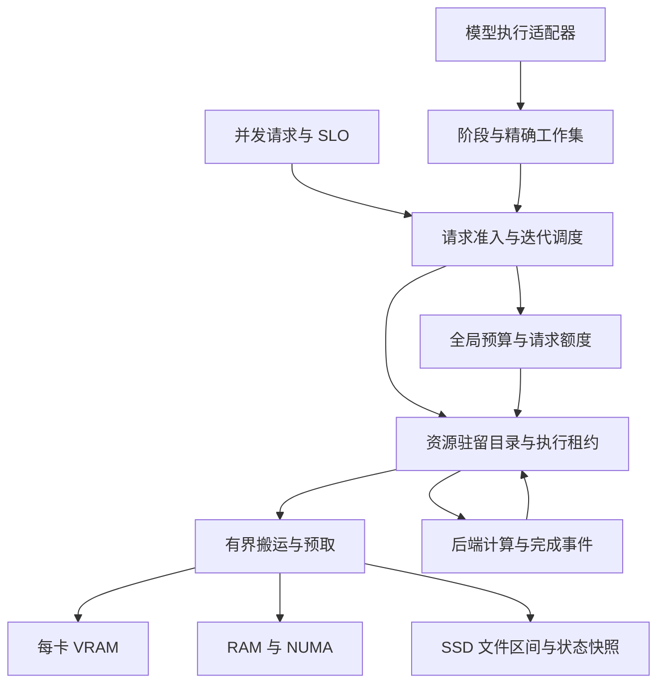

# TensorSharp 统一 VRAM / RAM / SSD 调度系统

源码基线：`f5b1eefb6cf378ed19c9a33178be84c818f7fc4b`；文件权重执行续作基于 `163474ba30814e5abcaba277c3a1f83d9f8ab604`。设计、实现与硬件续验：2026-10-10 UTC。

## 1. 交付状态与目标

目标是让模型的**可执行工作集**适配硬件，而不是要求整个模型同时驻留 VRAM 或 RAM。系统统一管理权重、专家、KV、循环状态、前缀缓存、LoRA、多模态中间结果与临时工作区，保留原有模型计算语义，并根据请求并发程度选择驻留、搬运、计算和排队方案。

本次已经构建可运行的调度基础库、RAM/文件搬运与状态回写、请求预算、GGUF 分片目录、CUDA 分配适配器，并将 Qwen4Exp 原有放置算法抽出后接回原路径。文件权重执行现已显式接入 dense Qwen 3.5 的 Q8_0 和 dense Gemma4 的 Q8_0/F16 PLE，两者均限定单 rank GGML CUDA、文本、无 MTP/draft。Qwen 0.8B 的完整 logits 与重复释放验收已通过；Gemma E4B 的短提示诊断、645-token 长提示 Forward/分块 ForwardRefill、后续 decode 和各两次加载均与原常驻路径逐位一致。Gemma 为保持原 CUDA 归约和融合语义，部分投影需要完整逻辑矩阵的临时设备工作区，不能沿用 Qwen 的极小配额结论。具体预算、上下文和硬件范围见第 6、14 节。**尚未完成全部模型的原生执行图、KV 和媒体流水线接入；不能把本次实现描述为“所有模型已自动支持三层调度”。** CLI、Server、TensorAgent 的公共引擎已可通过环境变量启用有预算的主机 KV 快照换页，但没有一个开关可以开启完整的全模型三层调度。

| 范围 | 本次状态 |
| --- | --- |
| 模型无关预算、驻留目录、租约、版本、LRU、固定搬运缓冲 | 已实现并测试 |
| 真正的 RAM 分配、文件按区间读取、可变状态 SSD 回写/恢复 | 已实现并测试；存储介质类型未作 NVMe 假设 |
| 请求完整峰值预留、FIFO 队列、取消、预留向实际分配转账 | 已接入 ContinuousBatchScheduler/InferenceEngine；由执行器显式提供成本，未自动启用全部旧模型 |
| GGUF / split GGUF 权重目录和不改量化格式的切片 | 已实现并测试；旧加载器未整体切换 |
| 文件权重实际执行 | dense Qwen35 Q8_0 和 dense Gemma4 Q8_0/F16 PLE 的单 rank GGML CUDA 文本适配器已接入；Qwen 0.8B 已验收，Gemma E4B 短/长提示 Forward 和分块 ForwardRefill 完整 logits 逐位一致；配额只覆盖登记的权重 payload |
| Qwen CUDA/UMA 静态放置算法通用化 | 已接入原模型路径；保持原调优参数 |
| 主机 KV 快照、前缀页、循环状态快照 | 显式启用时选择可恢复的逐序列路径，不再被融合路径绕过；Gemma 及 dense、无 MTP、单 rank GGML CUDA 的 Qwen 3.5 真实模型 RAM/文件换页已验证；不接管原生 holder/device arena |
| CUDA 原始分配/读写/释放、真实 event fence、可选 P2P | 默认有界主机中转。前一台 `63.141.33.49` 的中转和显式 P2P 探针通过；当前 `69.30.85.216` 的中转通过、显式 P2P 两个方向均损坏，独立 CUDA oracle 复现；不能跨部署推断直连可靠性 |
| GGML lazy device-copy/preload、选中专家 cache | 可通过 GgmlCacheBudgetScope 接入同一份托管 MemoryBudget，分配前预留、物理释放后归还；原有独立 cache 配额仍有效。Linux CUDA 大权重 cache miss 默认按页面驻留与 CPU 配额选择有界读取/上传流水线；不新增主机权重 payload 副本，实际覆盖见第 14 节 |
| Flash 选中专家的 Windows 文件读取/上传 | 已实现精确分片区间登记、有界并行读取、最多 32 MiB 共享搬运 arena、失败恢复和设备驻留释放后的重新登记；超过可用 RAM 且已有正值专家配额时自动选择。arena 可通过 hostPools 接同一 RAM 账本；槽内默认使用衰减频次淘汰，冷热性能和独立质量验收仍需分别看第 14 节 |
| 硬件/请求预算规划与驻留保留 | dense Gemma4/Qwen35 的 AdaptiveModelSession 显式入口；优先保留驻留图，按物理可用 RAM/VRAM、权重格式、融合、KV/状态和工作区选择；不是全模型自动策略 |
| 文件权重的跨 token RAM / GPU 复用 | RAM 保留原始字节区间；GPU 可保留完整权重及其输入/输出/scratch arena。动态入口按硬件余量、执行期峰值和用户上限设置额度，压力时先回收缓存；Qwen FullPrecision 覆盖 prefill/decode，Gemma ResidentCuda 当前只保留 N=1 decode |
| 文件执行临时 CUDA 工作区复用 | AdaptiveModelSession 默认自动启用；扣除其他 owner 与执行预留后，以最多四分之一余量作为工作区准入份额，权重缓存留出相应空间；请求 reset 回收未再使用的项。显式 0 关闭；底层手工 WeightStreamingOptions 仍保留零缓存默认值 |
| Qwen4Exp 单 token 图内复制及广播消除 | CUDA 默认保留已连续的选定只读输入，并以零步幅 view 广播；真实 IQ1_M 的 34 行完整 logits 逐位一致。最新新 VM 应用 decode 56.65 token/s，同期 llama 59.95，尚未对齐，详见第 14 节 |
| Qwen4Exp 图、循环状态与设备快照预算 | 已接入 includeGraphBuffers 共享账本，覆盖单请求和 batch arena；快照回滚、耗尽拒绝、增额重试和清理归零已有 CUDA 测试；仍不是总 VRAM 上限 |
| GGML/Metal/Vulkan/MLX 原生图、分页 KV、全部融合算子 | 全面适配仍待实现；本轮没有 Metal/Vulkan/MLX 硬件验收 |
| 多卡预算向量、带节点/设备标识的资源位置 | 已支持多位置工作集租约和全 rank fence；两张 A40 上实际内核、双向中转和释放验证通过 |
| 多机协调、远程内存、异步 DMA 重叠 | 设计阶段，未实现；文件提前读取已实现，不能等同异步 CUDA DMA |

“高速”必须相对于模型、量化、工作集、带宽和 SLO 定义。容量虚拟化能让更多模型运行，但无法让每个 token 都要读取几十 GB 冷权重的 dense 模型获得全驻留 GPU 的延迟。

## 2. 当前源码的实际集成边界

| 当前代码 | 已有机制 | 需要统一的边界 |
| --- | --- | --- |
| `TensorSharp.Models/Models/Qwen4Exp/Qwen4ExpModel.ExpertPlacement.cs` | CUDA/Metal 专家放置、专家缓存配额和布局下限 | 算法已迁出；GGML CUDA 选中专家缓存已接共享预算并支持压力缩槽/空闲回收；其他分配和后端仍需接入 |
| `TensorSharp.Models/GpuMemoryBudget.cs` | free VRAM、headroom、token 容量估算 | 统一观测、避免已驻留资源再次扣账 |
| `TensorSharp.Models/ModelBase.WeightLoading.cs`、`ModelBase.WeightPolicy.cs` | 公共权重读取和驻留决策 | 从目录注册资源，按执行边界获取租约 |
| `WeightStreamingOptions`、`WeightStreamingExecutor`、`GgmlWeightStreamingSession`、`GgmlResidentWeightSession` | 显式文件权重、固定主机 tile、下一 tile 文件预读、预算内 RAM 范围和 GPU 完整权重复用；按模型保留行分块或完整逻辑 M/N 算术 | Qwen35 Q8_0 和 Gemma4 Q8_0/F16 PLE 已接入；Gemma 的归约、Norm/RoPE/Residual 融合语义单独对齐，GPU 保留限 N=1；其他模型族和异步 CUDA DMA 未接入 |
| `TensorSharp.Runtime/GgufReader.cs` | GGUF、分片、mmap、tensor 类型与字节布局 | 新增文件区间接口；可避免预读整个数据区 |
| `TensorSharp.GGML.Native/ggml_ops_core.cpp` | device-copy、预载、host buffer、offload cache | 所有分配必须预留；缓存命中必须表示上传已完成 |
| `ggml_ops_host_moe_cache.cpp`、`ggml_ops_host_moe_decode.cpp` | 专家缓存与主机计算 | 热专家驻留、联合选中专家工作集、CPU/GPU 成本选择 |
| `TensorSharp.Runtime/Scheduling/ContinuousBatchScheduler.cs` | 连续批处理、prefill 分块、KV 容量准入、抢占 | 接入字节与 I/O 成本；仅 token 数和 KV 元数据不够 |
| `TensorSharp.Runtime/Scheduling/PrefixCache/` | radix、holder/page、跨请求恢复协议 | 可迁移数据位置，不改变“哪些状态足以恢复”的规则 |
| `TensorSharp.Runtime/Paged/`、各模型 KV/holder | 页面与模型专用状态 | 区分已读页、追加尾页、循环状态、可共享完整页 |
| `TensorSharp.Chat/DiffusionBatchScheduler.cs`、QwenImage、Wan | 非自回归任务、分阶段模型和临时张量 | 以 encoder/denoiser/VAE/帧块为阶段估算资源 |
| `TensorSharp.Distributed/`、GGML TP 实现 | collective、多卡执行路径 | 节点内预算与跨节点原子准入协议分别接入 |

原生执行图里缓存了原始地址。只增加一个“LRU + memcpy”会产生 use-after-free 或读到旧版本。必须在算子、图或原生 slot 的生命周期上持有租约。对于捕获图，采用固定地址的 slot arena，或在地址/布局版本改变时失效并重建图。模型名字不应进入驻留管理器。

本次原生改动全部位于 TensorSharp 自有 C++/CUDA 文件。upstream ggml 固定为 `ffa4e8b80930029a35991f94e7c8a93cd67730ab`，本地 checkout 保持原样，此前 VM 验收也使用未修改的同一 revision。VM 的 CUDA 12.8 / sm_86 缓存预算构建和本机 CUDA 12.6 / sm_86 文件权重构建分别记录，不能混为一次验收。对该 VM 使用 ggml 已有的 `GGML_CUDA_NO_PEER_COPY=ON`；TensorSharp 的 CMake 不再强制覆盖用户选项，没有修改 upstream 实现。

lazy device-copy cache 在分配前原子预留、成功发布后转为 committed，使用 ggml 报告的 buffer 字节数；显式 preload 单独记录 reserved/committed。`GgmlBasicOps.TryGetCacheMemoryUsage` 提供每 rank 诊断。可在首次缓存分配前安装 `GgmlCacheBudgetScope`，将这些缓存的完整所有权记入与 KV 快照共用的托管 `MemoryBudget`；物理释放后才归还额度，失败的 scope 卸载可在清理后重试。新增 `includeGraphBuffers: true` 可纳入已接线的普通算子和 Gemma/Qwen35 图 buffer、reuse gallocr，以及 Qwen4Exp 自有图 arena、循环状态和设备状态快照；默认构造保留旧 cache-only 合约。仍未覆盖所有 native executor、backend/driver pool 和总 RSS/VRAM。具体接入与关闭顺序见第 15 节。

首次 DeviceCopy 上传现在在发布前同步完成，随后图构建因 scratch 分配失败而退出，也不会留下未初始化的缓存命中。CPU/UMA host-pointer 路径不变；该正确性修复相对早期延迟上传的独立成本尚未隔离，不能将它本身宣传为提速。后续 Linux 冷页读取/上传优化保留这一发布边界，其同一二进制开关对照见第 14 节。设备回归覆盖 F32、Q8_0、opaque host key、放弃图构建后重试，以及跨 64 MiB 窗口和部分尾块；没有 Metal/Vulkan 运行验证。

## 3. 系统分层



控制面管理所有权、预算、版本、准入、放置和观测。数据面执行原有正确的算子、数据搬运和设备事件。调度器知道“字节数、合法执行位置、下次使用、代价、状态依赖”，不需要知道这是 Gemma、Qwen、图像还是音频。

新模型应主要增加**布局与执行计划适配**：声明只读资源、动态状态、每阶段工作集和安全完成边界。新算子可能需要新的分块内核；抽象接口无法凭空让一个必须连续持有巨大张量的旧内核变成可流式执行。

## 4. 资源和所有权协议

实际类型在 `TensorSharp.Memory/`：

| 类型 | 职责 |
| --- | --- |
| `ResourceKey(Owner, Epoch, Name)` | 区分模型修订、请求/租户、reload 和资源，避免地址复用污染缓存 |
| `MemoryResource` | 字节长度、用途、可变性、布局指纹；核心不解释布局字符串 |
| `IResourceSource` | 精确区间读取；权重可直接引用原文件，无需复制到 SSD 缓存 |
| `IMemoryBackend` | 预先声明实际分配的所有预算约束，再分配设备内存 |
| `ResourceLease` | 固定地址和版本；并发读共享，写独占；GPU 使用直到事件完成 |
| `BudgetReservation` | 保留、提交、转账、返还额度，覆盖短时双副本 |
| `MemoryLocation` | 节点、设备/NUMA、主机或加速器位置 |

权重和已完成的只读前缀允许多副本。KV 尾页、循环状态、扩散 latent 等可变资源有一个当前逻辑版本。取得写租约前等待读者结束，清除旧副本/快照，再增加版本。完成并验证一次搬运后才把目标登记成可命中副本。

执行中的资源、源副本和未完成写入不能被淘汰。每个资源的状态转换单独串行化，不在全局锁内等待 SSD 或 GPU。相同资源并发加载合并为一次；不同资源允许并行搬运。

多资源算子必须一次取得完整合法工作集。当前 `AcquireReadSetAsync` 在压力或冲突时释放部分租约，由上层重试整个集合；不会拿着半个工作集等待另一半容量。多资源写事务、COW 前缀页和 graph arena 的复合租约是原生适配阶段的必要工作。

资源来源保持不可变，源句柄必须活到注销之后。模型 hash、LoRA 组合、KV dtype、RoPE 参数、位置/模态布局、TP 分片规格等都应进入各适配器的缓存身份或布局验证，不能只用 prompt 文本作为键。

## 5. 一个预算系统，多个物理约束

对每个 pool 始终保持：

$$\text{reserved}_p + \text{committed}_p \leq \text{capacity}_p.$$

pool 是容量约束，不只是 VRAM/RAM/SSD 三个计数。例子包括 `node0/gpu0`、`node0/numa0/ram`、`node0/pinned`、`node0/ssd` 和 `node0/metal-working-set`。

Apple UMA 上一块共享内存同时约束物理 RAM 与 GPU working set；这是同一分配的两个上限，不是两份物理数据。独显权重存在 host mirror 与 device copy 时则确实是两份分配，需要分别记账。

预算必须包括权重、专家 cache、KV/前缀、draft/MTP、encoder、LoRA、activation、scratch、graph arena、通信区、对齐和复制过程中的新旧双份。固定 staging buffer 要先预留，保证压力下仍有办法搬出一页，而不是把最后一点 RAM 给缓存后无法回写。

当前 `MemoryBudget` 支持多 pool 原子预留、提交、释放、缩减容量时拒绝破坏已有额度。请求 envelope 的字节在分配时转成 committed；不重复记一遍请求额度和实际 buffer。释放 buffer 时返还活跃请求；请求先结束时，仅释放剩余额度，其仍被缓存保留的 buffer 继续计入全局 committed。

capacity 要扣掉 OS、其他进程、驱动、.NET 元数据、原生 allocator 等 headroom。已有分配不能同时算作 free-memory 观测中的减少和新的完整扣款。接入旧 cache 前应做一次基线归属清查，并持续比较“调度账本”和“设备/进程实际内存”的差值。

当前实现约束的是已登记的 payload 和对齐额度，**不是进程 RSS 的硬上限**。buffered I/O 的 page cache、libc 保留的 heap 页面、旧 GGML/MLX 缓存没有凭空纳入控制。生产阶段还需 Linux cgroup/pressure、Windows memory pressure、macOS working set 等观测；硬约束部署要配合系统级限制并保留缓冲余量。

## 6. VRAM 和 RAM 都不足时的加载

加载顺序应为：解析头部/张量目录 → 校验文件范围与布局 → 计算最小前进工作集 → 预留 staging 和必要状态 → 按阶段获取权重块 → 执行并释放。禁止为了“模型加载完成”先把所有张量读入托管数组、完整解量化或锁定全部 mmap 页面。

`GgufMemoryCatalog` 已实现单文件/分片目录和共享 shard 句柄，按真实文件 offset 读取原始量化字节；它不猜测专家布局。`GetSlice` 可以描述某专家、某些行或一个 tile，但其边界合法性必须由算子适配器保证。非 GGUF 数据可直接实现 `IResourceSource`。

实际权重执行入口是 `ModelBase.Create(..., weightStreaming: options)` 和 Qwen35/Gemma4 对应构造参数。`WeightStreamingOptions` 借用公共 `MemoryBudget`，声明一个 host pool、一个或多个约束同一 CUDA allocation 的 device pool、文件 tile 大小和 token 分块上限。能力检查限定为 dense、单 rank GGML CUDA、文本、无 MTP/外部 draft：Qwen35 接受 Q8_0 二维投影与 embedding；Gemma4 接受 Q8_0 矩阵，以及明确列入文件权重的 F16 `per_layer_model_proj.weight`。Gemma 的 F16 PLE 为兼容原 CUDA 算法，还要求输入宽度按 64、输出行数按 32 对齐；不能从通用 F16 文件区间支持推断任意模型布局可执行。MoE、多卡、layer split、媒体、推测解码和可绕过状态保护的批处理入口均明确拒绝。少量具名 F32 norm/循环参数保持常驻，限制为每 tensor 至多 1 MiB、合计至多 32 MiB，并单独报告字节数；它们不属于权重 staging 配额。

`WeightStreamingExecutor` 持有模型生命周期的 catalog 和一个固定主机读取 tile；共享容量允许时申请第二个 tile 并提前读取下一块。加载不创建全量 host 权重副本、不 prefault/mmap 数据区，也不把临时 tile 指针注册进旧原生 cache。运行时可在预算内逐区间保留已读原始字节；容量足够时可能逐渐缓存全部访问区间，不能将“加载不预读”误写为“始终不保留 RAM 权重”。Q8_0 每输出行是 `K / 32 * 34` 字节，`K` 必须按 32 元素 block 对齐；F16 原始行是 `K * 2` 字节。文件读取必须填满请求区间，不能把短读当成有效权重。embedding 和 Gemma PLE embedding 只读实际 token 对应行。Gemma 的单位 scale Q/K/V、同 scale 的 gate/up 使用 `ConcatenatedWeightSource` 形成虚拟行拼接，保持常驻参考的逻辑输出宽度；不复制源 tensor、不重复统计原文件字节，缺 V 时借用 K，共享 KV 层只投影自身 Q。非单位 QKV scale 明确拒绝，gate/up 的 scale 不同时保留 split。

计算策略按模型区分。Qwen35 继续使用 TensorSharp 自有 Q8×F32 行分块内核，保留 F32 激活和完整归约维度。Gemma 的 `ResidentCuda` 模式保留原 GGML CUDA 运算选择：Q8 在逻辑 token 数 `N <= 8` 时采用兼容 MMVQ 的行分块，F16 在 `N <= 16` 时采用对应的小批量行分块；Q8 `N > 8`、F16 `N > 16` 则通过 `GgmlResidentWeightSession` 分段上传完整逻辑权重矩阵和输入，只按原始 M/N 投影一次，再分块下载。token/row tile 仍限制 host staging，但不能缩小这部分完整设备工作区。F16 完整矩阵当前有 session 权重与 cuBLAS scratch 权重两份临时设备副本，连同 half input/output、对齐和显式 cuBLAS workspace 全部计账；handle、驱动和库内部元数据需要额外 headroom。Gemma E4B 已通过的短/长提示 Forward 分别使用 128/256 MiB device 配额，不声称 32 MiB 可以运行相同参考数学。

CUDA MMQ/cuBLAS 的归约策略会随逻辑矩阵形状变化，微小误差又可能在后续 Q8_1 激活量化时放大。因此 Gemma 除了保留完整投影形状，还用仅持有激活和小参数的 `StreamingNormRoPE`、`StreamingNormResidual` 图保留原路径的 norm/mul/rope 与 norm/mul/add 融合边界，并使用显式 flash attention 与相同 KV dtype。常驻整模型权重图和 batched holder 仍关闭；这里保留的是实际计算语义，不是缓存整个文件权重模型。默认 fusion policy 的模型对比已单独记录；`TS_WEIGHT_FUSION_COPIES=0` 可能使常驻 FFN 采用 split 投影，该非默认参考尚未由当前结果覆盖。

主机输出 tile 与 CUDA 工作区分别在分配前预留、物理释放后归还。若 host pool 也约束 CUDA allocation，规划会同时扣除独立的主机输出 staging 和设备工作区，避免漏记两份分配。允许分块的工作区按剩余额度缩小输出行数，再缩小 token 数；完整矩阵路径的 device payload 是固定下限，不会靠缩小 host tile 假装满足更低配额。规划后被其他 owner 抢占的额度仍由实际预留裁决，失败立即返回 pressure 并回收临时 staging，不持有半个工作集等待。调用同步完成后才复用 tile；CUDA 创建与清理同时失败时保留 session 和额度。`ResetKVCache` 必须先成功重试释放保留的 session，再重置模型状态并解除失败保护；Dispose 也允许重试。文件读取可与当前 tile 的计算重叠；跨 token 的 RAM 原始字节复用现已接入。H2D、计算和 D2H 仍按 session 同步执行。可选 GPU cache 保留完整权重及其已计费 arena，命中时只替换输入和下载输出；没有异步 DMA 或自动跨模型驱逐。

`HostCacheBytes` 控制可选 RAM 缓存，旧显式构造默认关闭。缓存以本次模型加载的 source 引用、offset 和长度为键，仅发布完整读取成功的不可变原始字节；命中先复制到固定 staging，再交给设备。64-byte 对齐 payload 分配前预留，物理释放后退款，缓存不持有捕获图地址。最多 4096 个条目；索引元数据由运行时 headroom 承担，不计作已精确约束的 RSS。满缓存不因每个扫描 miss 淘汰已有范围，避免大于 RAM 的顺序扫描导致完全抖动；压力回收采用 LRU。此策略没有成本反馈，区间形状变化也可能产生重复副本，不能称为最优替换算法。

`AdaptiveModelSession` 仅在选择文件权重路径时自动设置缓存上限：取源权重字节、用户上限和硬件预算减去 prefill/decode 峰值后的最小值。缓存只在加载结束后的读取中填充，因此不长期扣留加载临时峰值。准入仍为执行期预测保留余量，扣除已经计账的必需读取 tile，额外预读 tile 继续竞争剩余容量。请求边界刷新容量时，若现有 owner 与下次工作区余量不再同时容纳，先 `TrimIdleMemory` 回收缓存、重读物理可用量，再更新预算；不撤销活跃 KV 或其他 owner。未接管的状态仍依赖保守预测，不能等同全进程硬上限。

这条路径新增了实际文件权重计算，**尚不是整个 forward 的原子内存事务**。中途 pressure/I/O 错误可能发生在前面若干层已更新状态之后；流式 `Forward`/`ForwardRefill` 失败会阻止直接重试，必须成功 `ResetKVCache` 并重放请求，或释放模型。固定 host tile、输出 staging 和设备工作区的预算不包含现有激活、live KV、图/后端池、运行时和 OS page cache。真实模型的完整 logits 对比、实际 RSS/VRAM 观测及可用硬件范围须由第 14 节分别给出；不能从较小的 payload 配额推断“物理 RAM 不够也已完成整模型验收”。

最小可执行单元仍有下限：

$$M_{\min}=M_{\text{required state}}+M_{\text{activations}}+M_{\text{scratch}}+M_{\text{one legal tile}}+M_{\text{transfer reserve}}.$$

当某个现有内核的这个工作集也放不下时，需要更细粒度且正确的分块内核，或者 CPU 路径。如果全部合法路径都无法前进，应在加载/准入阶段给出需要的最小容量，而不是启动之后反复 OOM。

SSD 存放两类内容：只读模型权重直接引用原文件；变化的运行状态写入独立配额的临时快照。当前可变状态快照采用有界缓冲、完成所有写入并关闭句柄后原子改名和 SHA-256 校验，失败/取消不发布目标。临时换页不逐页强制持久化到物理介质。原文件不被修改。文件名不含 prompt 或请求内容。进程崩溃后的自动清理和持久恢复尚未实现，不能把临时 swap 文件当成可恢复会话数据库。

## 7. 按计算行为选择策略

### Dense 与共享权重

执行顺序通常可预测：按层/矩阵 tile 顺序读取，保持小而高频的常量驻留，提前准备下一单元，重复使用 staging。吞吐模式把多个请求对同一组权重的计算合并，摊薄 SSD/H2D 读取；交互模式限制 microbatch 和 prefill 工作量以保护 decode 延迟。

核心不应强制整层作为唯一迁移粒度。Embedding/LM head 的行访问、矩阵的行列分块、张量并行分片，都可以是独立资源。但分块 matmul 的归约顺序可能改变浮点舍入；需要与原路径比较 logits 和输出，而不能仅凭字节搬运正确就宣布模型等价。

### MoE

路由器仍执行原有 top-k。针对一个 microbatch，合并所有 token 实际选择的专家集合，gate/up/down 和格式元数据作为合法执行组获取。热专家保留在 VRAM，次热专家在 RAM，冷专家引用 SSD。预测只用于预取；预测错了必须加载真正被选择的专家，不能减少专家数或用近似专家替代。

选择 CPU 专家计算或搬到 GPU，比较的是测量得到的总时间：CPU 计算 + activation 传输，对比排队 + SSD/RAM 读取 + H2D + GPU 计算。一次只活跃很少专家的 decode 和覆盖大量专家的 prefill 可能需要不同策略。

并发增加时，活跃专家的并集会扩大。不能拿单请求的 expert-cache 命中率推算并发 16 的 VRAM。首版统一预算已能表达各类资源竞争；具体专家文件 coalescing、带宽成本模型和跨请求专家分组仍需在原生 MoE 执行适配中落地。

### KV、滑动窗口与循环状态

可复用的**冷前缀**与每个 decode 都访问的**活跃历史 KV**应区分。把前缀放到 SSD 可以节省再次 prefill；把活跃 KV 放到 SSD 则可能每个 token 都付出读取代价，收益条件不同。

普通 attention 的原始 K/V 以页保存；滑动窗口只丢弃模型语义已经允许不再访问的区域。GDN/SSM/Mamba 等保存的是循环状态及必要 checkpoint，不能按普通 KV 的 token 公式强行分页。共享 KV、压缩/索引 attention、MLA 和模型自己的 retention 策略保留专用布局与恢复规则。

超大活跃 KV 可用完整覆盖历史块的 online softmax attention。对于两个已计算块，令最大 logit 为 $m_a,m_b$、归一化和为 $l_a,l_b$、未归一化输出为 $z_a,z_b$：

$$m=\max(m_a,m_b),\quad l=e^{m_a-m}l_a+e^{m_b-m}l_b,$$
$$z=e^{m_a-m}z_a+e^{m_b-m}z_b,\qquad o=z/l.$$

这能分块覆盖所有原始 KV，不必用裁剪上下文换容量，但仍需与原内核验证精度、掩码、位置和吞吐。**本次尚未新增该 attention 内核。** Prefix cache 的分页/holder 协议只迁移位置，不擅自改变原有可恢复性判定。

### Diffusion、多模态、LoRA 与 draft

图像/视频的 text encoder、vision encoder、denoiser、VAE 常在不同阶段活跃。阶段切换允许卸载不再使用的组件；denoiser 的重复步骤有利于保留同一工作集。大分辨率 latent/attention 和 VAE 仍需要正确的空间/时间分块，不能假设仅搬运权重就解决所有峰值。

音频按采样长度/特征帧数，图像按 patch 数，视频按帧数和时空 token 数估算资源；按文本 token 预算会漏掉 encoder 峰值。LoRA、DoRA、draft、MTP 作为独立依赖登记，包含正确 identity、临时 merged/dequantized buffer 和验证阶段 KV。不得自动降低图像尺寸、帧数、音频长度、步数、draft 验证强度或改变 mask。

## 8. 并发请求调度

推荐的运行时流程是：

1. 模型适配器估算 prompt、最大输出、模态编码、循环状态和最坏算子 scratch，声明哪些资源可共享。
2. 请求进入有界队列，不能单独满足的请求立即给出容量原因；可满足但暂时不足的请求排队。
3. 每次迭代挑选 decode 和 prefill chunk，形成实际资源并集，并在所有相关 pool 上预留。
4. 获取完整租约集合、等待数据和依赖事件；完成之后执行；事件结束后释放临时租约。
5. KV/状态按请求生命周期持有；prefix cache 接收状态时保留其预算所有权，再关闭请求额度。

已实现的队列是严格 FIFO，具有明确的队头阻塞取舍。它没有自称为 EDF、WFQ 或动态批处理优化器。后续与 `ContinuousBatchScheduler` 集成时，保留现有公平性/防抖动机制，加入有限 bypass、aging、prefill token/byte 双预算，以及 IO stall 信号。请求的公平单位不能只看 token 数，还要考虑它占用的 SSD 时间和 GPU 工作集。

压力优先级建议为：取消低收益预取 → 清理无租约冷副本 → 回收冷前缀 → 缩小 prefill/microbatch → 排队新请求 → 在合法 checkpoint 暂停请求。避免多个长请求反复互相抢占、重新 prefill。用户显式指定的最大输出不应被悄悄改小。

同一权重在不同请求之间共享一个资源和加载过程；请求私有状态按 owner 隔离。逐层跨请求复用通常改善吞吐，但会增加请求等待权衡，需由目标 TTFT/TPOT/SLO 决定批次，而不是只优化总 tokens/s。

## 9. 多卡与多机

单机多卡采用每卡 pool、NUMA host pool 和设备拓扑。静态规划与实测传输成本应区别 PCIe、NVLink、P2P、经主机中转，以及共享 SSD 带宽。TP/PP/EP/DP 的分片与副本位置属于执行计划，不能把“有多个 MemoryLocation”当成已支持任意并行模式。

一个 TP step 需要同时取得所有 rank 的额度和 collective 工作区；不能 rank 0 持有预算后永久等 rank 1。单进程内多 pool 原子预留已能表达这个约束。图捕获地址、通信 buffer 和跨设备事件仍须后端适配。

多机以节点为预算权威：协调器发送带 epoch/有效期的 prepare；所有节点接受后 commit；任一失败则撤销整组。节点失联时禁止向失效地址发 DMA，未提交的预留超时回收，已提交的执行按可验证 checkpoint 恢复。远端 KV/专家缓存必须有模型版本、布局与分片标识；鉴权和配额按租户处理。远端缓存不是本地 SSD 的等价延迟层。

**以上跨节点协议尚未实现。** `MemoryLocation.Node` 只是为后续扩展预留身份空间，不提供分布式一致性。

## 10. 当前所有模型族的接入清单

以下来自基线 `BuiltInArchitectures.cs` 及其模型目录，不依据宣传名称推断已经兼容。所有条目的通用登记/搬运数据结构可复用；Qwen 放置策略、公共主机 KV 快照路径，以及下表限定的 Qwen35/Gemma4 文件权重执行入口已经接入。其余原生执行、holder/arena、媒体资源适配仍须逐项完成，不能用公共路径或微算子测试代替每个模型的验收。

| 注册族/目录 | 必须申报和适配的资源 | 关键验收 |
| --- | --- | --- |
| Qwen35 | dense、单 rank GGML CUDA、Q8_0、无 MTP/draft 的文本文件权重执行通过真实 0.8B 完整 logits parity；该单 rank CUDA 路径已有主机 GDN/KV 快照 | MoE、其他量化/backend、TP 流式权重、推测解码（含 N-gram）、MTP、vision 及 native KV/holder 全预算仍未接入 |
| Qwen4Exp | 专家、QSA/索引 KV、PLE、MTP、host seam | 全部选中专家、compact cache、量化布局、多请求并集 |
| Gemma4 | dense、单 rank GGML CUDA 的 Q8_0/F16 PLE 文本文件权重已接入；E4B Forward/分块 ForwardRefill、decode、重复加载完整 logits 逐位一致；原主机 KV 快照已有验收 | MoE、其他量化/backend、多卡、媒体、推测解码和 native holder/arena 全预算未接入 |
| GptOss | MoE、窗口/全局 attention KV、量化专家 | 分页与跨请求状态、完整路由 |
| Nemotron | 混合循环/attention、已有模态组件 | scan/conv 状态与 checkpoint 一致 |
| Mistral3 | dense 权重、KV、vision projector | 图像 token/位置、prefill/decode 一致 |
| HunyuanDense | dense 权重、KV、scratch | Dense 流式分块与原实现 logits |
| MuseGlimmer | 语言权重、vision、KV、DFlash | draft/target 的资源隔离与验证回滚 |
| DeepSeek4 | MoE、压缩/索引 attention、原生 slots、draft | 原生 slot 所有权和压缩状态一起恢复 |
| DeepSeek41 | 上述加 Engram/辅助 lookup/vision 等实际启用组件 | lookup 精确区间、异步 gather、slot/TP 不漏账 |
| GlmDsa | MoE、DSA 索引与相关状态 | 索引与值版本一致、精确路由 |
| MiniMaxH3 | 混合计算、专家/循环状态、既有 slot 机制 | 保留模型自己的状态语义 |
| DiffusionGemma | block/canvas、迭代状态、缓存、多模态输入 | 接受规则与恢复点，不能当成普通逐 token AR |
| QwenImage（含 2.1） | text/vision encoder、DiT、VAE、LoRA/DoRA、latent | 阶段峰值、空间分块、mask、adapter identity |
| WanVideo | encoder、DiT、VAE、帧/时空块、latent | 时序依赖、帧块拼接、视频质量和峰值 |

与新模型接入相关的契约应放在架构描述器旁：资源目录工厂、逐阶段工作集估算、原生绑定/重绑定、安全事件和状态导入导出。能力必须按**模型 × backend × dtype/layout × 执行模式**描述。只实现接口、只运行一个小 checkpoint、或保留旧常驻 fallback 都不能标记为完整三层支持。

## 11. 性能控制和带宽上限

以有效读取带宽 $B_{ssd}$、主机到设备带宽 $B_{h2d}$、冷数据字节 $D$ 估算，一个 step 至少受到相应链路时间约束：

$$T_{step}\geq\max(T_{compute},D_{ssd}/B_{ssd},D_{h2d}/B_{h2d}).$$

这是充分重叠时的下界，不是实现时延预测。不能重叠时各阶段还要相加，并计入随机读取、页故障、队列和同步。假设每 step 必须读取 8 GB 冷数据、有效 SSD 带宽 4 GB/s，单读取就至少 2 秒；单请求上限最多约 0.5 token/s，尚未计入计算。若 8 个请求在该 step 共享这批权重，聚合吞吐可能改善，但单请求 step 延迟并没有自动变成八分之一。

首版已实现驻留 LRU、有界搬运、同资源加载合并和不驱逐需求数据的预取。淘汰扫描只遍历**当前驻留项**，不扫描整个 SSD 模型目录。成本感知策略、页缓存建议、IO coalescing、后台回写、水位滞回、预取准确率反馈、按链路限流及 DMA/计算重叠尚待实现。

后续策略可使用“未来命中概率 × 省下的加载/计算时间 ÷ 常驻字节”衡量缓存价值；权重、KV、专家竞争同一个资源预算，但不能混淆它们的恢复成本。保留最低 decode 前进工作集，防止预取与前缀挤占所有额度。

## 12. 正确性规则和故障行为

- 默认仅迁移原有字节，不重新量化、不减少专家、不删有效上下文、不降分辨率。
- 活跃 lease/fence 未完成时不可释放地址。失败 fence 保留租约等待恢复；设备释放失败隔离该资源并保留预算。
- 目标 allocation、双副本、搬运 buffer、SSD 新快照都先预留；I/O 失败不会被当成有效缓存命中。
- 异步取消必须等待 DMA/I/O 不再引用 buffer 才释放。不能用“请求已取消”代替设备完成事件。
- 写租约更新版本、丢弃旧副本；临时 SSD 恢复校验失败返回错误，不读取未初始化数据继续生成。
- 所有资源对齐、元素类型、stride、shape、量化 block 信息由适配器验证；当前 `Layout` 是身份元数据，内核本身不解释它。
- 共享前缀只共享不可变完成页；修改尾页需要 COW 或独占副本。COW 集成尚待完成。
- 新旧后台 cache 不可同时声称拥有同一份免费额度。旧 buffer pool 若缓存物理分配，应在池真正释放之前保留额度。

无损搬运不意味着跨 CUDA/CPU/Metal 计算逐位相同；后端内核和累加顺序本来就可能不同。验收需要区分同路径 exact byte round trip、同 dtype 的数值容差、argmax/token 稳定性，以及任务质量。

## 13. 实施顺序与上线门槛

| 阶段 | 具体工作 | 完成条件 |
| --- | --- | --- |
| 本次基础库 | 预算、lease、文件、spill、queue、GGUF seam、Qwen policy 抽取 | 已有可复现 CPU/文件测试与放置回归 |
| 原生预算接管 | GGML device-copy/preload/expert cache、CUDA pool、MLX/Metal 所有分配归属 | 账本与设备实测差额可解释；加载/图重建峰值不越界 |
| 权重执行适配 | 固定 slot 或按阶段重绑，通用 dense/专家分块、真实 CUDA 事件 | 正确完成“权重 > RAM > 可用 VRAM”的真实模型测试 |
| 动态状态适配 | paged KV、holder、循环状态、draft、prefix 所有权转移 | 多轮/取消/并发/恢复不丢状态；冷/热 KV 语义清楚 |
| 媒体与所有族 | 按上表补齐 adapter、encoder/DiT/VAE 分块 | 每族每后端明确支持矩阵，缺失项不能默认为支持 |
| 高性能路径 | pinned DMA、预取/计算重叠、CPU/GPU 策略、带宽反馈 | 真实设备下满足设定 TTFT/TPOT/吞吐指标 |
| 多卡/多机 | rank 预算、通信区、P2P、节点租约和恢复 | 原子准入与故障测试，不以单卡成功替代 |

在完整适配前应保留显式能力检查；不足时报告哪个执行单元还不能迁移。先收集 shadow accounting，再逐族开启，禁止用无效开关宣称全模型支持。

2026-10-09 UTC 对照用户提供的初始设计复核：基础库、共享原生缓存预算、请求接入、文件执行和 RAM 原始字节复用已进入实现阶段，不能再统一列作“接口设计”。但初始目标的以下验收仍然缺失，不能因局部实现通过而删除：

- 默认 Qwen 解码仍落后独立基线；并行归约实验在较大模型出现数值门槛失败。后续必须同时改善正确性与吞吐，不能直接将实验设为默认。
- 文件权重已支持预算内跨 token GPU 保留，但仍无异步 DMA；Gemma 非单 token 投影继续使用原完整形状或行分块算术。当前准入为按访问顺序填充、扫描不替换热项、压力时 LRU 回收，尚未按实测收益全局选择缓存或优化流水线深度。需继续分别测量工作区、PCIe、计算和物理 SSD I/O。
- Gemma 12B UD-IQ2_M 的 FF7 重复/事实错误尚未解决；同源量化控制、独立数学对照和长输出质量检查仍需继续。其他低比特模型也不能套用 Q8 的验收。
- Flash Next 与 Qwen Image 的已有短任务/单图结果不覆盖统一文件调度、多模态多轮、编辑、并发或完整质量指标。新增适配需逐阶段验证 encoder、专家、DiT/VAE 及状态恢复。
- 全部原生 holder/KV、后端池、跨模型竞争和多卡故障恢复尚未统一；已计账 payload 不等于总 RAM/VRAM。远端不可用的本轮测试不计通过，旧 A40 结果保留其原范围。

CLI、HTTP API、Web Chat、TensorAgent 最终应共享一套 engine 配置。产品层只需展示预算、等待原因、实际运行位置、当前模式和预计性能；原生布局/指针等实现细节留在诊断页。该产品配置接入尚未在本次实现。

## 14. 验证与本次证据

本轮 VM 环境为 Ubuntu 24.04 x64、.NET SDK 10.0.401、CUDA 12.8.93、驱动 570.211.01，两张 NVIDIA A40（各 46,068 MiB）。`/workspace` 是网络文件系统，本轮文件换页不代表本地 NVMe 性能。使用未修改的上述 ggml revision 完成 CUDA 原生构建。

独立 Linux harness **46/46 通过**，覆盖原子预算/UMA、并发额度、请求 envelope、队列取消、真实文件大工作集、single-flight、写独占/版本、SSD 无损回写、损坏校验、SSD 配额耗尽、I/O/分配失败和取消回滚、完成事件、部分工作集回滚、预取、主机降级、生命周期、并发状态更新、split GGUF、原策略回归和流式矩阵计算。本轮增加分配与清理同时失败时的隔离、降级清理失败、预算缩减后的队列拒绝、真实 engine 的路径选择、完整页写放大、释放重试，以及多个 owner 共享 RAM/SSD 预算与部分构造回滚。释放中途失败时 worker 停止继续生成，完成所有等待 handle，保留未释放页面和额度；多请求 Dispose 中已经完成的释放不会因下一个请求失败而丢失。Windows 的同一 harness 为 **45/46**：文件共享语义不允许注入的损坏场景不可用，不能计为通过。

真实文件工作集测试：1 MiB 权重文件，在 12 KiB 的受管 payload/staging 预算下循环读取。流式计算测试：512 KiB F32 矩阵，在 20 KiB 的受管 payload/staging 预算下分块，8 个请求共享一次权重读取，4,096 个结果与同运算顺序的参考计算逐位一致。输入/输出、.NET 运行时和 OS page cache 不属于这个 payload 预算；这些不是低 RAM 完整 LLM 的 benchmark。

公共引擎测试用依赖完整历史状态的确定性模型逐 token 比较换页前后并发输出，并验证循环状态 checkpoint、外部预算释放唤醒、前缀回收和取消。原有调度、Qwen 放置与专家计划回归，加上执行计划、有预算快照、prefix 回收与并发对话回归，在 Linux 上 **140/140 通过，0 skipped**，与 harness 分开运行。此前三个 NuGet 包已本地打包；本轮没有发布包。

真实 CUDA residency：GPU 0、GPU 1 各 **5/5**，双 GPU 主机中转 **11/11**，包括两方向全量数据、事件、SSD 恢复和请求物理释放。直接 P2P 的两个方向均失败；独立 CUDA Runtime 控制程序的同步/异步、两个方向共 **4/4 失败**。这是部署上的传输问题证据，不推断具体驱动/平台原因，也不算 P2P 通过。

最终原生缓存 CTest **4/4 通过，0 skipped**：并发预留/回滚、共享预算安装/卸载与生命周期、CUDA 单卡和双卡实际缓存预算与 F32/Q8_0 计算、显式 preload 独立计账、释放归零。放弃图构建用例先将新 allocation 填入测试值，再要求其后缓存命中与强制流式参考逐元素一致。Q8_0 用可精确量化的激活输入，避免把 CUDA Q8_1 的输入舍入误判为缓存损坏；没有放宽比较容差。

真实托管/原生共享预算探针在 **1/2 张 A40** 上均通过，分别完成 **10/14 次**逐元素精确 F32 matvec，以及各 **6 个**分配失败回滚场景。验证外部 owner 占用额度、公共与每 rank 配额、lazy cache 拒绝后的计算回退、preload 拒绝、GC 后回调存活、带未释放缓存时 Dispose 拒绝与清理后重试、原生计数与托管账本一致。每次矩阵 allocation 为 **65,536 字节**。公共 pool 是两卡共享的配额，不是另一份物理 RAM 副本；这不是 UMA 硬件或模型全内存上限的验证。见 [GgmlBudgetProbe](../../eng/validation/UnifiedMemory.GgmlBudgetProbe/README.md)。

真实 Gemma 4 E2B IT Q4_K_M：此前完整聊天模板下并发 **1/2/4/8/16**、每请求 8 个生成 token，原有快照和受限 RAM/文件换页路径输出、结束原因一致；并发大于 1 必须实际发生 spill/load。另比较两个真实历史恢复后 **4,194,304** 个 logits，最大误差 **0**、argmax 无差异。仅验证文本和模型可恢复窗口内的状态。checkpoint hash、复现方式见 [ModelProbe](../../eng/validation/UnifiedMemory.ModelProbe/README.md)。最初未使用完整聊天模板的高并发用例发生早停，已保留为失败证据，不能与纠正后的固定输出用例混算。

Gemma 较长用例实际为两个 **271 token** 完整 prompt，每请求生成 **16 token**；输出一致，换页恢复后 **8,388,608** 个 logits 最大误差仍为 **0**。engine 的 snapshot RAM 配额为 **655,360 字节**，含一个 294,912 字节驻留页及 capture/transfer scratch；权重、设备上的活跃 KV 和 OS page cache 在该配额之外。该上下文仍在模型的 512-token 可恢复窗口内。

Qwen 3.5 0.8B Q8_0 的 dense、无 MTP、单 rank GGML CUDA 路径现已启用安全快照，包含完整 GDN conv/ring/delta state 与 attention KV。新增负数/溢出范围和逐层布局的事务性检查；中途恢复失败时只从真实 recurrent checkpoint 继续。最终计算库下并发 **1/2/4/8/16** 输出与 **16 个独立请求参考**完全一致，tiered 路径分别发生 **0/24/48/96/192 次 spill**；两个历史交替恢复三轮，**6 份快照字节完全一致**，共 **11,919,360** 个 logits 误差为 **0**。较长用例是两个 **258 token** prompt、每请求 **16 token**，发生 **64 次 spill**，**23,838,720** 个恢复后 logits 误差为 **0**。快照页为 **20,398,156 字节**，RAM 配额 **40,861,952 字节**，仍不包含权重/live device KV/OS page cache。MoE、MTP、多卡快照及其他 backend 未开放；这些不属于本次通过范围。

同一计算库在物理 GPU 1 上补跑 Gemma 并发 **2**，与独立请求参考相等，发生 **25 次 spill**；**6 次**快照恢复字节完全一致，**12,582,912** 个 logits 误差为 **0**。Qwen 和 Gemma 的短暂异卡重叠只用于正确性验收，时延没有作为受控 benchmark。GDN 每页重复完整状态导致大额 I/O，严格一页 RAM 配额下的换页显著慢于原有路径。

真实 Qwen 3.5 0.8B Q8_0 的 TP1/TP2 比较执行了 5 个用例 × 24 行、共 **29,798,400** 个 logits。日志、每 rank 缓存计数与设备观测确认两个 rank 实际参与。最终两进程均以 0 退出，全部有限且 **120/120 argmax 相同**；最大 relative L2 为 **0.0005205466**（限 0.001），最小 cosine 为 **0.9999998736**（限 0.999999），最大绝对误差 **0.006324291**。严格门槛未改变。初始版本的 relative L2 **0.04140844**、cosine **0.99914715** 和 max-abs **0.6113646** 属于失败记录，不能混入通过结果。

定位时同一 TP1 路径在物理 GPU 0/1 上的全部 logits 逐位相等；关闭 TP 并行/CUDA graph 等控制未消除旧差异。实际首 token 张量比较将首次显著偏差定位到第 7 层 QKV 投影：约 1e-7 的 norm 差异使 Q8_1 激活量化跨过舍入边界。修复为 dense Qwen GGML CUDA 的 Q8_0 权重注册 TensorSharp 自有 Q8×F32 投影，保留 F32 激活；TP1 和 TP2 使用一致策略，不生成常驻 F32 权重副本，也不修改 ggml。注册跟随 host/device key 生命周期并在释放前注销，缓存键创建失败可回滚重试。该模型的整个模型 TP decode 路径未使用；覆盖的是实际 per-operation TP 路径。命令与限制见 [ForcedLogitProbe](../../eng/ForcedLogitProbe/README.md)。测试使用 host reduction 和关闭 P2P 的 ggml 构建，不代表 NCCL/P2P 或吞吐验收。

以上数值、缓存和完整快照矩阵使用的原生库 SHA-256 为 `0146374922609a3f88038c61540467db26dc05dbf8098b128a87e6d2eacc5cfc`，上游 ggml revision 仍为 `ffa4e8b80930029a35991f94e7c8a93cd67730ab`，工作区无修改。Q8 精度路径改变了运算选择；模型数值误差已按上述范围验证，不能从这些单次运行推导性能提升。

随后只修正可选张量诊断的文件 I/O 错误处理，防止写文件失败使已经推进状态的 forward 重试。该库 SHA-256 为 `5bd4436676564091850c8862ed50e971ad8924147399742e4299fcf895d1c941`；对应 TP 和有效/无效诊断目录控制记录见 [ForcedLogitProbe](../../eng/ForcedLogitProbe/README.md)。它不取代上述原库的完整快照矩阵来源。

新增文件权重执行的本机微算子验证使用 Windows/MSVC 14.44、CUDA 12.6.77、sm_86 和 NVIDIA GeForce RTX 3080 Laptop GPU（16 GiB，驱动 566.36）：Q8_0 流式投影覆盖 **60 种配置 × 2 轮输入/权重内容**，逐元素检查独立 double oracle，并要求 full/tiled 两条 CUDA 计算逐位相等；原 Q8×F32 路径的 **86 种配置 × 2 轮**回归也通过。singleton/显式 rank 的设备身份修复后，contract/显式 rank/singleton 原生回归 **3/3 通过**，该阶段库 SHA-256 为 `d2fb392209eac7b6033a9adffc9b85ffb6be5f0c1aa7bf85514a95add8af4205`。

完整模型验收发现 GDN shape cache 延迟到 CUDA driver 退出后释放，导致虽然 logits 通过、进程仍以非零退出。已在 cache/model/backend teardown 时提前释放 TensorSharp 自有 GDN 和 recurrent-prefill 图缓存。修复后的库 SHA-256 为 `e0c73d62a7b074e82abce47994a1e94c0715d2376b0af3eb702573c1f6c3769b`，上游 ggml 仍为上述未修改 revision。实际 native GDN 生命周期测试覆盖三次分配、两次 Clear 后重建及一次 Shutdown，进程以 0 退出；最终托管契约、失败保护和实际 CUDA 双失败 ownership 回归 **32/32 通过，0 skipped**。流式模式明确拒绝 N-gram 在内的推测解码及直接 fused/pipelined 入口，避免绕过 failed-forward/reset 边界。独立 recurrent-prefill cache 在这些流式模型用例中始终为 0，其清理经过代码审查，但不计作已有分配的硬件释放覆盖。

真实 Qwen3.5 0.8B Q8_0 使用原 checkpoint（SHA-256 `0ad885ffd4bb022fc4f0d33a3308fa108ef8613159d3b3a67e23abca056b7a6c`，文件 811,843,840 字节）。187 个量化 tensor 共 798,887,936 字节保留为文件区间；133 个白名单 F32 tensor 共 1,993,984 字节常驻并单独报告。普通常驻模型生成独立参考，文件流式模型使用相同 prompt/token history；每轮重新构造并释放，外部 owner 耗尽 host/GPU 额度后分别验证构造拒绝、forward 拒绝、必须 reset 及恢复后的完整 logits。

| Qwen35 文件权重模型用例 | 实际通过结果 |
| --- | --- |
| 2 MiB host / 128 KiB CUDA 工作区；2 个 32-token prompt × 4 行 × 2 次加载 | 16 行、3,973,120 logits；max relative L2 **0.000842258**，min cosine **0.999999689**，top-1 **16/16**；host peak **1,052,160** B，CUDA peak **130,816** B |
| 2 MiB host / 2 MiB CUDA 工作区；2 个 256-token prompt × 16 行 × 2 次加载 | 64 行、15,892,480 logits；max relative L2 **0.000717923**，min cosine **0.999999745**，top-1 **64/64**；host peak **1,171,840** B，CUDA peak **1,541,376** B |

两用例均进程退出 0、无量化权重 preload、每轮预算回到 0。长用例每次实际 GDN graph buffer 从 **113,509,376** B 归零；这部分是预算之外的缓存，不能合并成“2 MiB 就能运行整个模型”。最终 Models assembly SHA-256 为 `738b66bf2c73bf92337bb85c39140f6f38f3f28ba0b624e2af15ddfc8560004c`，probe 为 `75125f6de46dbb4cf5007c939c4340ce41aee97c18ea7b2f65e7fc976183b2fc`。复现见 [WeightModelProbe](../../eng/validation/UnifiedMemory.WeightModelProbe/README.md)。Windows `/proc/self/maps` 检查不可用，没有计为通过；VM SSH 当前拒绝连接，新增文件权重路径尚无 Linux/双 GPU 完整模型验收。

性能对照固定 2 个 32-token prompt、每个 4 行、2 个加载周期，顺序为 token tile **8/32/32/8/8/32**。每组各三次运行全部通过原数值门槛。32-row 配置每进程逻辑文件读取从 **19,127,018,240** B 减至 **12,782,428,928** B（**33.2%**）；纯 Forward 中位耗时从 **12.787** s 降至 **9.019** s（**29.5%**），prefill 合计中位耗时从 **6.526** s 降至 **2.821** s。decode 合计仍约 6.2 s，没有声称单 token 解码加速。默认 token tile 因此设为 32，仍按剩余共享预算缩小。对照使用同一 native、Models `318bc7a0765bf57455dcf2374fb4aa4c21517158789acd0ed696369e83d0b652`、probe `f804a51163130e774a554bf336289e6e7dff50aeb593016f8a56dbf97afe9e64`；随后只改默认值和极端 token cursor 溢出边界，最终版本验证如上。这是同机缓存已热的短用例配置对照，逻辑读取包含 OS cache 命中，未测物理磁盘字节、冷启动带宽、p95/p99 或全驻留模型吞吐优势。128 KiB 用例的纯 Forward 合计约 **80.5 s**，更小工作区带来的分块开销不可忽略。

Gemma 文件权重续验使用本机同一 RTX 3080 Laptop / CUDA 12.6 / sm_86 环境，模型为用户目录中的 `gemma-4-E4B-it-uncensored-Q8_0.gguf`，文件 **8,031,235,616** 字节，SHA-256 `96c455818ff64884f0e2ae3bc5517675896c4eae60676cc9135b9bb865eaf15c`。380 个 Q8_0 tensor 和一个 F16 PLE tensor 共 **8,013,152,256** 字节保留为文件来源；339 个小 F32 参数共 **2,263,208** 字节常驻。F16 PLE 的逻辑形状为 `[2560,10752]`，原始 payload **55,050,240** 字节；它没有被当成小常量加载。以上是模型/文件身份，不表示将整个文件同时读入主机内存。

本轮新增原生 contract、显式 rank、singleton、resident 行分块和完整 M/N session 的 CTest **5/5 通过**；托管生命周期、预算和 flash attention 在 CUDA 配置下 **41/41 通过**（40 个 CUDA 用例 + 1 个 CPU 参数检查）；CPU 文件区间、虚拟拼接、布局/能力和 shared-pool 契约 **57/57 通过**，均为 **0 skipped**。随后 NormRoPE **5/5**（4 CUDA double-oracle + 1 CPU 参数检查）、NormResidual **3/3**（2 CUDA double-oracle + 1 CPU 参数检查）分别通过，未把参数检查算作硬件覆盖。完整 session 测试包括分段上传的缺口/越界拒绝、完整投影与原 AddmmQuant 逐位比较、子区域下载 canary、新输入使旧输出失效、真实上传失败后 poison、创建与清理双失败保留所有权，以及 shared host/device pool 的一字节配额边界。结果保存在忽略的 `artifacts/unified-memory-gemma/` 中，对应 `native-complete-matrix-tests-v1.log`、`cuda-complete-matrix-tests-v1.log`、`contracts-complete-matrix-v1.log`、`norm-rope-tests-v1.log` 和 `norm-residual-tests-v1.log`。

最新合并硬件 suite 的 `cuda-final-tests-v1.log` 为 **65/65 通过、0 skipped**，其中 **62 个实际 CUDA 用例、3 个 CPU 参数检查**；与上述阶段性结果存在重叠，不累加为新的独立覆盖总数。它包含 **14 个 direct CUDA circular-cache 用例**，覆盖 F16/F32、长 chunk 最后窗口、非零及 `int.MaxValue` 起点、graph 执行和非 circular 越界拒绝；另有 **2 个旧 `GgmlQ8StreamingSession` API 兼容用例**，比较旧 API 与 generic FullPrecision API 的结果、独立数值 oracle 和共享预算释放。旧 public API 已原样恢复，未借新接口改动旧行为。主机 ring、refill 清理等 CPU 用例不计入该硬件 suite。

CPU 全量套件 `cpu-suite-final-v1.log` 记录 **7,937 passed / 1 failed / 73 skipped**，不是全绿。唯一失败为未修改的 `MultiAgentWorkspaceTests.SymbolicLinksAreRejectedEvenWhenTheirTargetsRemainInsideParent`：创建符号链接时抛出 `System.IO.IOException`，报告缺少所需权限；仍按失败记录，未修改或跳过该测试。该轮编译早于最后一批 SWA 异常清理修改，尚不包含随后新增的 9 个失败清理所有权用例。

最后改动后的 CPU 定向复验 `cpu-focused-final-v1.log` 为 **92/92 通过、0 skipped**：原 57 个文件权重/预算契约、14 个主机 ring 用例、12 个 refill 用例，以及 9 个 SWA 部分分配失败的所有权用例。此轮覆盖 `BuildSwaPrevWindow` / `ConcatHeadFirstKV` 错误路径释放临时 owner，以及 K/V 字典接管时的事务式清理；修改限于异常路径，不改变正常算术。92 个定向通过与此前全量套件有重叠，不相加，也不将此前的符号链接权限失败改计为通过；最后改动后未再次运行整个 CPU 套件。

direct CUDA 的 tracked sm_120 PTX 使用官方 **CUDA 12.8.93** 编译器重新构建；同一编译器的修改前后 control 均含 **150 个 entry**，仅 `ts_copy_head_first_to_cache_f16` 与 `ts_copy_head_first_to_cache_f32` 两个目标 kernel 改变，其余 entry 和前缀相同，见 `artifacts/toolchains/cuda-12.8.1/ptx-control-diff-summary.json`。这是 **sm_120 编译验证**，没有该架构硬件运行结果。本机上述 direct CUDA 用例实际加载的是 **CUDA 12.6.77 / sm_86 / PTX 8.5** 构建，PTX SHA-256 为 `0BE65FA0530B12724E608B732530FE88191E3826D06E2A21C2CBB5592D259F7A`；不能用它宣称 sm_120 已通过硬件验收。

短提示诊断实际执行 **2 个 36-token prompt × 2 行 × 1 个加载周期**，比较全部 **1,048,576** 个 logits，relative L2 和最大绝对误差均为 **0**、cosine 为 **1**、top-1 **4/4**。同时比较选定融合边界的 **396 对中间张量**，全部逐位相等，缺失 **0**；这不是所有执行阶段或长上下文的覆盖。配置为 **32 MiB host / 128 MiB device**、16 MiB 文件 tile、32 token staging、F16 KV、最大上下文 1024、默认 CUDA/fusion 环境。host payload peak **17,566,720** B、device workspace peak **117,170,176** B；流式 quantized preload 始终为 0，构造/forward 压力拒绝与 reset 恢复通过，释放后两个预算 pool 均归零，进程正常退出。报告为 `gemma-e4b-norm-residual-diagnostic-v1.json` 和 `tensors-norm-residual-v1-comparison.json`；此阶段 native SHA-256 `3aed4594acbca0ac637d51d1b30e3ad8cb390f1d23a611b0328bd5bc4a439f47`，ggml 仍为上述未修改 revision。

长提示最新完整通过报告为 `gemma-e4b-long-forward-v3.json`：**2 个 645-token prompt × 16 行 × 2 个加载周期**，共 **64 行、16,777,216 个 logits** 全部逐位一致，relative L2/最大绝对误差为 **0**，cosine **1**，top-1 **64/64**。使用 **32 MiB host / 256 MiB device**、16 MiB 文件 tile、32 token staging、F16 KV、最大上下文 1024 和默认 CUDA/fusion 设置；没有启用 tensor dump。host/device weight payload 峰值分别为 **17,566,720 / 165,812,224 B**，每轮 forward 压力拒绝与 reset 恢复通过，两轮释放后预算均归零，进程正常退出。此报告仍使用上述 native `3aed4594…`；Models SHA-256 为 `707f2c3c8c4ca41a4f13fecebb2360292e7383502d0cb1d0a622be26bf2c3849`，probe 为 `648851c4e97962d878e3bd403aa6e7315700cb8ae6538046e6828b5fb5867d11`。

`long-forward-v1/v2` 的首 decode 不匹配保留为历史定位证据，不再代表最新 Forward 状态：v1 relative L2 为 **0.0083440551**，虽 top-1 相同仍按原门槛失败。修复包含两处实际问题：单 token decode 保持与常驻 CUDA 图一致的物理 ring 遍历顺序；主机 F16/F32 circular cache 写入只调度长 chunk 最后 `min(seqLen,cacheSize)` 行，保持原始 source/head stride，避免旧行与新行并行写同一槽位。direct CUDA 的两个对应 copy kernel 也采用最后窗口 guard，位置相加使用 64 位以免溢出。这些 direct CUDA 修改是独立修复；上述 GGML CUDA 模型验收经过的是主机 copy 路径，不能代替 direct CUDA 后端整模型验收。

同一 v3 报告的纯 Forward 时间对照如下。prefill 速率按输入 prompt token 数除以 prefill 时间；decode 速率只计算独立单 token decode 调用，首个输出由 prefill 产生，因此每例 16 行对应 15 次 decode。常驻参考跑两个用例一次，流式跑两个用例两轮；下表分别使用各自实际计数，不将两轮耗时直接与一轮相比。

| 路径 | Prefill token / 累计秒 / token·s⁻¹ | Decode 次数 / 累计秒 / token·s⁻¹ |
| --- | --- | --- |
| 常驻参考，2 个用例 | 1,290 / **0.538503** / **2,395.53** | 30 / **0.570599** / **52.576** |
| 强制文件流式，2 个用例 × 2 轮 | 2,580 / **29.335252** / **87.949** | 60 / **124.208739** / **0.4831** |

该强制流式配置明显慢于常驻参考。计时只覆盖返回的 Forward 调用，排除模型加载、压力/reset、logits 比较和释放；未控制 cold/warm cache，未交错随机化两条路径，也没有 p95/p99 或跨硬件吞吐测量。两轮逻辑文件读取 **317,490,998,400 B** 可能包含 OS cache 命中，不等于物理磁盘流量。它证明给定工作区下的正确执行和本机代价，不是全性能验收或流式提速结论。

分块 `ForwardRefill` 已完成独立验收，最新 `gemma-e4b-long-refill-v2.json` **通过**：`TS_PREFILL_CHUNK=256`，**2 个 645-token prompt × 16 行 × 2 轮**，**64 行、16,777,216 logits** 全部逐位一致，top-1 **64/64**。配置仍为 32 MiB host / 256 MiB device、16 MiB 文件 tile、32 token staging、F16 KV 和最大上下文 1024；host/device weight payload 峰值为 **17,566,720 / 134,742,016 B**，最终预算归零。与 Forward v3 合计 **128 行、33,554,432 logits** 逐位一致；这只是两类已列明用例的正确性总量，不合并性能指标。此阶段 Models SHA-256 为 `d772645dc281d5bb906f11ad744ae69b3fa879a17d11e8fb868e7f345c651a19`，native/probe 与 Forward v3 相同。

旧 `long-refill-v1` 的首行 relative L2 **0.0142817554** 属于已修复的历史失败。streaming 先前只保留 `W-1` 行旧 SWA 历史；resident CUDA verify 保留完整 `W=512` 行，再由首 query 的 mask 排除最老一行。两者有效逻辑 key 集相同，但删去这一行会移动 flash attention 的归约布局并改变数值。现在只对 streaming 保留完整的 512 行及其 leading masked slot，普通 per-op 路径保持原状；v2 的完整模型结果验证了修复，未放宽数值门槛。

Refill v2 未启用 tensor dump，其纯 ForwardRefill/prefill 与后续 decode 对照单独列出，token 和 decode 计数口径与上表一致。两条 arm 均使用 ForwardRefill，但它与整段 Forward 的工作划分不同，不能混算为一次吞吐结果。

| 分块 refill 路径 | Prefill token / 累计秒 / token·s⁻¹ | Decode 次数 / 累计秒 / token·s⁻¹ |
| --- | --- | --- |
| 常驻参考，2 个用例 | 1,290 / **0.802487** / **1,607.50** | 30 / **0.544150** / **55.132** |
| 强制文件流式，2 个用例 × 2 轮 | 2,580 / **53.639249** / **48.099** | 60 / **126.147967** / **0.4756** |

Refill 两轮逻辑读取为 **368,442,754,048 B**，不是物理磁盘流量。此配置的流式 prefill/decode 仍明显慢于常驻参考；cold/warm cache 未控制、无 p95/p99 和跨硬件测量，计时排除加载、压力/reset、比较与释放，不把正确性验收宣传为完整性能验收。

共享执行器改造后也重跑 Qwen 0.8B，`qwen-regression-v1.json` **通过**：2 个 **256-token** prompt × 4 行 × 2 轮，**16 行、3,973,120 logits**，max relative L2 **0.0007179224**、min cosine **0.9999997448**、top-1 **16/16**。使用 **2 MiB host / 2 MiB device** 配额，实际 payload 峰值 **1,171,840 / 1,541,376 B**，最终额度归零。此回归的 Models 为 `54970d39334bcee780937462381e6e1be151ca23198839b988a3e326e0e5b4e9`，native 为同一 `3aed4594…`；它验证该阶段通用 Q8 路径未被 Gemma 的 resident-arithmetic 分支替换，不混称所有后续模型专属修改均已复验。

最终程序集还完成 Gemma 文件 tile 对照：固定 **128 MiB host / 256 MiB device**，两个 **36-token prompt × 4 行 × 1 轮**，四个独立进程按 **16/64/64/16 MiB** 顺序执行。四次均通过，合计 **32 行、8,388,608 logits** 全部逐位一致，压力/reset/释放检查通过。16 MiB 的纯 Forward 时间为 **17.763 / 16.682 s**，64 MiB 为 **16.767 / 16.457 s**；两次均值分别 **17.223 / 16.612 s**，差 **3.54%**，但样本范围重叠，不能据此断言稳定提速或调整全局默认值。prefill 均值 **4.867 / 4.541 s**，decode 均值 **12.355 / 12.072 s**。每进程逻辑文件读取同为 **39,681,038,976 B**，linear tile 次数由 **3,736** 降至 **2,112**，host payload 峰值由 **17,566,720** 增至 **69,730,304 B**，device 峰值均为 **117,170,176 B**。常驻参考先执行使文件缓存变热；未测冷磁盘或延迟分位数。原始报告为 `gemma-tile-abba-{0-16m,1-64m,2-64m,3-16m}.json`，汇总为 `gemma-tile-abba-summary.json`。Models SHA-256 `1742a43dd7e4f8395fc316a306724bf565ab8ae9cbfe9926419ac8d3086de95a`，probe `f935581331a7e3e98415a50242b507eb13f80325205ec6925828be334a88441c`，native 仍为 `3aed4594…`；这组使用最后的 SWA 异常清理和旧 API 兼容代码。

最后的同一 Models/probe 程序集另以 `gemma-final-refill-smoke.json` 复验两个 645-token prompt、chunk 256、每例 2 行和 1 个周期，**4 行、1,048,576 logits** 逐位一致，压力/reset/释放通过且退出 0。此复验覆盖最后异常清理改动后的正常长窗口 refill；不替代前述 16 行 × 2 轮的长解码报告。

该阶段的性能审查确认当时路径逐算子创建和释放 CUDA 工作区，并串行执行文件读取、H2D、计算与 D2H；随后实现的文件预读与 RAM 复用见下文续验。较大的文件 tile 不减少每个 decode 约 4.96 GB 的逻辑权重读取，现有计数不能区分 OS cache、物理磁盘、PCIe 和同步开销。后续流水线和预算内常驻策略需要独立实现、阶段计时与正确性验证；不能将未实现的异步重叠计为当前性能收益。

这些 payload 配额均**不是进程 RSS 或总 VRAM 上限**。短提示报告观察到流式阶段 working set 约 0.98–1.03 GB；同一进程此前运行了常驻参考，生命周期峰值包含该阶段，且采样可能遗漏瞬时峰值，不能代替 GPU 内存观测。激活、live KV、Norm/RoPE/Residual/attention 图 arena、后端池、CUDA runtime/库内部开销和 OS 文件缓存均在 weight budget 之外。F16 两份临时 device weight 及显式 scratch 已计入设备 payload，但不能由此声称所有原生分配已接管。诊断会增加 I/O 和内存开销；诊断短用例耗时不是性能基准，早期不匹配结果也保留为失败证据。

Linux 主机限额只完成了只读检查：给定 VM 的 cgroup v1 容器已有约 100 GB memory limit，但可见 memory cgroup 目录不通过写权限检查，未创建子 cgroup 或改变任何 limit。可复用工具与实验边界见 [Linux memory-limit evidence](../../eng/validation/linux-memory-limits.md)。文件模型字节数、受管 weight payload、进程 RSS、cgroup 含文件缓存的 usage 和 GPU VRAM 是不同指标，不能互相替代。

本轮最终 SSH 重试仍返回 `Connection refused`（退出码 255），见忽略的 `artifacts/unified-memory-gemma/vm-availability-final.log`。因此 Gemma 新增文件权重路径尚无该 VM 的 Linux/多 GPU 验收；此前 A40 缓存、快照及 Qwen TP 结果不能替代本轮新增路径。

真实媒体输入/生成、全部其他模型族、Metal/Vulkan/MLX、多机以及“权重同时大于 RAM/VRAM”的完整模型测试：**未运行**。模拟 accelerator 只验证状态机。文件换页增加时延，本轮单次观测不是性能提升、p95/p99 或异步重叠证明。

复现命令：

```sh
dotnet run --project eng/tests/unified-memory/UnifiedMemory.Tests.csproj -c Release \
  -- --json artifacts/unified-memory/results.json

dotnet test InferenceWeb.Tests/InferenceWeb.Tests.csproj -c Release -m:1 \
  -p:BuildInParallel=false -p:TensorSharpSkipGgmlNative=true -p:TensorSharpSkipMlxNative=true \
  --filter 'FullyQualifiedName~ContinuousBatchSchedulerTests|FullyQualifiedName~Qwen4ExpCudaPlacementTests|FullyQualifiedName~SchedulerCapacityAdmissionTests|FullyQualifiedName~Qwen4ExpExpertOffloadTests.Plan_|FullyQualifiedName~ExecutionPlannerTests|FullyQualifiedName~BoundedSnapshotEngineTests|FullyQualifiedName~ReclaimQueueFailureTests|FullyQualifiedName~PrefixTreeEvictionTests|FullyQualifiedName~ParallelConversationReuseTests|FullyQualifiedName~RadixPagedEngineTests' \
  --logger 'trx;LogFileName=unified-memory-followup.trx' \
  --results-directory artifacts/unified-memory
```

后续真实基准至少覆盖：全驻留、只缺 VRAM、VRAM/RAM 同时不足；cold/warm cache；并发 1/2/4/8/16；短/长上下文；prefill/decode/混合；各量化格式；MTP on/off；模型 reload、取消、SSD 满/慢/短读、GPU 分配失败；多模态输入和生成阶段；单卡/多卡/多机。

记录 p50/p95/p99 TTFT、TPOT、每请求与聚合吞吐、模型质量/完整 logits、实际 VRAM/RSS/pinned 峰值、每层有效字节、SSD IOPS/带宽/写放大、cache 命中、重复 prefill 和队列等待。比较必须保持 checkpoint、量化、上下文、路由、输出长度和服务质量设定一致，不能把所有请求聚合 throughput 当成单请求速度。

### 2026-10-08：动态驻留、提前读取与扩展模型续验

以下是前述阶段之后的新证据，不覆盖或改写早期失败记录。upstream ggml 仍为未修改的 `ffa4e8b80930029a35991f94e7c8a93cd67730ab`。

新增纯 `InferenceMemoryPlanner` 和单 CUDA dense `AdaptiveModelSession`。规划优先保留原驻留图，再缩小 prefill chunk，最后才选择已验证格式的文件执行器。RAM 区分原文件映射、常驻 F32/显式保留副本与融合构造峰值；Qwen recurrent 输入融合保留原矩阵时计入额外副本。Linux 观察同时约束于 `/proc/meminfo` 和当前进程可见的 cgroup v1/v2 各级 `limit-current`；隐藏的 namespace 父层仍不可观测，读取失败不当作无限内存。请求边界刷新容量时保留 live owner，压力下停止新准入，不撤销正在使用的 KV。

原生 graph owner 适配保持 ggml 原 buffer 的类型、context 与 free 函数不变，避免破坏 CUDA/Metal 的类型判定。reuse gallocr 在已核对的 upstream 单 buft 世代切换边界退款。真实模型测试发现并修复了 Gemma 单路解码图在 `Model.Dispose` 后仍存活的问题；E4B 两次加载、Forward/decode、卸载后全部 owner 归零，无须 backend Shutdown。

E4B Q8_0（checkpoint SHA `96c455818ff64884f0e2ae3bc5517675896c4eae60676cc9135b9bb865eaf15c`）在 RTX 3080 Laptop 16 GiB 上按 resident/adaptive/adaptive/resident 四个独立进程交替，context 2048，每进程排除一次 warmup、测三次 645-token prefill 和 63 次 decode。native SHA `4bd1fbae1ba3a7e8422f9169527a64277b56c6f008ef159e067f347287320233`。六次/组中位数为：resident **2037.09 / 53.24** tokens/s，adaptive **2053.09 / 52.53** tokens/s（prefill/decode）。decode 中位数低 1.35%，观测范围重叠；全部完整 raw-logit 哈希一致且退出零。这支持该 fixture 接近原驻留性能，不能推及所有模型、设备或受限卸载场景。方法与范围见 [AdaptiveMemoryProbe](../../eng/validation/AdaptiveMemoryProbe/README.md)，原始报告在忽略的 `artifacts/unified-memory-adaptive/e4b-abba-v1-*`。

文件执行器可从同一 RAM 预算申请第二块 tile，消费当前块时启动下一次文件读取；中止后等待未完成读取，再释放 buffer 和额度。紧预算、禁用选项及 RAM/device 共用同一 pool 时保留单 buffer。CUDA Q8 输入量化 scratch 在同一输入的输出 tile 间复用，完整形状路径只清零尾部 padding。E4B 短提示新增验证的 8 个完整词表行逐位一致，触发 1,704 次提前读取，host/device payload 峰值 **34,343,936 / 117,170,176 B**。这次验证有并行编译，不用其耗时宣称提速；逻辑读取 **39,681,038,976 B** 也不是物理 SSD 流量。该阶段尚无跨 token GPU 权重保留；后续已补充预算内保留，见下文续验。异步 H2D/D2H 仍未实现。

扩展真实模型检查使用 `C:\Works\models` 的官方分片/组件，并记录固定源版本及 SHA。Flash Next IQ1_M 的完整三分片、projector 和 Qwen Image 2.1 的 Q4 DiT、Qwen3VL encoder、projector、VAE 均完成文件验证。Flash 全模型约 75.45 GB，大于本机 RAM 与 VRAM 总量；host experts + 2 GiB 选中专家 cache 完成实际 `17+25` 任务并输出 `42`。仅该短任务的 prefill/decode 为 **1.676 / 1.291** tokens/s，cache 命中率 **18.89%**，不能当作已达到性能目标。Qwen Image 完成 512×512、40 step、seed 42 生图，红茶壶/蓝杯/木桌的单提示视觉检查通过；杯子部分裁边。不是全图像质量基准、编辑验收或独立实现数值对照。并行编译期间的计时不作为安静硬件性能。原始报告在忽略的 `artifacts/multimodal-local-runs/`。

Gemma 12B UD-IQ2_M 从 Unsloth 固定 revision `fc034cfff751157913579611efad8462ac1be606` 下载，SHA `4bd2461d35398dbcf5f3d5f0c9ad91cac78ae35b556e3a81f315a0cc0815ae8c`。发现并修复了未执行 `tokenizer.ggml.suppress_tokens` 的采样合约缺陷，适用于普通、grammar、greedy 与 speculative 路径，并禁用不适用的 device argmax 捷径。但原中文 FF7 提示在修复后及推荐采样三 seed 下仍有重复/严重事实错误，**质量未通过**。独立重新编译的未修改 llama.cpp `4ebdf2c74acce30883d8e34b7c70b3eb8146f2fe` 同文件、同 prompt IDs 的 greedy 1024-token 输出也未结束，末尾有 period-84 的 310-token 重复；这不能单独证明量化或运行时是根因。TensorSharp 对该连续基线前 20 个固定 teacher prefix 的 allowed argmax 一致，但有限个 top-1 一致不是完整数学或质量证明。逐请求重放的独立基线自身也在 step 18 与连续运行不同，涉及缓存和 prefill/decode geometry，不能把该重放无条件当作 oracle。CUDA FA 的 KV=19/256 两种形状均通过独立 double oracle；默认关闭的 padding 诊断未显示整体 gap 改善，未改默认调度。QAT Q4 是不同 checkpoint，不能替代同源控制。可复用入口见 [GemmaRepetitionProbe](../../eng/validation/GemmaRepetitionProbe/README.md)。

Flash Next 的实际工具智能体套件首次仅 **2/6 通过**，不是只检查输出能否解析为工具调用。两例工具执行正确但最终答复违反精确输出约束；代码生成/修改还暴露前缀 checkpoint 发布重试期间的节点生命周期错误，以及压缩历史后文件正文不可见、`read_file` 却继续去重的错误。代码产物独立执行能区分“文件本身正确”与“完整工作流失败”，不把前者覆盖后者。修复须复测原 8k context 条件，并将更大 context 的结果另列。记录位于忽略的 `artifacts/multimodal-local-runs/flash-agent-v1/`。

真实 CUDA 的 N=38 MoE 共享预算回归还覆盖了 graph allocator 失败后 context-buffer fallback 的同账本拒绝：零预算下两次分配均被拒绝、输出 canary 不变；64 MiB 恢复计算；live owner 阻止 detach，清理后全部归零。该修复位于 TensorSharp 自有代码，native SHA `cf1e969d8f5618734ea43484f96f5485b6fc005ea59a2d0572dc59af4d9078d0`。这只证明该拒绝/恢复路径，不能作为 Flash 全模型吞吐或所有 graph hook 的完整覆盖。

以上新增范围不包括完整多 GPU、Metal/Vulkan/MLX、全量模型族或生产并发 SLO 验收；缺失场景不计通过。

同日最新 `v2` 驻留/动态 ABBA 使用 native `cf1e969d…`、Models `4f264ce3…`，每模型每组 6 个排除 warmup 的样本。E4B 中位 prefill/decode 为 resident **2158.09 / 55.96**、adaptive **2264.80 / 56.24** tokens/s；Qwen3.5-0.8B-Q8_0 为 **2171.81 / 18.38** 和 **2168.53 / 18.36**。各模型完整 raw logits 的 SHA 在两路径及全部请求间一致，释放后账本归零。测量无并行构建、下载或推理；模型哈希在计时前读取，属于文件缓存已预热的范围。它证明本次动态策略无明显额外开销，不证明原执行器已经最优，Qwen 的绝对解码吞吐仍待优化。原 `v1` 数据和文件不覆盖。

同一 native 的长 refill 提前读取回归：E4B 162、Qwen 165 prompt tokens，chunk 64，每模型两个提示各 4 个完整词表行。E4B 逐位一致；Qwen 最大 relative L2 **0.0008688644**、max absolute **0.009527684**，通过预先规定的 relative L2≤0.001、cosine≥0.999999、每步相同 top-1 门槛。host/device payload 峰值分别为 E4B **34,343,936 / 119,406,592 B**、Qwen **34,340,864 / 16,842,752 B**；两者构造/执行压力拒绝、显式 reset 后恢复、卸载零 owner 均通过。此段有并行构建/下载，只用于正确性与预算验证，不作为吞吐比较。日志和 JSON 在忽略的 `artifacts/unified-memory-adaptive/*-refill-read-ahead-v11.*`。

智能体故障的确定性回归使用同一测试程序集比较：旧 HEAD coordinator 的 5 个用例均复现原 root-node 异常，当前版本 5/5 通过；未临时改写工作树源码，负控只替换隔离构建的单个 Compile 输入。文件可见性/真实压缩新增 13/13 CPU 用例通过。扩展 CPU 套件 810 通过、14 跳过；另有 4 个 Qwen KV geometry 用例，覆盖不等 key/value 长度及缺省字段，按实际两个 `Config.HeadDim` 缓存计算预算。实际 CUDA graph/FA 用例 4/4、原生缓存/streaming/预算用例 22/22 通过；原智能体 8k 条件的实际 GPU 重跑仍需另行记录。

续测原 8k 智能体发现第二个问题：不可删除的系统/工具说明、当前任务与最新修复轮已约 6.3k tokens，高于固定预留 2048 后的 6144 目标。每轮压缩都删除全部旧工具记录，也无法满足这个目标。现在先测量受保护的最小提示；目标不可达但仍在硬窗口内时，将剩余容量分给历史和回复，再从完整原历史选择足够的整轮。用户生成上限仍保留，最终回复可使用实际剩余空间。媒体路径使用展开后的实际容量；不截断系统策略、当前任务或最新修复证据，也不允许受保护输入越过硬窗口。

该预算修复的文本/媒体真实准备流程负对照使用同一测试程序集，只替换旧版 Chat 程序集：旧版 2/2 复现错误删除，修复版 2/2 通过；相关 CPU 用例合计 31/31。扩展 CPU 回归最新为 **844 通过、14 跳过、0 失败**；跳过的真实模型场景不计通过。证据在忽略的 `artifacts/context-budget-negative-v1/`、`artifacts/unified-memory-adaptive/context-budget-cpu-v2.log` 和 `cpu-integration-v12.log`。

真实智能体 `flash-agent-recovery-8k-v2` 在相同 8192 窗口、模型、启动参数与 CF native 下，代码生成及代码修改 **2/2 完整通过**：实际 shell 执行、精确 `result.json` 下载验值、最终链接均符合原门槛；追加函数输入独立检查也为 2/2。用时分别为 274.91/261.42 秒，不作为性能合格结论。十轮模型生成的提示为 6300–7039 tokens，无反复清空旧工具历史或原 radix 异常。各托管程序集 SHA 均已记录；期间提交产生版本元数据变更，因此不声称除 Chat 外二进制逐位相同。客户端退出零；server 正常 Ctrl-C 后确认物理退出，其退出码不可观测，记录为 null。前一版重跑保留 case1 失败、case2 主动中断的原始证据；新两例通过不冒充整个六例套件或并发验证通过。证据在忽略的 `artifacts/multimodal-local-runs/flash-agent-recovery-8k-v2/`。

Q8 单 token 投影另有保持原逐 K FMA 顺序的优化，跳过矩阵路径中无用的七列。Qwen3.5-0.8B 四个独立进程按旧/新/新/旧交替，每组 6 个测量请求，完整 raw logits 全部逐位一致。decode 中位数 **18.374→20.122 tokens/s（+9.51%）**，prefill **2174.71→2203.59** 且区间重叠。native 新 SHA `aad101dc524c20388a351e6b0b7bd05e4ee4901d41ab00b2655d55e4e6a8981d`；其独立 FP64、N=1 新旧逐位/越界检查、两条 FullPrecision streaming 入口通过。这是有限的实际模型提升，绝非整体性能目标完成；投影微基准的更大提速不冒充模型提速。完整方法见 [AdaptiveMemoryProbe](../../eng/validation/AdaptiveMemoryProbe/README.md)。

后续 Linux x64/ARM64 CI 在 `8b808869` 揭露了此前本地选测未覆盖的三个批处理失败恢复用例：首次绑定空 suppression 列表错误清掉了待提交的设备 token。现将 null/empty 视为相同合约，同值列表也保留 sampler 状态；真实增加或移除限制仍使旧 draw 失效。原三个用例在本地修复前全部复现，修复后批处理、suppression、speculation、采样及上下文相关 **90/90** 通过。完整本地 CPU lane 为 **8084 通过、76 跳过、1 失败**；唯一失败仍是 Windows 无创建符号链接权限，发生在未改动的测试夹具建立阶段，不计通过。日志在忽略的 `artifacts/unified-memory-adaptive/device-token-bind-*.log` 和 `cpu-full-after-device-bind.log`。修复提交 `63819f22` 的 [Linux x64/ARM64 CI](https://github.com/zhongkaifu/TensorSharp/actions/runs/37843386486) 均完成并通过；这不覆盖其后尚未推送的原生实验修改。自托管 GPU benchmark 仍排队，不算已运行。

新增真实 Flash 专家数学诊断读取原始 IQ1_M gate/up、IQ4_NL down 字节，独立解码先与 native dequant 逐值核对，再以 FP64 计算。保留 H=2560、FF=640、E=512、used=10 原几何；输入与路由明确为合成 fixture，down 只检查 64 个均匀维度，不冒充完整模型激活。它发现 N=1/8 的流式权重会被图分配器回收并覆盖，CUDA 融合 gate/up/GLU 仍在读取这些 leaf。TensorSharp 自有代码现对流式及 deferred fallback 权重同时设置 input/output 生命周期，未改 upstream。相同原生回归程序在旧库失败、修复库通过原有 FP64 容差与 64 次重复检查；真实权重 N=1/8/9/38 流式输出与驻留 CUDA 完整逐位一致，FP64 采样 relative L2 约 0.0069–0.0074。这不解释此前所有整模型 CPU/CUDA logits 差异。Windows 子进程须从父进程继承 native 环境参数；早期只在 .NET 内设置变量的“GPU”试验实际走 CPU，已明确排除。工具及限制见 [MoE numerical diagnosis](../../eng/validation/MoeNumericalOracleProbe/README.md)，证据在忽略的 `artifacts/unified-memory-adaptive/moe-numerical/`。

独立 llama.cpp `4ebdf2c74acce30883d8e34b7c70b3eb8146f2fe` 的 Qwen0.8B 基线完成 1 次 warmup、3 次测量。使用相同 GGUF、643 个精确提示 token、2048 context/batch/ubatch、F16 KV、全部 25 层 CUDA、无推测解码；64 个输出对应 63 次 decode，全部 prompt cache 命中数为零。测量中位 prefill **8792.20**（8669.27–8972.93）、decode **183.98**（181.82–184.69）tokens/s。四条 token 历史与 TensorSharp 对应请求相同；这不是完整 logits 或语言质量等价证明。先前约 20 tokens/s 的 TensorSharp 解码仍远低于此基线，不能把与自身常驻路径一致当作性能目标完成。

Nsight 的 18 个完整 decode 区间显示旧 Q8 kernel 每 token 约占 47.59 ms，而全部 GPU kernel 约 48.40 ms、完整区间 51.89 ms；同步等待不能再次累加为额外 CPU 时间。实验 `TS_GGML_Q8_PARALLEL_VECTOR=1` 将 N=1 投影改为每 warp 一行的 F32 并行归约，保留原量化权重和 F32 激活，不额外分配权重工作区。仍默认关闭；并行顺序改变，不再保证与 N>1 逐位相同。native `12912f533fa340da6e2ab409a833ba590aa324a0c9054d51e4fa1deb13391bca` 通过默认 96×2、实验 106×2 形状与独立 FP64/下溢/越界检查，并以显式启用环境通过两条 FullPrecision streaming 原生入口。固定 64 步 Qwen 整词表对照通过原定 relative L2≤0.001、cosine≥0.999999、每步相同 argmax 门槛：最大 relative L2 **0.0004957374**、最低 cosine **0.9999998876**，最大绝对误差 **0.0071466**；两个进程均退出零。它是数值回归，不是语义质量通过。另一次 E4B 分块 refill 8 行逐位一致、预算归零，但 E4B 使用 ResidentCuda 策略，没有调用该实验 kernel，因此仅算未受影响路径回归。证据在忽略的 `q8-parallel-model-v1/` 和 `q8-parallel-e4b-v1/`。

同源 Gemma12B Q4_K_M SHA `0a270ec9fe6b34f4a0d33992b6135117b484ebc4766ab76b51d4ae8c457e4c42` 已完成 TensorSharp 与独立 llama.cpp 的 1024-token FF7 对照。两者均比 IQ2 输出连贯，正确展开 Cloud、Shinra、Mako、AVALANCHE 等主体，未出现明显循环；但都在段落中间触及上限、未到 EOS，且包含译名及 ATB 表述错误，均不计完整质量通过。这支持继续检查量化影响，却不足以排除两引擎共享底层算子的错误或证明 IQ2 文件为唯一根因。原 IQ2 重复问题仍未解决。

`QuantizedProjectionOracleProbe` 随后以 IQ2 文件中的三张原始稠密权重继续诊断：IQ2_S/IQ3_XXS，K=3840、M=15360/4096、N=1/8/9/19/38，每张抽取 128 行，但原生调用保持完整 K/M 与原 dtype。独立托管解码与 native 抽样权重逐位相同，所有原生输出有限，CPU/CUDA 进程均正常退出并完成 shutdown。对标量 FP64 的激活量化模型，CPU 与 Q8_K 相差约 1e-7；CUDA N≥9 与 MMQ D4 相差约 2e-7，N≤8 与 MMVQ Q8_1 相差约 1e-5。原始 F32 激活 oracle 的差异较大，不能忽略普通量化运算自身对激活的量化。这里使用合成激活、抽样输出及独立标量量化假设，未捕获实际设备量化缓冲，也不证明模型全图或 FF7 输出正确。完整诊断在 `gemma-iq2-projections-v1/`，退出零只代表诊断完成。

该并行 Q8 实验随后完成安静硬件 ABBA：两个隔离目录使用相同全部托管程序集和上述 native，仅父进程开关为 0/1；串行/并行/并行/串行四个进程各排除一次 warmup、测三次请求。精确提示、全部 argmax/消费历史一致，capture 关闭，四次退出及 native shutdown 均成功。decode 中位数 **20.054→186.014 tokens/s（9.2756×）**，范围分别 **20.020–20.124 / 178.198–189.357**，本 fixture 已接近独立 llama 的 183.98。但 prefill 中位数 **2210.58→2106.53（-4.71%）**，范围 **2178.27–2230.58 / 2041.18–2157.50**，仍远低于独立基线；没有用 kernel 未变来否认实际端到端下降。尚未控制动态频率或建立统计置信区间，实验仍不默认启用，其他提示/长上下文/批次策略与语义质量必须另验。严格比较器同时核对进程 PID/生命周期、完整运行数、全部身份与实际 native 选择日志，报告为 `q8-parallel-model-v1/perf-summary.json`。

后续实际 Qwen FullPrecision 分块 refill 在同一 `12912f…` native、实验开关为 1 下通过原定完整 logits 门槛：两段各 165 prompt、各 4 行、refill=64；最大 relative L2 **0.0008688620**、最低 cosine **0.9999996592**、相同 argmax。host/device 配额各 2 MiB、tile=1 MiB，峰值分别 1,171,840/1,541,376 bytes，最终所有者归零。请求 read-ahead 但小配额实际选择 0 次，不能计作并发读取通过。实际 native 选择日志、压力/reset/退出证据在 `q8-parallel-qwen-stream-v1*`。

Qwen 三项语义用例中，串行、并行与独立 llama.cpp 的模板 token、输出 token/文本全部相同，但都只有 **1/3 通过**：17+25 正确，库存筛选答错，1..20 平方列表漏项且违反格式。两个 TensorSharp 探针按质量失败退出 1；独立引擎相同输出没有把这些失败变成通过。证据在 `qwen-q8-semantic-v1/`。另以 8192 context、F16 KV、初始容量 128、提示长度 1024/2048/4096/6000、批量 2/4、32 decode 步完成 matched-checkpoint 数值回归、独立 greedy 延续与最后 solo continuation：无 fallback、argmax 分歧或该工具数值门槛失败，进程退出零。其 cosine/KL 经验门槛与前述整词表门槛不同；构建并发中的耗时不作性能结论，批量路径仍明显慢。记录为 `qwen-parallel-batch-long-v1*`，不覆盖独立 prefill 的状态差异或语言任务质量。

提交 `062f8aff` 的 Linux x64 与 ARM64 CPU CI 均完成通过；自托管 GPU job 仍排队。Windows 完整 CPU lane 中缺少符号链接权限的一项失败仍单独记录，没有以 Linux 结果将其改记为本地通过。

小批量 Q8 实验另以 `TS_GGML_Q8_PARALLEL_SMALL_BATCH=1` 覆盖 N=2..8，每列使用与实验 N=1 相同的 warp 归约，不分配或保留解量化权重副本；默认仍关闭。native `4bc7204e748dadb57fcc1da313d1c931da9f61fd9ab70623b9ad07ab6969f45c` 完成默认 96×2、vector 106×2、small-batch 184×2 原生检查，后者额外覆盖各批次 subnormal 舍入、输入 stride、输出 canary、跨 N 逐位一致和独立 FP64 门槛。首版夹具在 interleaved 输入上调用不受支持的 ggml scale 而失败；修正为分别测试 stride 与合法 scale pipeline 后再测，未改 ggml 或放宽数值门槛。

Qwen0.8B 的 context=8192、prompt=1024/2048/4096/6000、batch=2/3/4、32 步 matched-state 回归在此 native 下全部 logits 零差异、greedy 延续一致。安静硬件 ABBA 的独立四进程则固定 context=2048、prompt=128/256/512/1024、64 步、每进程三个测量 pair；vector 在两组均开启，仅切换 small-batch。每宽度每组 6 样本：batch2 中位 **3686.17→658.82 ms（5.60×）**，batch4 **3853.44→1228.56 ms（3.14×）**，总吞吐分别 **34.72→194.29 / 66.43→208.37 tokens/s**。没有 argmax 分歧、数值失败或 fallback，四进程均退出零。它包含 reseed/capture/logits copy，排除 prefill，不是独立引擎或端到端并发性能达标。详见 `q8-small-batch-model-v1/` 与对应可复用探针说明。

预填充的另一独立研究工具 `GgmlOpsQ8PrefillBench` 使用实际预算约束的 F32 权重行 tile 和 pedantic SGEMM。stride/tail/canary/精确准入及少一字节拒绝检查通过，但 K=1024/M=7168/N=643 的部分较快 tile 仍超出原绝对误差门槛，未进入生产。v5 对旧串行控制也应用同一门槛，发现 527 抽样中有 2 项失败（relative L2 约 8.56e-7），因此现有实现不能当作精确 oracle。失败保持退出 1、原日志保留，没有放宽门槛或将较小的相对误差当作全部通过。scratch owner 清理后归零；范围和排除项见 `eng/validation/README-q8-prefill.md`。

另一条保持原逐 K FMA 次序的预填充实验仅扩大 CTA 内复用的列 tile，以 `TS_GGML_Q8_PREFILL_TILE=64/128` 显式开启；默认仍为 32，不新增全局权重副本或 payload。native `4ae03489d078b7f971dfdd3113477f9cfdfce5c75ee4a7ad1a237e60283b3f8c` 的默认/vector/small-batch/两种 prefill tile 五组 CUDA 检查、CPU 96×2 均通过。Qwen0.8B 六进程按 32/64/128/128/64/32 运行，每组排除 warmup 后六次测量，完整 logits 与 token 历史全部相同，进程及 shutdown 均成功。prefill 中位 **1988.08/2346.67/2549.06 tokens/s**（64 列 +18.0%、128 列 +28.2%），decode **178.61/175.78/171.85** 且区间重叠；后者下降照实保留。测试期间无并发构建或推理，但未锁频，且此前图像测试已使设备升温。它不改变原算子的数值误差，也不能将前述独立 FP64 诊断失败改记为通过；绝对 prefill 性能仍不及独立基线。完整严格比较在 `q8-prefill-tiles-v1/comparison.json`。

此 native 的两条 FullPrecision streaming 原生入口在启用 vector/small-batch 时通过；这些短列用例未覆盖大列 tile。另一次实际 Qwen file-refill 覆盖 prefill 选择和预算读取：两段各 165 tokens、refill64、各 4 个完整 logits 行，host/device 各 64 MiB、tile8 MiB、token rows128；relative L2 最大 **0.0008688620**、cosine 最低 **0.9999996592**，所有 top1 一致，原门槛通过。host/device staging 峰值 **18,350,080/8,519,680 bytes**，实际提前读取 **256 次**，压力/reset 后正常恢复且最终预算归零。该探针使用先前合格的 Models `4f264ce3…` 和新 native，身份已记录，不冒充所有托管程序集均为当前构建。证据在 `q8-prefill-stream-v1/`。

Gemma Q4 的追加 FF7 请求提高 context/max-new 至 4096/3072，TensorSharp **1152 tokens**、独立 llama **1177 tokens** 均自然 EOS、无明显后缀循环。它们仍有译名、ATB/作品分类等内容错误，因此不计严格质量通过，也没有修复原 IQ2 文件的重复。记录在 `gemma-q4-k-m/*long-v1*`。

图像独立对照从 clean stable-diffusion.cpp `3f8527a46c54ecf4cb4ed6003da8e8982283c73c` 构建，并显式使用 unchanged ggml `ffa4e8b…`，未采用该项目的修改版 ggml；CUDA graphs 关闭。相同组件、prompt、40 steps、seed42、CFG1、匹配 sigma 的 512² 编辑同样损坏副标题。追加 **1152×768**、接近原图比例的两引擎编辑可辨识人物、服饰、晴空和标题，但英文副标题仍有字符错误，均不计保留全部文字通过。TensorSharp 观察 wall 117.09 s、峰值 RSS 13.85 GB、采样全设备 VRAM 8603 MiB；独立参考 147.30 s、RSS 1.54 GB、VRAM 14562 MiB，并实际发生 VAE OOM 后 spatial tiling 恢复。二者参考图插值不同、参考有 fallback，且 TensorSharp 初始化期间有短 CPU 构建，不能将此单次时间当作性能胜出证明。RSS、private commit 与采样 VRAM 也不混算为同一预算。原图和未修改输出的严格人工检查在 `artifacts/multimodal-local-runs/image-edit-banner-{sd-upstream,1152}-v1/visual-assessment.json`。

Qwen Image 2.1 还执行了真实 banner 编辑，源图 1253×836，conditioning 640×416，输出 512²、40 steps，native `4bd1fbae…`，进程退出零。人物/服装/姿态保留及明亮蓝天修改通过局部视觉检查，TensorSharp 标题正确，但英文副标题明显乱码，故整项严格语义检查 **失败**。37.063 秒 wall、33.722 秒模型阶段只是一例观测，不作为性能验收。原始图、提示、组件身份与失败判断保留在忽略的 `artifacts/multimodal-local-runs/image-edit-banner-v1/`；此前完整 512² 生图的 native 也是 4BD，F612 只对应较早 256² smoke，不混淆其验证范围。

本轮选中专家缓存修复了一个实际预算边界问题：固定每层槽数被共享预算或当前空闲 VRAM 拒绝时，原来直接回退 CPU；现在先尝试更小的测量图，最低仍容纳全部选中专家。只对分配之前的准入拒绝缩小；分配/commit 失败保留原有回滚行为，不当作普通压力反复重试。热缓存不重复预留。新增 `GgmlBasicOps.TrimHostMoeExpertCache(targetBytes)`，供所有 rank 停止模型工作后的请求边界按 LRU 回收整个专家图，先等待未完成拷贝、物理释放，再归还共享额度；模型/KV 与累计统计保留。

native `a76d9b93914279a9274356e961397ce719201f9e6a332fd84232c767d90d4c53` 在 unchanged ggml `ffa4e8b…` 上完成 **12/12** 相关原生测试，无跳过，覆盖 Q8_0、IQ1_M、IQ2_XXS/IQ4_NL、三阶段失败回滚、最小额度及少一字节拒绝、模拟物理空闲量不足、三项 LRU 顺序和待完成输出拷贝。物理空闲量用注入的更严格观察值测试，不冒充真实 CUDA OOM。两种八层量化夹具和本地真实 Qwen3.8 Flash Next 完成 **10 个最终版本进程**；14 组比较的 **366 个完整词表行全部逐字节相同**，每个进程均正常 shutdown、最终覆盖到的预算 owner 归零。

两个旧 native `4ae03489…` 负对照保留相同托管程序、模型、请求和预算：混合夹具在 26,000,000 bytes 共享额度下仅 756/864 个专家行使用缓存，新版最后一层缩至 6 槽后 864/864，已观察共享峰值 **25,961,854 bytes**。真实 Flash 在 5,630,000,000 bytes 下旧版 1692/1728，新版最后一层 **24→18 槽**后 1728/1728，峰值 **5,629,208,012 bytes**。旧版回退与新版全 CUDA 专家路径的完整 logits 诊断最大 relative L2 分别约 0.003564/0.010207；这不是把任一引擎当作语言质量 oracle。新版压力路径与自身充足预算路径逐字节一致。真实 Flash 另验证每次回收 **2,101,714,944 bytes** 缓存额度后重填成功。完整身份、原始失败和比较在 `artifacts/unified-memory-adaptive/expert-cache-admission-v1/summary.json`。

该轮为短提示、固定历史和带输出捕获的数值/生命周期验证，不使用其计时声明吞吐提升；真实 Flash 的 prompt=4、decode=8、context=256，不能替代 N=38 原失败、长上下文、语义或智能体任务。几何缩小不是全局最优/公平分配，旧小槽表不会自动增大；配置上限、每层分区与原生 512 MiB 物理余量底线仍保留。回收 API 尚未自动接入全部服务的压力调度，预算也不覆盖总 RSS/VRAM。此前 `f33fce97` 的 Linux x64/ARM64 CPU CI 均完成通过，自托管 GPU 仍排队；本轮再试指定 SSH 仍拒绝连接，没有新增多 GPU 通过记录。

随后 CI 在 `e0bfdff5` ARM64 CPU lane 发现新 trim 导出缺少 iOS Release 符号保留项（7426 通过、82 跳过、1 失败）；已在 `5d38902e` 补齐清单，本地既有 MAUI 项目/导出回归 **21/21** 通过。该检查读取实际源文件清单，不是 iOS 设备构建或执行验证；原失败保留，后续提交等待各自 CI。

预填充分段研究继续保持独立、未接入生产：`GgmlOpsQ8PrefillBench` 可把 K 拆成短 pedantic F32 GEMM，再在有界 FP64 tile 中累加、最后转换一次 F32。原始权重和激活精度不变，额外 F32 partial/FP64 sum 都包含在同一预留 arena。K=96 的完整 FP64 小矩阵覆盖 chunk=0/32/64、stride、尾行/列、K 尾块、精确/少一字节准入，共 30 组形状/预算场景、201 个实际执行 tile 全部通过；CUDA Compute Sanitizer 报告 **0 errors、0 bytes leaked**。补充 CLI 严格解析后，最终独立执行文件再次通过这些小用例，并拒绝带符号/后缀/溢出的整数和被实验 tile 改写的控制组。

K=1024/M=7168/N=643、scratch=32 MiB 的相同 527 个 FP64 抽样中，chunk=256 仍有 2/11 个可准入 tile 不满足原绝对门槛；chunk=128/64 的 11/11 满足门槛，但观测耗时更高，未作为性能实现采用。最终 chunk128 最快观测约 **4.54 ms**，同进程串行控制前后约 **3.11/3.47 ms**；没有锁频或均衡整模型 A/B，不能外推到模型吞吐。旧控制仍有 2 个抽样超出门槛，因此相关 benchmark 均保留退出 1。该轮未放宽门槛、未把整个测试标成通过。sanitizer 对应 CLI 收紧前执行文件 `caea0e22…`，最终重测及各版本身份保存在 `artifacts/unified-memory-adaptive/q8-prefill-chunks-v6/summary.json`。

当前默认 Q8/F32 预填充已从固定 32 列改为硬件/形状自适应的 32/64/128 列：查询实际设备 SM 数和两个内核的可驻留 CTA 数，只有 grid 足够利用设备且列尾部浪费不超过 25% 时扩大复用；小行条带保留并行度。它不改变逐 K FMA 次序、不增加全局 VRAM payload，也不把 CTA shared memory 与可交换的权重预算混为一项。`TS_GGML_Q8_PREFILL_TILE=32/64/128` 保留为显式覆盖，unset/auto 使用默认策略；并行 K 的 decode/small-batch 实验仍默认关闭。

native `9be5eabf71cb2554a2bf4a71866c4b2d12ce8a898854ba79fdba91b94f82ca89` 对 unchanged ggml `ffa4e8b…` 完成 **7/7** CPU/CUDA Q8 精度检查和 **4/4** 文件/驻留 streaming 检查，无跳过。新增完整矩阵旧/新逐位检查、独立 FP64 检查以及足够大 grid 的自动选择场景，保留特殊值、stride 和 canary 检查。Qwen0.8B 在 context=2048、prompt=643、64 prediction rows、每进程三次测量下，固定 32/unset/unset/固定 32 两轮 ABBA 共八进程：默认解码的 prefill **2106.63→2791.37 tokens/s（+32.50%）**，decode **19.519→19.442**；开启既有 parallel-K 解码时 prefill **1994.47→2747.54（+37.76%）**，decode **177.943→181.950**。每轮固定/自动之间完整 logits 哈希相同、正常退出和 shutdown；不声称两种解码算术之间逐位一致。没有并发构建/下载/推理，未锁频，decode 范围重叠。这仍不是独立基线性能达标或语言质量通过。证据见忽略的 `q8-prefill-auto-v1/`。

追加 Tensor Core 分量展开研究在同一 K=1024/M=7168/N=643 的 527 个 FP64 抽样中，部分配置满足原门槛，但仍慢于现有内核；K=256 分块出现绝对误差超限。未接入生产，失败和实验源快照留在 `q8-tensor-prefill-v1/`、`q8-tensor-prefill-v2/`。`bc084594` 的 Linux x64/ARM64 CPU CI 已完成通过，不能代替新改动的 CI 或排队中的 GPU job。

追加本地 Qwen3.8 27B UD-IQ4_XS 时发现，加载器为合并 Gate/Up 对 28 层混合格式做二次量化。单 rank GGML CPU/CUDA、已有 split FFN 的模型现在保留原始对象/格式/字节；37 个同格式 pair 仍合并，Gemma/Qwen 的单卡预算不再计入混合 pair 的二次量化副本与 scratch。TP 和其他后端不在这次修改范围内。新回归在旧 Models 二进制上实际失败（加载器 1 项、预算 2 项）；修复后的 CPU 相关测试 **38/38**、CUDA fixture **1/1** 通过，均未跳过。

同一 27B 文件 SHA `40fac405…`、native `9be5eabf…`，旧/新 Models `77380c6c…` / `e85e3b25…`：两次独立进程观测加载 **85.14→7.36 秒**、加载后工作集 **16.398→14.484 GB**。文件哈希会预热页缓存，且只有各一次，不能作为冷加载或重复性能结论；带全词表捕获的 prefill/decode 计时也不是安静吞吐测试。相同 258-token prompt、context512、F16 KV 和 16 步固定历史，干净 llama `4ebdf2c7…` 全部 66 层在 CUDA。HTTP 全词表移除共同 token offset 后，旧/新相对 L2 中位数 **0.007010/0.004672**，最大 **0.026925/0.017443**，两版 argmax 均 16/16 一致，但**都未达到 0.001 门槛**，部分逐行结果变差。修复加载时权重改写不等于整模型数值或语言质量达标。

27B 上另测并行 Q8 向量与串行版本：完整固定历史数值比较最大 relative L2 **0.011107**，未通过。并行解码继续仅供显式实验，不因小模型速度结果而设为默认。独立比较工具 `AdaptiveMemoryProbe/llama-teacher.py` 检查原始捕获哈希和完整词表，保存失败响应；新增 4 项 CPU 工具测试通过。证据在 `qwen27-q8-precision-v1/`。

Gemma 12B IQ2 的 embedding-only 诊断也未找到修复：仅把 tied `token_embd.weight` 从 Q3_K 替换为同源 Q4_K，另外 666 个 tensor 字节不变；原模型和明确标记的诊断变体在同一 FF7 提示、context4096、无惩罚/无重复截断/MTP关闭下均生成到 3072-token 上限，没有 EOS，并出现重复和事实错误。原版 19-token 周期后缀 1374 tokens，变体 41-token 周期后缀 914 tokens。未用变体冒充原文件修复。生成器增加单文件与 alignment 检查后的版本只重测了合成 fixture，完整变体使用 manifest 记录的先前版本。原始输出与全部身份在 `gemma-iq2-embedding-v1/`。

另测本地 Gemma E4B Q8（SHA `96c45581…`、262 prompt tokens、context1024、16 步）：固定32/unset配置的完整 logits 逐字节一致，进程正常退出。但此模型的 resident 路径使用原有量化算术，没有触发新 Q8/F32 自动分块，只算未受影响路径的回归，不计为新内核覆盖或性能提升。证据 `gemma-q8-auto-v1/`。

### 2026-10-09 UTC：文件权重 RAM 复用与执行期余量

新增缓存只保留完整读取成功的原始字节，能力检查与计算内核不变。最终 Models SHA-256 为 `eb3781a969a37595de32db0e301420fb9dc3f461148526f5f7896f71af606397`，WeightModelProbe 为 `09ad61805c7b154b18e9a6eba0c623011eaec254a4b8e1f267a189b1f3eac0c3`；native 仍为 `9be5eabf…`，upstream ggml `ffa4e8b80930029a35991f94e7c8a93cd67730ab` 工作树无改动。相关 CPU 两组 **70 + 64**、CUDA **25**、比较工具 **2** 项通过，无跳过。覆盖扫描抗抖动、不同 source 的引用身份、短读失败不发布、预读中止排空后复用、共享 owner 保留、实际 CUDA 输出不变、trim 后重读、旧 API、能力拒绝及失败/reset 边界。新增预算用例覆盖加载期结束后的额度回收，以及 owner 尚能放下但下个请求工作区已不足时的提前回收。没有新增原生导出。

最终真实文件路径检查：Qwen0.8B Q8 SHA `0ad885ff…`，两个 67-token prompt × 8 行 × 2 次加载，共 **32 个完整词表行**通过原数值门槛，最大 relative L2 **0.0008168431**，不宣称与常驻参考逐位一致。128 MiB host、64 MiB device、64 MiB cache ceiling 下，实际缓存 **67,108,160 B**，每次加载期间复用 **1,274,598,528 B**。本地 `C:\Works\models\gemma-4-E4B-it-uncensored-Q8_0.gguf`（SHA `96c45581…`）的两个 36-token prompt × 4 行，共 **8 行完整词表逐位一致**；256 MiB host/device、128 MiB cache ceiling 下，缓存 **134,189,056 B**，复用 **937,300,608 B**，实际完成 506 次完整矩阵投影，覆盖 Q8/F16 PLE 路径。两模型均通过压力拒绝、显式 reset 和释放后零 owner 检查；这些运行不是安静吞吐基准，也不验证中文长输出语义。

另用最终二进制在同一 RTX 3080 Laptop 16 GiB 上执行 Qwen 文件模式 **off/on/on/off** 四个独立进程；相同 context512、67 prompt tokens、16 prediction rows、16 MiB tile、512 MiB host/device ceiling，固定串行 Q8 算术和 prefill tile32。每进程一个 warmup、三个测量请求，每组 **6 个测量样本**。缓存 ceiling 为 256 MiB，动态余量限制使实际保留 **249,109,568 B**；不能把 ceiling 当成实际分配。修正前保守方案保留 180,452,416 B 的结果在 `host-weight-cache-v1/` 单独留存，不与最终结果混用。

| 指标 | 缓存关闭 | 缓存开启 | 变化 |
| --- | ---: | ---: | ---: |
| prefill 中位 tokens/s | 67.224 | 77.612 | +15.45% |
| decode 中位 tokens/s | 2.416 | 2.772 | +14.74% |
| 每测量请求逻辑源读取 B | 13,839,729,920 | 9,356,312,576 | −32.40% |
| 每测量请求缓存复用 B | 0 | 4,483,417,344 | 同一批原始字节 |

全部 warmup/测量请求的完整 logits 哈希和 token 历史一致，四进程正常退出/shutdown，缓存与其他预算 owner 释放归零。测量无并发构建、下载或其他推理；未锁频，模型哈希会预热文件缓存，未测冷盘、物理 SSD I/O、p95/p99 或独立引擎同预算性能。**该配置的绝对速度仍远低于全驻留参考，不能据此宣布性能目标完成。** 完整身份、范围、原始计数和失败拒绝在忽略的 `artifacts/unified-memory-adaptive/host-weight-cache-v2/`；比较入口为 [compare-host-cache.py](../../eng/validation/AdaptiveMemoryProbe/compare-host-cache.py)。本轮 SSH 两次连接均拒绝（exit255），没有新的 Linux/多 GPU 验收。上一提交 `2d66c0b9` 的 Linux x64/ARM64 CI 已通过，不代替这次新增托管实现的 CI。

### 2026-10-09 UTC：保持运算顺序的默认 Q8 解码优化

默认 N=1 投影改为每 lane 一行、每 CTA 一个 warp，用符合 Q8_0 两字节对齐约束的打包读取，消除原来的共享内存转置和每 32 项屏障。仍按递增 K 对原始 Q8 权重与 F32 激活执行相同 FMA；没有扩大权重、增加全局 scratch 或改变并行归约默认开关。sm86 编译资源为 40 registers、0 local stack、0 shared memory。所有改动在 TensorSharp 内；ggml `ffa4e8b80930029a35991f94e7c8a93cd67730ab` 工作树保持无改动。

最终 native SHA `3c6f0fb7204b678a607fe38f74ba39fdcf436dd8503246adab16634d8beda7bc`，Models 仍为 `eb3781a9…`，AdaptiveMemoryProbe 为 `402871974977554eaffffc303147d38e4820ad7dc446035cb3a21ad133ff9386`。生产精度与 streaming 原生检查 **12/12** 通过，无跳过；默认精度程序另经 CUDA memcheck 检查，0 errors。原有独立 FP64 门槛未放宽。独立研究程序的 60 组形状/步幅 × 10 路径均逐位一致、canary/输入未改写，memcheck 0 errors；该研究自己的 FP64 检查使用逐项 FMA 的前向误差界，不能冒充生产严格绝对误差门槛通过。研究控制程序在修改生产代码前冻结，重新构建时的 control 则是当时链接的生产版本。

本机 RTX 3080 Laptop 16 GiB，Qwen0.8B Q8、643-token prompt、context2048、64 prediction rows，旧/新/新/旧四个独立进程，每组 6 次测量并排除 warmup：decode 中位数 **19.513→84.985 tokens/s（4.355×）**，范围 **19.461–19.528 / 83.741–85.759**；prefill **2783.714→2804.476**，范围重叠。全部 warmup/测量的完整 logits 哈希和 token 历史相同，进程退出及 native shutdown 均正常。无并发推理、构建或下载，未锁频且文件哈希预热页缓存。与先前独立 llama **183.98 decode / 8792.20 prefill** 参考仍有明显差距，不作为性能目标完成的结论。

同一托管程序集搭配旧/新 native，对本地 `C:\Works\models\Qwen\Qwen3.8-27B-UD-IQ4_XS.gguf`、258-token prompt、context512、固定历史 16 行全词表捕获全部逐位一致。这避免引入此前 parallel-K 在 27B 上的新偏差，但不解决既有独立基线差异或语义质量问题。Qwen 文件模式再测 32 行完整词表，原数值门槛通过；128 MiB host/64 MiB device/64 MiB cache ceiling 下实际保留 67,108,160 B，压力拒绝、reset 恢复与最终零 owner 均通过。该文件验证只计正确性和预算覆盖，不算吞吐基准。

27B 另以关闭完整 logits 捕获的独立四进程完成相同固定历史 ABBA，每组 6 次测量：decode **7.503→14.749 tokens/s（1.966×）**，范围 **7.422–7.541 / 14.411–14.879**；prefill **397.602→391.744**，范围 **374.978–400.633 / 383.002–400.776**，保留中位下降的观测。包含 warmup 的所有完整 logits 哈希/历史一致，进程退出和 shutdown 正常。仍是单卡短固定历史，不能推断长中文输出质量、其他设备或并发 SLO。

严格测速入口现为 `compare-native-runs.py --executions`，同时校验四进程时间/PID、退出、隔离部署身份、设置、计时分母以及包含 warmup 的完整历史，比较工具回归共 **6/6**。原始证据位于忽略的 `artifacts/unified-memory-adaptive/q8-ordered-vector-v1/`，方法见 [AdaptiveMemoryProbe](../../eng/validation/AdaptiveMemoryProbe/README.md)。上一提交 `f1bbbe53` 的 Linux x64/ARM64 CPU CI 已通过；本次 native 修改仍需独立 CI，多 GPU 与其他未运行场景不计通过。

### 2026-10-09 UTC：文件权重的预算内 GPU 保留

文件执行器现在可将完整、不可变的 Q8_0/F16 权重及其输入/输出/scratch arena 保留在共享设备预算内。主机仍通过原有小 tile 上传和下载，不增加整矩阵主机副本。FullPrecision 使用实际 token 数，允许同一 arena 在预填充与解码间复用；Gemma ResidentCuda 当前只保留 N=1，其他 N 继续使用原有算术与工作区。完整矩阵超出索引范围或缓存额度时回退行分块。默认显式 streaming 的 `DeviceCacheBytes=0`；动态入口依据硬件容量、请求执行期峰值和 `MaximumStreamingDeviceCacheBytes` 自动设置上限并预留后续工作区。

准入不因扫描未命中替换热项；临时工作区需要额度时先按 LRU 物理释放缓存，再缩小 tile。FullPrecision 晋升后移除同源 RAM 范围，避免重复保留。正常 KV reset 保留有效权重，idle trim/Dispose 释放；上传、计算或释放失败时禁止继续使用失败 owner，物理释放成功才归还预算，显式 reset 可重试。最多 256 个缓存 arena；驱动/stream/托管索引仍由额外余量覆盖，不能将 payload 上限称为总 VRAM/RSS 上限。当前策略不包含异步 CUDA DMA、全局公平分配或按收益优化的缓存选择。

最终 native SHA `74c1b4f8c2981c8571d456b105074044b27b5b164446a116e8ffba0c69167ba1`，Models `c2404c9e326a8cd87dd2e02241d6f621bb81ad3e9c5cb5ed00e79cc9452d5791`，unchanged ggml 仍为 `ffa4e8b…`。**13/13** 原生、**129/129** 相关托管检查通过，无跳过；新增原生保留路径覆盖 14 个形状/算术组合、每项四次输入替换，独立 FP64 或原驻留算术门槛未放宽，CUDA memcheck **0 errors**。缓存比较器 4/4 测试通过，包含缺失命中、伪造节省、输出变化、预算越界和退出失败的拒绝检查。扩大执行 Python 全套检查为 582 项，报告 5 failures、49 errors、2 skipped，涉及历史文件缺失/哈希、Windows Bash/路径及文本编码；该全套检查未通过，完整失败日志保留。HTTP 相关测试以显式 UTF-8 复测 15/15 通过，不改写原全套失败。

本地 Qwen0.8B 文件模式 32 行完整词表通过原数值门槛：最大 relative L2 **0.0008168431**、最低 cosine **0.9999996796**、全部 top1 一致，两次加载释放后预算归零。实际设备保留 **134,195,200 B**，保留与临时工作区合计峰值 **135,736,576 B**。Gemma E4B 两个短提示的 8 行完整词表与原驻留路径逐位相同，设备保留 **134,183,936 B**，合计峰值 **251,354,112 B**，小于 256 MiB 设备配额；两者均执行压力拒绝和 reset 恢复。这些是数值/所有权验证，不是语言质量通过。

最终构建另以 Qwen0.8B、context512、67-token prompt、16 predictions、512 MiB host/device 配额、RAM cache ceiling 256 MiB，设备 cache 关/开/开/关进行四个独立进程对照。每进程排除 warmup、测三次请求；实际设备保留 **184,048,640 B**，受工作区预留约束而低于 256 MiB 上限。预填充中位 **75.096→86.556 tokens/s（+15.26%）**，范围 **73.299–78.000 / 83.700–90.398**；解码 **3.035→3.851（+26.90%）**，范围 **2.981–3.076 / 3.815–3.929**。每请求权重上传 **13,839,638,528→10,997,921,792 B（−20.53%）**，逻辑文件读取 **9,356,312,576→6,518,669,312 B（−30.33%）**。完整 logits/历史逐位一致，退出、native shutdown 和最后预算清零通过。相同全部二进制、串行 K、tile32，无并发构建/下载/推理；文件缓存已预热，未锁频。这仍远低于全驻留基线，不代表性能目标完成，也不是冷盘、物理 SSD 或 p95/p99 测量。证据在忽略的 `artifacts/unified-memory-adaptive/device-weight-cache-v2/`；相同 native 的原生日志在 `device-weight-cache-v1/`。

本轮没有新增 Flash Next、Qwen Image、IQ2 FF7、多 GPU 或智能体语义质量通过记录。SSH 指定 VM 仍拒绝连接（exit255）。更广的模型接入、独立引擎性能差距、IQ2 重复输出、媒体文字质量和异步搬运继续保留为未完成项。

### 2026-10-09 UTC：完成通知边界与预算内 CUDA 工作区复用

上一提交 `65ec9e04` 的 Linux ARM64 CI 通过，x64 有一项前缀保留测试失败（8094 passed、82 skipped、1 failed）。定位为请求的完成通知早于结束状态的保留/释放交接：容量压力先移除旧 checkpoint，再发布结束状态，调用方可能在两者之间读到空集合。现在正常结果处理在交接完成后才关闭 token channel 并通知 completion；释放异常仍保留原失败 owner 和额度，不承诺失败释放已经成功。新的确定性阻塞测试在旧 Runtime 上失败，修复后的前缀/引擎/预算相关测试 **422 passed、33 skipped**；跳过的模型场景不计通过。

文件执行器新增可选的空闲行分块 CUDA arena 复用，`DeviceWorkspaceCacheBytes` / adaptive `MaximumStreamingWorkspaceCacheBytes` 默认均为零。每次借用重新上传输入和权重；匹配 rank、格式、K 和行/token 容量，ResidentCuda 还要求原始逻辑 N/M 相同，完整矩阵的多 token Gemma 路径不进入此池。最多保留 16 个成功完成的 session，所有 payload 继续占用共享设备预算。动态入口保留执行期峰值，压力下先物理释放空闲工作区，再回收权重缓存；正常 reset 保留健康项，失败 owner 禁止重用并在显式 reset 重试释放。不同 K、输入/权重替换、共享 owner、失败创建/上传/释放与恢复相关测试 **74/74** 通过，无跳过。

Models SHA `e1162225ee23c3aae812d576a465d118909e55827a29a94cd31dc0be7df0a4d6`，AdaptiveMemoryProbe `713f29e1e2dbd63722e3f6efa2e9e1d4d9908feb6c79324fb5d142bfdcb34250`。本次没有改动 native，实际加载的仍为已验证的 `74c1b4f8…`；ggml `ffa4e8b80930029a35991f94e7c8a93cd67730ab` 工作树保持干净，未重复把上次 13 项原生测试计作本次新增覆盖。

Qwen0.8B Q8 的两轮加载、32 行完整词表通过原门槛（最大 relative L2 **0.0008168431**，最低 cosine **0.9999996796**）。实际空闲工作区 **4,214,272 B**，复用 **2,221** 次；保留权重加全部工作区峰值 **138,409,472 B**。本地 Gemma E4B 的 8 行完整词表与常驻路径逐位一致，空闲工作区 **13,778,688 B**，复用 **1,455** 次，合计峰值 **265,132,800 B**，仍在 256 MiB 设备配额内。两模型的压力拒绝、reset 恢复与加载周期结束后零 owner 均通过；这些短数值检查不证明中文长输出语义正确。

独立安静测速使用 Qwen0.8B、context512、67 prompt tokens、16 predictions、host/device ceiling 各 512 MiB、RAM cache ceiling 256 MiB、device weight cache ceiling 固定 128 MiB。工作区 ceiling 以 **0/64/64/0 MiB** 运行四个新进程，每进程排除 warmup，测三次；实际工作区保留 **31,555,584 B**，设备权重保留 **134,195,200 B**，两者峰值合计 **165,750,784 B**。

| 指标 | 工作区复用关闭 | 工作区复用开启 |
| --- | ---: | ---: |
| prefill 中位 tokens/s（范围） | 82.297（80.362–84.209） | 89.414（87.368–90.207），+8.65% |
| decode 中位 tokens/s（范围） | 3.574（3.492–3.610） | 4.577（4.542–4.602），+28.08% |
| 每测量请求新建 session | 2,224 | 0（复用 2,224 次） |
| 每测量请求逻辑源读取 B | 7,300,775,936 | 7,300,775,936 |
| 每测量请求权重上传 B | 11,779,715,072 | 11,779,715,072 |

所有 warmup/测量的完整 logits 和 token 历史一致，退出、shutdown 和最终 owner 清零通过。比较器还要求每个测量请求实际复用、创建与复用次数合计一致、RAM/device 权重命中及传输量不变；若工作区挤走权重，则拒绝这类隔离对照。三个缓存比较器 **6/6** 测试通过，包含伪造复用、计数下降、权重竞争、额度越界、输出变化和超时的拒绝用例。证据在忽略的 `artifacts/unified-memory-adaptive/workspace-reuse-v1/`，可复用入口为 [compare-workspace-cache.py](../../eng/validation/AdaptiveMemoryProbe/compare-workspace-cache.py)。

本机仍为 RTX 3080 Laptop 16 GiB；无并发构建/推理/下载，哈希预热文件缓存，未锁频。配置与上一次 device-cache ABBA 不同，不能把两轮百分比相乘。工作区选项保持显式启用：尚未证明更广形状/设备或动态权重与工作区竞争下的最优分配。同步 CUDA 搬运、全驻留基线差距、IQ2 FF7 重复、媒体文字质量、多 GPU 和其他未执行场景继续未完成。

### 2026-10-09 UTC：自适应入口默认工作区复用与竞争验证

`AdaptiveModelMemoryOptions.MaximumStreamingWorkspaceCacheBytes` 现在默认 `long.MaxValue`，代表由硬件、请求执行峰值和共享账本限定上限；显式 `0` 关闭。实际准入再以扣除其他 owner 与执行预留后的可选设备余量的 **1/4** 为上限，不预先分配这部分显存。完整权重准入为尚未占用的工作区份额留出空间，已计费的空闲 arena 不重复扣除；上限、物理可用量和预算缩减仍有效。请求 reset 时物理释放上一请求没有用到的 workspace，并按当前余量缩小保留量；失败释放继续持有额度、阻止新计算并允许 reset 重试。该份额是经过代表性竞争测试的启发式，尚未实现按耗时反馈的全局最优分配。底层显式 `WeightStreamingOptions` 与其他手工缓存选项一样仍默认零；自动默认适用于已支持的 adaptive 文件路径，不表示所有 Server/CLI 模型已接入自动三层调度。

最终 Models SHA `5552950117db0074da4b0180bc12ac322d5c7156e69bf6a46765ac9668645c14`，AdaptiveMemoryProbe `21009081c001b13229899cee81e70a021c0a247bc1b215a1501c8cbf8e76c97d`。native 仍为 `74c1b4f8…`，没有修改或重新宣称覆盖原生内核；ggml `ffa4e8b80930029a35991f94e7c8a93cd67730ab` 保持干净。相关托管/CUDA 检查 **78/78** 通过，无跳过，新增共享预算下权重与工作区共存、其他 owner 挤压、跨请求失效以及 aging 释放失败恢复。缓存/parallel/native/prefill 比较工具回归分别 **9/8/6/4** 项通过，无跳过。独立真实文件数值检查：Qwen **32** 行通过原门槛（最大 relative L2 **0.0008168431**），Gemma E4B **8** 行与常驻路径逐位一致；压力拒绝、reset 和最后零 owner 通过。这两次正确性运行与构建/CPU 校验有重叠，不计吞吐证据。

四组性能对照共 **16 个独立进程**，每组均 off/auto/auto/off；auto 进程省略工作区选项，控制组显式设为零，RAM/device 权重缓存均使用自动上限。每个进程一个 warmup、三个测量请求；相同二进制、模型、上下文、完整 token 条件、Q8 串行算术和 tile32。固定请求每组每侧 6 个测量；混合请求 warmup 为短提示，测量顺序为长/短/长，按提示长度分别统计（短 2、长 4 个样本/侧）。首次长提示包含该形状的首次设置成本。

| 文件模式与 host/device 配额 | prefill 中位 tokens/s：off → auto | decode 中位 tokens/s：off → auto | 每请求权重上传变化 |
| --- | ---: | ---: | ---: |
| Qwen0.8B，69-token prompt，512 MiB，16 predictions | 84.753 → 89.950（+6.13%） | 3.554 → 4.550（+28.02%） | +6.48% |
| Qwen0.8B，69-token prompt，384 MiB，16 predictions | 66.774 → 74.779（+11.99%） | 2.702 → 3.436（+27.17%） | +1.46% |
| Gemma E4B，38-token prompt，1 GiB，4 predictions | 10.977 → 11.457（+4.37%） | 0.574 → 0.650（+13.13%） | +2.96% |
| Qwen 混合，512 MiB，69-token 短提示 | 65.899 → 68.123 | 2.897 → 3.276 | +0.49% |
| Qwen 混合，512 MiB，258-token 长提示 | 123.844 → 122.702 | 3.295 → 3.284 | +3.13% |

混合长提示的中位数下降原样保留；prefill 范围 **116.403–135.620 / 115.944–128.630**，decode **2.973–3.600 / 3.209–3.435**，均重叠。第一条长请求使更多图内存驻留；auto 曾在请求中实际复用后释放全部空闲工作区，后续稳定在较小份额，不能要求每条请求结束时缓存仍非零才算真实复用。新 `--competition` 比较模式验证每条测量请求的新增复用、完整输出、退出、最终零 owner，以及源读取/RAM/device 复用与投影字节的守恒，允许并报告权重上传变化。原隔离比较仍要求上传/读取不变；不会将自动竞争的收益错误归因于单独减少分配。首次混合报告因“结束时缓存为零”的旧校验拒绝，原失败证据保留；修正比较器并新增释放后验证用例后通过，未改原始模型记录。

所有 warmup/测量的完整 logits 哈希及历史在对应控制与 auto 请求之间一致。Qwen 512/384 MiB 实际空闲工作区分别 **38,666,240 / 11,599,872 B**；Gemma 为 **112,639,744 B**。Qwen 固定 512 MiB 测量期新建 session **2,064→0/请求**；384 MiB 为 **2,688→368**；Gemma **1,105→253**。所有受测共享 pool 均未超出配额，释放后归零。保留 payload 与总 VRAM/RSS 仍有区别。

本地 RTX 3080 Laptop 16 GiB、CUDA 12.6，四组对照期间无并发推理、构建或模型下载；文件缓存预热、未锁频，不作为跨机器或 p95/p99 保证。原始范围、身份、预算与完整失败记录在忽略的 `artifacts/unified-memory-adaptive/workspace-auto-v1/`。上一提交 `f0baf26a` 的 PR Unit Tests 已通过（[CI](https://github.com/zhongkaifu/TensorSharp/actions/runs/37886188421)），包括此前完成通知竞态修复；新的提交仍需独立 CI。没有新增多 GPU、异步搬运、IQ2 FF7、媒体或智能体语义通过；全驻留独立基线差距仍未关闭。

### 2026-10-09 UTC：Flash 文件读取、冷热性能与独立质量续验

本节基于 `5bce5840` 之后的工作区修改。TensorSharp-owned native SHA256 为 `3fb137a04a10511cec5a1f5a43f8e7d35712471dfb65d2c56f39176a8eab940a`，最终 Models 为 `6dcadb46…`；upstream ggml `ffa4e8b80930029a35991f94e7c8a93cd67730ab` checkout 保持未修改。复用此前 mmap 读取/上传流水线；新增 Windows 文件读取，避免所有 decode miss 都将映射源页纳入进程工作集。加载器登记精确分片、偏移和长度，读取工人填充一个按需增长的主机 arena，只有提交线程执行上传。投影全部提交后才发布槽位，失败时等待在途读取/上传；不改原权重字节或算术。

arena payload 上限 **32 MiB**，此模型观测约 **16.85 MiB**；优先小型 CUDA pinned host allocation，失败时回退 pageable RAM，不锁住整套模型映射。空缓存 trim 释放 arena；模型仍存活但调用 `ReleaseGgmlDeviceResidency()` 时，失效旧登记后按原 GGUF 区间重新登记，保证下次执行继续使用文件路径。自动策略仅覆盖 Windows、GGML CUDA、可映射量化专家、已有正值专家配额且专家总量大于当前可用 RAM 的情况，在加载和设备驻留释放后评估。`TS_HOST_MOE_FILE_READ=0/1` 保留诊断覆盖。**这不是全局动态 RAM 策略**：主机 arena 尚未接共同 RAM 账本，专家 VRAM 配额仍需配置，CPU 长预填充与其他权重/KV 不在此文件路径中。

正式验证在 RTX 3080 Laptop 16 GiB、31.71 GiB RAM、i7-11800H、CUDA 12.6 上串行运行，无并发模型/构建/下载，未锁频、未清空 OS 缓存。中文 FF7 提示 62 tokens、126 decode forward、自然 EOS、context512、8 CPU threads、无推测解码；同一最终二进制只切换文件读取。两轮 ABBA/BAAB 共 8 进程，每进程首请求单列、之后 3 次重复；两侧专家配额均为 9472 MiB，实际专家图保留均为 **9,894,764,544 bytes**。

| 中文完整生成 | mmap | 有界文件读取 |
| --- | ---: | ---: |
| 首请求 prefill 中位 tokens/s，各 4 次 | 12.35 | 7.40 |
| 首请求 decode 中位 tokens/s，各 4 次 | 6.06 | 15.35 |
| 热请求 prefill 中位 tokens/s，各 12 次 | 22.31 | 24.30 |
| 热请求 decode 中位 tokens/s，各 12 次 | 24.86 | 22.00 |
| 全部进程的峰值工作集 GiB | 21.98 | 16.60 |
| 采样全设备 VRAM 峰值 GiB，含桌面 | 14.33 | 14.37 |

首次 decode 改善，热 decode **-11.52%**；首次 prefill 的观测亦下降、范围较宽，不能只展示有利数字。首请求不是受控冷 SSD；热请求是同进程相同提示和历史。完整词表链与输出在全部 32 请求逐位相同并完成清理，但这仅验证搬运等价性。另一个 88-token 工具 JSON 提示 ABBA 共 16 请求也完整词表逐位一致、自然 EOS；首请求 decode 中位 **3.62→9.12**，热 decode **22.16→17.84（-19.47%）**，峰值工作集 **22.58→19.03 GiB**。中文和工具提示都没有用输出来证明一般语言质量。

带 I/O 采样的独立诊断发现 mmap 过程可用 RAM 最低仅 **0.257 GiB**，全磁盘读取约 **18.18 GiB**；早期文件版本对应 **3.148 GiB / 8.51 GiB**。两次顺序及 OS cache 状态不同、二进制也非最终版本，不计受控性能结论；全磁盘统计覆盖其他进程，PageFaultCount 包含软错误，进程 I/O 又遗漏部分 mmap 读取。Windows 内核追踪因权限不可用，未将其算作通过。热请求仍需复制读入文件字节；新策略如何同时保留首次性能与热数据复用，是后续工作，不宣称瓶颈已经全部定位或解决。

已撤回 PrefetchVirtualMemory（热请求回退和更大磁盘读取）、VirtualUnlock（内核开销/停顿）、完整与三个地址抽样的 QueryWorkingSetEx（均有严重内核开销），以及按热度串行 ReadFile（热 decode 回退约 14.78%）。被中止的实验只有原始日志，不计完整吞吐或通过。最终保留有界并行读/上传；没有改 ggml。默认自动选择的真实模型另完成一次首次、两次设备驻留释放后 refill，三次完整词表一致、EOS 和清理通过；重新登记日志真实出现，重复 refill decode 约 **14.71/14.71 tokens/s**，不能作为热吞吐；首次 prefill 仍约 **29.53 s**。

独立 Strata `99f3dbd0b21d1401b3769e0c0d963913607f380b` 与固定 llama.cpp `3cf03257f219afbe7334045ff7c6a06ac68c627d` 从未修改源码构建，TensorSharp 的依赖仍为前述 `ffa4e8b…`。两轮新进程测试给两引擎相同提示 token IDs、FP16 KV、greedy/EOS、无实际 MTP。平方数 1..20 列表全部通过且输出 IDs 相同；严格工具 JSON **TensorSharp 缓存开启/关闭均失败，Strata 通过**：TensorSharp 多出 Markdown 代码围栏。没有剥除围栏、放宽检查或把正确字段当作格式通过，也没有执行真实工具或完整智能体循环。文件搬运开关保持同一 CUDA 路径的全部 logits；缓存关闭是另一 CPU 量化算术，不能把这两类比较混为一谈。

该 Strata 首请求 decode 约 **3–4 tokens/s**，TensorSharp 文件路径平方数约 **12.96/18.30**、工具 JSON **8.90/8.20**；不是用户 10–11 基线的复现。Strata 实际专家缓存约 9.60 GiB、进程工作集约 10.31 GiB；TensorSharp 专家配额 9.25 GiB、工作集约 13.93–19.03 GiB，总 RAM 不匹配。兼容 pack 的 dense BF16 转换、两个引擎的 prefill/decode/TTFT 分母差异明确保留，因此不能宣称相同资源性能或整图逐位 parity。此独立比较使用 native `70658696…`，后续最终版新增回收/重新登记修复；二进制与各自范围分别记录。

最终本机原生 CUDA 检查 **16/16、无跳过**，涵盖真实 Q8/IQ1_M 文件偏移/边界、异序完成、部分上传/读取失败恢复、源失效、pageable fallback、trim 与释放后重用；Compute Sanitizer memcheck **0 errors**。性能比较器 **21/21**、语义检查工具 **11/11**；这些工具测试不改变实际 JSON 失败。新增原生入口的 iOS 保留清单已同步，既有项目/源符号检查 **21/21** 通过，未运行 iOS 构建/设备。Probe/Server.Host 构建成功。原始证据在忽略的 `artifacts/flash-decode-optimization-v2/`，汇总为 [本地报表](../validation/flash-decode-optimization-v2/report.html)；复用工具在 [Probe 说明](../../eng/validation/Qwen4ExpExpertCacheProbe/README.md)。

**剩余工作**：解决热 decode 回退与首次 prefill；Flash 全请求 RAM/VRAM/workspace 共同规划；匹配总资源及请求的独立性能验收；严格结构化输出、Gemma IQ2 无限重复、Qwen Image 字幕质量与真实多轮智能体；长上下文及新版本多 GPU 回归。给定 VM 的 SSH 本轮仍拒绝连接，未新增远程/多 GPU 通过记录。历史 `1.29 tokens/s` 是旧 2 GiB 缓存、仅 3 decode 次、无 warmup 的短请求，不能直接与本轮 9.25 GiB/长生成相除当作补丁提速。

### 2026-10-09 UTC：专家频次复用、共同主机预算和实际工具往返

本轮仍使用未修改的 upstream ggml `ffa4e8b80930029a35991f94e7c8a93cd67730ab`。已开启的紧凑专家缓存，槽内淘汰默认改为**衰减访问频次，同频时 LRU**；保护当前全部路由，优先空槽，16-bit 计数饱和，衰减周期随容量选择 32–1024 行。只增加计数元数据，不增加权重副本或改变计算。`TS_HOST_MOE_EXPERT_CACHE_LFU=0` 保留原 LRU 对照；专家缓存本身仍要求正值配额，尚未变成全请求自动规划。

真实中文、工具 JSON、平方数的路由捕获，均先逐项复现原生 LRU 的 calls/hits/misses，再用于离线策略诊断；trace 计时不算吞吐。中文热请求的专家未命中中位数 **5440→3332**，工具 **2814→1723**，平方数 **1663→934**，主要减少重复文件读取和上传。正式比较保持两侧配额、文件读取、CPU 线程、上下文、采样完全相同，短 prefill 固定走 CPU。硬件仍为 RTX 3080 Laptop 16 GiB、31.71 GiB RAM、i7-11800H，未锁频、未清空 OS 页缓存。

| 请求 / 配额 / 二进制 | 热 prefill，LRU→频次，tokens/s | 热 decode，LRU→频次，tokens/s | decode 变化 | 进程峰值 WS，LRU→频次，GiB |
| --- | ---: | ---: | ---: | ---: |
| 中文 / 9472 MiB / A，两轮 ABBA+BAAB | 21.42→22.37 | 21.52→24.39 | +13.33% | 16.56→16.59 |
| 工具 JSON / 9472 MiB / A，ABBA | 21.51→20.68 | 17.70→21.77 | +23.03% | 19.03→19.03 |
| 平方数 / 9472 MiB / B，ABBA | 24.35→23.10 | 25.66→26.72 | +4.14% | 14.02→14.03 |
| 工具 JSON / 2048 MiB / B，ABBA | 20.93→21.58 | 7.96→9.23 | +15.95% | 19.03→19.03 |

A 为 native `bc756aabe81e69637cd7b30b675d23c64e91f5e71beecd386084b4dc75ff68c7`，B 为最终 `9c3e68d79200a2f77779fa3ae7a65b9e3975edbb42e7e909c74b5e21ee281f40`；两者之间只拆分主机预算原生接口并增加版本不匹配时的明确拒绝，未改专家计算/淘汰代码。各二进制分别统计。另有 A 的平方数 BAAB，热 decode **25.83→26.99**，完整结果保留在报表。9472 MiB 组的实际专家图保留均为 **9,894,764,544 bytes**；2048 MiB 组为 **2,101,714,944 bytes**。全设备峰值大缓存约 14.4–14.5 GiB，小缓存约 7.2 GiB，含桌面，不是模型硬上限。

六轮共 **96 次完整生成**的受控组内词表链、EOS、配额及清理均通过。平方数 32 次独立内容检查通过；无约束工具 JSON 32 次仍带围栏，严格检查失败。中文只有回归一致性与实际输出记录，不据此宣布广泛语言质量通过。首请求仍有退步和顺序影响：A 的工具 decode **9.31→8.65**、平方数 **18.44→14.77**；B 的平方数反向顺序为 **15.40→16.72**。首次 prefill 未普遍改善，不把热请求收益当作首请求收益，也不将 v1 的 1.29 与本轮不同历史/配额相除。

**主机 arena 已接共同预算**：`GgmlCacheBudgetScope(..., includeGraphBuffers, hostPools)` 将其与其他 RAM owner 原子计费，GPU rank pool 独立；先预留再分配，增长前先释放旧缓冲，物理释放后归还。已有 arena 拒绝接管，存活时拒绝卸载。独立的 `TSGgml_AttachSharedCacheBudgetWithHost` 防止旧原生库把扩展参数当作 graph 布尔值而漏计 RAM；混用旧库时在模型加载前明确拒绝。省略 hostPools 保持旧覆盖范围。

最终版在真实模型上用已接线 GPU 配额 15 GiB、host 配额 32 MiB，完成首请求及两次设备驻留释放、trim、refill，三次完整词表相同且清理归零；1-byte host 配额在读取/arena 分配前拒绝，保留原生拒绝原因并清理归零。host arena 本模型约 16.85 MiB，上限 32 MiB；**不覆盖** mmap 驻留、OS 文件缓存、CPU 长 prefill scratch 或所有驱动分配，仍不是整个进程 RAM 上限。

另对现有 GPU streamed prefill 做了诊断，阈值设为 32：工具 prefill 首次/两次重复为 **8.48/38.45/42.93**，平方数为 **15.18/35.22/36.04 tokens/s**。同任务文本与 CPU 路径相同，但 logits 不逐位相同；工具格式问题仍存在。全设备峰值约 **15.2–15.3 GiB**，更接近物理上限。此路径启用了计时日志，只作为诊断，未据此降低默认 128-token 阈值或宣称数值验收完成。

**真实 HTTP 质量覆盖**：最终 Server.Host，context 4096、专家配额 8192 MiB、现有 GPU prefill 阈值 128、无 MTP/前缀复用。天气工具与字符串 JSON 参数两种任务，在流式/非流式下完成四个两轮往返；严格验证工具名、参数类型和内容、模型生成的 call ID、回传 receipt。另一个严格 JSON Schema 响应通过。它们是客户端工具夹具，不执行外部天气查询或模型生成代码，且不能替无约束格式失败免责。首次 context 1024 因真实受保护工具提示超过容量而拒绝，保留该失败后扩大上下文并降低缓存重测。1564-token 天气请求首次 TTFT **183.67 s**、decode **7.67 tokens/s**，重复同类请求 **32.62 s / 11.99 tokens/s**；实际长 prefill 延迟仍是明显未完成项。

最终原生 **21/21**、托管/符号 **24/24**、Python 验证工具 **43/43** 通过，无跳过；托管中 3 项为实际 CUDA 预算测试、21 项为项目/符号检查。专家文件/LFU/拒绝恢复夹具的 Compute Sanitizer 为 **0 errors**；未做 iOS 设备或构建验收。初始夹具槽位假设、测试钩子构建缺失、原生拒绝原因丢失及旧库兼容检查器的未安装 scope 判断均有原始失败和后续修复/核验记录。Probe、Server.Host 构建成功；NuGet 在线漏洞数据查询不可达警告保留。

证据在忽略的 `artifacts/flash-decode-optimization-v3/`，完整阶段数据、质量失败、二进制身份及限制见 [v3 报表](../validation/flash-decode-optimization-v3/report.html)。剩余重点是长/首请求 prefill、Flash 全请求共同资源规划、同总资源的独立基线、Gemma IQ2 重复、图像语义和真实工具执行型智能体；VM 本轮仍拒绝 SSH，没有新增多 GPU 通过结果。

### 2026-10-09 UTC：扩展多架构质量、性能与图像验证

新增 [串行多模型验证入口](../../eng/validation/multimodel-quality-bench.md) 与独立重算评分/计时分母的报告工具，直接测试生产 HTTP 服务。冻结部署仍使用 native `9c3e68d79200a2f77779fa3ae7a65b9e3975edbb42e7e909c74b5e21ee281f40`；本轮没有修改或重建原生内核。上游 ggml `ffa4e8b80930029a35991f94e7c8a93cd67730ab` 干净。所有 GPU 请求串行，贪心、无惩罚、关闭推测解码/前缀复用/技能发现/模型委派；不把现有实现输出当作正确答案。

主矩阵五个 checkpoint、**66 次请求，严格任务检查 51 通过、15 失败**。每项先运行一次，再重复两次；下表速度为后两次的中位数，单位 tokens/s。短 prefill/decode 使用平方数任务；较长 prefill 使用 60 条记录的信息提取，实际只有 419–614 prompt tokens，不是长上下文验收。单卡仍为 RTX 3080 Laptop 16 GiB、RAM 31.71 GiB。内存为整个进程生命周期的采样峰值，各列峰值不保证同时发生。

| 模型/放置 | 严格任务通过 | 短 prefill | 平方数 decode | 较长 prefill | RAM working set GiB | 整卡 VRAM GiB |
| --- | ---: | ---: | ---: | ---: | ---: | ---: |
| GPT-OSS 20B Q8_0，GPU | 9/12 | 689.24 | 89.23 | 1987.07 | 18.66 | 12.64 |
| Muse-Glimmer 30B IQ2_XXS，GPU | 9/15 | 347.95 | 18.56，截断 | 502.60 | 12.19 | 10.74 |
| Qwen3.6 35B-A3B IQ2_XXS，GPU，MTP 文件但推测关闭 | 12/15 | 354.10 | 71.27 | 1355.66 | 13.64 | 13.87 |
| Gemma 12B QAT UD-Q4_K_XL，GPU | 12/15 | 300.34 | 37.58 | 1177.58 | 8.37 | 8.42 |
| Gemma 26B-A4B QAT UD-Q4_K_XL，8 线程主机专家 | 9/9 | 57.27 | 22.93 | 447.18 | 13.42 | 3.93 |

**具体失败与独立检查**：GPT-OSS 的无约束 JSON 三次把 `arguments` 写成字符串；Gemma 12B 三次带 Markdown 围栏。Muse 的平方数/JSON 六次在 256-token 上限截断；`think:false` 并未使该 checkpoint 停止内部推理。另一个新进程以 1024 上限各测一次，分别在 399/292 tokens 完成两项任务；这是预算区分实验，不称为修复，也不合并到主表。

Muse 与 Gemma 12B 的同一数字图片 OCR 各 **3/3** 通过；Qwen3.6 三次将 `4821` 读为 `4081`。独立、未修改的 llama.cpp `4ebdf2c74acce30883d8e34b7c70b3eb8146f2fe` 用同一 checkpoint、projector、图片和可见提示也三次失败，输出 `6611`。双方 prompt count 均为 332，但没有完整 token/logit 对齐，不能认作数值一致或认定量化是唯一原因。本地主模型和 projector 的完整 SHA 与 [Unsloth MTP 仓库固定版本](https://huggingface.co/unsloth/Qwen3.6-35B-A3B-MTP-GGUF/tree/5bc3e238d916f48a861bac2f8a1990a0e9b7e98d) 一致；非 MTP 仓库同名文件的字节不同，不能混用身份。

四个模型各完成流式/非流式工具调用，共 **8 个两轮往返**；检查模型生成的 call ID、参数及回传 receipt。这些是客户端天气夹具，不是外部天气服务或完整宿主智能体执行。四个模型各一次 JSON Schema 请求通过，不能替无约束格式失败免责。Qwen3-VL 8B 的独立 chat 加载失败：当前只接入 Qwen-Image 的 encoder，未注册完整聊天架构，未计通过。

评分代码同时修正了自动剥离代码围栏、宽松接受数学/列表格式、以及允许重复工具参数键的问题。相关 Python 检查 **33/33** 通过，无跳过；已有 8 个真实工具往返另经新规则离线复核通过，不重复计作 GPU 测试。报告工具重新从原始响应验证每项评分、请求、采样设置、图像 SHA、计时分母和实际加载的 native 身份；质量失败原样保留。

**资源策略的边界**：Gemma 26B 主表显式关闭 compact expert cache；较早设置 4096 MiB 的六次运行另存，代码检查该缓存只接入 Qwen4Exp，不能把一个未生效选项当作跨模型预算/缓存覆盖。全驻留 GPU 与主机专家放置不同，不作简单速度排名。RAM working set、private commit、整卡 VRAM 均不是全请求 `MemoryBudget` 硬上限。图像编码/渲染不在模型 prefill 计算计时内，HTTP 总时间单独保留；decode 包括内部推理及协议 token，不等于可见答案速率。哈希与启动 warmup 会预热，未控制冷 SSD 或锁频；两个热样本不支持 p95/p99 或性能最优结论。

证据在忽略的 `artifacts/multimodel-quality-v1/`，完整首请求/热请求范围、内存、输出与失败分析见 [多模型报表](../validation/multimodel-quality-v1/report.html)。本轮继续未完成的项目包括 Flash 首/长 prefill、全模型共同资源动态规划、Qwen3.6 OCR 定位、Gemma IQ2 FF7 重复、Qwen-Image 字幕质量、完整宿主智能体和多 GPU；VM SSH 再次拒绝连接。没有新增这些场景的通过记录。

### 2026-10-09 UTC：新双 A40 VM、多模型实测与默认容量规划

新 VM 实测为两张 A40，各 46,068 MiB；CUDA 12.8、驱动 580.159.03、Ubuntu 24.04、.NET 10.0.401。宿主机显示 503 GiB RAM 和 96 逻辑 CPU，容器实际 `memory.max=99999997952`（93.13 GiB）、`cpu.max=1615000 100000`（16.15 核）。规划必须采用容器限制。`/workspace` 是约 932 GiB 的网络文件系统，不能将首次读取/换页数字标为本地 NVMe 性能。

工作树（包括前序未提交的自有实现）已部署；ggml 固定 `ffa4e8b80930029a35991f94e7c8a93cd67730ab`，实际验证的 upstream checkout 保持干净。独立 CUDA Runtime 双向同步/异步复制四项全量数据检查通过。统一内存 CUDA 探针在主机中转、显式 P2P 两种模式下均完成真实内核、event、全缓冲复制、文件回写/恢复、多 rank fence 和释放检查；这不等于三个生产模型都接入统一预算。

Qwen3.8 Flash Next 使用 Unsloth `766911a6b7369840a91dbcd95f9f997acaab6cd6` 的 UD-IQ1_M 三分片和 BF16 projector；GLM 5.3 Flash 使用 Unsloth `a38483c8cd5df544f53d70fb281afe97369d5ab6` 的 UD-Q2_K_XL 四分片和 BF16 projector。Unsloth 的 V4.1 Flash GGUF 地址返回 401，改用模型文档已记录的 smalinin 修复版 `d1de55c19f95172c882906cc83c0e55932d26a63` Q2_K-Q5（312.349 GiB）。三组下载均完成完整 SHA-256 校验。DeepSeek 视觉组件从官方 `dba1be0a40aa45a94ad051997016db3960a90277` 的隔离视觉分片和精确区间生成，970,619,072 字节、306 tensors，SHA-256 `e7b0debed15706dd2f065879fa62a54f49e5c0472a54fa33d5ff40957f167e0c`；生成组件的哈希与发布方权重校验分开记录。

验证工具扩展到 Linux：核对实际加载的 `.so`、全部 GGUF 分片、每卡及合计 VRAM、进程 RSS 和容器用量/限流。可显式复用先前完整下载校验的摘要并复查尺寸，报告明确不宣称每次重复全量哈希。新增独立 llama.cpp HTTP 任务重放与原始响应离线复核；按用户要求，两引擎共同失败的质量用例先记录、暂缓修复。生成证据在忽略的 `artifacts/new-vm-20261009/`，[完整报告](../../artifacts/new-vm-20261009/report.html) 分开验证同部署分组，保留初始失败和复测日志。

本轮修复：

- 发布 GGUF 使用 `glm5-next`，原有入口只识别 `glm5next`；统一架构识别、native 元数据前缀、视觉和协议入口，未改写模型或 ggml。混合 KDA/MLA + Q8 专家合成 fixture 的旧/新别名在托管和原生 CPU 上 logits 逐位一致，decode/reset/rewind 契约一致；随后用真实双卡 GLM 完成下面的文本、图像、工具测试。
- GLM 5.3 Flash / DeepSeek V4.1 的 GGML CUDA 加载器默认调用已有 native 容量规划，根据实际空闲 VRAM、context、scratch 和 ubatch 选择最少 CPU 专家层；可全驻留时选择零层。其他后端/模型保留原策略，显式 CLI 或环境变量设置仍优先。修复环境变量 `TS_N_CPU_MOE=0` / `TS_CPU_MOE=0` 未标记为显式禁止的问题；回归从 3 项失败变为本机 51/51 通过。VM 最终定向托管套件 **146 通过、2 跳过**，跳过项不计通过。
- Linux Hadamard 隔离测试补齐无关投影分支的 fail-fast 链接 stub。CPU-only 量化 strip 改用未修改 ggml 的 `mul_mat_id` 批处理语义，修复 VNNI Q2_K 在 N=17 时与参考计算的偏差；14 种量化格式和显式 F32 的定向复测通过。CUDA strip 分支未因此改变，不宣称获得 CUDA 加速。

顺序单请求、context 4096、16 线程、无 MTP、无前缀复用、贪心采样，计时期间无并发下载/编译。任务是算术、严格 JSON、短代码、60 条记录的文中检索和图片数字 OCR；同一检索提示在三个模型上分别为 612、466、378 token。每类 3 次，表中 warm 为后两次中位数；首次不等于主动清空 OS 缓存。DeepSeek 行合并同一 auto-final 部署的基础套件与检索/工具补测，完整报告分别核对两份原始运行。速度单位 tokens/s。

| 模型 / 部署 | 严格质量 | 首次短 prefill / decode | warm 短 prefill / decode | warm 检索 prefill | 采样 RSS / 两卡 VRAM GiB |
| --- | --- | --- | --- | --- | --- |
| Qwen3.8 Flash Next UD-IQ1_M / v2 | 12/15 | 140.59 / 47.36 | 254.28 / 53.24 | 735.51 | 43.11 / 46.07 |
| GLM 5.3 Flash UD-Q2_K_XL / auto-final | 15/15 | 41.37 / 20.69 | 51.70 / 22.81 | 171.66 | 25.44 / 82.40 |
| DeepSeek V4.1 Flash Q2_K-Q5 / auto-final | 15/15 | 0.84 / 2.58 | 45.31 / 18.42 | 92.39 | 83.83 / 81.16 |

三模型 OCR 均通过，非流式、流式两轮工具调用及 JSON Schema 也各通过；工具结果是客户端生成的确定性回执，不是已覆盖完整宿主智能体。Qwen 的 3 个失败是未加 schema 的严格 JSON 返回 Markdown 围栏，独立 llama.cpp 同样失败，暂缓处理。RAM 是进程采样 RSS，VRAM 是同一时刻各卡占用总和，不是相同强制内存配额；容器 `memory.current` 含页缓存并接近上限，未发生 OOM。Qwen 退出时有一次采样进程消失记录，原始证据保留。

v2 的实际 native SHA-256 为 `91b62abca1e0e12f0a7aeada356213c670e023a7278ab594024145a7d8c440f1`，Models 为 `8bc8a1f7ae464f3fa88a07af8568720dd8008f62e641c34fd3c31ab5c95e2f0e`。auto-final 使用相同 native，Models 为 `39c37166b0c588b1e4eb3675bbf2e8252d2c9e586f23c47755c43ba3f7c41c4f`。v2 已在显式 12/24 层上完成 GLM/DeepSeek 复测；auto-final 未提供层数仍实际选择 12/24 层并通过，不能把默认行为变化宣传成热 decode 内核加速。

原生全套首次运行 **91 项：83 通过、6 跳过、2 失败**。6 项需要 3–8 GPU；CPU strip 失败已如上修复并定向复测。另一项为未修改 upstream F16 dense flash attention 在 N=256、KV=4096/8192 下相对 FP64 的 L2 误差约 0.00167/0.00187，超过 0.0015；dense 与 sparse-hint 回落路径逐位一致，真正 sparse 路径的较长 KV 场景通过。保留失败、不放宽阈值；这不是 DeepSeek 真实模型与 llama.cpp 的共同质量失败。没有把定向复测称为整套重跑全绿。

仍需继续的工作：

- DeepSeek 的主机专家约 110.0 GiB，加 Engram 共 235.8 GiB 主机映射，超过容器 93.13 GiB。新提示需要不同权重页，网络存储换页令首次请求明显变慢；18.42 tokens/s 是重复工作集命中页缓存后的结果，冷请求瓶颈尚未解决。自动卸载是加载时容量规划，尚不是全局 RAM/VRAM/SSD 成本最优调度。
- Qwen IQ1_M tensor parallel 因缺少精确 CUDA MMQ output-strip kernel 明确拒绝；本轮双 GPU layer split 通过，不能算 TP 通过。完整生产 KV/media/holder 接入共同账本、跨请求成本反馈及异步读取/传输流水线仍有缺口。
- 独立 llama.cpp 固定未修改 `6184e92c57dcd34de8a3e381d7641a5e75250d5f`。Qwen warm 算术 decode 为 58.81、检索 prefill 为 630.65；GLM 需将层划分从 1:1 调为 28:19 才能在相同 12 层 CPU offload 下装入两卡。GLM 仅设置 `enable_thinking=false` 仍产生思考，单独加 `reasoning_budget_tokens=0` 的复测为 15/15，warm 算术 decode 21.61；保留两种配置的独立结果。两引擎模板、输出 token、scratch/ubatch 和计时分母有差异，报告保留原始次数，不宣称固定 token 或相同硬预算下性能已经一致。DeepSeek 实际加载退出码 1、返回 `unknown model architecture: deepseek41`，没有可用独立真实模型 logits 对照。
- 长上下文、服务并发、完整宿主智能体、音频与图像生成不在本轮三模型验收内；不能从有限任务全部通过推断全面质量最优。

### DeepSeek CPU 专家的按路由读取：2026-10-09 后续验证

新增 Linux `TS_DSV4_HOST_EXPERT_READ=1` 实验路径：在实际路由产生后，以持久描述符、
I/O 线程池和有界暂存读取当前层选中的 gate/up/down 原始字节。模型仍使用原 mmap 和
未修改的 ggml 算子；不改量化或归约顺序，不预测未来专家，不声称跨层计算/传输已经重叠。
线程数综合进程 CPU affinity/cgroup 和请求配置，最多 16；暂存依据主机实际 allowance
缩放，最多 64 MiB。配置 `hostPools` 时先取得共享 RAM 信用、物理释放后归还，
OS 文件页、Engram 映射和其余运行时内存仍不属于这个暂存额度。

初版的自定义节点在整张 CPU 图的 16 个线程上重复执行驻留查询，已在 TensorSharp 回调
中增加单线程入口保护。真实 ggml 图覆盖 1/4/16 线程、1/3 列、9 次连续执行，共 54 次，
检查路由字节、后续 matmul 结果以及每层读取次数。解码的已检查专家可使用至多八次层调用
的驻留提示；新专家和 prefill 总是检查。这是可过期的性能提示，不是锁页；OS 提前回收
仍由 mmap 正常缺页读取。配额竞争、失败 commit 回滚、驻留跳过、短文件错误和释放回收
也通过。四个相关 native CTest 通过，Linux 页缓存工具单测通过。

最终对照使用同一个 native `8aa6cf26874fd34097dd110dccae9fd9d7aff4f1567671b4d0c845ce78d95d05`，
ggml 仍是干净的 `ffa4e8b80930029a35991f94e7c8a93cd67730ab`。设备、量化和容器限制同上，
context 4096、16 线程、自动 CPU 专家 24 层，关闭 MTP、前缀复用和后台 Engram 预热。
两臂启动前仅对十个分片执行客户端文件缓存回收，`mincore` 验证全部 81,880,380 页非驻留。
不控制 FUSE 文件服务器或物理设备缓存；模型加载仍可预热部分页。性能套件不加载 projector。

每类五次请求，warm 为后四次中位数，单位 tokens/s。只有平方数首次是进程首请求，
其余新提示可利用前序请求的缓存。各配对组回答、prompt/generated token 数一致。

| 任务 | 首次 prefill，关→开 | 首次 decode，关→开 | warm prefill，关→开 | warm decode，关→开 |
| --- | --- | --- | --- | --- |
| 平方数，31→58 token | 0.91→4.41 | 2.74→4.21 | 44.86→43.53 | 17.36→16.76 |
| 严格工具 JSON，72→27 token | 1.76→9.34 | 3.48→4.98 | 52.30→49.73 | 17.36→15.62 |
| 文中检索，378→1 token | 14.83→42.69 | 不作吞吐结论 | 105.33→94.22 | 不作吞吐结论 |

平方数首请求总耗时从 55.29 s 降至 20.95 s，但热 decode 仍下降约 3.5%，工具 JSON 热
decode 下降约 10.0%，检索热 prefill 下降约 10.5%。因此仍默认关闭，不把冷热折中写成
普遍提速。驻留提示已减少重复查询，整个热图仍有开销；消除这部分开销以及加入根据
实测缺页成本切换的策略，是下一步，尚未完成。采样 RSS 约 61.09→61.06 GiB、两卡同时
VRAM 80.57→80.64 GiB，含文件缓存的 cgroup 峰值约 73.28→75.45 GiB，均不是全局硬预算。

真实模型以相同有效 token 历史，比较 17-token prefill、8 步 teacher-forced decode 和
reset 后 31-token refill：10 组完整 129,280 维 logits 全部有限且逐位一致，共 1,292,800
个值。额外安装实际 native host 预算回调后，关闭时暂存峰值为 0，开启时为 64 MiB；
模型销毁后额度全部归还、解绑成功。这是同模型两配置的数值不变性，不能代替独立模型 oracle。

补充确认生产默认的 TensorSharp 自有 F32 attention，在 N=256、head=512、64 heads、
KV=4096/8192 的两组测试通过；相对分解 F32 参考的 L2 分别约 2.55e-7 / 7.47e-7。
4096 的自有 dense 路径耗时 9.21 ms、参考 8.37 ms；8192 的自有 sparse 路径 17.24 ms、
参考 17.67 ms，只是该形状的微算子测量。此前 upstream F16 相对 FP64 的失败仍保留，
它不是这个生产默认 F32 路径；未修改 ggml、未放宽阈值，也没有把补测记成全套 CTest 全绿。

本次完整生成的配对性能套件为 30/30；最终同库开启路径的代码和 OCR 补测为 6/6，
非流式、流式两轮工具往返及 JSON Schema 均通过。它们是确定性客户端工具回执，
没有执行完整宿主智能体。通过情况和最终图片/工具补测见
`artifacts/deepseek-cold-20261009/report.html` 与原始报告。该忽略目录保留三轮不同二进制的
冷热结果和失败实验，不将它们混成同一实现的重复测量。

### 取消读取节点后的热态对照：2026-10-09

在 TensorSharp 自有 CPU 后端中登记专家文件映射，在原 `MUL_MAT_ID` 前准备读取，
不再添加路由复制或读取节点。CPU 产生的路由先执行其依赖前缀；同一路由的三个投影
共享准备，不同路由分别处理。CPU 算术与其他自定义算子仍由原 upstream 后端执行。

这一阶段的库为 `ec402a6f34b1ae43347172460db41244ff8653681c46d7e53a1c6685ab8d47cd`。
先开后关、再先关后开，两组普通亲和性对照各五次请求；下表合并每组后四次，
每种模式、每个任务共八个 warm 样本，单位 tokens/s。二进制、请求、token 数、
显存/主机限制与页缓存回收条件匹配。相同 token 位置的图节点和 split 数一致。

| 任务 | warm prefill，关→开 | warm decode，关→开 |
| --- | --- | --- |
| 平方数 | 47.39→42.82 | 18.66→17.07 |
| 严格工具 JSON | 54.51→48.77 | 18.18→14.64 |
| 378-token 文中检索 | 102.18→97.57 | 仅输出 1 token，不作吞吐结论 |

**取消额外节点仍未消除热退化。** 仅将旧节点移出计算线程组的较早版本也未解决问题，
其负面结果单列保留。驻留检查累计耗时较小，不能据此推断全部差距来自检查本身；
运行时调度、内存放置等影响仍需隔离。

该构建实际为 `GGML_OPENMP=ON` 并链接 `libgomp`。`ggml_threadpool` 对象存在并不
意味着 ggml 的 pthread 工作线程及 `poll` 参数在生效。显式限制到 CPU 0–15 后，
平方数 warm decode 降至约 10–11 tokens/s；普通亲和性下显式设置
`OMP_WAIT_POLICY=PASSIVE`、`GOMP_SPINCOUNT=0` 后约为 5.81（关）/7.57（开）。
这些负面实验不作为默认策略，也不能据此断言所有 NUMA 或等待策略均无效。

这一阶段最终库的四组配对共 120/120，代码与 OCR 补测 6/6、流式/非流式工具回执、
JSON Schema 均通过。10 组完整 129,280 维 logits 逐位一致，64 MiB 暂存额度销毁后
归零。原生测试补强了 CPU 路由生产依赖、不同路由不可误复用及其他自定义算子的执行，
共 109 次包装后端成功执行和 13 次原 CPU 参考；四项相关 CTest 通过。
基准工具对 OpenMP 设置显式记录并排除继承环境中的隐含调优，8 项工具测试通过。

完整证据在 `artifacts/deepseek-hot-20261009/report.html`。模型、存储、并发和独立
oracle 的覆盖边界同上；此处没有把普通亲和性、限制 CPU 或被动等待的结果混成一个
性能中位数。按实际缺页反馈避开热态准备的实现及压力恢复验证在后续阶段继续进行。

### 缺页反馈与热态直通：2026-10-09

在上述自有 CPU 后端中增加反馈策略：连续 32 个单 token CPU 图没有实际读取和
major fault 后，直接提交整个原 CPU 图，省去逐专家准备。多 token 图恢复准备；
进程 major-fault 计数变化时同时清除热态状态和旧专家驻留提示。提示始终是可失效的
优化，原 mmap 和 upstream 算术继续承担数据读取与计算。已开启读取时可用
`TS_DSV4_HOST_EXPERT_HOT_BYPASS=0` 关闭该策略。

最终库为 `38551bf1bc92bd0e2a420db43734e1acf0aa6b75288c8178189a930b466a91bf`，
ggml 仍为干净的 `ffa4e8b80930029a35991f94e7c8a93cd67730ab`。
双 A40、93.13 GiB cgroup RAM、16.15 核 CPU 配额，context 4096、16 计算线程、
按层分两卡、自动 24 层 CPU 专家；关闭 MTP、前缀复用及 Engram 后台预热。
普通配置先关后开、再先开后关，每任务每臂五次，后四次合并为八个 warm 样本：

| 任务 | warm prefill，关→开 | warm decode，关→开 |
| --- | --- | --- |
| 平方数 | 48.37→42.81 | 18.75→16.89 |
| 严格工具 JSON | 55.85→50.87 | 18.29→16.46 |
| 378-token 文中检索 | 104.24→99.87 | 仅输出 1 token，不作吞吐结论 |

两次进程首请求的平方数端到端耗时分别由 **54.46→26.58 秒**、
**54.40→21.17 秒**。每臂启动前十个分片共 81,880,380 个客户端缓存页全部非驻留；
不包含对 FUSE 服务端或物理设备缓存的控制，模型加载仍会预热部分页面。
冷启动收益仍在，但**尚未证明热态稳定达到原路径性能**：开启时两组平方数 warm
decode 分别为 14.32 和 18.63，工具 JSON 为 13.38 和 18.34 tokens/s，不能只选后一组。
慢的一组各 warm 请求专家新增读取均为零；准备累计约 19–44 ms/请求，采样中
CPU 限额节流也较少。调度/内存放置仍待隔离，不能把全部差距归因于驻留查询。
普通配置、固定线程分布和较早版本均单列，不混成一个中位数。

补充的 `OMP_PROC_BIND=spread`、`OMP_PLACES=cores` 组合配置中，平方数 warm
decode 为 20.05→17.81，工具 JSON 为 15.07→16.89 tokens/s，没有一致收益。
它还将提交线程的亲和性收窄，触发现有预算规则把读取池从 16 线程/64 MiB 降为
2 线程/8 MiB，故不能把结果全部归因于计算线程分布，也未据此调整默认配置。
这暴露出后续成本策略需要分别评估计算并行度与存储读取并发度。
普通配置的采样峰值 RSS 为 61.04–61.09 GiB，两卡同时采样的 VRAM 总和为
80.57–80.63 GiB；包含文件缓存的 cgroup 采样峰值为 67.76–71.42 GiB。
这些是采样值，不是所有瞬时峰值或整个运行时的硬预算证明。

质量与恢复验证：

- 普通配置配对请求 60/60，补充组合配置 30/30；代码/OCR 补测 6/6，流式与非流式模型工具回执、
  JSON Schema 通过。这里只覆盖有限任务，不代表完整宿主智能体或并发任务已完成。
- 两种模式各捕获 21 个完整 129,280 维 FP32 logits，逐位一致。独占测试进程在
  同步 Forward 之间回收自己的只读模型映射，再确认十个分片缓存均非驻留；
  相同历史下继续解码与回收前参考逐位一致。没有把这次压力测试用作吞吐基准。
- 开启策略时，回收后新增 50 次 major fault，实际重新准备 1,844,674,560 字节
  专家数据，热态直通计数不再增长，证明恢复准备确实发生。
- 64 MiB 共享主机暂存预算峰值符合额度，模型销毁后额度归零且 detach 成功。
  这不是整个模型的 RAM 硬上限；OS 文件页、其他运行时分配另计。
- 四项相关 CTest 通过；原生夹具包含 142 次包装后端成功执行和 13 次原 CPU
  参考，覆盖 CPU 路由依赖、热态直通、回到多 token 准备、错误传播及预算回滚。
  映射范围校验工具的三项测试通过。未重新宣称全部原生测试或其他模型通过。

完整日志、逐请求响应、内存采样、源码/二进制身份及失败尝试保存在
`artifacts/deepseek-adaptive-20261009/report.html`。实验读取仍默认关闭。
32 次阈值尚未经过成本标定；跨模型统一 KV/媒体/workspace 账本、带宽/延迟反馈、
跨阶段异步传输流水线、更多并发/模态覆盖仍未完成，不能用本阶段验证替代。

### 持久提交线程实验与两引擎复测：2026-10-09

为隔离 DeepSeek 热态回退中的线程迁移因素，测试了 TensorSharp 自有的同步持久
CPU 提交线程原型。两臂均开启专家读取，使用同一个实验库，只改变提交线程开关；
默认 CPU 亲和性、16 个读取线程和 64 MiB 暂存额度保持一致。每臂启动前均确认
十个分片的客户端缓存页全部非驻留，每任务五次，后四次取 warm 中位数。

| 任务 | warm prefill，原提交→持久线程 | warm decode，原提交→持久线程 |
| --- | --- | --- |
| 平方数 | 46.50→44.32 | 18.21→14.04 |
| 严格工具 JSON | 52.18→51.66 | 17.14→13.41 |
| 文中检索 | 104.21→100.15 | 仅输出 1 token，不作吞吐结论 |

仅完成先关后开的一个顺序，不能排除 NUMA/系统波动或认定迁移是唯一原因，
但该原型没有提供保留所需的性能证据，**已经撤回**。30/30 模型 HTTP 请求通过，
两臂响应与 token 数一致，图几何一致；四项相关 CTest 通过，覆盖 142 次包装后端
执行、13 次原 CPU 参考，以及并发提交/错误恢复夹具。原型的完整 logits、压力恢复
及补充 OCR 验证没有执行，不算通过。实验库 SHA-256 为
`8572ca9f796022c24d4d03dc547f41260a7c620ca690750381aeecdc29a8a783`；
源码按前一阶段清单精确恢复，原生库重新构建后逐字节恢复为 `38551bf…`，四项
相关 CTest 再次通过。ggml 仍为未修改的 `ffa4e8b…`。实验源码、撤回补丁、
原始响应、测试与恢复清单在忽略的 `artifacts/deepseek-dispatch-20261009/`，
其 `dispatch-report.html` 明确区分实际通过和未执行的覆盖。

随后复测 Qwen3.8 Flash Next UD-IQ1_M，复用此前已验证的冻结 Server 构建及
`91b62abc…` 原生库，与未修改的 llama.cpp `6184e92c…` 串行比较。模型三分片、
BF16 projector、二进制身份与实际加载路径均复核。双 A40、context 4096、
16 计算线程、两卡按层划分，关闭 MTP、提示 KV 复用与诊断日志。两个文本任务
各执行三次，warm 为后两次中位数，两引擎均 **6/6** 通过。本轮结果与此前完整
套件分别保留，没有合并样本，也不冒充最新全部工作区源码的跨模型验收。

| 本轮 Qwen 任务 | TensorSharp prefill | llama.cpp prefill | TensorSharp decode | llama.cpp decode |
| --- | --- | --- | --- | --- |
| 平方数 | 246.50 | 179.06 | 52.25 | 60.19 |
| 文中检索 | 711.25 | 659.52 | 输出过短，不作比较 | 输出过短，不作比较 |

单位 tokens/s。本轮平方数 decode 观测低 **13.2%**，此前完整套件为
53.24 对 58.81、低 9.5%；两组均表明缺口存在，但样本量与系统波动不足以证明
代码退化或最优性能。平方数 prompt 为 37 对 38 token，两边输出计数均为 87；
检索 prompt 为 612 对 613 token、输出均为 4。llama decode 分母对应 86 个后续
生成步骤，TensorSharp 的 API 区间还包含末端执行；模板、ubatch、scratch 也
未完全统一。因此这是相同用户任务的应用层观测，尚非固定 token 序列和相同
强制 RAM+VRAM 配额下的性能验收。

本轮 Qwen 两文本任务的采样峰值 RSS 为 **43.05 对 42.72 GiB**，两卡同时
采样的 VRAM 总和为 **44.54 对 44.98 GiB**。含页缓存的 cgroup 峰值分别为
约 **92.98、90.49 GiB**，不能把 RSS 当作实际 RAM 总成本。此处没有图片任务，
不能与旧完整套件的峰值相减当作内存优化收益。启动至就绪约 **149.62 对
12.10 秒**；TensorSharp 包含较长内核/图预热，未统一启动策略或控制整个文件
缓存，该数值不作为严格冷启动基准，但启动延迟仍是待优化项。

独立开启 `TS_Q4E_PROFILE`/`TS_Q4E_LOG` 的诊断运行也完成 6/6 请求。三个
平方数请求各观察到 88 次单 token Forward，原生调用累计区间占 API decode
约 **99.5%**，并观察到 graph replay。该粗粒度毫秒计时包括原生图执行、准备、
同步和传输，不是纯 CUDA kernel 时间。诊断日志影响性能，其吞吐没有纳入上表。
目前证据支持优先细分原生执行阶段，而不是把托管采样视为主要成本；尚需统一
执行步数、CUDA event/传输计时及更长输出验证，不能据此宣布找到唯一瓶颈。

同 VM 的既有 GLM 5.3 Flash UD-Q2_K_XL 完整套件，两边均 15/15 通过；
平方数 warm prefill 为 **51.70 对 37.55**、decode 为 **22.81 对 21.61**。
这是既有结果，本轮没有重新运行 GLM。双方均卸载 12 层 CPU 专家，llama
分卡 28:19 并设置 `reasoning_budget_tokens=0`；输出长度仍不同。RSS
**25.44 对 90.88 GiB** 的差别包含映射/页缓存统计归属，不能等同于节省同等
物理 RAM。DeepSeek V4.1 在该 llama.cpp revision 报 `unknown model architecture:
deepseek41`，仍没有有效两引擎吞吐对照；不得将 TensorSharp 的 18.75 tokens/s
与加载失败值相比。

汇总、原始计时、质量失败、资源峰值和身份清单见本阶段
`engine-comparison.html` / `engine-comparison.json`。Qwen 旧完整套件的严格
JSON 围栏失败两边均有，仍为 12/15，没有被本轮两个文本任务的 6/6 覆盖。
固定工作量与共同硬预算对照、Qwen 原生 decode/启动优化、DeepSeek 读取热态
回退、跨模型 KV/媒体/workspace 账本、成本反馈与异步传输、长上下文/并发及
完整宿主智能体仍未完成。

### Qwen 默认门控融合与冷权重上传：2026-10-09

本阶段最终原生库为 `3d27837388a03998ab75db51835d2f999f28bb8210f6992f2e60e4df3159b673`。
upstream ggml 仍为干净的 `ffa4e8b80930029a35991f94e7c8a93cd67730ab`，没有补丁。
Server 复用已有冻结托管程序集，原生库与本轮七个变更源文件的身份已复核；
这不代表其余未提交托管改动都经过本轮跨模型验收。测试仍使用双 A40、
93.13 GiB cgroup RAM、16.15 核 CPU 配额，context 4096、16 计算线程、按层分两卡，
关闭 MTP 和前缀复用。计时期间没有并行编译、下载或其他模型测试。

先对原生跨度增加可关闭的阶段计时。诊断中两个 rank 的首次节点构建/权重绑定
分别耗时约 57.67、55.57 秒，同次图计算仅约 53、44 毫秒；热态 replay 的
图计算中位数约 8.76、9.26 毫秒。这是包含同步的主机区间，不是纯 CUDA
kernel 时间，也没有把诊断吞吐混入普通测试。启动与 decode 因而分别处理：

- **普通 CUDA 单 token FFN 默认使用 canonical SwiGLU 节点**，允许未修改的
  ggml 配对投影融合。CPU 专家、TP 和多 token 图保留原路径；
  `TS_Q4E_FUSED_GLU=0` 可关闭。多 token 验证和其他设备没有被本次单 token
  性能结果自动覆盖。
- **Linux CUDA 的大权重 cache miss 默认自动选择页面准备/分块上传**。先完成
  设备预算准入及分配；对至少 16 MiB 的权重，仅在 CPU 并行额度大于一且
  `mincore` 检测到非驻留页面时启动流水线。全驻留源或查询失败保持整块上传。
  `TS_GGML_UPLOAD_PREFETCH=0` 关闭，`=1` 强制符合大小/设备条件的权重准备；
  未设置为自动。
- 工作池初始化时按亲和性/CFS 配额限制总并发度，最多 16（包含提交线程）；
  每块 4 MiB、一个活跃读取窗口最多 64 MiB。工作线程读页，提交线程上传，
  每个窗口等待读取全部结束后再前进，异常也先汇合工作线程。没有新增或锁定
  主机权重 payload 副本；全部上传完成后才发布 cache 命中及提交额度。
  这是读取与同步上传的重叠，**尚不是异步 CUDA DMA 与计算的重叠**。
  页缓存仍由 OS 回收，窗口不是总 RAM 硬上限；并发度也没有在线成本标定。

Qwen UD-IQ1_M 的 GLU 对照使用同一个实验库，先开后关、再先关后开；每臂、
每任务合计六个 warm 样本。32/32 文本请求通过。平方数 warm decode 为
**53.01→55.30 tokens/s（观测 +4.3%）**，prefill 为 263.41→265.17。
长检索 prefill 为 758.92→740.76；该多 token 路径没有改变，仍保留这组波动，
不将少量样本解释为全场景稳定提速。两个顺序分别保留在报告中。

上传策略的各轮使用对应的同一二进制，只改变上传开关，不合并不同缓存条件：

| Qwen 对照 | 就绪秒数，关→开 | 平方数 warm prefill，关→开 | 平方数 warm decode，关→开 |
| --- | --- | --- | --- |
| 首组，客户端缓存未控制 | 143.61→70.63 | 257.89→242.63 | 53.23→53.10 |
| 反向顺序，两臂启动前客户端缓存均非驻留 | 131.45→58.60 | 263.14→263.50 | 54.10→53.85 |
| 最终库，关闭→默认自动；均先回收客户端缓存 | 122.47→60.46 | 258.19→266.98 | 55.01→55.18 |

速度单位 tokens/s，warm 为每任务第 2、3 次中位数。最终自动策略使此条件下的
就绪时间下降 **50.6%**。缓存回收只针对停止使用的模型分片，逐分片确认非驻留；
未控制 FUSE 服务端或设备缓存，不称为物理冷盘测试。首组短 prefill 的下降
没有在后两组复现，但这些结果也不证明所有硬件、存储或并发下均无退化。

正确性与资源生命周期验证：

- GLU 合成模型 34 行、真实 Qwen 34 行完整 logits 逐位一致；最终自动上传
  与原路径另有 34 行真实 Qwen logits 逐位一致，词表为 248,320。
  均检查完成状态及模型、cache、reuse buffer 和 native shutdown；
  原始 FP32 payload 下载后再次校验。它们证明路径一致性，不替代独立语义检查。
- 自动上传诊断确认 144 次准备、合计 41,838,182,400 字节，跨两个 rank，
  窗口最大 64 MiB；不是仅设置开关而没有执行。该带日志运行不用于吞吐比较。
- 最终构建的 12 次相关 CTest（8 个不同场景）均通过，没有 skipped。
  覆盖单/双卡 cache 预算与释放、自动/强制/关闭策略、非对齐驻留查询和冷尾页，
  64 MiB + 8 KiB 权重的每行精确校验、冷源端点及内部页面、缓存复用，
  读取池异常汇合，以及 Qwen QSA/CPU/CUDA prefill 合并。
- 首次真实模型捕获因输入验证清单 schema 不匹配，在加载模型前失败；
  保留失败记录，转换既有完整 hash 核验清单、核对当前大小/mtime/分片元数据后
  重试通过。没有将这次工具失败计为模型失败，也没有冒充重新进行整文件 hash。

最终库与同 VM 上干净的 llama.cpp `6184e92c57dcd34de8a3e381d7641a5e75250d5f`
重新执行了五种任务各三次，均含代码、严格 JSON、长检索和图片 OCR：

| 模型 | 平方数 PF：TS / llama | 平方数 D：TS / llama | 长检索 PF：TS / llama | 任务检查：TS / llama |
| --- | --- | --- | --- | --- |
| Qwen3.8 Flash Next UD-IQ1_M | 266.98 / 177.27 | 55.18 / 59.04 | 750.67 / 660.01 | 12/15 / 12/15 |
| GLM 5.3 Flash UD-Q2_K_XL | 51.22 / 35.05 | 21.43 / 20.40 | 166.26 / 135.74 | 15/15 / 15/15 |

Qwen decode 仍观测落后 **6.5%**，没有宣布完成性能对齐。其严格 JSON 的三个
围栏失败两边均有，按用户要求记录而不在本轮修复。TensorSharp 两个模型额外的
流式/非流式工具往返及 JSON Schema 均通过；工具回执为确定性客户端模拟，
尚非完整宿主智能体。GLM 双方均卸载 12 层 CPU 专家，llama 分卡 28:19，
并显式设置 `reasoning_budget_tokens=0`。Qwen 平方数 prompt 为 37/38 token，
输出计数均为 87，但 llama 的 decode 区间对应 86 个后续步骤；模板、ubatch、
scratch 和执行步数未完全统一，仍为应用层对照，不是固定 token、共同指定的
较小 RAM+VRAM 配额验收。

| 模型/引擎 | 峰值 RSS GiB | 双卡显存峰值 GiB | 含页缓存的 cgroup 峰值 GiB | 启动至就绪秒数 |
| --- | --- | --- | --- | --- |
| Qwen / TensorSharp | 43.31 | 46.14 | 93.12 | 60.46 |
| Qwen / llama.cpp | 42.73 | 45.02 | 90.37 | 80.57 |
| GLM / TensorSharp | 25.40 | 82.40 | 93.13 | 35.49 |
| GLM / llama.cpp | 91.70 | 82.25 | 93.13 | 198.37 |

这些是整个运行的采样峰值；TensorSharp 还包含工具/schema 补测，llama 为共同
十五项任务，不能相减当作严格相同工作量的内存收益。显存为两卡同时采样总和，
含设备/驱动占用；RSS 与文件缓存统计归属不同，GLM 的 RSS 差距不代表同等
物理 RAM 节省。双方仍接近 cgroup 上限。本轮两引擎均先回收模型客户端缓存，
但初始化、读取与预热策略不同；不能把此前缓存未统一时 llama 的 12 秒就绪
结果与本轮 80.57 秒相减，解释为代码退化。

完整结果、每次响应、峰值、源码/二进制身份与原始 payload 在忽略的
`artifacts/qwen-pipeline-20261009/report.html` / `report.json`，归档 152 个证据文件
均已校验。DeepSeek 本轮未重新验收，固定 llama.cpp 对 `deepseek41` 的不支持
记录仍有效。Qwen 剩余原生 decode 开销、固定工作量/较小硬预算对照、DeepSeek
读取热态回退、全模型 KV/媒体/workspace 账本、在线成本反馈、异步 DMA、长上下文、
并发、多平台及完整宿主智能体仍未完成。

### 新 VM 与 Windows 跨硬件续验：2026-10-09

当前 VM 已切换为 `69.30.85.216:22101`；前文 `63.141.33.49` 上的成绩保留为
历史记录。新机为双 A40，每卡 46,068 MiB，驱动 595.91.07、CUDA 12.8。
宿主物理 RAM 约 503 GiB，但当前容器使用 **cgroup v1**，memory limit 为
99,999,997,952 字节（93.13 GiB），CPU quota 为 16.15 核。`/workspace` 是
FUSE 网络卷，不能把测试称为本地 NVMe/SSD 性能。控制器只读，本轮未建立更小的
共同进程 RAM 硬配额。Windows 对照机仍为 RTX 3080 Laptop 16 GiB、约 31.71 GiB
物理 RAM、驱动 566.36、CUDA 12.6。

发现并修复验证采样器只读取 v2 固定路径的问题。新增
`eng/validation/linux-cgroup-telemetry.py`，通过被测服务进程的 cgroup membership
和 mountinfo 识别 v1/v2/hybrid、组合 CPU mount、命名空间内挂载及可见祖先；
保留原始文件名、controller version、读取错误和单位。v1 的 usage/limit/peak
映射到报告字段，但不把 failcnt 冒充 v2 OOM 次数，也不把读取失败写成零。
现有模型侧 `HostMemoryAvailability` 已支持两种版本，本次修复的是验证观测。
采样器的目标服务由同一工具启动，共享其 mount namespace；不声称已验收任意
跨 namespace/PID 的观测。解析单测 5 项及包含 PID/退出竞态的 bench 单测 9 项通过。

双卡传输验收发现明确的部署限制：`UnifiedMemory.CudaProbe --peer false`
在两卡的真实 kernel、事件、RAM/VRAM 压力恢复、并发读取、部分工作集回滚和
全 rank fence 检查中通过；显式 `--peer true` 两个方向均发生字节损坏。
新增独立 CUDA Runtime 程序 `eng/validation/cuda-peer-oracle.cu`，不依赖
TensorSharp/ggml，复现 4 KiB、1 MiB + 17 B、16 MiB 三种大小、两个方向的
**6/6 直接 P2P 失败、6/6 主机中转通过**。因此保持默认有界主机中转；
尚不能区分具体驱动、虚拟化或硬件根因，不能只凭 API 报支持启用直接 P2P。
补充 `--without-peer-access` 独立新进程控制后，同一 `cudaMemcpyPeerAsync` API
的 6 项复制与 6 项主机中转均正确；这种运行时回退的通过不代表直接 P2P 可用。
当前两引擎构建没有启用 `GGML_CUDA_NO_PEER_COPY`，运行环境也没有设置
`GGML_CUDA_P2P`；这些实际条件与前文旧 VM 的构建条件分别记录。
原生双卡 cache 测试另经 compute-sanitizer memcheck，报告 0 errors。

本机以重新构建的原生库
`5f222d080283b87bcbd404480e50f1728165235d501bdf8497c38a2b8803231d`
完成三模型对照。ggml 为未修改的 `ffa4e8b80930029a35991f94e7c8a93cd67730ab`；
Windows llama.cpp 为干净的 `4ebdf2c74acce30883d8e34b7c70b3eb8146f2fe`。
本机 24 项相关 CTest 通过、无 skipped；4 项真实 CUDA graph budget/释放检查
在最终 DLL 上单独重跑通过。较早使用旧 DLL 的那次运行保留，但不作为最终库覆盖。

下表为每任务三次中的后两次中位数，单位 tokens/s，context 4096、8 线程、
无 MTP/前缀复用、贪心并关闭惩罚。质量包含平方数、原始严格 JSON、代码、
长检索，以及具备 mmproj 的两个模型的图片 OCR。

| 本机模型 | 短 PF：TS / llama | D：TS / llama | 长 PF：TS / llama | 严格任务：TS / llama |
| --- | --- | --- | --- | --- |
| Gemma 4 12B QAT UD-Q4_K_XL | 279.19 / 355.77 | 38.20 / 39.30 | 1161.19 / 1178.84 | 12/15 / 12/15 |
| Qwen3.6 35B-A3B UD-IQ2_XXS | 357.88 / 385.05 | 72.49 / 73.90 | 1385.16 / 1141.65 | 12/15 / 12/15 |
| GPT-OSS 20B Q8_0 | 616.22 / 549.48 | 85.68 / 83.44 | 1991.88 / 1445.71 | 9/12 / 9/12 |

Gemma 短 prefill 仍落后，长 prefill 差距较小。Gemma 的三个原始 JSON 回答均带
围栏，Qwen 的三次 OCR 均读错数字，GPT-OSS 的三个 JSON 回答均把 arguments
写成字符串；对应 llama 对照也失败，依用户要求记录而暂不修复。Qwen 两引擎读错的
数字不同，不能由同一通过数声称输出等价。三个 TensorSharp 模型额外的流式/非流式
工具往返与 JSON Schema 均通过；这不覆盖原始严格 JSON 的失败。

| 本机模型/引擎 | 峰值 RSS GiB | 整卡显存峰值 GiB |
| --- | --- | --- |
| Gemma / TensorSharp | 8.31 | 8.64 |
| Gemma / llama.cpp | 7.00 | 8.37 |
| Qwen3.6 / TensorSharp | 13.57 | 14.21 |
| Qwen3.6 / llama.cpp | 11.31 | 12.94 |
| GPT-OSS / TensorSharp | 18.63 | 12.82 |
| GPT-OSS / llama.cpp | 11.31 | 12.00 |

这是应用层对照：模板/token 分母未完全统一，llama decode 使用其计时对应的
n−1 步，TensorSharp 使用 API 计数。显存含桌面与驱动占用；生命周期不同，TS
还包含工具/schema 补测，不能将峰值差直接解释成等工作量物理 RAM 收益。模型先
hash、TS 先执行、llama 后执行，未统一冷缓存条件，不比较冷启动。
该冻结版本还有一个已定位的加载语义差异：Qwen3.6 虽然关闭了推测生成，TensorSharp 日志
仍记录初始化 NextN/MTP draft head；llama 日志明确忽略 20 个相关 tensor，原始
payload 合计 322,557,952 字节。这不是实测 GPU 差额，也解释不了全部内存差距；
后续同工作集和辅助权重的按需准入需要把这部分单独核算。下述 2026-10-10 UTC
续验已修复显式关闭 MTP 和启用 n-gram 时的此项加载问题；上表仍保留原冻结版本数据。

此外，在同一冻结服务上补了真实宿主智能体：skill 选择/读取、skill script、shell、
文件生成、读取、patch 和执行。Qwen3.6 为 **5/6**，skill 选择的最终答复多了说明
文字；生成和修改后的两个 Python 函数均经独立新增输入检查通过。Gemma QAT 也为
**5/6**，文件修改成功，但反复生成相同的无效 PowerShell，未完成要求的 shell
验证；执行器没有重放历史错误命令。独立诊断发现保留的两个 Python 函数都正确，
仍不把原工作流失败改为通过。这些是 Windows **显式 unconfined 功能验证**，
不构成 OS 隔离、稳定长程代理能力或双引擎智能体性能验收。

新 VM 的 21 项相关原生 CTest 已通过、无 skipped。`Qwen4ExpExpertCacheProbe`
现在支持 layer split 的每 rank 独立 device pool，数值配额分别应用于每张卡，
可选 host pool 仍共用一个 RAM 账本。真实 Qwen UD-IQ1_M 在双卡每 rank 32 GiB
scope 下，两轮合计 **34 行、8,442,880 个 logits** 与无 scope 路径逐位一致；
两个下载后的原始 payload 也再次逐行校验 SHA。阶段观察中两卡最大 committed
分别为 22,311,445,696 / 23,159,210,380 字节，清理后两卡账本及 1,090 个活跃
allocation owner 全部归零。它们是阶段采样值，不是每个瞬时分配的峰值。
每 rank 16 MiB 用例在 quantized weight preload 明确拒绝，随后 cache/reuse
释放、scope 卸载、native shutdown 均完成，没有残留 owner 或 cleanup error。
以上配额覆盖已接入 cache/preload/graph buffer，**不是总 VRAM/RSS/KV 配额**。
这组正确性验证与下载重叠，不用于吞吐比较。

进一步降低到每 rank **21 GiB**，运行仍成功：部分权重未驻留于 cache，转入已
计账的 graph storage；两轮各 17 行完整 logits 的链哈希与无 scope 结果一致。
阶段观察的 committed 最大值为 22,311,445,696 / 22,471,082,164 字节，均在每卡
22,548,578,304 字节容量内，最终全部归零。此用例原先预期触发拒绝，故编排脚本的
该断言失败；原记录保留并单独更正解释，不称作运行时失败，也不假称已经覆盖
“第一卡运行后第二卡中途拒绝”。21 GiB 仅保留全量 logits 的链摘要，未另外导出
原始词表 payload；32 GiB 的完整下载复核范围保持独立。

为定位 Gemma 短 prefill，`GemmaRepetitionProbe` 新增仅用于诊断的
`--prefill-method forward|refill`。相同 40-token prompt、8 个固定 teacher token，
按 Forward/Refill/Refill/Forward 顺序运行；同方法两次完整 logits 逐位一致，
跨方法 relative L2 为 **0.0561–0.1206**。两方法及独立 llama 连续生成的 allowed
argmax 在这 8 行均一致，但 top-list logit gap 仍有差异；有限 top-1 一致不能证明
完整数学等价。首次 Forward 约 196/165 ms，Refill 约 199/220 ms，包含 graph/JIT
初始化，不作为 warm 吞吐收益。当前最后一个 prompt token 独立 decode 的路径
未改默认，不能为减少一次调用而忽视 batch geometry 引起的数值变化。

新 VM 主矩阵已完成，冻结原生库为
`7bd75ec6aeea0c0880df44f451a00c5432d00b8cf63738629cf56a9bd91035da`，
独立 llama.cpp 为未修改的 `6184e92c57dcd34de8a3e381d7641a5e75250d5f`。
运行环境清除了先前实验变量，16 线程、context 4096、按层分两卡；GLM 两边均
放置 12 层 CPU 专家。编译、模型下载及正确性探针结束后才串行运行性能矩阵。

| 新 VM 模型 | 短 PF：TS / llama | D：TS / llama | 长 PF：TS / llama | 严格任务：TS / llama |
| --- | --- | --- | --- | --- |
| Qwen3.8 Flash Next UD-IQ1_M | 256.16 / 179.19 | 55.33 / 60.00 | 762.09 / 625.07 | 12/15 / 12/15 |
| GLM 5.3 Flash UD-Q2_K_XL | 48.53 / 37.89 | 22.13 / 22.27 | 160.00 / 136.89 | 15/15 / 15/15 |
| DeepSeek V4.1 Flash EngramQ5-Q2_K | 47.03 / 不支持 | 19.12 / 不支持 | 98.81 / 不支持 | 12/12 / 未执行 |

Qwen decode 仍落后约 **7.8%**，性能对齐未完成；其三次原始 JSON 围栏失败两边
都有。GLM decode 观测差约 0.6%，不把小样本微差解读为稳定优劣。三个 TS 模型
额外的两个工具往返及一次 schema 均通过。DeepSeek 本轮仅测文本，未在新 VM
复验视觉组件；固定 llama revision 的 `deepseek41` 不支持记录来自先前独立加载
失败，本轮没有把该缺项算作通过，也没有编造两引擎吞吐比。

| 新 VM 模型/引擎 | 峰值 RSS GiB | 双卡显存峰值 GiB | cgroup 采样峰值 GiB | 就绪秒数 |
| --- | --- | --- | --- | --- |
| Qwen / TensorSharp | 43.44 | 46.18 | 93.13 | 68.68 |
| Qwen / llama.cpp | 42.73 | 45.02 | 90.26 | 10.78 |
| GLM / TensorSharp | 25.45 | 82.40 | 93.13 | 51.56 |
| GLM / llama.cpp | 91.89 | 82.26 | 93.13 | 243.13 |
| DeepSeek / TensorSharp | 85.86 | 83.02 | 93.13 | 29.70 |

这组未清空、也未统一各次启动的文件缓存，故**不比较冷启动**；尤其不能把
Qwen 的 68.68/10.78 秒称为同冷态加载速度比。RSS 和共享文件缓存口径不同，
不能从 GLM 的 RSS 差推导同等物理 RAM 节省。v1 控制器实际采样成功，保留了
limit/usage/failcnt；观测到的 failcnt 为零不代表任意请求均不会触达容量上限。
DeepSeek 的首个平方数 prefill/decode 为 **37.81/22.23 秒**，首次工具提示为
**44.06/8.91 秒**，首次长检索 prefill 为 **26.53 秒**；相同工具提示随后两次
prefill 为 1.54/1.29 秒。网络卷、页缓存与新 token 的访问工作集影响显著，
不能把 warm 19.12 tokens/s 当作首请求或任意新任务的 SLO。

为继续缩小 Qwen 的 decode 差距，另试验仅由 TensorSharp 提前展开 router 权重
子图，使 ggml 能识别连续的 softmax/top-k/get-rows 融合；没有修改 ggml。
小型合成模型的 34 行 logits 逐位一致，但真实 UD-IQ1_M 的每轮 17 行中，
prefill 一致，16 行 decode 的 relative L2 为 **0.0474–0.1691**，远超既定
`1e-6` 门槛。所有 top-1 相同不能替代完整数值检查，故停止该候选的性能验收，
撤回实验开关和代码。独立进程设置 `GGML_CUDA_DISABLE_FUSION=1` 后，两种图
顺序恢复逐位一致；证据把差异定位到融合相关路径，但未证明具体哪个算子有误，
也不把当前实现自动当作模型语义的独立真值。失败捕获、源码快照和控制实验
保留在 `router-experiment/`；上述主矩阵使用此前冻结的库，不受此实验影响。
撤回后强制重新编译，Linux 库的 SHA-256 恢复为主矩阵的 `7bd75ec6…035da`；
两轮合计 34 行真实模型 logits 与实验关闭时逐位一致。恢复后的 Linux 相关
CTest 20 项通过。Windows 恢复构建为 `bf584fe5…c701a`，相关检查 23 项通过、
单 GPU 笔记本上的双卡项 1 项 skipped；不能把这项计作通过。首次恢复曾因
复制文件保留旧时间戳而没有重编译，证据留存于 `restored/`，最终强制重建及
回归位于 `restored-final/`，两者不混算。

按更新后的设计核对，本轮新增完成与剩余工作分别为：

| 范围 | 当前状态与后续验收 |
| --- | --- |
| 新 VM / Windows、多模型共同任务、图像及真实工具 | 本轮已完成 6 个模型的 TS 测试和其中 5 个 llama 对照；每模型 3 次共同任务，失败原样保留。不是长程智能体或所有模态验收 |
| 双卡预算与释放 | 真实 Qwen 的每卡 32/21 GiB scope 数值一致、16 MiB 预加载拒绝及清理完成；不是整个进程 RAM/总 VRAM 硬上限，也未覆盖第二卡运行中拒绝 |
| 跨硬件观测与传输 | v1/v2 采样器及新部署的独立复制 oracle 完成；当前 VM 的显式 P2P 不合格，保留默认有界中转 |
| 解码和短 prefill 对齐 | 正在进行。Qwen decode 仍差 7.8%，Gemma 短 PF 仍差约 21.5%；router 提前展开、Gemma Forward/Refill 候选均没有足够数值证据可改变默认 |
| 冷权重/新任务访问 | 部分页驻留反馈及读取/上传流水线已实现；DeepSeek 网络卷上的首次新任务延迟仍显著，尚需不同提示工作集、受控页缓存及成本反馈验收 |
| 模型全资源统一计账 | 部分接入；KV、媒体、辅助 MTP 权重、全部 workspace 的统一准入，以及相同较小 RAM+VRAM 硬预算对照仍待完成 |
| 长上下文、并发、其他后端、异步 DMA、多机 | 本轮未覆盖；相关全面适配仍属剩余工作，不能从双卡单请求测试外推 |

本阶段原始证据及独立重算报告位于忽略目录
`artifacts/vm216-20261009/`，入口为 `report.html` 和 `report.json`。全模型 KV/媒体/workspace 统一账本、较小共同
RAM+VRAM 硬预算对照、在线成本反馈、异步 DMA、长上下文/并发及完整跨平台
智能体仍未完成；新增硬件结果不代表整个设计已验收。

### 2026-10-10 UTC 续验：Qwen 辅助权重准入与 decode 定位

本轮已实现 Qwen3.5/3.6 的 NextN 权重按需加载：启动时显式 `--no-spec` /
`TS_SPEC=0`，或启用 `TS_SPEC_TYPE=ngram`，均在 prefault、权重物化、融合、上传
之前排除声明的尾部 NextN 层，相应层的 KV 和缓存数组也不再创建。专家文件读取
策略的工作集估算只计入准入权重。没有指定策略的直接 API 保留历史兼容能力，允许
调用者在构造后附加学习型草稿解码器；显式启用 MTP 仍加载并执行该头。策略在模型
构造时确定，不随之后的环境变量变更动态重载。本项不扩大文件流式权重模式的支持范围。

真实本地 `Qwen3.6-35B-A3B-UD-IQ2_XXS` 少加载 **20 个 tensor / 322,557,952
字节（307.6 MiB）源 payload**，总缓存层数从 41 降至 40。源字节数不是物理 RAM/
VRAM 节省值。公共观测字段 `OmittedCheckpointWeightBytes/Count` 明确采用该口径。
实现及 probe 全在 TensorSharp 自有代码中；上游 ggml 仍为干净的
`ffa4e8b80930029a35991f94e7c8a93cd67730ab`，本轮没有 native 源码或二进制行为改动。

可复用入口为 [Qwen35WeightAdmissionProbe](../../eng/validation/Qwen35WeightAdmissionProbe/README.md)。
冻结改动前后程序集，共用同一 checkpoint、native、上下文、输入及 teacher token：

| 数值/执行范围 | 实际结果 |
| --- | --- |
| 显式关闭 MTP：改动前 / 后 | 两轮共 34 行完整词表 logits 逐位一致 |
| 显式启用 MTP：改动前 / 后 | 两轮共 34 行完整 logits 逐位一致；16 个生成 token 相同，16 drafted / 8 accepted / 8 verify / 4 rollback |
| 修改后关闭 MTP / n-gram | 两轮共 34 行完整 logits 逐位一致 |
| 实际 n-gram 生成：改动前 / 后 | 另 17 行完整 logits 逐位一致；64 个输出 token 相同，42 drafted / 42 accepted / 21 verify / 0 rollback |
| 最终相关单元测试 | Windows **99/99**、Linux **99/99**，均无 skipped；包含加载策略、streaming 契约、CLI、prefault 与 n-gram |

每行复核原始 f32 payload、SHA-256、长度和输入历史；没有以 top-1 相同代替全量
检查。该证据证明此修改的行为不变，不是模型语义的独立真值。真实数值覆盖一个
Windows GGML CUDA checkpoint，不能算作其他量化、MLX 或 Linux 真实 NextN 模型
验证。Linux 首次 `--no-restore` 因缺少项目还原资产未实际运行测试，不计为通过；
恢复依赖后的正式 TRX 才是上述 99/99 的依据。初始探针 teacher 长度检查失败以及
复制失败日志均保留，不计为通过。

本地 RTX 3080 Laptop 16 GiB，context 4096、8 线程、greedy、输出上限 512，关闭
MTP 和前缀复用。每组相同五类任务各 3 次，速度仍采用指定任务后两次的中位数。
按“前 / 后 / 后 / 前”执行，前后使用相同 native `bf584fe5…c701a`：

| 顺序 | 短 prefill token/s | decode token/s | 长 prefill token/s | 峰值 RSS GiB | 整板显存峰值 GiB |
| --- | --- | --- | --- | --- | --- |
| 0 / 修改前 | 323.31 | 71.89 | 1359.96 | 13.94 | 14.11 |
| 1 / 修改后 | 385.10 | 75.08 | 1417.93 | 13.75 | 14.04 |
| 2 / 修改后 | 381.71 | 73.12 | 1426.58 | 13.86 | 14.13 |
| 3 / 修改前 | 380.74 | 74.47 | 1418.66 | 13.80 | 14.14 |

decode 两组中位数为 **73.18 → 74.10 token/s**，约 +1.26%，区间重叠，不能宣称
稳定提速。短 prefill 波动也不能直接归因于本修改。RSS/显存读数受采样、桌面及
驱动影响，不能把源 payload 当作显存收益。四组共同任务完整答复、结束原因和
token 数均相同，严格任务 **12/15**，原有 3 次 OCR 失败保留；工具往返与 schema
均通过。C 盘在冗余二进制复制时耗尽后，两组冻结程序均改存 D 盘，原始证据保留在
忽略目录；未比较冷启动，也未将失败的复制当作完成。

新 VM 双 A40 的 Qwen3.8 使用原稳定冻结库 `7bd75ec6…035da`，单独完成线程数
16 / 8 / 8 / 16 的同任务对照；这些性能运行期间，本任务没有在 VM 并行构建、
下载或执行其他测试：

| 线程 / 顺序 | 短 prefill token/s | decode token/s | 长 prefill token/s | 峰值 RSS GiB | 双卡显存峰值 GiB |
| --- | --- | --- | --- | --- | --- |
| 16 / 0 | 265.15 | 54.48 | 739.73 | 43.34 | 46.14 |
| 8 / 1 | 252.14 | 55.23 | 742.76 | 43.47 | 46.21 |
| 8 / 2 | 260.02 | 54.08 | 731.80 | 43.41 | 46.12 |
| 16 / 3 | 257.07 | 54.66 | 748.50 | 43.30 | 46.05 |

16 线程 decode 中位数 **54.57**，8 线程 **54.65 token/s**，差约 0.15%；没有
充分依据修改全局线程默认。全部严格任务 12/15，原始 JSON 围栏失败保留，工具和
schema 补测通过。本轮没有重新跑 llama.cpp；上一主矩阵 55.33 / 60.00 的约 7.8%
差距仍属未解决，不把不同轮次观测拼成新的引擎速度比。

进一步使用原库开启已有阶段计时，40-token prefill、64 个固定 teacher token，
两轮。第二轮前两个 decode 为 **34.19 / 44.95 ms**，之后 62 步中位数 **17.80 ms**。
后 62 步的两个 layer span 中位数分别为总计 **8.555 / 9.080 ms**，其中
`graph_compute` 为 **8.470 / 8.875 ms**；累计该调用占 span 墙钟 **98.25%**。
准备、输入上传与输出下载较小。`graph_compute` 包括图内调度、同步和可能的搬运，
不等同于纯 GPU 算术；这些带诊断日志的时间不混入主吞吐矩阵。
代码审计显示每个 span 的 prefill/decode 共用一个 shape cache 槽，形状切换会
替换已有图；保留多形状的候选仍需有界预算、释放及全 logits 验证，**尚未实现**。
稳定 decode 的下一步是算子级定位，而不是根据线程实验猜测提速。

本轮证据入口：忽略目录 `artifacts/weight-admission-20261010/report.html` 与
`report.json`。辅助 MTP 无用驻留这一具体缺项已修复；全模型 KV/媒体/workspace
统一计账、较小共同 RAM+VRAM 硬预算对照、Qwen decode/Gemma 短 prefill 对齐、
DeepSeek 新任务冷访问、长上下文/并发和跨后端全面验收仍未完成。

### 2026-10-10 UTC 续验：Qwen3.8 单 token 图内复制消除

已完成上一阶段的 CUDA 算子级定位，并在 TensorSharp 自有
`ggml_ops_qwen4exp.cpp` 中消除部分冗余物化：单 token 且输入已连续时，
hyperconnection 首路混合、GDN 的 q/k/v 及归一化输入直接保留 view。
该路径仅在 CUDA 默认开启；`TS_Q4E_DECODE_VIEWS=0` 可恢复原复制路径。
多 token 图、状态写入以及专家融合所需的显式分配屏障保持原有行为；没有修改
上游 ggml，也没有采用前一轮未通过数值验收的 router 顺序候选。

新增可复用的 [CUPTI activity 工具](../../eng/validation/cuda-activity-trace.md)
在图内记录 GPU 内核、复制及 runtime API，用完整 forward 的时间戳界定范围。
两组均取第二轮跳过前两步后的 14 步，未发现丢失记录或 CUPTI 错误。
每步 D2D 复制从 **519 降至 207 次**，累计复制时间 **1.0996 → 0.7387 ms**；
各名称 GPU 内核的执行次数相同，累计内核时间 **15.8761 / 15.8821 ms**。
API 与 GPU 时间重叠，不能相加；CUPTI 会增加 graph launch 开销，以上不是
无插桩的吞吐结果。已有逐节点 profiler 会打破融合并改变数值，其结果不作为
正确性 oracle 或正式性能对照。实际追踪也确认专家加权归约已经融合，不能仅
凭图中的 add 数量判断该归约尚未融合。

数值校验使用同一真实 `Qwen3.8-Flash-Next-UD-IQ1_M` checkpoint、40 个提示
token、16 个固定 teacher token、两轮，每行 248,320 个 f32。旧稳定库、候选
关闭、候选开启的 **34 行完整 logits 逐位一致**；最终限定 CUDA 的构建另在
每卡 32 GiB 已接线资源 scope 下复验，34 行仍逐位一致。独立复核原始 f32
文件的偏移、长度、输入历史及 SHA-256；各 scope 均在物理清理后归零。
这证明修改保持已有结果，不把旧实现视为独立模型语义真值；scope 也不覆盖
总 VRAM、全部 KV、driver/backend pool 或主机 RAM。

同期间按 off / on / llama / on / off / llama 顺序完成六组应用对照。四组 TS
使用同一最终 native 和程序集，仅切换上述开关；不插入 CUPTI。硬件为双 A40，
context 4096、16 线程、按层分两卡、greedy、输出上限 512、关闭 MTP 和前缀
复用。同一五类共同任务各执行三次，表中取每组对应任务后两次的中位数：

| 顺序 / 路径 | 短 prefill token/s | decode token/s | 长 prefill token/s | 峰值 RSS GiB | 双卡显存峰值 GiB |
| --- | --- | --- | --- | --- | --- |
| 0 / TS 原复制 | 234.07 | 54.34 | 743.42 | 43.31 | 46.13 |
| 1 / TS view | 255.36 | 56.04 | 748.98 | 43.30 | 45.98 |
| 2 / llama.cpp | 171.18 | 59.68 | 654.79 | 42.73 | 45.02 |
| 3 / TS view | 262.50 | 55.68 | 763.07 | 43.20 | 46.07 |
| 4 / TS 原复制 | 255.01 | 55.29 | 761.04 | 43.54 | 46.23 |
| 5 / llama.cpp | 181.08 | 60.28 | 636.85 | 42.73 | 45.02 |

TS decode 两组中位数 **54.82 → 55.86 token/s（+1.91%）**；同期 llama 为
**59.98**，TS 仍落后 **6.87%**。两次 on 的运行中位数都高于 off，但单次
请求区间有重叠、样本有限，不能外推普遍稳定收益。多 token prefill 图未变，
短 prefill 的波动不直接归因于该修改。两引擎的模板和 token 数仍可能不同；
llama decode 使用实际 n−1 步，此表不是固定 teacher token 的跨引擎内核基准。

全部六组严格任务均为 **12/15**，三次原始 JSON 围栏失败两引擎共有，依用户
要求记录保留。数学、代码、长检索及图像 OCR 通过。四组 TS 的完整答复、
停止原因和 token 数相同，额外的两个真实工具往返及一次 schema 均通过。
RSS/整板显存仅为采样峰值，TS 多执行的工具任务也不同，不能推导等工作量
物理 RAM 节省。最后一次 llama 采样出现一次 PID 消失错误；其脚本先停止
进程后停止采样器，存在退出竞争，该组只报告已有样本峰值，不声称连续完整
采样。没有统一清空页缓存，不比较冷启动；容器 RAM 上限仍为 93.13 GiB，
没有增加较小的共同 RAM 硬预算。

最终构建的实际相关验证：Windows CUDA 托管测试 **15/15**、Linux 双卡
**15/15**；Windows 原生 CTest **8 通过 / 1 双卡项 skipped**，Linux **9/9**；
诊断报告解析器 **4/4**。Windows 初次忘记选择 CUDA 测试后端造成 8 项 skipped，
该记录不计入通过。真实数值仅覆盖此 IQ1_M；其他量化、其他后端、长上下文与
并发未在本轮增加验收。GGML 仍为干净的 `ffa4e8b80930029a35991f94e7c8a93cd67730ab`，
llama 为干净的 `6184e92c57dcd34de8a3e381d7641a5e75250d5f`。最终 Linux native
为 `ed488422…ad7f6`，Windows 为 `5b6f5a02…0ae3`。

原始证据、源码差分、构建身份、独立重算报表位于忽略目录
`artifacts/qwen-kernel-20261010/`（入口 `report.html` / `report.json`）。较大
证据通过该目录内 junction 保存到 D 盘，未 force-add。GLM/DeepSeek 等模型
本轮未重跑，仍参考先前分阶段报表。Qwen 剩余 decode 差距、Gemma 短 prefill、
DeepSeek 新任务冷访问、KV/媒体/workspace 全资源统一账本、共同较小 RAM+VRAM
预算、长上下文/并发与跨后端验收仍未完成。

### 2026-10-10 UTC 续验：Qwen 广播消除及图/状态共享预算

进一步将单 token CUDA hyperconnection scatter 和 PLE 的只读广播改为零步幅
view，保留后续乘法的归约与融合语义。`TS_Q4E_BROADCAST_VIEWS=0` 恢复物化
repeat，与上一阶段 `TS_Q4E_DECODE_VIEWS` 独立；默认开启，多 token 和非 CUDA
路径不变。初版错误使用 `ggml_view_tensor`，丢失计算生产者并触发 native
assert，已改为保留源依赖的 `ggml_view_3d`。失败日志保留，仅修正后的构建合格。

Qwen4Exp 自有的 gallocr 图 arena、循环/GDN/PLE/QSA 状态和设备状态快照已接入
`includeGraphBuffers: true` 的共享账本，按活动 rank 计费，物理释放后归还。
batch arena 同样接入。新增三项 CUDA 测试分别验证 cache-only/graph scope
覆盖差异及快照回滚、额度耗尽时拒绝并清理、batch 拒绝不推进 holder 且增额后
原批重试与参考输出一致。默认 cache-only 合约保持；host、全部 KV/媒体、
backend/driver pool 尚未统一覆盖，不能称为整个模型的硬显存上限。

真实 IQ1_M checkpoint 的 40-token 提示、16 个固定 teacher token、两轮，
开关两侧以及两个 CUPTI 诊断运行的 **34 行完整词表 logits**，均与上一稳定
构建逐位一致；每行 248,320 个 f32。独立复核原始文件偏移、长度、SHA-256 和
输入历史。每卡 32 GiB 已接线 scope 的物理清理后额度归零；这证明保留既有
数值，不将旧实现当作独立语义真值。

同一最终 native、相同 TS 程序集、相同环境，仅切换广播开关，完成六组
off / on / llama / on / off / llama 对照。双 A40，context 4096、16 线程、
按层分两卡、greedy、输出上限 512，无 MTP/前缀复用；五种共同任务各三次，
下表速度取指定任务后两次中位数，应用测试没有 CUPTI 插桩或并行 GPU 测试：

| 顺序 / 路径 | 短 prefill token/s | decode token/s | 长 prefill token/s | 峰值 RSS GiB | 双卡显存峰值 GiB |
| --- | --- | --- | --- | --- | --- |
| matrix-0-off | 214.43 | 56.48 | 755.16 | 43.24 | 46.09 |
| matrix-1-on | 251.69 | 56.58 | 727.78 | 43.25 | 46.02 |
| matrix-2-llama | 176.88 | 59.63 | 656.41 | 42.73 | 45.02 |
| matrix-3-on | 258.53 | 56.72 | 721.48 | 43.31 | 46.10 |
| matrix-4-off | 208.09 | 54.46 | 690.19 | 43.37 | 46.16 |
| matrix-5-llama | 181.56 | 60.27 | 649.25 | 42.73 | 45.02 |


两组运行中位数：TS decode **55.47 → 56.65 token/s**
（+2.14%），同期 llama **59.95**，
仍落后 **5.50%**。多 token 图没有改变，prefill
波动不能直接归因于该优化；样本有限，不能外推全部工作集或硬件。模板与 token
数可不同，llama decode 用实际 n−1 步；不是跨引擎固定 token 内核基准。

六组均 **12/15**：三次原始 JSON 围栏失败两引擎共有，保留失败；数学、代码、
长检索、图片 OCR 通过。四组 TS 的完整答复、停止原因和 token 数相同，额外
两种工具往返与 schema 通过。采样器先停止再退出服务，六组无采样错误；RSS
和整板显存仍只是采样峰值，TS 额外任务不同，不能据此推导等工作量 RAM 节省。
容器 RAM 上限仍为 93.13 GiB，未增加较小共同硬预算，也未控制冷文件缓存。

CUPTI 独立诊断中，第二轮跳过前两步后的 14 步，repeat 内核每步
**169 → 72**，无活动丢失或追踪错误，全部 logits
仍逐位一致。API/GPU 时间有重叠，插桩会改变运行开销，不计入主吞吐结论。

实际相关托管验证：Windows CUDA **18 个唯一测试通过**（17 项与后续 3 项有
2 项重叠），Linux CUDA **21/21**；策略/CPU 两平台各 **150/150**。原生全量
Windows **85 通过、1 双卡项 skipped**；Linux **84 通过、2 失败、6 skipped**（需要 3–8 张卡）。
Linux 失败 `deepseek41-sparse-flash-attention-cuda` 直接链接未改的上游 ggml，
不链接 TensorSharp 内核：256-token、4096/8192 KV 的结果与 dense 路径相同，
对独立 double oracle 的 relative L2 为 0.001668 / 0.001868，超过原有
0.0015 门槛；没有放宽阈值或将失败计入通过。Windows 不配置该测试。另一项
失败为默认传输的 NCCL F32 gather 超时，使用 `NCCL_P2P_DISABLE=1` 单独复跑
通过；结合此前独立 CUDA 直连损坏证据，仍不能宣称默认 P2P 在此 VM 可靠。

变更 Python 工具测试 **85 通过、1 Linux-only skipped**。另一次历史全量
discovery 共 651 项，5 failures、44 errors、3 skips，**未通过**；涉及缺失的
历史忽略证据 fixture、Windows CRLF 导致的固定源码 hash 差异和平台假设。保留日志，不把相关小集的
通过描述为全仓库通过。Qwen Image 2.1 的原生 CPU/CUDA 合成图测试通过，但
不计作新增真实图像 checkpoint 的生成质量验收。

ggml 仍为干净 `ffa4e8b80930029a35991f94e7c8a93cd67730ab`，llama 为干净
`6184e92c57dcd34de8a3e381d7641a5e75250d5f`。Linux native
`affe5f81…746aa`，Windows `8a52a011…e1a60`；构建后仅修正一处 allocator
名称注释，未改变执行代码。证据入口为忽略目录
`artifacts/qwen-broadcast-20261010/report.html` / `report.json`；大文件通过
junction 存在 D 盘。未提交生成日志、报表或 upstream 改动。

本阶段收尾不等于全设计完成。Qwen 剩余 decode 差距、Gemma 短 prefill、
DeepSeek 新任务冷访问及上述上游数值缺口、全模型 KV/媒体/workspace 账本、
较小共同 RAM+VRAM 硬预算、长上下文/并发和跨后端适配仍待继续。

### 2026-10-10 UTC 续验：多模态计账、低预算和长上下文并发

**默认状态没有变成全模型统一调度。** 已验证的局部缓存/图复用仍沿用默认策略；
`GgmlCacheBudgetScope`、`AdaptiveModelSession`、主机 KV 分层和请求内存准入仍是显式入口。
本轮扩展的是已接入分配的计账覆盖，不是全进程 RAM/VRAM 硬上限。

新接入 Qwen-Image 2.1 的持久图、前缀 K/V、VAE context buffer，以及 MiniMax-H3
十处执行/持久 context buffer 分配；释放也通过同一生命周期计账。Qwen-Image
在共享额度不足时回收可重建的另一图槽，再进行一次有界重试。测试发现失败的
ggml allocator 仍保留无 backing storage 的计划，直接重试会崩溃；TensorSharp
现先销毁失败 allocator，再新建重试。未修改上游 ggml。

真实权重来自固定 revision、逐文件 SHA-256 验证的 Qwen-Image 2.1 Q4_K_M、
Qwen3-VL-8B Q4_K_M/F16 projector/BF16 VAE，以及 Unsloth MiniMax-H3 FL2VA Q4_K、
32B Q4_K_M encoder、视频/音频 VAE 和固定 tokenizer。另修正 Qwen-Image 配置中
把 Q4/F16 文件命名为 Q8/BF16 的错误，并使用可覆盖的跨平台模型目录。

双 A40 VM 的多模态测试只使用一张卡；RAM cgroup 仍为 93.13 GiB、CPU 配额
16.15 核。创建较小子 cgroup 被拒绝，因此**尚无较小 RAM 硬上限通过结论**。
表中额度只约束已接入的 native 分配；RSS 与 GPU 实测不能与额度混称。

| 场景 | 计账额度 GiB | 生成耗时 s | 计账峰值 GiB | 进程 RSS 峰值 GiB | GPU 峰值 GiB |
|---|---:|---:|---:|---:|---:|
| Qwen-Image 512²/20 步，连续两次，原预读入口 | 32 | 23.334 / 9.573 | 4.106 | 11.881 | 4.604 |
| 相同请求，较小额度 | 8 | 18.507 / 9.423 | 4.106 | 11.773 | 4.612 |
| 红壶改蓝壶，512²/20 步 | 8 | 25.976 | 6.078 | 12.703 | 6.808 |
| H3 文生视频，256²/22 帧/8 步 | 32 | 40.328 | 15.673 | 16.280 | 16.341 |
| 相同 H3 请求，较小额度 | 20 | 38.949 | 15.673 | 16.309 | 16.341 |
| H3 256²/107 帧/4 步，数值覆盖 | 32 | 46.150 | 16.023 | 16.660 | 16.690 |
| H3 图生视频，256²/22 帧/8 步 | 20 | 47.970 | 15.898 | 18.246 | 未采样 |

首组矩阵与 sd.cpp 的 CPU 编译有重叠，耗时只作诊断，不能用于声称额度改变带来
加速。峰值为采样下界。Qwen 两档额度的两次原始 F32 像素均逐字节相同；H3
两档额度及修改前 native 控制的 22 帧和双声道 PCM 均逐字节相同。所有成功运行
模型 Dispose 后计账归零。Qwen 4 GiB 额度在所需图不适配时明确失败，清理后
active allocations 为零；这属于拒绝/回收验证，**不计为生成成功**。

独立性能对照发现 Qwen-Image 自定义 DiT loader 绕过了通用并行预读。现接入
相同的有界、容量检查及驻留页检查，`TS_QWEN21_DIT_PREFAULT=0` 可关闭；仍尊重
`TS_GGUF_PREFAULT=0`。编译和其他服务退出后的 off/on/on/off 四个新进程测试：
首请求平均 **22.20 → 15.18 s（-31.6%）**，去噪阶段均值 **14.027 → 7.058 s**，
四次原始像素 SHA 完全相同，计账峰值不变。本地 RTX 3080 Laptop/32 GiB RAM
的前后各两次测试也保持原始像素相同；最终两次为 20.152/16.501 s，RSS 峰值
11.770 GiB、计账峰值 4.106 GiB；样本不足以声称本地稳定加速。

最终 CLI 与未修改的 stable-diffusion.cpp 同权重、512²、20 步、seed 42、CFG 1、
显式相同 sigma、每引擎两个新进程、交替串行测试：

| 引擎 | 进程 wall 均值 s | 内部生成均值 s | 去噪均值 s | VAE 解码均值 s | GPU 峰值 GiB |
|---|---:|---:|---:|---:|---:|
| TensorSharp 最终预读 | 17.687 | 15.180 | 6.961 | 5.383 | 4.599 |
| stable-diffusion.cpp | 9.465 | 7.870 | 6.370 | 0.685 | 8.923 |

因此首次请求性能**仍未达基线**，剩余差距集中于加载/文本编码和首次 VAE 阶段。
两边实际 GPU 占用不同，没有同一硬内存额度结论；sd.cpp RSS 采样不可用，保留为空。
成图 RGBA PSNR 为 32.92 dB，像素不相同，不能据此判定谁是质量 ground truth。
人工检查文生图符合红壶/木桌描述；改色完成但背景纹理与高光也变了，严格背景
保留尚未通过。视频首末帧可辨识雪地行走狐狸；没有将有限值检查当作完整视听质量验收。

Qwen3.8 IQ1_M 在双卡、context 16384 下，两个主题各约 **11266 prompt tokens**，
串行/并发/错峰、串流交叠、精确标记任务、取消槽复用和后续健康检查通过。
主题组端到端合计输出率分别为 **16.26/15.14/14.27 tokens/s**；日志明确
`arena decode currently requires one device`，双卡仍逐序列 fused 执行，不能宣称
双卡批量 decode 已完成。相同 HTTP 长提示的 llama.cpp 双槽控制为串行/并发
**25.43/31.22 tokens/s**，未施加相同硬 RAM/VRAM 配额，也不是纯 decode 速度。
本地 Gemma 4 12B QAT UD-Q4_K_XL 的相同短主题矩阵通过，日志观察到 batch width 2；
主题串行/并发为 **38.31/62.71 tokens/s**，标记任务没有同等吞吐提升。

这些自动测试只覆盖相关性、明显串话、标记与恢复。两模型的长篇答案在串行/
并发之间并不逐字相同，不能宣称严格输出一致。人工复核发现 Qwen 并发 FF7
回答称“神罗科学家爱丽丝”，与 [Square Enix 官方人物介绍](https://na.finalfantasy.com/titles/finalfantasy7)
不符；该项事实质量未通过，不能被自动主题 PASS 覆盖。llama 的本轮截断回答
未复现同一人物错误，不据此断言问题已解决或归因于量化。

本轮验证：Windows 五项 Qwen native CPU/CUDA/VAE 测试通过；Linux 四项相应测试
通过，其中 TP 使用 `NCCL_P2P_DISABLE=1`，不覆盖 VM 已知失效的默认 P2P。
Windows 定向托管测试 193 通过、1 个无 fixture 的真实 companion 测试跳过。
Linux H3 实际权重两项测试通过，含 640×384 下 22–124 帧有限值扫描及长片段
去噪循环。GGML 仍为干净的 `ffa4e8b80930029a35991f94e7c8a93cd67730ab`；sd.cpp 为
`f89d9b13d730eabeede7314ce49dacd18d3c90c2`，其 ggml 为
`d25b121ce1d6ae0c7e62ad080460d9fc1e46dd93`。复用探针见
`eng/validation/UnifiedMemory.MultimodalProbe/README.md`；生成证据在忽略的
`artifacts/multimodal-budget-20261010/` 和 `artifacts/multimodal-budget-gemma-20261010/`。

仍需完成：其余 executor/live KV/managed arrays/vendor workspace 的全模型计账；
硬 RAM 限额和跨请求统一准入；更长上下文与多卡批量 decode；上述事实质量问题的
独立数值定位；首次 VAE/加载延迟、更多 LoRA/遮罩/多参考及完整音频质量验收。

### 共享请求额度、自动快照驻留与容器准入：2026-10-10

**默认状态：全模型统一内存仍未默认启用。** 本轮使显式共享配置下的模型、
KV 快照和请求预留实际连接起来，并修复了会阻碍默认启用的确定性问题。

- `AdaptiveModelSession.Create(path, options, sharedBudget)` 借用既有 RAM/device
  pool，加载与刷新不改写外部容量；计算可选缓存时扣除其他 owner。
  私有 session 使用原子多 pool 容量刷新，失败不会只改一半。
- 同一账本上的请求峰值与 KV 页面不再重复计费。捕获、恢复、预取、spill
  使用原请求的 envelope；请求结束后仍被缓存保留的子分配继续计费。
  SSD 预留不足时拒绝，不能绕过预留去占用其他全局空闲额度。
- 预取遇到在途转换或活跃写租约立即返回未命中，不等待正在执行的请求。
  无容量变化的刷新、子分配归还给仍存活的请求，不再唤醒全局准入等待者。
- 完整替换快照不读回将被覆盖的 SSD 旧页；分配失败保留旧恢复来源。
  临时 swap 不逐页执行持久介质同步，仍保留写完、关闭、原子发布和恢复校验。
- `RequestMemoryAdmission.ForKvSnapshots` 按实际页大小、请求长度、并发数、
  既有 owner 和执行余量分配 RAM 窗口；能完全驻留的请求不预留无用 spill。
  它只推导快照部分，其他请求增量仍须由 adapter 提供，不是全模型估算器。

VM 上复现了另一个真实问题：cgroup v1 的约 93.13 GiB 限额中，约 90 GiB
是文件页缓存，原算法直接用 limit−usage，导致 0.8B 模型也无法准入。
现在仅保守计入当前叶 cgroup 的干净、未映射、非活跃文件缓存，并扣除
dirty/writeback/shmem/unevictable；v2 还要求确认无后代并扣除保护额度。
每个可见祖先和宿主 MemAvailable 仍约束结果，不借用兄弟 cgroup 的缓存。
缺少完整统计不给回收额度，错误统计仍拒绝。修复后相同 VM 成功加载和运行，
前后 `memory.failcnt` 都为 0。这里是硬件可用量预测，不是原子的 OS 内存预留。
计数语义参考 Linux 官方 [v1 memory controller](https://docs.kernel.org/admin-guide/cgroup-v1/memory.html)
和 [v2 memory controller](https://docs.kernel.org/admin-guide/cgroup-v2.html)；上述保守公式是 TensorSharp 的策略。

实际执行与质量：

- Linux 核心运行时测试 **54/54**；Windows **53/54**，其中既有损坏文件注入
  在 Windows 报平台不可用，**未计通过**。托管规划、硬件观察、调度与快照
  集成测试 **115/115、0 skip**。旧二进制分别复现共享额度拒绝和预取等待；
  新实现通过。取消活跃请求后，剩余请求及新请求输出正确、额度归零。
- Qwen3.5 0.8B Q8_0：本地 RTX 3080 Laptop 与 VM A40，单请求及 2/4 并发，
  与隔离执行 token 完全一致。每个数值回放案例比较 **11,919,360** 个 logits，
  最大差为 **0**，六次完整快照导出/恢复字节一致。
- 本地 Gemma4 12B QAT UD-Q4_K_XL：1/2 并发及 **12,582,912** 个回放 logits
  全部一致，最大差 **0**。这不是此前有重复输出问题的 IQ2_M checkpoint。
- 模型释放后保留独立 owner 的 64 MiB，全部物理释放后账本归零。
  这些是状态恢复/隔离测试，不是事实问答、长输出或智能体语义质量验收。

以下是整组请求墙钟时间，含 prefill、decode 和换页，**不是分别测得的
prefill/decode tokens/s**。对照是相同 TensorSharp 逐序列路径的 managed
快照，不是 llama.cpp；两侧都关闭 batched decode/prefix reuse。

| 模型 / 环境 / 场景 | managed 对照 | 共享预算快照 | 解释 |
| --- | ---: | ---: | --- |
| Qwen0.8B / 本地 / 2 并发、短提示 | 1.696 s | 1.738 s | 最终实现两个独立进程平均；auto 驻留、0 spill |
| Qwen0.8B / 本地 / 4 并发、短提示 | 3.396 s | 3.412 s | 同上；0 spill |
| Gemma12B QAT Q4 / 本地 / 2 并发 | 3.787 s | 3.672 s | 单次；0 spill，不宣称稳定加速 |
| Qwen0.8B / A40 / 2 并发、短提示 | 2.079 s | 2.453 s | 单次；此项仍有 18% 墙钟差距 |
| Qwen0.8B / A40 / 4 并发、短提示 | 4.581 s | 4.593 s | 单次；0 spill |
| Qwen0.8B / A40 / 1 GiB RAM + 4 GiB device、长一些的提示、量子 1 | 6.068 s | 65.674 s | 48 次 spill，约 5291 MiB 恢复传输；压力性能未达标 |
| 同一小账本与提示、使用现有默认量子 256 | 3.055 s | 3.052 s | 0 spill；请求 TTFT 约 2.75/2.97 s，不能等同严格逐 token 公平性 |

常规案例账本上限为 8 GiB RAM + 12 GiB device；小账本案例为 1 + 4 GiB。
它们**不是 RSS/物理 VRAM 硬限**，本探针未采样物理峰值。小账本提示最小
256 tokens、context 1024，不算长上下文验收。`--decode-quantum 1` 是强制
频繁换页的压力配置，现有生产默认是 256。本地强制每请求一页时耗时
44.33 s，I/O 调整后 46.12 s，未测得收益；auto 驻留才消除了此处不必要换页。
本地 spill 目录实际位于 Seagate USB HDD，VM `/workspace` 是网络 FUSE；
没有把它们称为实测 NVMe SSD。单次/两次测量、未锁定时钟，不能当通用性能保证。

GGML 始终未修改，revision 为 `ffa4e8b80930029a35991f94e7c8a93cd67730ab`。
生成报表/JSON/日志位于忽略的 `artifacts/shared-admission-20261010/`；远端
归档 32 个文件经 SHA-256 清单验证。复用入口见
`eng/validation/UnifiedMemory.ModelProbe/README.md`。

剩余默认启用门槛：全模型 live KV/holder/managed/vendor workspace 计账；
所有 adapter 的完整请求峰值；跨 owner/引擎缓存回收与多模型 GGML scope；
较小预算下吞吐和交互公平性的兼顾；真正长上下文、物理内存硬限、更多多模态
与工具调用质量验收。不能因为本轮明确场景通过就全局切换默认值。

## 15. 后续实际接入与硬件验证入口

`PagedKvStorage` 的 `Acquire` 返回有生命周期的 span 租约；`BatchExecutor` 的捕获、尾页刷新、恢复全部使用该 API。底层将一个页面视为不解释布局的可变资源，按原字节回写/恢复。前缀引用继续保留逻辑页，最后一个引用消失才注销；id 再次分配时增加 epoch。失败的释放不把页面放回 free queue。捕获 scratch 和固定搬运缓冲在启动时预留，单个模型必须能容纳一个合法完整快照页。恢复阶段可在有空闲驻留容量时预取下一页，与当前注入操作重叠；停止/回收前等待预取结束。

公共引擎的可用配置：

```sh
export TS_SCHED_KV_RAM_BYTES=1073741824
export TS_SCHED_KV_SSD_BYTES=8589934592
export TS_SCHED_KV_SPILL_DIRECTORY=/path/on/ssd/tensorsharp-kv
```

这些是**每个引擎的主机快照预算**，包含其 scratch/staging；不是总 RSS、模型权重、原生设备 KV 或 holder 的上限。多引擎部署须保证这些独立配额总和适合机器容量。显式配置后，planner 使用逐序列主机快照路径；不支持安全跨序列恢复、零字节布局或快照页大于可恢复窗口的模型在创建 engine 时明确拒绝。单请求直接执行可不捕获快照，更大的原生 attention/KV/holder 适配仍需对应实现。

程序化配置还可通过 `KvSnapshotOptions.FromSharedBudget(budget, ramPool, ssdPool, directory)` 借用同一份 `MemoryBudget`，将多个引擎的页面、capture scratch、staging 和 spill 记入共同的物理 pool。此时共享 pool 的容量替代独立引擎限额，`MemoryUsage` 返回所有 owner 的总账；释放一个引擎只归还它自己的额度，不要求整个账本归零。每个引擎只能驱逐自己的页面；共享账本尚不提供跨引擎 LRU。

`TensorSharp.GGML.GgmlCacheBudgetScope` 将原生 lazy device-copy 与显式 preload 接入这份托管预算。每个 rank 映射到一个或多个 pool；例如 UMA 同时约束 `node0/ram` 和 `node0/gpu0`，独立显卡只约束对应 GPU pool。必须在这些缓存首次分配前安装；原生预留、实际分配、commit 和物理释放依次持有同一额度。已有缓存或正在分配时拒绝接管；仍有额度或回调在途时拒绝卸载并保留托管回调，允许清理后重试。停止模型执行并清空原生缓存后再释放 scope。不要又在请求 envelope 中重复预留这些由适配器直接计费的字节。

默认 scope 仍为 cache-only；可选 `includeGraphBuffers: true` 增加已接线的 context buffer 和 reuse graph arena，包括 Gemma/Qwen35 主要执行入口、Qwen4Exp 的自有图 arena/循环状态/设备快照、Qwen-Image 2.1 的图/前缀/VAE buffer 及 MiniMax-H3 的已接线执行 buffer。Qwen4Exp batch arena 额度不足时不推进 holder，增加额度后可重试。未接线的 executor、部分 live KV/holder、backend pool、host-pointer wrapper 和 driver overhead 仍不包含，因此不是整个模型的硬 VRAM 上限。Qwen35/Gemma4 的显式文件权重模式通过各自 session 直接预留同一份 `MemoryBudget`；AdaptiveModelSession 同时启用覆盖到的 graph scope，保留实际拒绝而不改用不受限 fallback。接口用法见 [Memory README](../../TensorSharp.Memory/README.md) 和 [adaptive 入口](../../eng/validation/AdaptiveMemoryProbe/README.md)。

四参数 scope 的 `hostPools` 可将紧凑专家文件读取 arena 和 DeepSeek 按路由读取的暂存接入同一账本的 RAM pool，独立于 rank 的 GPU 映射。
与其他 RAM owner 原子竞争额度，先准入再分配，物理释放后归还；增长前先释放旧 arena，避免双份暂存。
配额不足会报告原生原因并终止当前执行，不静默绕到 mmap。已有主机 arena 时拒绝接管，仍存活时拒绝卸载。
DeepSeek 暂存随模型销毁释放；紧凑 arena 可在空缓存 trim 时释放。
省略 `hostPools` 保留原契约；OS 页缓存、模型映射、CPU 长 prefill scratch 等仍未覆盖。

`SchedulerConfig.MemoryAdmission` 已接入实际调度器：执行器提供每请求完整增量峰值，按多 pool 原子预留；准入先于前缀物化，取消/结束/抢占的额度在模型释放完成后才归还。`SequenceState.MemoryEnvelope` 用于实际分配，防止双重计账；缓存存活的子分配继续计费。共享权重、池化 arena 和保留前缀必须采用自己的生命周期额度。预算耗尽且当前引擎无运行请求时，worker 在模型锁外等待预算变化或新命令，不忙轮询。尚未为所有旧模型自动推导成本。

多卡 `ResourcePlacement` 工作集失败时释放所有部分 pin，`ResourceLeaseSet.ReleaseAfterAsync` 接受全 rank fence。CUDA 实现真实 event fence 与可选 P2P；默认跨设备走有界主机中转。仓库既有 P2P 通信实现记录了部分云端 PCIe/IOMMU 拓扑传输损坏，故新接口也不能只凭 `cuDeviceCanAccessPeer` 就默认启用。

硬件验证工具：[UnifiedMemory.CudaProbe](../../eng/validation/UnifiedMemory.CudaProbe/README.md)。它在每个选中 GPU 上实际执行整数内核，检查全量结果、事件生命周期、VRAM/RAM 压力下的 SSD 恢复、16 个并发读取者、逐方向 GPU 复制、部分工作集回滚与所有 rank fence。指定 P2P 却未走 peer 路径时返回失败；没有驱动或设备时返回 unavailable，不算通过。

此前旧 VM 在文件权重续验时连接被拒绝，当时仅使用本机 CUDA；当前已切换至 `69.30.85.216:22101` 并完成上述双 A40 验证。历史 unavailable 与各部署的通过/失败分别记录，不能混算。生成的日志、JSON、TRX、模型探针输出保留在忽略的 `artifacts/unified-memory/`、`artifacts/unified-memory-continuation/`、`artifacts/unified-memory-gemma/`、`artifacts/new-vm-20261009/` 和本轮 `artifacts/vm216-20261009/`，不提交 Git。

## 16. 外部工程依据

以下只用于设计取舍，没有把别人的性能数字当作 TensorSharp 成绩：

- [vLLM KV Offloading](https://docs.vllm.ai/en/latest/features/kv_offloading_usage/)：参考 completed KV 的分层存储和 host staging；不把 prefix offload 等同于任意活跃 attention 可直接读 SSD。
- [vLLM Hybrid KV Cache Manager](https://docs.vllm.ai/en/latest/design/hybrid_kv_cache_manager/)：参考不同 attention/循环状态的分组与 prefix 语义；保留 TensorSharp 自己的状态契约。
- [NVIDIA Dynamo / SGLang HiCache](https://docs.nvidia.com/dynamo/dev/backends/sg-lang/hi-cache)：参考 KV locality 与 tier-aware 路由。最终这里仍需 TensorSharp 自己的资源目录和后端适配。
- [DeepSpeed ZeRO-Inference](https://www.deepspeed.ai/2022/09/09/zero-inference.html)：参考按层权重流式执行和预取/计算的重叠；吞吐收益取决于 batch 与计算量。
- [FlexGen, ICML 2023](https://proceedings.mlr.press/v202/sheng23a.html)：参考跨 GPU/CPU/disk 的调度与吞吐导向取舍；本设计默认不引入其进一步有损压缩。
- [CUDA API synchronization behavior](https://docs.nvidia.com/cuda/cuda-runtime-api/api-sync-behavior.html)：同步命名的 H2D 对 pageable memory 也可能只完成 staging。当前 CUDA adapter 在发布前显式同步 default stream；高性能异步版本必须用真实 event/fence 管理生命周期。

全模型、跨后端的完成标准是上表的执行适配和实测，而不是接口数量或一份漂亮的架构图。
