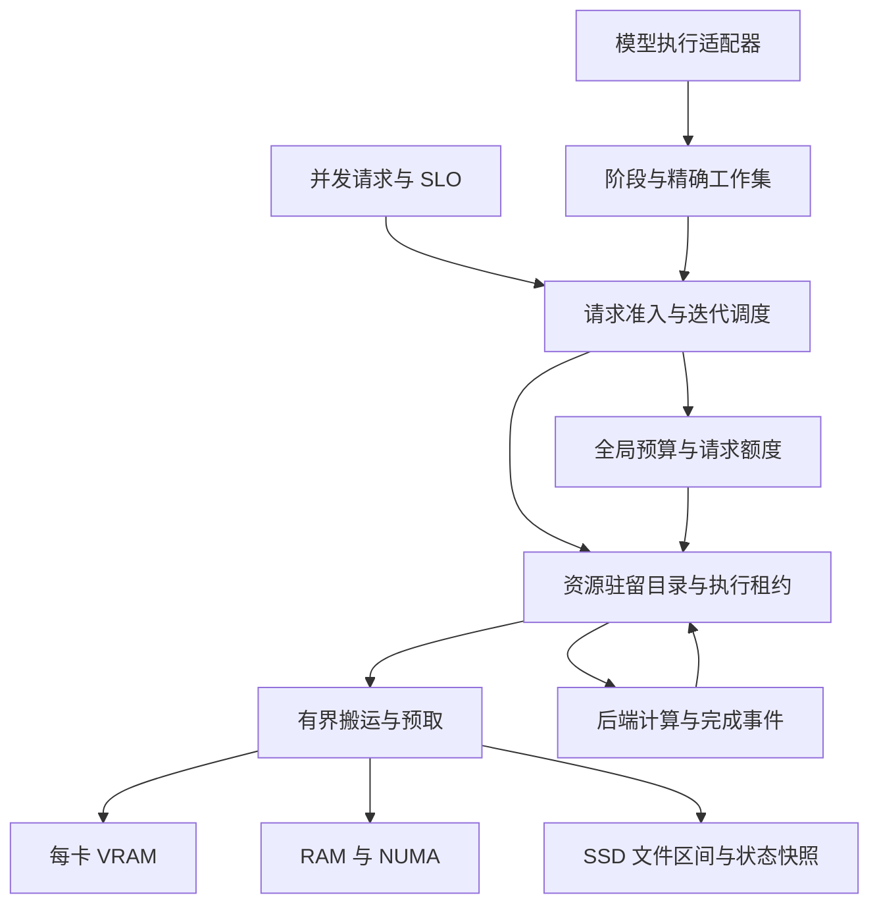

# TensorSharp 统一 VRAM / RAM / SSD 调度系统

源码基线：`f5b1eefb6cf378ed19c9a33178be84c818f7fc4b`；本轮续作基于 `a52e4a1849ce94035c89c58c788e78bccaa88a37`。设计、实现与硬件续验：2026-10-08 UTC。

## 1. 交付状态与目标

目标是让模型的**可执行工作集**适配硬件，而不是要求整个模型同时驻留 VRAM 或 RAM。系统统一管理权重、专家、KV、循环状态、前缀缓存、LoRA、多模态中间结果与临时工作区，保留原有模型计算语义，并根据请求并发程度选择驻留、搬运、计算和排队方案。

本次已经构建可运行的调度基础库、RAM/文件搬运与状态回写、请求预算、GGUF 分片目录、CUDA 分配适配器，并将 Qwen4Exp 原有放置算法抽出后接回原路径。**尚未完成全部模型的原生执行图、KV 和媒体流水线接入；不能把本次实现描述为“所有模型已自动支持三层调度”。** CLI、Server、TensorAgent 的公共引擎已可通过环境变量启用有预算的主机 KV 快照换页，但没有一个开关可以开启完整的全模型三层调度。

| 范围 | 本次状态 |
| --- | --- |
| 模型无关预算、驻留目录、租约、版本、LRU、固定搬运缓冲 | 已实现并测试 |
| 真正的 RAM 分配、文件按区间读取、可变状态 SSD 回写/恢复 | 已实现并测试；存储介质类型未作 NVMe 假设 |
| 请求完整峰值预留、FIFO 队列、取消、预留向实际分配转账 | 已接入 ContinuousBatchScheduler/InferenceEngine；由执行器显式提供成本，未自动启用全部旧模型 |
| GGUF / split GGUF 权重目录和不改量化格式的切片 | 已实现并测试；旧加载器未整体切换 |
| Qwen CUDA/UMA 静态放置算法通用化 | 已接入原模型路径；保持原调优参数 |
| 主机 KV 快照、前缀页、循环状态快照 | 显式启用时选择可恢复的逐序列路径，不再被融合路径绕过；Gemma 真实模型 RAM/文件换页已验证；不接管原生 holder/device arena |
| CUDA 原始分配/读写/释放、真实 event fence、可选 P2P | 两张 A40 上单卡和主机中转多卡通过；本 VM 的直接 P2P 数据损坏，保持默认关闭 |
| GGML lazy device-copy/preload cache | 新增并发分配预留与按 rank 的 payload 观测；显式预载独立计账，不代表整个 native 内存纳入 MemoryBudget |
| GGML/Metal/Vulkan/MLX 原生图、分页 KV、全部融合算子 | 全面适配仍待实现；本轮没有 Metal/Vulkan/MLX 硬件验收 |
| 多卡预算向量、带节点/设备标识的资源位置 | 已支持多位置工作集租约和全 rank fence；两张 A40 上实际内核、双向中转和释放验证通过 |
| 多机协调、远程内存、异步 DMA 重叠、自适应成本策略 | 设计阶段，未实现 |

“高速”必须相对于模型、量化、工作集、带宽和 SLO 定义。容量虚拟化能让更多模型运行，但无法让每个 token 都要读取几十 GB 冷权重的 dense 模型获得全驻留 GPU 的延迟。

## 2. 当前源码的实际集成边界

| 当前代码 | 已有机制 | 需要统一的边界 |
| --- | --- | --- |
| `TensorSharp.Models/Models/Qwen4Exp/Qwen4ExpModel.ExpertPlacement.cs` | CUDA/Metal 专家放置、专家缓存配额和布局下限 | 算法已迁出；下一步把实际原生分配接入同一个预算 |
| `TensorSharp.Models/GpuMemoryBudget.cs` | free VRAM、headroom、token 容量估算 | 统一观测、避免已驻留资源再次扣账 |
| `TensorSharp.Models/ModelBase.WeightLoading.cs`、`ModelBase.WeightPolicy.cs` | 公共权重读取和驻留决策 | 从目录注册资源，按执行边界获取租约 |
| `TensorSharp.Runtime/GgufReader.cs` | GGUF、分片、mmap、tensor 类型与字节布局 | 新增文件区间接口；可避免预读整个数据区 |
| `TensorSharp.GGML.Native/ggml_ops_core.cpp` | device-copy、预载、host buffer、offload cache | 所有分配必须预留；缓存命中必须表示上传已完成 |
| `ggml_ops_host_moe_cache.cpp`、`ggml_ops_host_moe_decode.cpp` | 专家缓存与主机计算 | 热专家驻留、联合选中专家工作集、CPU/GPU 成本选择 |
| `TensorSharp.Runtime/Scheduling/ContinuousBatchScheduler.cs` | 连续批处理、prefill 分块、KV 容量准入、抢占 | 接入字节与 I/O 成本；仅 token 数和 KV 元数据不够 |
| `TensorSharp.Runtime/Scheduling/PrefixCache/` | radix、holder/page、跨请求恢复协议 | 可迁移数据位置，不改变“哪些状态足以恢复”的规则 |
| `TensorSharp.Runtime/Paged/`、各模型 KV/holder | 页面与模型专用状态 | 区分已读页、追加尾页、循环状态、可共享完整页 |
| `TensorSharp.Chat/DiffusionBatchScheduler.cs`、QwenImage、Wan | 非自回归任务、分阶段模型和临时张量 | 以 encoder/denoiser/VAE/帧块为阶段估算资源 |
| `TensorSharp.Distributed/`、GGML TP 实现 | collective、多卡执行路径 | 节点内预算与跨节点原子准入协议分别接入 |

原生执行图里缓存了原始地址。只增加一个“LRU + memcpy”会产生 use-after-free 或读到旧版本。必须在算子、图或原生 slot 的生命周期上持有租约。对于捕获图，采用固定地址的 slot arena，或在地址/布局版本改变时失效并重建图。模型名字不应进入驻留管理器。

本次原生改动全部位于 TensorSharp 自有 C++ 文件。upstream ggml 固定为 `ffa4e8b80930029a35991f94e7c8a93cd67730ab`，本地和 VM checkout 均保持原样。CUDA 12.8 / sm_86 原生构建及缓存预算测试已完成。对该 VM 使用 ggml 已有的 `GGML_CUDA_NO_PEER_COPY=ON`；TensorSharp 的 CMake 不再强制覆盖用户选项，没有修改 upstream 实现。

lazy device-copy cache 在分配前原子预留、成功发布后转为 committed，使用 ggml 报告的 buffer 字节数；显式 preload 单独记录 reserved/committed。`GgmlBasicOps.TryGetCacheMemoryUsage` 提供每 rank 诊断。该计数不包括 graph arena、KV、backend pool、allocator/driver 开销，不是进程 VRAM 硬上限，尚未与托管 `MemoryBudget` 合并。

首次 DeviceCopy 上传现在在发布前同步完成，随后图构建因 scratch 分配失败而退出，也不会留下未初始化的缓存命中。CPU/UMA host-pointer 路径不变；冷 miss 增加 descriptor 和同步成本，尚未测量其性能影响，不能宣传为提速。设备回归覆盖 F32、Q8_0、opaque host key 和放弃图构建后重试；没有 Metal/Vulkan 运行验证。

## 3. 系统分层



控制面管理所有权、预算、版本、准入、放置和观测。数据面执行原有正确的算子、数据搬运和设备事件。调度器知道“字节数、合法执行位置、下次使用、代价、状态依赖”，不需要知道这是 Gemma、Qwen、图像还是音频。

新模型应主要增加**布局与执行计划适配**：声明只读资源、动态状态、每阶段工作集和安全完成边界。新算子可能需要新的分块内核；抽象接口无法凭空让一个必须连续持有巨大张量的旧内核变成可流式执行。

## 4. 资源和所有权协议

实际类型在 `TensorSharp.Memory/`：

| 类型 | 职责 |
| --- | --- |
| `ResourceKey(Owner, Epoch, Name)` | 区分模型修订、请求/租户、reload 和资源，避免地址复用污染缓存 |
| `MemoryResource` | 字节长度、用途、可变性、布局指纹；核心不解释布局字符串 |
| `IResourceSource` | 精确区间读取；权重可直接引用原文件，无需复制到 SSD 缓存 |
| `IMemoryBackend` | 预先声明实际分配的所有预算约束，再分配设备内存 |
| `ResourceLease` | 固定地址和版本；并发读共享，写独占；GPU 使用直到事件完成 |
| `BudgetReservation` | 保留、提交、转账、返还额度，覆盖短时双副本 |
| `MemoryLocation` | 节点、设备/NUMA、主机或加速器位置 |

权重和已完成的只读前缀允许多副本。KV 尾页、循环状态、扩散 latent 等可变资源有一个当前逻辑版本。取得写租约前等待读者结束，清除旧副本/快照，再增加版本。完成并验证一次搬运后才把目标登记成可命中副本。

执行中的资源、源副本和未完成写入不能被淘汰。每个资源的状态转换单独串行化，不在全局锁内等待 SSD 或 GPU。相同资源并发加载合并为一次；不同资源允许并行搬运。

多资源算子必须一次取得完整合法工作集。当前 `AcquireReadSetAsync` 在压力或冲突时释放部分租约，由上层重试整个集合；不会拿着半个工作集等待另一半容量。多资源写事务、COW 前缀页和 graph arena 的复合租约是原生适配阶段的必要工作。

资源来源保持不可变，源句柄必须活到注销之后。模型 hash、LoRA 组合、KV dtype、RoPE 参数、位置/模态布局、TP 分片规格等都应进入各适配器的缓存身份或布局验证，不能只用 prompt 文本作为键。

## 5. 一个预算系统，多个物理约束

对每个 pool 始终保持：

$$\text{reserved}_p + \text{committed}_p \leq \text{capacity}_p.$$

pool 是容量约束，不只是 VRAM/RAM/SSD 三个计数。例子包括 `node0/gpu0`、`node0/numa0/ram`、`node0/pinned`、`node0/ssd` 和 `node0/metal-working-set`。

Apple UMA 上一块共享内存同时约束物理 RAM 与 GPU working set；这是同一分配的两个上限，不是两份物理数据。独显权重存在 host mirror 与 device copy 时则确实是两份分配，需要分别记账。

预算必须包括权重、专家 cache、KV/前缀、draft/MTP、encoder、LoRA、activation、scratch、graph arena、通信区、对齐和复制过程中的新旧双份。固定 staging buffer 要先预留，保证压力下仍有办法搬出一页，而不是把最后一点 RAM 给缓存后无法回写。

当前 `MemoryBudget` 支持多 pool 原子预留、提交、释放、缩减容量时拒绝破坏已有额度。请求 envelope 的字节在分配时转成 committed；不重复记一遍请求额度和实际 buffer。释放 buffer 时返还活跃请求；请求先结束时，仅释放剩余额度，其仍被缓存保留的 buffer 继续计入全局 committed。

capacity 要扣掉 OS、其他进程、驱动、.NET 元数据、原生 allocator 等 headroom。已有分配不能同时算作 free-memory 观测中的减少和新的完整扣款。接入旧 cache 前应做一次基线归属清查，并持续比较“调度账本”和“设备/进程实际内存”的差值。

当前实现约束的是已登记的 payload 和对齐额度，**不是进程 RSS 的硬上限**。buffered I/O 的 page cache、libc 保留的 heap 页面、旧 GGML/MLX 缓存没有凭空纳入控制。生产阶段还需 Linux cgroup/pressure、Windows memory pressure、macOS working set 等观测；硬约束部署要配合系统级限制并保留缓冲余量。

## 6. VRAM 和 RAM 都不足时的加载

加载顺序应为：解析头部/张量目录 → 校验文件范围与布局 → 计算最小前进工作集 → 预留 staging 和必要状态 → 按阶段获取权重块 → 执行并释放。禁止为了“模型加载完成”先把所有张量读入托管数组、完整解量化或锁定全部 mmap 页面。

`GgufMemoryCatalog` 已实现单文件/分片目录和共享 shard 句柄，按真实文件 offset 读取原始量化字节；它不猜测专家布局。`GetSlice` 可以描述某专家、某些行或一个 tile，但其边界合法性必须由算子适配器保证。非 GGUF 数据可直接实现 `IResourceSource`。

最小可执行单元仍有下限：

$$M_{\min}=M_{\text{required state}}+M_{\text{activations}}+M_{\text{scratch}}+M_{\text{one legal tile}}+M_{\text{transfer reserve}}.$$

当某个现有内核的这个工作集也放不下时，需要更细粒度且正确的分块内核，或者 CPU 路径。如果全部合法路径都无法前进，应在加载/准入阶段给出需要的最小容量，而不是启动之后反复 OOM。

SSD 存放两类内容：只读模型权重直接引用原文件；变化的运行状态写入独立配额的临时快照。当前可变状态快照采用有界缓冲、完成落盘后原子改名和 SHA-256 校验，失败/取消不发布目标。原文件不被修改。文件名不含 prompt 或请求内容。进程崩溃后的自动清理和持久恢复尚未实现，不能把临时 swap 文件当成可恢复会话数据库。

## 7. 按计算行为选择策略

### Dense 与共享权重

执行顺序通常可预测：按层/矩阵 tile 顺序读取，保持小而高频的常量驻留，提前准备下一单元，重复使用 staging。吞吐模式把多个请求对同一组权重的计算合并，摊薄 SSD/H2D 读取；交互模式限制 microbatch 和 prefill 工作量以保护 decode 延迟。

核心不应强制整层作为唯一迁移粒度。Embedding/LM head 的行访问、矩阵的行列分块、张量并行分片，都可以是独立资源。但分块 matmul 的归约顺序可能改变浮点舍入；需要与原路径比较 logits 和输出，而不能仅凭字节搬运正确就宣布模型等价。

### MoE

路由器仍执行原有 top-k。针对一个 microbatch，合并所有 token 实际选择的专家集合，gate/up/down 和格式元数据作为合法执行组获取。热专家保留在 VRAM，次热专家在 RAM，冷专家引用 SSD。预测只用于预取；预测错了必须加载真正被选择的专家，不能减少专家数或用近似专家替代。

选择 CPU 专家计算或搬到 GPU，比较的是测量得到的总时间：CPU 计算 + activation 传输，对比排队 + SSD/RAM 读取 + H2D + GPU 计算。一次只活跃很少专家的 decode 和覆盖大量专家的 prefill 可能需要不同策略。

并发增加时，活跃专家的并集会扩大。不能拿单请求的 expert-cache 命中率推算并发 16 的 VRAM。首版统一预算已能表达各类资源竞争；具体专家文件 coalescing、带宽成本模型和跨请求专家分组仍需在原生 MoE 执行适配中落地。

### KV、滑动窗口与循环状态

可复用的**冷前缀**与每个 decode 都访问的**活跃历史 KV**应区分。把前缀放到 SSD 可以节省再次 prefill；把活跃 KV 放到 SSD 则可能每个 token 都付出读取代价，收益条件不同。

普通 attention 的原始 K/V 以页保存；滑动窗口只丢弃模型语义已经允许不再访问的区域。GDN/SSM/Mamba 等保存的是循环状态及必要 checkpoint，不能按普通 KV 的 token 公式强行分页。共享 KV、压缩/索引 attention、MLA 和模型自己的 retention 策略保留专用布局与恢复规则。

超大活跃 KV 可用完整覆盖历史块的 online softmax attention。对于两个已计算块，令最大 logit 为 $m_a,m_b$、归一化和为 $l_a,l_b$、未归一化输出为 $z_a,z_b$：

$$m=\max(m_a,m_b),\quad l=e^{m_a-m}l_a+e^{m_b-m}l_b,$$
$$z=e^{m_a-m}z_a+e^{m_b-m}z_b,\qquad o=z/l.$$

这能分块覆盖所有原始 KV，不必用裁剪上下文换容量，但仍需与原内核验证精度、掩码、位置和吞吐。**本次尚未新增该 attention 内核。** Prefix cache 的分页/holder 协议只迁移位置，不擅自改变原有可恢复性判定。

### Diffusion、多模态、LoRA 与 draft

图像/视频的 text encoder、vision encoder、denoiser、VAE 常在不同阶段活跃。阶段切换允许卸载不再使用的组件；denoiser 的重复步骤有利于保留同一工作集。大分辨率 latent/attention 和 VAE 仍需要正确的空间/时间分块，不能假设仅搬运权重就解决所有峰值。

音频按采样长度/特征帧数，图像按 patch 数，视频按帧数和时空 token 数估算资源；按文本 token 预算会漏掉 encoder 峰值。LoRA、DoRA、draft、MTP 作为独立依赖登记，包含正确 identity、临时 merged/dequantized buffer 和验证阶段 KV。不得自动降低图像尺寸、帧数、音频长度、步数、draft 验证强度或改变 mask。

## 8. 并发请求调度

推荐的运行时流程是：

1. 模型适配器估算 prompt、最大输出、模态编码、循环状态和最坏算子 scratch，声明哪些资源可共享。
2. 请求进入有界队列，不能单独满足的请求立即给出容量原因；可满足但暂时不足的请求排队。
3. 每次迭代挑选 decode 和 prefill chunk，形成实际资源并集，并在所有相关 pool 上预留。
4. 获取完整租约集合、等待数据和依赖事件；完成之后执行；事件结束后释放临时租约。
5. KV/状态按请求生命周期持有；prefix cache 接收状态时保留其预算所有权，再关闭请求额度。

已实现的队列是严格 FIFO，具有明确的队头阻塞取舍。它没有自称为 EDF、WFQ 或动态批处理优化器。后续与 `ContinuousBatchScheduler` 集成时，保留现有公平性/防抖动机制，加入有限 bypass、aging、prefill token/byte 双预算，以及 IO stall 信号。请求的公平单位不能只看 token 数，还要考虑它占用的 SSD 时间和 GPU 工作集。

压力优先级建议为：取消低收益预取 → 清理无租约冷副本 → 回收冷前缀 → 缩小 prefill/microbatch → 排队新请求 → 在合法 checkpoint 暂停请求。避免多个长请求反复互相抢占、重新 prefill。用户显式指定的最大输出不应被悄悄改小。

同一权重在不同请求之间共享一个资源和加载过程；请求私有状态按 owner 隔离。逐层跨请求复用通常改善吞吐，但会增加请求等待权衡，需由目标 TTFT/TPOT/SLO 决定批次，而不是只优化总 tokens/s。

## 9. 多卡与多机

单机多卡采用每卡 pool、NUMA host pool 和设备拓扑。静态规划与实测传输成本应区别 PCIe、NVLink、P2P、经主机中转，以及共享 SSD 带宽。TP/PP/EP/DP 的分片与副本位置属于执行计划，不能把“有多个 MemoryLocation”当成已支持任意并行模式。

一个 TP step 需要同时取得所有 rank 的额度和 collective 工作区；不能 rank 0 持有预算后永久等 rank 1。单进程内多 pool 原子预留已能表达这个约束。图捕获地址、通信 buffer 和跨设备事件仍须后端适配。

多机以节点为预算权威：协调器发送带 epoch/有效期的 prepare；所有节点接受后 commit；任一失败则撤销整组。节点失联时禁止向失效地址发 DMA，未提交的预留超时回收，已提交的执行按可验证 checkpoint 恢复。远端 KV/专家缓存必须有模型版本、布局与分片标识；鉴权和配额按租户处理。远端缓存不是本地 SSD 的等价延迟层。

**以上跨节点协议尚未实现。** `MemoryLocation.Node` 只是为后续扩展预留身份空间，不提供分布式一致性。

## 10. 当前所有模型族的接入清单

以下来自基线 `BuiltInArchitectures.cs` 及其模型目录，不依据宣传名称推断已经兼容。所有条目的通用登记/搬运数据结构可复用；Qwen 放置策略和公共主机 KV 快照路径已经接入；下表的各模型原生执行、holder/arena、媒体资源适配仍是待完成工作，不能用公共路径测试代替每个模型的验收。

| 注册族/目录 | 必须申报和适配的资源 | 关键验收 |
| --- | --- | --- |
| Qwen35 | dense/MoE 权重、GDN、attention KV、MTP、vision | recurrent checkpoint、prefix 恢复、MTP rollback |
| Qwen4Exp | 专家、QSA/索引 KV、PLE、MTP、host seam | 全部选中专家、compact cache、量化布局、多请求并集 |
| Gemma4 | dense/MoE、异构窗口 KV、共享 KV、多模态 | 层间布局、per-sequence holder、音视频/图像状态 |
| GptOss | MoE、窗口/全局 attention KV、量化专家 | 分页与跨请求状态、完整路由 |
| Nemotron | 混合循环/attention、已有模态组件 | scan/conv 状态与 checkpoint 一致 |
| Mistral3 | dense 权重、KV、vision projector | 图像 token/位置、prefill/decode 一致 |
| HunyuanDense | dense 权重、KV、scratch | Dense 流式分块与原实现 logits |
| MuseGlimmer | 语言权重、vision、KV、DFlash | draft/target 的资源隔离与验证回滚 |
| DeepSeek4 | MoE、压缩/索引 attention、原生 slots、draft | 原生 slot 所有权和压缩状态一起恢复 |
| DeepSeek41 | 上述加 Engram/辅助 lookup/vision 等实际启用组件 | lookup 精确区间、异步 gather、slot/TP 不漏账 |
| GlmDsa | MoE、DSA 索引与相关状态 | 索引与值版本一致、精确路由 |
| MiniMaxH3 | 混合计算、专家/循环状态、既有 slot 机制 | 保留模型自己的状态语义 |
| DiffusionGemma | block/canvas、迭代状态、缓存、多模态输入 | 接受规则与恢复点，不能当成普通逐 token AR |
| QwenImage（含 2.1） | text/vision encoder、DiT、VAE、LoRA/DoRA、latent | 阶段峰值、空间分块、mask、adapter identity |
| WanVideo | encoder、DiT、VAE、帧/时空块、latent | 时序依赖、帧块拼接、视频质量和峰值 |

与新模型接入相关的契约应放在架构描述器旁：资源目录工厂、逐阶段工作集估算、原生绑定/重绑定、安全事件和状态导入导出。能力必须按**模型 × backend × dtype/layout × 执行模式**描述。只实现接口、只运行一个小 checkpoint、或保留旧常驻 fallback 都不能标记为完整三层支持。

## 11. 性能控制和带宽上限

以有效读取带宽 $B_{ssd}$、主机到设备带宽 $B_{h2d}$、冷数据字节 $D$ 估算，一个 step 至少受到相应链路时间约束：

$$T_{step}\geq\max(T_{compute},D_{ssd}/B_{ssd},D_{h2d}/B_{h2d}).$$

这是充分重叠时的下界，不是实现时延预测。不能重叠时各阶段还要相加，并计入随机读取、页故障、队列和同步。假设每 step 必须读取 8 GB 冷数据、有效 SSD 带宽 4 GB/s，单读取就至少 2 秒；单请求上限最多约 0.5 token/s，尚未计入计算。若 8 个请求在该 step 共享这批权重，聚合吞吐可能改善，但单请求 step 延迟并没有自动变成八分之一。

首版已实现驻留 LRU、有界搬运、同资源加载合并和不驱逐需求数据的预取。淘汰扫描只遍历**当前驻留项**，不扫描整个 SSD 模型目录。成本感知策略、页缓存建议、IO coalescing、后台回写、水位滞回、预取准确率反馈、按链路限流及 DMA/计算重叠尚待实现。

后续策略可使用“未来命中概率 × 省下的加载/计算时间 ÷ 常驻字节”衡量缓存价值；权重、KV、专家竞争同一个资源预算，但不能混淆它们的恢复成本。保留最低 decode 前进工作集，防止预取与前缀挤占所有额度。

## 12. 正确性规则和故障行为

- 默认仅迁移原有字节，不重新量化、不减少专家、不删有效上下文、不降分辨率。
- 活跃 lease/fence 未完成时不可释放地址。失败 fence 保留租约等待恢复；设备释放失败隔离该资源并保留预算。
- 目标 allocation、双副本、搬运 buffer、SSD 新快照都先预留；I/O 失败不会被当成有效缓存命中。
- 异步取消必须等待 DMA/I/O 不再引用 buffer 才释放。不能用“请求已取消”代替设备完成事件。
- 写租约更新版本、丢弃旧副本；临时 SSD 恢复校验失败返回错误，不读取未初始化数据继续生成。
- 所有资源对齐、元素类型、stride、shape、量化 block 信息由适配器验证；当前 `Layout` 是身份元数据，内核本身不解释它。
- 共享前缀只共享不可变完成页；修改尾页需要 COW 或独占副本。COW 集成尚待完成。
- 新旧后台 cache 不可同时声称拥有同一份免费额度。旧 buffer pool 若缓存物理分配，应在池真正释放之前保留额度。

无损搬运不意味着跨 CUDA/CPU/Metal 计算逐位相同；后端内核和累加顺序本来就可能不同。验收需要区分同路径 exact byte round trip、同 dtype 的数值容差、argmax/token 稳定性，以及任务质量。

## 13. 实施顺序与上线门槛

| 阶段 | 具体工作 | 完成条件 |
| --- | --- | --- |
| 本次基础库 | 预算、lease、文件、spill、queue、GGUF seam、Qwen policy 抽取 | 已有可复现 CPU/文件测试与放置回归 |
| 原生预算接管 | GGML device-copy/preload/expert cache、CUDA pool、MLX/Metal 所有分配归属 | 账本与设备实测差额可解释；加载/图重建峰值不越界 |
| 权重执行适配 | 固定 slot 或按阶段重绑，通用 dense/专家分块、真实 CUDA 事件 | 正确完成“权重 > RAM > 可用 VRAM”的真实模型测试 |
| 动态状态适配 | paged KV、holder、循环状态、draft、prefix 所有权转移 | 多轮/取消/并发/恢复不丢状态；冷/热 KV 语义清楚 |
| 媒体与所有族 | 按上表补齐 adapter、encoder/DiT/VAE 分块 | 每族每后端明确支持矩阵，缺失项不能默认为支持 |
| 高性能路径 | pinned DMA、预取/计算重叠、CPU/GPU 策略、带宽反馈 | 真实设备下满足设定 TTFT/TPOT/吞吐指标 |
| 多卡/多机 | rank 预算、通信区、P2P、节点租约和恢复 | 原子准入与故障测试，不以单卡成功替代 |

在完整适配前应保留显式能力检查；不足时报告哪个执行单元还不能迁移。先收集 shadow accounting，再逐族开启，禁止用无效开关宣称全模型支持。

CLI、HTTP API、Web Chat、TensorAgent 最终应共享一套 engine 配置。产品层只需展示预算、等待原因、实际运行位置、当前模式和预计性能；原生布局/指针等实现细节留在诊断页。该产品配置接入尚未在本次实现。

## 14. 验证与本次证据

本轮 VM 环境为 Ubuntu 24.04 x64、.NET SDK 10.0.401、CUDA 12.8.93、驱动 570.211.01，两张 NVIDIA A40（各 46,068 MiB）。`/workspace` 是网络文件系统，本轮文件换页不代表本地 NVMe 性能。使用未修改的上述 ggml revision 完成 CUDA 原生构建。

独立 Linux harness **46/46 通过**，覆盖原子预算/UMA、并发额度、请求 envelope、队列取消、真实文件大工作集、single-flight、写独占/版本、SSD 无损回写、损坏校验、SSD 配额耗尽、I/O/分配失败和取消回滚、完成事件、部分工作集回滚、预取、主机降级、生命周期、并发状态更新、split GGUF、原策略回归和流式矩阵计算。本轮增加分配与清理同时失败时的隔离、降级清理失败、预算缩减后的队列拒绝、真实 engine 的路径选择、完整页写放大、释放重试，以及多个 owner 共享 RAM/SSD 预算与部分构造回滚。释放中途失败时 worker 停止继续生成，完成所有等待 handle，保留未释放页面和额度；多请求 Dispose 中已经完成的释放不会因下一个请求失败而丢失。Windows 的同一 harness 为 **45/46**：文件共享语义不允许注入的损坏场景不可用，不能计为通过。

真实文件工作集测试：1 MiB 权重文件，在 12 KiB 的受管 payload/staging 预算下循环读取。流式计算测试：512 KiB F32 矩阵，在 20 KiB 的受管 payload/staging 预算下分块，8 个请求共享一次权重读取，4,096 个结果与同运算顺序的参考计算逐位一致。输入/输出、.NET 运行时和 OS page cache 不属于这个 payload 预算；这些不是低 RAM 完整 LLM 的 benchmark。

公共引擎测试用依赖完整历史状态的确定性模型逐 token 比较换页前后并发输出，并验证循环状态 checkpoint、外部预算释放唤醒、前缀回收和取消。原有调度、Qwen 放置与专家计划回归，加上执行计划、有预算快照、prefix 回收与并发对话回归，在 Linux 上 **140/140 通过，0 skipped**，与 harness 分开运行。此前三个 NuGet 包已本地打包；本轮没有发布包。

真实 CUDA residency：GPU 0、GPU 1 各 **5/5**，双 GPU 主机中转 **11/11**，包括两方向全量数据、事件、SSD 恢复和请求物理释放。直接 P2P 的两个方向均失败；独立 CUDA Runtime 控制程序的同步/异步、两个方向共 **4/4 失败**。这是部署上的传输问题证据，不推断具体驱动/平台原因，也不算 P2P 通过。

最终原生缓存 CTest **4/4 通过，0 skipped**：并发预留/回滚、共享预算安装/卸载与生命周期、CUDA 单卡和双卡实际缓存预算与 F32/Q8_0 计算、显式 preload 独立计账、释放归零。放弃图构建用例先将新 allocation 填入测试值，再要求其后缓存命中与强制流式参考逐元素一致。Q8_0 用可精确量化的激活输入，避免把 CUDA Q8_1 的输入舍入误判为缓存损坏；没有放宽比较容差。

真实托管/原生共享预算探针在 **1/2 张 A40** 上均通过，分别完成 **10/14 次**逐元素精确 F32 matvec，以及各 **6 个**分配失败回滚场景。验证外部 owner 占用额度、公共与每 rank 配额、lazy cache 拒绝后的计算回退、preload 拒绝、GC 后回调存活、带未释放缓存时 Dispose 拒绝与清理后重试、原生计数与托管账本一致。每次矩阵 allocation 为 **65,536 字节**。公共 pool 是两卡共享的配额，不是另一份物理 RAM 副本；这不是 UMA 硬件或模型全内存上限的验证。见 [GgmlBudgetProbe](../../eng/validation/UnifiedMemory.GgmlBudgetProbe/README.md)。

真实 Gemma 4 E2B IT Q4_K_M：此前完整聊天模板下并发 **1/2/4/8/16**、每请求 8 个生成 token，原有快照和受限 RAM/文件换页路径输出、结束原因一致；并发大于 1 必须实际发生 spill/load。另比较两个真实历史恢复后 **4,194,304** 个 logits，最大误差 **0**、argmax 无差异。仅验证文本和模型可恢复窗口内的状态。checkpoint hash、复现方式见 [ModelProbe](../../eng/validation/UnifiedMemory.ModelProbe/README.md)。最初未使用完整聊天模板的高并发用例发生早停，已保留为失败证据，不能与纠正后的固定输出用例混算。

Gemma 较长用例实际为两个 **271 token** 完整 prompt，每请求生成 **16 token**；输出一致，换页恢复后 **8,388,608** 个 logits 最大误差仍为 **0**。engine 的 snapshot RAM 配额为 **655,360 字节**，含一个 294,912 字节驻留页及 capture/transfer scratch；权重、设备上的活跃 KV 和 OS page cache 在该配额之外。该上下文仍在模型的 512-token 可恢复窗口内。

Qwen 3.5 0.8B Q8_0 的 dense、无 MTP、单 rank GGML CUDA 路径现已启用安全快照，包含完整 GDN conv/ring/delta state 与 attention KV。新增负数/溢出范围和逐层布局的事务性检查；中途恢复失败时只从真实 recurrent checkpoint 继续。最终计算库下并发 **1/2/4/8/16** 输出与 **16 个独立请求参考**完全一致，tiered 路径分别发生 **0/24/48/96/192 次 spill**；两个历史交替恢复三轮，**6 份快照字节完全一致**，共 **11,919,360** 个 logits 误差为 **0**。较长用例是两个 **258 token** prompt、每请求 **16 token**，发生 **64 次 spill**，**23,838,720** 个恢复后 logits 误差为 **0**。快照页为 **20,398,156 字节**，RAM 配额 **40,861,952 字节**，仍不包含权重/live device KV/OS page cache。MoE、MTP、多卡快照及其他 backend 未开放；这些不属于本次通过范围。

同一计算库在物理 GPU 1 上补跑 Gemma 并发 **2**，与独立请求参考相等，发生 **25 次 spill**；**6 次**快照恢复字节完全一致，**12,582,912** 个 logits 误差为 **0**。Qwen 和 Gemma 的短暂异卡重叠只用于正确性验收，时延没有作为受控 benchmark。GDN 每页重复完整状态导致大额 I/O，严格一页 RAM 配额下的换页显著慢于原有路径。

真实 Qwen 3.5 0.8B Q8_0 的 TP1/TP2 比较执行了 5 个用例 × 24 行、共 **29,798,400** 个 logits。日志、每 rank 缓存计数与设备观测确认两个 rank 实际参与。最终两进程均以 0 退出，全部有限且 **120/120 argmax 相同**；最大 relative L2 为 **0.0005205466**（限 0.001），最小 cosine 为 **0.9999998736**（限 0.999999），最大绝对误差 **0.006324291**。严格门槛未改变。初始版本的 relative L2 **0.04140844**、cosine **0.99914715** 和 max-abs **0.6113646** 属于失败记录，不能混入通过结果。

定位时同一 TP1 路径在物理 GPU 0/1 上的全部 logits 逐位相等；关闭 TP 并行/CUDA graph 等控制未消除旧差异。实际首 token 张量比较将首次显著偏差定位到第 7 层 QKV 投影：约 1e-7 的 norm 差异使 Q8_1 激活量化跨过舍入边界。修复为 dense Qwen GGML CUDA 的 Q8_0 权重注册 TensorSharp 自有 Q8×F32 投影，保留 F32 激活；TP1 和 TP2 使用一致策略，不生成常驻 F32 权重副本，也不修改 ggml。注册跟随 host/device key 生命周期并在释放前注销，缓存键创建失败可回滚重试。该模型的整个模型 TP decode 路径未使用；覆盖的是实际 per-operation TP 路径。命令与限制见 [ForcedLogitProbe](../../eng/ForcedLogitProbe/README.md)。测试使用 host reduction 和关闭 P2P 的 ggml 构建，不代表 NCCL/P2P 或吞吐验收。

以上数值、缓存和完整快照矩阵使用的原生库 SHA-256 为 `0146374922609a3f88038c61540467db26dc05dbf8098b128a87e6d2eacc5cfc`，上游 ggml revision 仍为 `ffa4e8b80930029a35991f94e7c8a93cd67730ab`，工作区无修改。Q8 精度路径改变了运算选择；模型数值误差已按上述范围验证，不能从这些单次运行推导性能提升。

随后只修正可选张量诊断的文件 I/O 错误处理，防止写文件失败使已经推进状态的 forward 重试。该库 SHA-256 为 `5bd4436676564091850c8862ed50e971ad8924147399742e4299fcf895d1c941`；对应 TP 和有效/无效诊断目录控制记录见 [ForcedLogitProbe](../../eng/ForcedLogitProbe/README.md)。它不取代上述原库的完整快照矩阵来源。

真实媒体输入/生成、全部其他模型族、Metal/Vulkan/MLX、多机以及“权重同时大于 RAM/VRAM”的完整模型测试：**未运行**。模拟 accelerator 只验证状态机。文件换页增加时延，本轮单次观测不是性能提升、p95/p99 或异步重叠证明。

复现命令：

```sh
dotnet run --project eng/tests/unified-memory/UnifiedMemory.Tests.csproj -c Release \
  -- --json artifacts/unified-memory/results.json

dotnet test InferenceWeb.Tests/InferenceWeb.Tests.csproj -c Release -m:1 \
  -p:BuildInParallel=false -p:TensorSharpSkipGgmlNative=true -p:TensorSharpSkipMlxNative=true \
  --filter 'FullyQualifiedName~ContinuousBatchSchedulerTests|FullyQualifiedName~Qwen4ExpCudaPlacementTests|FullyQualifiedName~SchedulerCapacityAdmissionTests|FullyQualifiedName~Qwen4ExpExpertOffloadTests.Plan_|FullyQualifiedName~ExecutionPlannerTests|FullyQualifiedName~BoundedSnapshotEngineTests|FullyQualifiedName~ReclaimQueueFailureTests|FullyQualifiedName~PrefixTreeEvictionTests|FullyQualifiedName~ParallelConversationReuseTests|FullyQualifiedName~RadixPagedEngineTests' \
  --logger 'trx;LogFileName=unified-memory-followup.trx' \
  --results-directory artifacts/unified-memory
```

后续真实基准至少覆盖：全驻留、只缺 VRAM、VRAM/RAM 同时不足；cold/warm cache；并发 1/2/4/8/16；短/长上下文；prefill/decode/混合；各量化格式；MTP on/off；模型 reload、取消、SSD 满/慢/短读、GPU 分配失败；多模态输入和生成阶段；单卡/多卡/多机。

记录 p50/p95/p99 TTFT、TPOT、每请求与聚合吞吐、模型质量/完整 logits、实际 VRAM/RSS/pinned 峰值、每层有效字节、SSD IOPS/带宽/写放大、cache 命中、重复 prefill 和队列等待。比较必须保持 checkpoint、量化、上下文、路由、输出长度和服务质量设定一致，不能把所有请求聚合 throughput 当成单请求速度。

## 15. 后续实际接入与硬件验证入口

`PagedKvStorage` 的 `Acquire` 返回有生命周期的 span 租约；`BatchExecutor` 的捕获、尾页刷新、恢复全部使用该 API。底层将一个页面视为不解释布局的可变资源，按原字节回写/恢复。前缀引用继续保留逻辑页，最后一个引用消失才注销；id 再次分配时增加 epoch。失败的释放不把页面放回 free queue。捕获 scratch 和固定搬运缓冲在启动时预留，单个模型必须能容纳一个合法完整快照页。恢复阶段可在有空闲驻留容量时预取下一页，与当前注入操作重叠；停止/回收前等待预取结束。

公共引擎的可用配置：

```sh
export TS_SCHED_KV_RAM_BYTES=1073741824
export TS_SCHED_KV_SSD_BYTES=8589934592
export TS_SCHED_KV_SPILL_DIRECTORY=/path/on/ssd/tensorsharp-kv
```

这些是**每个引擎的主机快照预算**，包含其 scratch/staging；不是总 RSS、模型权重、原生设备 KV 或 holder 的上限。多引擎部署须保证这些独立配额总和适合机器容量。显式配置后，planner 使用逐序列主机快照路径；不支持安全跨序列恢复、零字节布局或快照页大于可恢复窗口的模型在创建 engine 时明确拒绝。单请求直接执行可不捕获快照，更大的原生 attention/KV/holder 适配仍需对应实现。

程序化配置还可通过 `KvSnapshotOptions.FromSharedBudget(budget, ramPool, ssdPool, directory)` 借用同一份 `MemoryBudget`，将多个引擎的页面、capture scratch、staging 和 spill 记入共同的物理 pool。此时共享 pool 的容量替代独立引擎限额，`MemoryUsage` 返回所有 owner 的总账；释放一个引擎只归还它自己的额度，不要求整个账本归零。每个引擎只能驱逐自己的页面；共享账本尚不提供跨引擎 LRU。

`TensorSharp.GGML.GgmlCacheBudgetScope` 将原生 lazy device-copy 与显式 preload 接入这份托管预算。每个 rank 映射到一个或多个 pool；例如 UMA 同时约束 `node0/ram` 和 `node0/gpu0`，独立显卡只约束对应 GPU pool。必须在这些缓存首次分配前安装；原生预留、实际分配、commit 和物理释放依次持有同一额度。已有缓存或正在分配时拒绝接管；仍有额度或回调在途时拒绝卸载并保留托管回调，允许清理后重试。停止模型执行并清空原生缓存后再释放 scope。不要又在请求 envelope 中重复预留这些由适配器直接计费的字节。

该 scope **不包含** graph arena、live KV/holder、backend pool、host-pointer wrapper 和 driver overhead；lazy cache 被拒绝后仍可走原有 graph streaming，因此它不是整个模型的硬 VRAM 上限。通用权重执行和其他缓存仍需逐项接入。接口用法见 [Memory README](../../TensorSharp.Memory/README.md)。

`SchedulerConfig.MemoryAdmission` 已接入实际调度器：执行器提供每请求完整增量峰值，按多 pool 原子预留；准入先于前缀物化，取消/结束/抢占的额度在模型释放完成后才归还。`SequenceState.MemoryEnvelope` 用于实际分配，防止双重计账；缓存存活的子分配继续计费。共享权重、池化 arena 和保留前缀必须采用自己的生命周期额度。预算耗尽且当前引擎无运行请求时，worker 在模型锁外等待预算变化或新命令，不忙轮询。尚未为所有旧模型自动推导成本。

多卡 `ResourcePlacement` 工作集失败时释放所有部分 pin，`ResourceLeaseSet.ReleaseAfterAsync` 接受全 rank fence。CUDA 实现真实 event fence 与可选 P2P；默认跨设备走有界主机中转。仓库既有 P2P 通信实现记录了部分云端 PCIe/IOMMU 拓扑传输损坏，故新接口也不能只凭 `cuDeviceCanAccessPeer` 就默认启用。

硬件验证工具：[UnifiedMemory.CudaProbe](../../eng/validation/UnifiedMemory.CudaProbe/README.md)。它在每个选中 GPU 上实际执行整数内核，检查全量结果、事件生命周期、VRAM/RAM 压力下的 SSD 恢复、16 个并发读取者、逐方向 GPU 复制、部分工作集回滚与所有 rank fence。指定 P2P 却未走 peer 路径时返回失败；没有驱动或设备时返回 unavailable，不算通过。

本轮已使用给定 SSH 访问 VM、安装隔离的 .NET SDK、构建 CUDA 原生库并运行上述真实硬件和模型用例。历史环境的 unavailable 结果仍是历史记录，不能与本轮完成的场景混算。生成的日志、JSON、TRX、模型探针输出均保留在忽略的 `artifacts/unified-memory/` 和 `artifacts/unified-memory-continuation/`，不提交 Git。

## 16. 外部工程依据

以下只用于设计取舍，没有把别人的性能数字当作 TensorSharp 成绩：

- [vLLM KV Offloading](https://docs.vllm.ai/en/latest/features/kv_offloading_usage/)：参考 completed KV 的分层存储和 host staging；不把 prefix offload 等同于任意活跃 attention 可直接读 SSD。
- [vLLM Hybrid KV Cache Manager](https://docs.vllm.ai/en/latest/design/hybrid_kv_cache_manager/)：参考不同 attention/循环状态的分组与 prefix 语义；保留 TensorSharp 自己的状态契约。
- [NVIDIA Dynamo / SGLang HiCache](https://docs.nvidia.com/dynamo/dev/backends/sg-lang/hi-cache)：参考 KV locality 与 tier-aware 路由。最终这里仍需 TensorSharp 自己的资源目录和后端适配。
- [DeepSpeed ZeRO-Inference](https://www.deepspeed.ai/2022/09/09/zero-inference.html)：参考按层权重流式执行和预取/计算的重叠；吞吐收益取决于 batch 与计算量。
- [FlexGen, ICML 2023](https://proceedings.mlr.press/v202/sheng23a.html)：参考跨 GPU/CPU/disk 的调度与吞吐导向取舍；本设计默认不引入其进一步有损压缩。
- [CUDA API synchronization behavior](https://docs.nvidia.com/cuda/cuda-runtime-api/api-sync-behavior.html)：同步命名的 H2D 对 pageable memory 也可能只完成 staging。当前 CUDA adapter 在发布前显式同步 default stream；高性能异步版本必须用真实 event/fence 管理生命周期。

全模型、跨后端的完成标准是上表的执行适配和实测，而不是接口数量或一份漂亮的架构图。
